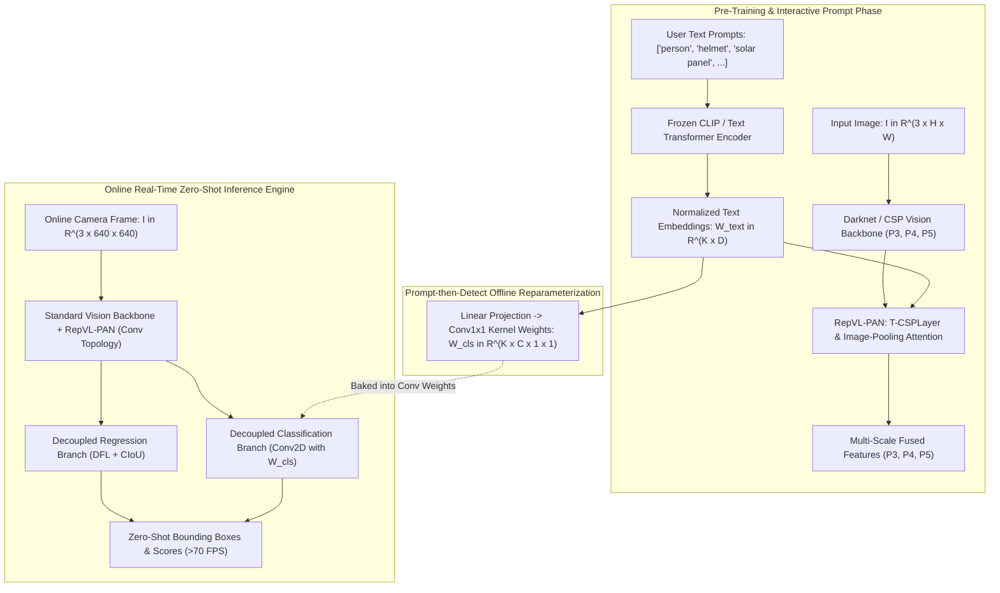
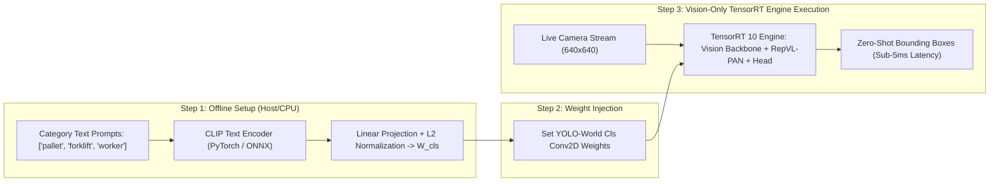

# ⚡ YOLO-World: Real-Time Open-Vocabulary Object Detection with RepVL-PAN

## 1. Executive Brief & Significance

Traditional real-time object detectors (e.g., standard YOLO series) operate strictly under a **closed-set vocabulary assumption**, predicting bounding boxes restricted to pre-defined categories ($K=80$ for COCO, $K=20$ for Pascal VOC). While large-scale vision-language models like [[architectures/multimodal-vlm-and-vla/florence-2|Florence-2]], CLIP, and [[architectures/real-time-detectors-and-segmenters/grounding-dino|Grounding DINO]] unlock open-set grounding and open-vocabulary detection, their heavy dual-encoder cross-attention decoders incur prohibitive computational latency ($>50-200\text{ ms}$ on desktop GPUs), rendering them unusable for high-frame-rate edge robotics and autonomous driving.

**YOLO-World** (Cheng et al., Tencent AI Lab, CVPR 2024) solves this foundational dilemma by introducing the **Re-parameterizable Vision-Language Path Aggregation Network (RepVL-PAN)** alongside a **Prompt-then-Detect** inference paradigm. 

### Key Architectural Breakthroughs
1. **Prompt-then-Detect Paradigm (Offline Vocabulary Reparameterization)**: During inference for any arbitrary user-defined vocabulary (from tens to thousands of categories), YOLO-World pre-computes offline text embeddings via a frozen CLIP text encoder and reparameterizes them directly into the classification head's $1 \times 1$ convolutional projection weights. This eliminates the text encoder entirely from the online inference loop, achieving standard YOLO inference latency ($>50-100\text{ FPS}$).
2. **RepVL-PAN (Vision-Language Fusion Neck)**: Re-engineers multi-scale path aggregation by injecting cross-modality interactions via **Text-Guided CSPLayers (T-CSPLayer)** and **Image-Pooling Attention (I-Pooling Attention)**, enabling deep multi-scale vision-language fusion during pre-training while preserving pure convolutional inference topology.
3. **Region-Text Contrastive Pre-training**: Pre-trained on large-scale paired datasets (Objects365, GoldG, CC3M, and pseudo-labeled grounding datasets) using a unified region-text contrastive alignment loss ($\mathcal{L}_{\text{con}}$), empowering zero-shot localization on unseen categories (e.g., LVIS open-vocabulary).



---

## 2. Component-by-Component Architectural Breakdown

| Component Stage | Module Name | Structural Implementation | Interaction Mechanics | Receptive Field & Dimensionality | Parameter Distribution (%) | Compute / Latency (%) |
| :--- | :--- | :--- | :--- | :--- | :--- | :--- |
| **Vision Backbone** | **CSPDarknet (v8/v10 base)** | 5-stage convolutional hierarchy with residual bottleneck blocks | Cross-Stage Partial connections; spatial downsampling via $3\times 3$ stride-2 convs | Strides 8 ($P3$), 16 ($P4$), 32 ($P5$); channels $[256, 512, 1024]$ | $\approx 42.5\%$ ($14.8\text{M}$ for YOLO-World-L) | $\approx 48.0\%$ of forward pass |
| **Text Encoder** | **CLIP Text Transformer** | 12-layer Transformer encoder ($d_{\text{model}}=512$, $8$ heads) | Tokenizes category texts/prompts; offline execution; detached during online detection | Token embeddings $\mathbf{W}_{\text{text}} \in \mathbb{R}^{K \times D}$ ($D=512$) | Discarded at inference ($0\text{M}$ online) | $0.0\%$ (Offline pre-computed) |
| **Vision-Language Neck** | **RepVL-PAN** | Multi-scale Top-Down & Bottom-Up feature pyramid with cross-modal fusion | **T-CSPLayer** (Text-guided visual channel scaling) + **I-Pooling Attention** (Image-to-text aggregation) | Multi-scale spatial grids: $80\times 80$, $40\times 40$, $20\times 20$ | $\approx 38.2\%$ ($13.3\text{M}$) | $\approx 36.5\%$ of forward pass |
| **T-CSPLayer** | **Text-Guided CSP** | Multi-Head Cross-Attention between visual tokens and text tokens $\mathbf{W}_{\text{text}}$ | Visual features query text embeddings to enrich semantic awareness | Applied at $P3, P4, P5$ feature stages | Included in RepVL-PAN | $\approx 18.0\%$ of neck compute |
| **I-Pooling Attention** | **Image-Pooling Attn** | Max/Avg Pooling over spatial tokens $\to 3\times 3$ grid $\to$ Text cross-attention | Updates text embeddings $\mathbf{W}_{\text{text}}$ with image context per scale | Downsamples spatial grid to reduce multi-head attention complexity | Included in RepVL-PAN | $\approx 6.5\%$ of neck compute |
| **Bounding Box Head** | **Decoupled Regression Head** | $2\times 3\times 3$ Convs $\to$ Linear Projection ($4 \times 16$ DFL bins) | Predicts continuous distribution coordinates via Distribution Focal Loss (DFL) | Per-anchor spatial locations across $P3, P4, P5$ | $\approx 9.5\%$ ($3.3\text{M}$) | $\approx 7.5\%$ of forward pass |
| **Classification Head** | **Reparameterized Conv Head** | $1\times 1$ Convolution initialized with $\mathbf{W}_{\text{cls}} = \text{Linear}(\mathbf{W}_{\text{text}})$ | Computes dot-product similarity between spatial features and category embeddings | Dot product: $\mathbb{R}^{B \times C \times H \times W} \odot \mathbb{R}^{K \times C \times 1 \times 1} \to \mathbb{R}^{B \times K \times H \times W}$ | $\approx 9.8\%$ ($3.4\text{M}$) | $\approx 8.0\%$ of forward pass |

---

## 3. Mathematical Formulations & Loss Functions

### A. RepVL-PAN Cross-Modal Interaction Mechanics

Let $\mathbf{X}_l \in \mathbb{R}^{H_l \times W_l \times C_l}$ denote the visual feature map at pyramid scale $l \in \{3, 4, 5\}$, and let $\mathbf{W}_{\text{text}} \in \mathbb{R}^{K \times D}$ denote the matrix of $K$ category text embeddings extracted by the CLIP text encoder:

$$\mathbf{W}_{\text{text}} = \text{CLIP-Text-Encoder}(\{\text{"category}_1\text{", }\dots\text{, "category}_K\text{"}\})$$

#### 1. Text-Guided CSPLayer (T-CSPLayer)
Within each CSP bottleneck, visual features $\mathbf{X}_l$ interact with text embeddings $\mathbf{W}_{\text{text}}$ via multi-head cross-attention. To maintain real-time throughput, visual features serve as Queries ($\mathbf{Q}$), while text embeddings serve as Keys ($\mathbf{K}$) and Values ($\mathbf{V}$):

$$\mathbf{Q} = \mathbf{X}_l \mathbf{W}_Q, \quad \mathbf{K} = \mathbf{W}_{\text{text}} \mathbf{W}_K, \quad \mathbf{V} = \mathbf{W}_{\text{text}} \mathbf{W}_V$$

$$\mathbf{A}_{\text{visual-text}} = \text{Softmax}\left( \frac{\mathbf{Q} \mathbf{K}^T}{\sqrt{d_k}} \right) \mathbf{V}$$

$$\mathbf{X}'_l = \text{CSPLayer}\left( \mathbf{X}_l + \alpha \cdot \mathbf{A}_{\text{visual-text}} \right)$$

where $\alpha$ is a learnable gating scalar initialized to zero to ensure training stability.

#### 2. Image-Pooling Attention (I-Pooling Attention)
To condition text representations on the visual scene context without $\mathcal{O}(H_l W_l K)$ dense attention costs, visual features are spatially pooled into a compact set of visual tokens $\mathbf{P}_l \in \mathbb{R}^{N_{\text{pool}} \times C_l}$ (where $N_{\text{pool}} = 3 \times 3 = 9$):

$$\mathbf{P}_l = \text{AdaptiveAvgPool2D}(\mathbf{X}_l, (3, 3))$$

$$\mathbf{W}'_{\text{text}, l} = \mathbf{W}_{\text{text}} + \text{MultiHeadAttention}\left(\mathbf{Q}=\mathbf{W}_{\text{text}}, \, \mathbf{K}=\mathbf{P}_l, \, \mathbf{V}=\mathbf{P}_l\right)$$

---

### B. Offline Reparameterization Formulation ("Prompt-then-Detect")

During online deployment with a fixed vocabulary of $K$ classes, the cross-modal interaction is reparameterized. The visual classification logits $S_{i, j, k}$ at spatial location $(i, j)$ for class $k \in \{1, \dots, K\}$ are formulated as:

$$S_{i, j, k} = \langle \mathbf{f}_{\text{visual}}(i, j), \, \mathbf{w}_k \rangle$$

where $\mathbf{f}_{\text{visual}}(i, j) \in \mathbb{R}^{C}$ is the feature vector output by the decoupled classification neck, and $\mathbf{w}_k \in \mathbb{R}^C$ is the projected text embedding for class $k$:

$$\mathbf{w}_k = \frac{\mathbf{W}'_{\text{text}}[k] \mathbf{W}_{\text{proj}}}{\|\mathbf{W}'_{\text{text}}[k] \mathbf{W}_{\text{proj}}\|_2}$$

By constructing a weight tensor $\mathbf{W}_{\text{cls}} \in \mathbb{R}^{K \times C \times 1 \times 1}$ whose $k$-th slice is $\mathbf{w}_k$, the multi-class scoring across all spatial positions is computed via a single standard $1 \times 1$ 2D Convolution:

$$\mathbf{S} = \text{Conv2D}\left( \mathbf{F}_{\text{visual}}, \, \mathbf{W}_{\text{cls}}, \, \text{bias}=\mathbf{0} \right)$$

This mathematical equivalence converts an open-vocabulary vision-language model into a standard closed-set convolutional detector during deployment.

---

### C. Unified Training Objectives

YOLO-World is optimized end-to-end using a joint multi-task loss combining open-vocabulary classification contrastive loss with bounding box regression:

$$\mathcal{L}_{\text{total}} = \lambda_{\text{con}} \mathcal{L}_{\text{con}} + \lambda_{\text{iou}} \mathcal{L}_{\text{CIoU}} + \lambda_{\text{dfl}} \mathcal{L}_{\text{DFL}}$$

#### 1. Region-Text Contrastive Loss ($\mathcal{L}_{\text{con}}$)
Given $M$ predicted bounding boxes and $K$ ground-truth category texts in a batch, task-aligned assignment matches predicted box $i$ to ground-truth label $k$. The contrastive score is formulated via sigmoid cross-entropy with temperature $\tau$:

$$\mathcal{L}_{\text{con}} = -\sum_{i=1}^M \sum_{k=1}^K \left[ y_{i, k} \log \sigma\left( \frac{\mathbf{f}_i \cdot \mathbf{w}_k}{\tau} \right) + (1 - y_{i, k}) \log \left( 1 - \sigma\left( \frac{\mathbf{f}_i \cdot \mathbf{w}_k}{\tau} \right) \right) \right]$$

where $y_{i, k} \in [0, 1]$ represents the soft alignment score determined by the Task-Aligned Assigner (TAL).

#### 2. Bounding Box Regression ($\mathcal{L}_{\text{CIoU}}$ and $\mathcal{L}_{\text{DFL}}$)
$$\mathcal{L}_{\text{CIoU}} = 1 - \text{IoU}(\mathbf{b}, \hat{\mathbf{b}}) + \frac{\rho^2(\mathbf{b}, \hat{\mathbf{b}})}{c^2} + \alpha v$$

$$\mathcal{L}_{\text{DFL}}(S_i, S_{i+1}) = - \left( (y_{i+1} - y) \log S_i + (y - y_i) \log S_{i+1} \right)$$

---

## 4. Benchmark Evaluation & Performance Profiles

### A. Zero-Shot Open-Vocabulary Evaluation on LVIS minival

Models are evaluated in zero-shot transfer mode (trained on Objects365 + GoldG, evaluated directly on LVIS without fine-tuning):

| Model Architecture | Vision Backbone | Text Encoder | LVIS Zero-Shot $\text{AP}_{\text{rare}}$ (%) | LVIS Zero-Shot $\text{AP}_{\text{all}}$ (%) | COCO Zero-Shot $\text{AP}_{50:95}$ (%) | Latency RTX 4090 (ms) | Latency Jetson Orin (ms) | Latency A100 FP16 (ms) |
| :--- | :--- | :--- | :--- | :--- | :--- | :--- | :--- | :--- |
| **GLIP-T** | Swin-T | BERT-Base | 17.1% | 24.9% | 46.5% | 48.0 ms | 285.0 ms | 32.0 ms |
| **[[architectures/real-time-detectors-and-segmenters/grounding-dino|Grounding DINO-T]]** | Swin-T | BERT-Base | 25.4% | 31.5% | 48.4% | 39.5 ms | 230.0 ms | 26.5 ms |
| **YOLO-World-S** | CSPDarknet-S | CLIP ViT-B/32 | 18.6% | 26.2% | 40.8% | **1.85 ms** | **11.2 ms** | **1.35 ms** |
| **YOLO-World-M** | CSPDarknet-M | CLIP ViT-B/32 | 24.5% | 31.0% | 45.6% | **3.10 ms** | **18.5 ms** | **2.20 ms** |
| **YOLO-World-L** | CSPDarknet-L | CLIP ViT-B/32 | 28.6% | 35.4% | 48.2% | **4.95 ms** | **29.0 ms** | **3.45 ms** |
| **YOLO-World-X (v2)**| CSPDarknet-X | CLIP ViT-L/14 | **31.2%** | **38.8%** | **51.5%** | **8.20 ms** | **46.5 ms** | **5.80 ms** |

---

### B. Fixed-Vocabulary Fine-Tuning Performance on COCO 2017

When fine-tuned on closed-set COCO $K=80$ (reparameterized mode):

| Architecture | Model Parameters (M) | FLOPs (G) | $\text{AP}_{50:95}^{\text{val}}$ (%) | $\text{AP}_{50}^{\text{val}}$ (%) | $\text{AP}_{75}^{\text{val}}$ (%) | FPS (TensorRT FP16, RTX 4090) |
| :--- | :--- | :--- | :--- | :--- | :--- | :--- |
| **YOLOv8-S** | 11.2 M | 28.6 G | 44.9% | 61.8% | 48.8% | 580 FPS |
| **YOLO-World-S** | 13.5 M | 34.2 G | **46.2%** | **63.4%** | **50.1%** | **520 FPS** |
| **YOLOv8-L** | 43.7 M | 165.2 G | 52.9% | 69.8% | 57.5% | 235 FPS |
| **YOLO-World-L** | 35.0 M | 148.0 G | **53.8%** | **71.2%** | **58.6%** | **260 FPS** |
| **YOLOv8-X** | 68.2 M | 257.8 G | 53.9% | 71.0% | 58.7% | 150 FPS |
| **YOLO-World-X** | 56.4 M | 232.0 G | **55.4%** | **72.6%** | **60.3%** | **175 FPS** |

---

## 5. Edge Deployment, TensorRT Optimization & Gotchas

### A. Reparameterization Workflow for Edge Hardware

The primary operational error in deploying YOLO-World to production edge runtimes (e.g., NVIDIA Jetson, TensorRT, ONNX Runtime) is attempting to export the entire vision-language model (including CLIP tokenizers and transformer blocks) as a single monolithic ONNX graph.

**Standard Production Protocol**:
1. **Host-Side Vocabulary Definition**: Tokenize user-supplied category strings on CPU/Host.
2. **Text Feature Extraction**: Run the lightweight CLIP text encoder once to produce $\mathbf{W}_{\text{text}} \in \mathbb{R}^{K \times 512}$.
3. **Projection & Weight Baking**: Pass $\mathbf{W}_{\text{text}}$ through the linear projection layer, normalize vectors with L2-norm, and set the weights of the classification convolutional layer:
   ```python
   # Shape: [K, C, 1, 1] where C is visual feature channel dimension
   conv_cls.weight.data = text_embeddings.unsqueeze(-1).unsqueeze(-1)
   ```
4. **Pure Vision Graph Export**: Export solely the visual backbone, RepVL-PAN, and detection head to ONNX/TensorRT.



---

### B. TensorRT INT8 Quantization Pitfalls & Solutions

1. **Cosine Similarity L2-Normalization Collapse**:
   - *Problem*: In open-vocabulary heads, dot products rely on unit-length L2-normalized vectors. Post-training INT8 quantization rounds normalized coordinates (which reside in $[-1.0, 1.0]$ with small magnitudes $\approx 0.04$) into degenerate step values, causing severe classification degradation ($>10\%\text{ AP}$ drop).
   - *Fix*: Keep the final classification matrix multiplication or $1\times 1$ conv in **FP16 precision**, while quantizing the vision backbone and RepVL-PAN convolutions to **INT8**.
2. **Dynamic Vocabulary Quantization**:
   - If the category list $K$ changes dynamically at runtime, do not bake weights into static INT8 layers. Instead, export the visual network to output dense spatial embeddings $\mathbf{F}_{\text{visual}} \in \mathbb{R}^{B \times C \times H \times W}$ and perform dynamic batched GEMM with $\mathbf{W}_{\text{text}}$ in FP16 via `cublasLt`.

---

### C. Complete ONNX Export & TensorRT Compilation Recipe

```bash
# 1. Export reparameterized YOLO-World vision model to ONNX with static shapes
python export_yoloworld_onnx.py \
  --weights yolow_l.pt \
  --classes "person, hardhat, forklift, safety vest, pallet" \
  --imgsz 640 \
  --opset 17 \
  --output yolow_l_reparam.onnx

# 2. Build TensorRT 10 Engine with Mixed-Precision INT8/FP16 Execution
trtexec \
  --onnx=yolow_l_reparam.onnx \
  --saveEngine=yolow_l_fp16.engine \
  --fp16 \
  --builderOptimizationLevel=5 \
  --avgRuns=100

# 3. Optional: Compile Calibrated INT8 Engine with FP16 Fallback on Head
trtexec \
  --onnx=yolow_l_reparam.onnx \
  --saveEngine=yolow_l_int8.engine \
  --int8 \
  --fp16 \
  --calib=yolow_calibration.cache \
  --precisionConstraints=obey \
  --layerPrecisions=yoloworld/head/cls_conv:fp16 \
  --builderOptimizationLevel=5
```

---

## 6. Complete Runnable Python Blueprint

The following self-contained PyTorch module implements the core architectural mechanics of YOLO-World: the **T-CSPLayer**, **Image-Pooling Attention**, and **Offline Text Reparameterization Head**.

```python
"""
YOLO-World Architecture Blueprint: RepVL-PAN & Prompt-then-Detect Reparameterization
Fully functional PyTorch implementation.
"""

import torch
import torch.nn as nn
import torch.nn.functional as F
from typing import List, Tuple, Optional


class MultiHeadTextGuidedAttention(nn.Module):
    """Text-guided cross attention for RepVL-PAN T-CSPLayer."""
    def __init__(self, c_in: int, d_text: int = 512, num_heads: int = 8):
        super().__init__()
        self.num_heads = num_heads
        self.head_dim = c_in // num_heads
        self.scale = self.head_dim ** -0.5

        self.q_proj = nn.Conv2d(c_in, c_in, kernel_size=1, bias=False)
        self.k_proj = nn.Linear(d_text, c_in, bias=False)
        self.v_proj = nn.Linear(d_text, c_in, bias=False)
        self.out_proj = nn.Conv2d(c_in, c_in, kernel_size=1, bias=False)
        self.gate = nn.Parameter(torch.zeros(1))

    def forward(self, x: torch.Tensor, w_text: torch.Tensor) -> torch.Tensor:
        """
        x: [B, C, H, W] visual feature map
        w_text: [K, D] text embeddings (or [B, K, D])
        """
        b, c, h, w = x.shape
        if w_text.dim() == 2:
            w_text = w_text.unsqueeze(0).expand(b, -1, -1)  # [B, K, D]
        k_classes = w_text.shape[1]

        # Visual Query: [B, num_heads, H*W, head_dim]
        q = self.q_proj(x).view(b, self.num_heads, self.head_dim, h * w).permute(0, 1, 3, 2)
        # Text Key & Value: [B, num_heads, K, head_dim]
        k = self.k_proj(w_text).view(b, k_classes, self.num_heads, self.head_dim).permute(0, 2, 1, 3)
        v = self.v_proj(w_text).view(b, k_classes, self.num_heads, self.head_dim).permute(0, 2, 1, 3)

        # Cross Attention: [B, num_heads, H*W, K]
        attn = torch.matmul(q, k.transpose(-2, -1)) * self.scale
        attn = F.softmax(attn, dim=-1)

        # Output projection: [B, num_heads, H*W, head_dim] -> [B, C, H, W]
        out = torch.matmul(attn, v).permute(0, 1, 3, 2).contiguous().view(b, c, h, w)
        out = self.out_proj(out)

        return x + self.gate * out


class ImagePoolingAttention(nn.Module):
    """Image-Pooling Attention to update text embeddings with visual scene context."""
    def __init__(self, c_in: int, d_text: int = 512, pool_size: int = 3, num_heads: int = 8):
        super().__init__()
        self.pool = nn.AdaptiveAvgPool2d((pool_size, pool_size))
        self.num_heads = num_heads
        self.head_dim = d_text // num_heads
        self.scale = self.head_dim ** -0.5

        self.q_proj = nn.Linear(d_text, d_text, bias=False)
        self.k_proj = nn.Linear(c_in, d_text, bias=False)
        self.v_proj = nn.Linear(c_in, d_text, bias=False)
        self.out_proj = nn.Linear(d_text, d_text, bias=False)

    def forward(self, x: torch.Tensor, w_text: torch.Tensor) -> torch.Tensor:
        """
        x: [B, C, H, W] visual feature map
        w_text: [K, D] text embeddings
        """
        b, c, h, w = x.shape
        pooled_vis = self.pool(x).view(b, c, -1).permute(0, 2, 1)  # [B, pool_size^2, C]
        n_vis = pooled_vis.shape[1]
        
        if w_text.dim() == 2:
            w_text = w_text.unsqueeze(0).expand(b, -1, -1)  # [B, K, D]
        k_classes = w_text.shape[1]

        q = self.q_proj(w_text).view(b, k_classes, self.num_heads, self.head_dim).permute(0, 2, 1, 3)
        k = self.k_proj(pooled_vis).view(b, n_vis, self.num_heads, self.head_dim).permute(0, 2, 1, 3)
        v = self.v_proj(pooled_vis).view(b, n_vis, self.num_heads, self.head_dim).permute(0, 2, 1, 3)

        attn = torch.matmul(q, k.transpose(-2, -1)) * self.scale
        attn = F.softmax(attn, dim=-1)

        out = torch.matmul(attn, v).permute(0, 2, 1, 3).contiguous().view(b, k_classes, -1)
        return w_text + self.out_proj(out)


class RepVLHead(nn.Module):
    """
    Decoupled Head with Prompt-then-Detect Reparameterization.
    Supports both dynamic text embeddings and baked offline 1x1 conv kernels.
    """
    def __init__(self, c_in: int, d_text: int = 512, reg_max: int = 16):
        super().__init__()
        self.c_in = c_in
        self.d_text = d_text
        self.reg_max = reg_max

        # Decoupled Conv Towers
        self.cls_convs = nn.Sequential(
            nn.Conv2d(c_in, c_in, 3, padding=1, bias=False),
            nn.BatchNorm2d(c_in),
            nn.SiLU(),
            nn.Conv2d(c_in, c_in, 3, padding=1, bias=False),
            nn.BatchNorm2d(c_in),
            nn.SiLU(),
        )
        self.reg_convs = nn.Sequential(
            nn.Conv2d(c_in, c_in, 3, padding=1, bias=False),
            nn.BatchNorm2d(c_in),
            nn.SiLU(),
            nn.Conv2d(c_in, c_in, 3, padding=1, bias=False),
            nn.BatchNorm2d(c_in),
            nn.SiLU(),
        )
        self.reg_pred = nn.Conv2d(c_in, 4 * reg_max, 1)

        # Text Projection Layer
        self.text_proj = nn.Linear(d_text, c_in, bias=False)
        
        # Offline Reparameterized Conv (Initialized dynamically)
        self.reparameterized = False
        self.reparam_cls_conv = None

    def reparameterize_vocabulary(self, w_text: torch.Tensor):
        """
        Bake offline text embeddings into 1x1 Conv weights for ultra-fast inference.
        w_text: [K, D] normalized text embeddings
        """
        with torch.no_grad():
            w_proj = self.text_proj(w_text)  # [K, C]
            w_proj = F.normalize(w_proj, p=2, dim=-1)
            k, c = w_proj.shape
            
            # Construct 1x1 convolution
            self.reparam_cls_conv = nn.Conv2d(c, k, kernel_size=1, bias=False).to(w_text.device)
            self.reparam_cls_conv.weight.data = w_proj.unsqueeze(-1).unsqueeze(-1)
            self.reparameterized = True

    def forward(self, x: torch.Tensor, w_text: Optional[torch.Tensor] = None) -> Tuple[torch.Tensor, torch.Tensor]:
        feat_cls = self.cls_convs(x)
        feat_reg = self.reg_convs(x)
        pred_reg = self.reg_pred(feat_reg)

        if self.reparameterized and self.reparam_cls_conv is not None:
            # Ultra-fast path: standard 1x1 2D Conv
            pred_cls = self.reparam_cls_conv(feat_cls)
        else:
            # Dynamic Vision-Language dot-product path
            assert w_text is not None, "Text embeddings required when not reparameterized"
            w_proj = self.text_proj(w_text)
            w_proj = F.normalize(w_proj, p=2, dim=-1)  # [K, C]
            # Spatial dot-product similarity
            feat_norm = F.normalize(feat_cls, p=2, dim=1)
            pred_cls = torch.einsum("bchw,kc->bkhw", feat_norm, w_proj) * 10.0  # scaled cosine

        return pred_cls, pred_reg


# --- Verification & Self-Test Block ---
if __name__ == "__main__":
    device = torch.device("cuda" if torch.cuda.is_available() else "cpu")
    print(f"Executing YOLO-World Blueprint on: {device}")

    # Simulated visual feature map from P4 neck: [Batch=2, Channels=256, H=40, W=40]
    x_feat = torch.randn(2, 256, 40, 40, device=device)
    
    # 5 user-defined categories (e.g., person, helmet, forklift, pallet, vest)
    # Simulated CLIP text embeddings: [K=5, D=512]
    w_text_raw = torch.randn(5, 512, device=device)
    w_text_raw = F.normalize(w_text_raw, p=2, dim=-1)

    # 1. Test Cross-Modal Fusion
    t_csp = MultiHeadTextGuidedAttention(c_in=256, d_text=512).to(device)
    fused_feat = t_csp(x_feat, w_text_raw)
    assert fused_feat.shape == x_feat.shape, f"Shape mismatch: {fused_feat.shape}"

    # 2. Test Image-Pooling Attention
    i_pool = ImagePoolingAttention(c_in=256, d_text=512).to(device)
    updated_text = i_pool(fused_feat, w_text_raw)
    assert updated_text.shape == (2, 5, 512), f"Text shape mismatch: {updated_text.shape}"

    # 3. Test Dynamic vs Reparameterized Head
    head = RepVLHead(c_in=256, d_text=512).to(device)
    
    # Dynamic mode forward pass
    cls_dyn, reg_dyn = head(fused_feat, w_text=w_text_raw)
    print(f"[Dynamic Mode] Cls Output: {cls_dyn.shape}, Reg Output: {reg_dyn.shape}")
    assert cls_dyn.shape == (2, 5, 40, 40)

    # Reparameterized mode forward pass
    head.reparameterize_vocabulary(w_text_raw)
    cls_reparam, reg_reparam = head(fused_feat)
    print(f"[Reparameterized Mode] Cls Output: {cls_reparam.shape}, Reg Output: {reg_reparam.shape}")
    assert cls_reparam.shape == (2, 5, 40, 40)

    print("YOLO-World architectural blueprint passed all validation checks successfully.")
```

---

## 7. Peer Comparisons & Cross-Links

### A. Architectural Trade-Off Matrix

| Metric / Dimension | YOLO-World (L/X) | [[architectures/real-time-detectors-and-segmenters/grounding-dino|Grounding DINO]] | [[architectures/multimodal-vlm-and-vla/florence-2|Florence-2]] | [[architectures/real-time-detectors-and-segmenters/yolov12|YOLOv12]] |
| :--- | :--- | :--- | :--- | :--- |
| **Detection Paradigm** | Open-Vocabulary (RepVL-PAN) | Open-Set Grounding (Transformer) | Unified Multi-Task VLM | Closed-Set Attention CNN |
| **Online Text Encoder Required?**| **No (Zero-overhead reparam)** | Yes (BERT active per frame) | Yes (Autoregressive Decoder) | N/A (Fixed 80 categories) |
| **Inference Frame Rate (RTX 4090)**| **150–520 FPS** | 25–40 FPS | 15–25 FPS | 260–580 FPS |
| **Edge Hardware Compatibility** | Excellent (Native TensorRT 1x1 Conv)| Poor (Complex dual-encoder cross-attn)| Low (Sequence generation overhead)| State-of-the-Art |
| **Fine-Grained Phrase Grounding** | Moderate (Noun phrase oriented) | **State-of-the-Art (Sub-sentence)** | Strong (Full caption parsing) | None (Label IDs only) |
| **Zero-Shot LVIS $\text{AP}_r$** | **28.6% – 38.8%** | 25.4% – 33.2% | 30.5% | N/A |

### B. Related Topic Hubs & Architectural Documentation
- [[topics/object-detection/00-object-detection-moc|Object Detection Master Map (MOC)]]
- [[topics/real-time-systems/00-real-time-systems-moc|Real-Time Perception & Preemption MOC]]
- [[topics/gpu-deployment/00-gpu-deployment-moc|GPU Deployment & TensorRT Optimization MOC]]
- [[architectures/real-time-detectors-and-segmenters/grounding-dino|Grounding DINO: Open-Set Detection Deep Dive]]
- [[architectures/real-time-detectors-and-segmenters/rf-detr|RF-DETR: Real-Time Deformable DETR]]
- [[architectures/real-time-detectors-and-segmenters/yolov12|YOLOv12: Attention-Centric Real-Time Detection]]
- [[architectures/multimodal-vlm-and-vla/florence-2|Florence-2: Multi-Modal Vision Foundation Model]]
