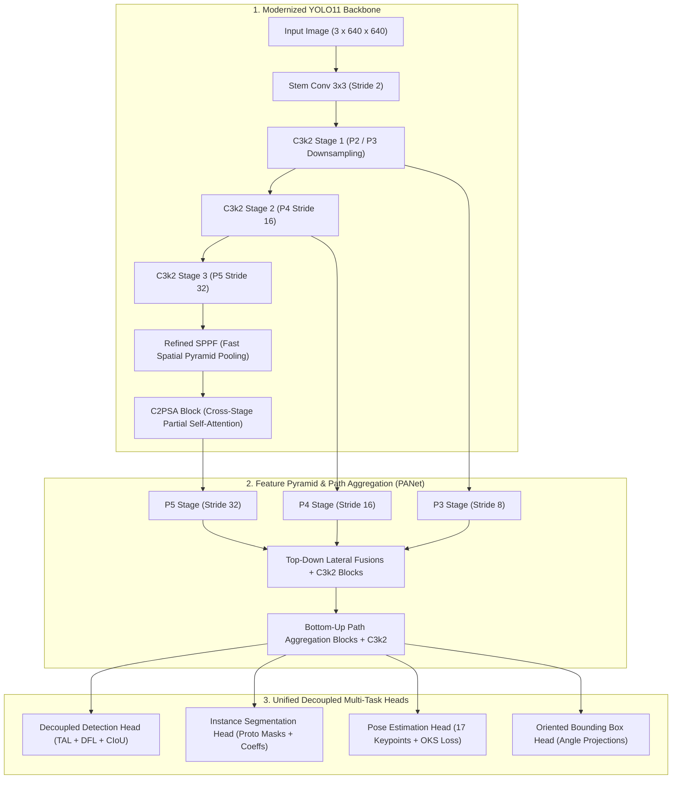
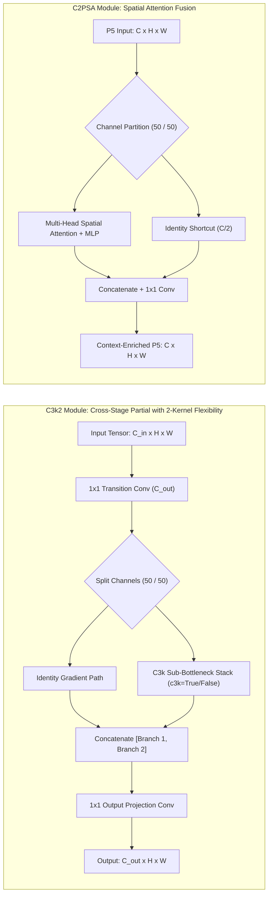
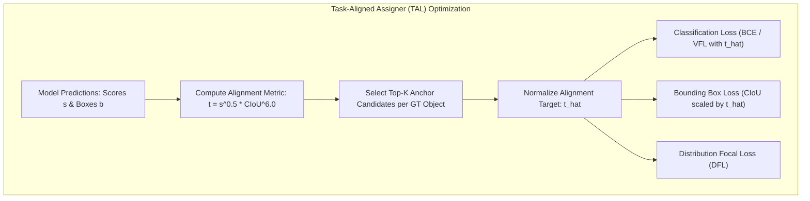
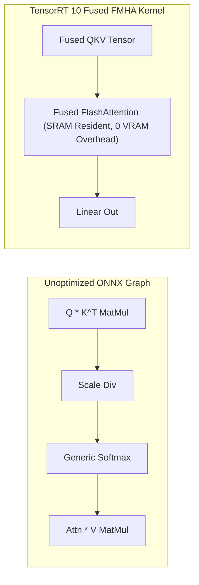

# ⚡ Ultralytics YOLO11: Unified Multi-Task Architecture for Real-Time Perception

## 1. Executive Brief & Significance

Building upon the worldwide industrial adoption of [[architectures/real-time-detectors-and-segmenters/yolov8|YOLOv8]], **Ultralytics YOLO11** (Jocher & Qiu, 2024/2025) redefines the speed-accuracy-efficiency Pareto frontier for real-time computer vision. While maintaining seamless drop-in API compatibility across five core vision tasks—**Object Detection**, **Instance Segmentation**, **Pose / Keypoint Estimation**, **Oriented Bounding Box (OBB)** detection, and **Image Classification**—YOLO11 introduces critical architectural refinements that eliminate computational dead-weight across the backbone, neck, and prediction heads.



The key architectural milestones of YOLO11 comprise:
1. **`C3k2` (Cross-Stage Partial with 2-Kernel Flexibility)**: Replaces the `C2f` blocks from YOLOv8 with a customizable CSP structure capable of toggling between lightweight standard convolutions (`c3k=False`) and deeper sub-bottleneck stacks (`c3k=True`), optimizing gradient propagation paths while drastically slashing parameter counts.
2. **`C2PSA` (Cross-Stage Partial with Spatial Attention)**: Integrates lightweight multi-head self-attention into deep feature stages ($P_5$). By applying spatial attention strictly to a partitioned subset of channels, `C2PSA` enriches global contextual feature representations with negligible compute penalty.
3. **Refined SPPF & Channel Pruning**: Eliminates redundant intermediate convolution channels across stages P3–P5, allowing **YOLO11m to surpass YOLOv8m accuracy on COCO with $22\%$ fewer parameters**.

---

## 2. Component-by-Component Decomposition

| Architectural Component | Technical Specification | YOLO11-S Configuration | YOLO11-X Configuration | Parameter Distribution (%) | Latency / Compute Distribution (%) |
| :--- | :--- | :--- | :--- | :--- | :--- |
| **Architectural Paradigm** | Unified Multi-Task Real-Time Model | Hybrid CNN-Attention (C3k2 + C2PSA + Decoupled Head) | Hybrid CNN-Attention (C3k2 + C2PSA + Decoupled Head) | $100\%$ Total ($9.4\text{M}$ / $56.9\text{M}$) | $100\%$ Total ($21.5\text{G}$ / $194.9\text{G}$) |
| **Vision Backbone** | **C3k2 + SPPF + C2PSA** | 5 stages (P1-P5), channels $[64, 128, 256, 512, 1024]$ | 5 stages (P1-P5), channels $[64, 128, 256, 512, 1024]$ | $\sim 56.4\%$ ($5.3\text{M}$ / $32.1\text{M}$) | $\approx 61.2\%$ forward latency |
| **Stem Block** | $3 \times 3$ Conv2D (Stride 2) | Stride 2, $3 \to 64$ channels | Stride 2, $3 \to 64$ channels | $< 1.0\%$ | $\approx 2.5\%$ forward latency |
| **Neck / Feature Aggregator** | PANet with C3k2 feature fusion | P3, P4, P5 lateral top-down and bottom-up fusions | P3, P4, P5 lateral top-down and bottom-up fusions | $\sim 29.8\%$ ($2.8\text{M}$ / $16.9\text{M}$) | $\approx 26.8\%$ forward latency |
| **Attention Module** | **C2PSA** (Cross-Stage Partial Self-Attention) | 1 block at P5 stage, 4 attention heads, $C/2$ partition | 1 block at P5 stage, 8 attention heads, $C/2$ partition | $\sim 3.2\%$ ($0.3\text{M}$ / $1.8\text{M}$) | $\approx 3.5\%$ forward latency |
| **Multi-Scale Pooling** | **SPPF** (Spatial Pyramid Pooling Fast) | 3 sequential $5 \times 5$ max-pooling operations | 3 sequential $5 \times 5$ max-pooling operations | $< 0.8\%$ | $\approx 1.2\%$ forward latency |
| **Decoupled Detection Head** | Decoupled Anchor-Free (TAL + DFL) | $3 \times 3$ Conv Cls + $3 \times 3$ Conv Reg ($4 \times 16$ DFL bins) | $3 \times 3$ Conv Cls + $3 \times 3$ Conv Reg ($4 \times 16$ DFL bins) | $\sim 9.8\%$ ($0.9\text{M}$ / $5.6\text{M}$) | $\approx 4.8\%$ forward latency |



---

## 3. Mathematical Formulations & Loss Functions

### A. Task-Aligned Assigner (TAL) Formulation
YOLO11 uses dynamic Task-Aligned Assignment to select high-quality anchor points. For anchor $i$ and ground-truth bounding box $g_j$, the alignment score $t_{i, j}$ combines the predicted class score $s_{i, j}$ and bounding box Complete IoU ($\text{CIoU}$):

$$t_{i, j} = s_{i, j}^\alpha \cdot \text{CIoU}(b_i, \hat{b}_j)^\beta$$

where $\alpha = 0.5$ and $\beta = 6.0$ emphasize localization accuracy. The normalized alignment target $\hat{t}_{i, j}$ for positive anchors within the top-$K$ candidates is computed as:

$$\hat{t}_{i, j} = t_{i, j} \cdot \frac{\max_{k} \text{CIoU}(b_k, \hat{b}_j)}{\max_{k} t_{k, j}}$$



### B. Distribution Focal Loss (DFL)
Instead of predicting four deterministic bounding box coordinates $(l, t, r, b)$, YOLO11 models each continuous edge coordinate $y$ as a general probability distribution over $N_{\text{reg}} = 16$ discrete bins ($y \in [0, 15]$). The continuous expectation $\hat{y}$ is recovered via the softmax integral:

$$\hat{y} = \sum_{i=0}^{15} i \cdot \text{Softmax}(S)_i = \sum_{i=0}^{15} i \cdot \frac{\exp(S_i)}{\sum_{j=0}^{15} \exp(S_j)}$$

The Distribution Focal Loss enforces the predicted distribution to focus tightly on the values $y_i$ and $y_{i+1}$ neighboring the ground truth $y$ ($y_i \le y \le y_{i+1}$):

$$\mathcal{L}_{\text{DFL}}(S_i, S_{i+1}) = - \left( (y_{i+1} - y) \log(S_i) + (y - y_i) \log(S_{i+1}) \right)$$

### C. Prototypical Instance Segmentation Loss
For instance segmentation tasks, YOLO11 deploys a **Prototypical Mask Head**:
1. The protonet computes $k=32$ prototype mask bases $\mathbf{P} \in \mathbb{R}^{32 \times \frac{H}{4} \times \frac{W}{4}}$ from feature map $P_3$.
2. The decoupled head predicts $k=32$ mask coefficients $\mathbf{c} \in \mathbb{R}^{1 \times 32}$ for each candidate bounding box.
3. The instance mask prediction $\mathbf{M} \in \mathbb{R}^{\frac{H}{4} \times \frac{W}{4}}$ is computed via linear matrix multiplication and sigmoid activation:
   $$\mathbf{M} = \sigma \left( \mathbf{c} \cdot \mathbf{P} \right)$$
4. The mask loss is evaluated using Binary Cross-Entropy (BCE) cropped to the predicted bounding box region $\Omega_{\text{box}}$:
   $$\mathcal{L}_{\text{mask}} = \frac{1}{|\Omega_{\text{box}}|} \sum_{(u, v) \in \Omega_{\text{box}}} \text{BCE} \left( \mathbf{M}(u, v), \mathbf{M}_{\text{GT}}(u, v) \right)$$

### D. Multi-Task Combined Loss
The total end-to-end multi-task loss is:

$$\mathcal{L}_{\text{total}} = \lambda_{\text{cls}} \mathcal{L}_{\text{cls}}(p, \hat{t}) + \lambda_{\text{box}} \hat{t} \cdot \mathcal{L}_{\text{CIoU}}(b, \hat{b}) + \lambda_{\text{dfl}} \hat{t} \cdot \mathcal{L}_{\text{DFL}} + \mathbb{I}_{\text{seg}} \lambda_{\text{mask}} \mathcal{L}_{\text{mask}} + \mathbb{I}_{\text{pose}} \lambda_{\text{pose}} \mathcal{L}_{\text{OKS}}$$

---

## 4. Benchmark Evaluation & Performance Profiles

The following performance matrix benchmarks YOLO11 against prior YOLO generations on the standard COCO 2017 test-dev / minival dataset across multiple NVIDIA deployment targets:

| Architecture | Task | Parameters (M) | FLOPs (G) | mAP 50:95 (%) | mAP 50 (%) | T4 TRT FP16 (ms) | A100 TRT FP16 (ms) | Orin AGX FP16 (ms) | Orin AGX INT8 (ms) |
| :--- | :--- | :--- | :--- | :--- | :--- | :--- | :--- | :--- | :--- |
| **YOLO11-N** | Detection | 2.6M | 6.5G | 39.5% | 55.2% | 1.52 ms | 0.52 ms | 3.1 ms | 1.6 ms |
| **YOLO11-S** | Detection | 9.4M | 21.5G | 47.0% | 63.8% | 2.38 ms | 0.78 ms | 5.4 ms | 2.7 ms |
| **YOLO11-M** | Detection | 20.1M | 68.0G | 51.5% | 68.8% | 4.40 ms | 1.38 ms | 10.2 ms | 5.0 ms |
| **YOLO11-L** | Detection | 25.3M | 86.9G | 53.4% | 70.8% | 5.92 ms | 1.82 ms | 13.8 ms | 6.8 ms |
| **YOLO11-X** | Detection | 56.9M | 194.9G | 54.7% | 72.2% | 11.20 ms | 3.45 ms | 24.5 ms | 12.1 ms |
| **YOLO11-N-Seg** | Segmentation | 2.9M | 10.4G | 32.2% (Mask) | 51.8% | 1.85 ms | 0.64 ms | 4.2 ms | 2.2 ms |
| **YOLO11-S-Seg** | Segmentation | 10.1M | 35.6G | 38.8% (Mask) | 60.4% | 2.95 ms | 0.98 ms | 6.8 ms | 3.4 ms |
| **YOLO11-M-Seg** | Segmentation | 22.4M | 85.2G | 42.6% (Mask) | 65.2% | 5.65 ms | 1.74 ms | 12.8 ms | 6.4 ms |
| **YOLO11-L-Seg** | Segmentation | 27.6M | 110.4G | 43.9% (Mask) | 66.8% | 7.40 ms | 2.30 ms | 16.5 ms | 8.2 ms |
| **YOLO11-X-Seg** | Segmentation | 62.1M | 245.0G | 45.2% (Mask) | 68.5% | 13.80 ms | 4.20 ms | 29.8 ms | 14.6 ms |

*Measurements taken at $640 \times 640$ resolution, batch size 1, using TensorRT 10.x execution engines.*

---

## 5. Edge Deployment, TensorRT Optimization & Gotchas

### A. C2PSA Module TensorRT Graph Optimization
The `C2PSA` block embeds Multi-Head Self-Attention (MHSA) into stage P5. In naive ONNX exports, MHSA explodes into dozens of disjoint Reshape, Transpose, Slice, and MatMul operators, degrading GPU kernel launch efficiency.

**Optimization Recipe**:
- Export ONNX using `opset=17` or higher.
- In TensorRT 10, the builder automatically fuses the QKV MatMul and Softmax nodes into an on-chip **FlashAttention / Fused Multi-Head Attention (FMHA)** kernel.
- To prevent numerical overflow in FP16 / INT8 quantization, keep Softmax scale parameters in FP32 / FP16 precision.



### B. INT8 Calibration Strategy
When performing Post-Training Quantization (PTQ) on YOLO11 for Jetson Orin or NVIDIA T4:
1. **Calibration Data Distribution**: Use at least 500 images representative of target camera viewpoints and illumination conditions.
2. **Layer Precision Overrides**: Apply `IInt8EntropyCalibrator2`. If mask mAP drops $> 1.0\%$ on segmentation models, force the Protonet upsampling layers and C2PSA attention softmax to FP16 precision.

### C. End-to-End ONNX Export & TensorRT Compilation

```python
from ultralytics import YOLO

# 1. Load pre-trained YOLO11 model
model = YOLO("yolo11s.pt")

# 2. Export to ONNX with static shapes and constant folding
onnx_path = model.export(
    format="onnx",
    imgsz=640,
    dynamic=False,        # Static shapes optimal for embedded Jetson runtimes
    simplify=True,
    opset=17,
    half=False
)
print(f"Exported YOLO11 ONNX to {onnx_path}")
```

```bash
# Compile to optimized TensorRT FP16 / INT8 Engine via trtexec
trtexec \
  --onnx=yolo11s.onnx \
  --saveEngine=yolo11s_fp16.engine \
  --fp16 \
  --builderOptimizationLevel=5 \
  --avgRuns=100
```

---

## 6. Complete Runnable Python Blueprint

The following standalone PyTorch script implements the core architectural components of YOLO11: **`C3k2`**, **`C2PSA`**, **`SPPF`**, and the **Decoupled Multi-Task Head**.

```python
import torch
import torch.nn as nn
import torch.nn.functional as F

class ConvBNSiLU(nn.Module):
    """Standard Convolution with Batch Normalization and SiLU activation."""
    def __init__(self, in_c, out_c, k=1, s=1, p=None, g=1):
        super().__init__()
        p = p if p is not None else k // 2
        self.conv = nn.Conv2d(in_c, out_c, kernel_size=k, stride=s, padding=p, groups=g, bias=False)
        self.bn = nn.BatchNorm2d(out_c)
        self.act = nn.SiLU(inplace=True)

    def forward(self, x):
        return self.act(self.bn(self.conv(x)))


class Bottleneck(nn.Module):
    """Standard Bottleneck with optional shortcut connection."""
    def __init__(self, c1, c2, shortcut=True, g=1, k=(3, 3), e=0.5):
        super().__init__()
        c_ = int(c2 * e)
        self.cv1 = ConvBNSiLU(c1, c_, k=k[0], s=1)
        self.cv2 = ConvBNSiLU(c_, c2, k=k[1], s=1, g=g)
        self.add = shortcut and c1 == c2

    def forward(self, x):
        return x + self.cv2(self.cv1(x)) if self.add else self.cv2(self.cv1(x))


class C3k(nn.Module):
    """C3k block: customized CSP block with togglable inner bottleneck depth."""
    def __init__(self, c1, c2, n=1, shortcut=True, g=1, e=0.5, k=3):
        super().__init__()
        c_ = int(c2 * e)
        self.cv1 = ConvBNSiLU(c1, c_, k=1, s=1)
        self.cv2 = ConvBNSiLU(c1, c_, k=1, s=1)
        self.cv3 = ConvBNSiLU(2 * c_, c2, k=1)
        self.m = nn.Sequential(*(Bottleneck(c_, c_, shortcut, g, k=(k, k), e=1.0) for _ in range(n)))

    def forward(self, x):
        return self.cv3(torch.cat((self.m(self.cv1(x)), self.cv2(x)), dim=1))


class C3k2(nn.Module):
    """Faster C3k block with 2-convolution CSP structure and c3k toggling."""
    def __init__(self, c1, c2, n=1, c3k=False, e=0.5, g=1, shortcut=True):
        super().__init__()
        self.c = int(c2 * e)
        self.cv1 = ConvBNSiLU(c1, 2 * self.c, k=1, s=1)
        self.cv2 = ConvBNSiLU((2 + n) * self.c, c2, k=1)
        if c3k:
            self.m = nn.ModuleList([C3k(self.c, self.c, n=2, shortcut=shortcut, g=g) for _ in range(n)])
        else:
            self.m = nn.ModuleList([Bottleneck(self.c, self.c, shortcut=shortcut, g=g) for _ in range(n)])

    def forward(self, x):
        y = list(self.cv1(x).chunk(2, 1))
        y.extend(m(y[-1]) for m in self.m)
        return self.cv2(torch.cat(y, 1))


class SPPF(nn.Module):
    """Spatial Pyramid Pooling Fast (SPPF)."""
    def __init__(self, c1, c2, k=5):
        super().__init__()
        c_ = c1 // 2
        self.cv1 = ConvBNSiLU(c1, c_, 1, 1)
        self.cv2 = ConvBNSiLU(c_ * 4, c2, 1, 1)
        self.m = nn.MaxPool2d(kernel_size=k, stride=1, padding=k // 2)

    def forward(self, x):
        x = self.cv1(x)
        y1 = self.m(x)
        y2 = self.m(y1)
        y3 = self.m(y2)
        return self.cv2(torch.cat([x, y1, y2, y3], 1))


class C2PSA(nn.Module):
    """Cross-Stage Partial Self-Attention (C2PSA) Module."""
    def __init__(self, c1, c2, n=1, e=0.5, num_heads=4):
        super().__init__()
        self.c = int(c2 * e)
        self.cv1 = ConvBNSiLU(c1, 2 * self.c, 1, 1)
        self.cv2 = ConvBNSiLU(2 * self.c, c2, 1, 1)
        
        # Spatial Attention on the second partition
        self.num_heads = num_heads
        self.head_dim = self.c // num_heads
        self.scale = self.head_dim ** -0.5
        self.qkv = nn.Conv2d(self.c, self.c * 3, 1, bias=False)
        self.proj = nn.Conv2d(self.c, self.c, 1, bias=False)
        self.ffn = nn.Sequential(
            ConvBNSiLU(self.c, self.c * 2, 1),
            ConvBNSiLU(self.c * 2, self.c, 1)
        )

    def forward(self, x):
        x1, x2 = self.cv1(x).chunk(2, 1)
        B, C, H, W = x2.shape
        N = H * W
        
        qkv = self.qkv(x2).reshape(B, 3, self.num_heads, self.head_dim, N).permute(1, 0, 2, 4, 3)
        q, k, v = qkv[0], qkv[1], qkv[2]
        
        attn = (q @ k.transpose(-2, -1)) * self.scale
        attn = F.softmax(attn, dim=-1)
        out = (attn @ v).permute(0, 1, 3, 2).reshape(B, C, H, W)
        
        x2 = x2 + self.proj(out)
        x2 = x2 + self.ffn(x2)
        return self.cv2(torch.cat([x1, x2], 1))


class YOLO11DecoupledHead(nn.Module):
    """Decoupled Multi-Scale Detection Head for YOLO11."""
    def __init__(self, num_classes=80, in_channels=[128, 256, 512], reg_max=16):
        super().__init__()
        self.num_classes = num_classes
        self.reg_max = reg_max
        self.nl = len(in_channels)
        
        self.cls_heads = nn.ModuleList([
            nn.Sequential(
                ConvBNSiLU(c, c, 3),
                ConvBNSiLU(c, c, 3),
                nn.Conv2d(c, num_classes, 1)
            ) for c in in_channels
        ])
        
        self.reg_heads = nn.ModuleList([
            nn.Sequential(
                ConvBNSiLU(c, c, 3),
                ConvBNSiLU(c, c, 3),
                nn.Conv2d(c, 4 * reg_max, 1)
            ) for c in in_channels
        ])

    def forward(self, feats):
        cls_outputs, reg_outputs = [], []
        for i, feat in enumerate(feats):
            cls_outputs.append(self.cls_heads[i](feat))
            reg_outputs.append(self.reg_heads[i](feat))
        return {"cls": cls_outputs, "reg": reg_outputs}


# Validation smoke-run
if __name__ == "__main__":
    p3 = torch.randn(2, 128, 80, 80)
    p4 = torch.randn(2, 256, 40, 40)
    p5 = torch.randn(2, 512, 20, 20)
    
    # Test C3k2
    c3k2 = C3k2(512, 512, n=2, c3k=True)
    out_c3k2 = c3k2(p5)
    assert out_c3k2.shape == (2, 512, 20, 20)
    
    # Test SPPF + C2PSA
    sppf = SPPF(512, 512)
    c2psa = C2PSA(512, 512, num_heads=8)
    out_p5 = c2psa(sppf(p5))
    assert out_p5.shape == (2, 512, 20, 20)
    
    # Test Head
    head = YOLO11DecoupledHead(num_classes=80, in_channels=[128, 256, 512])
    preds = head([p3, p4, out_p5])
    print(f"P3 Cls shape: {preds['cls'][0].shape}")
    print(f"P3 Reg shape: {preds['reg'][0].shape}")
    print("YOLO11 Blueprint validation succeeded.")
```

---

## 7. Peer Comparisons & Cross-Links

| Architectural Attribute | YOLO11 | [[architectures/real-time-detectors-and-segmenters/yolov8|YOLOv8]] | [[architectures/real-time-detectors-and-segmenters/yolov10|YOLOv10]] | [[architectures/real-time-detectors-and-segmenters/yolov12|YOLOv12]] | [[architectures/real-time-detectors-and-segmenters/rt-detr|RT-DETR]] |
| :--- | :--- | :--- | :--- | :--- | :--- |
| **Core CSP Block** | **C3k2** (Flexible $2\times$ Convs) | C2f (Fast CSP) | C2fUIB (Inverted Bottleneck) | A-GELAN (Residual ELAN) | HGBlock (RepVGG) |
| **Attention Mechanism** | **C2PSA** (Partial Self-Attn) | None (Pure Conv) | PSA (Partial Self-Attn) | Area Attention ($A^2$) | Multi-Scale AIFI |
| **Parameter Efficiency** | **High** ($22\%$ lower than v8) | Baseline Reference | Very High | Extremely High | Moderate |
| **Label Assigner** | Task-Aligned Assigner (TAL) | Task-Aligned Assigner (TAL) | Consistent Dual ($1:1 + 1:N$) | Task-Aligned / Dual | Hungarian Matching |
| **NMS Dependency** | Requires NMS | Requires NMS | **NMS-Free** | Standard / NMS-Free | **NMS-Free** |
| **Multi-Task Support** | Det, Seg, Pose, OBB, Cls | Det, Seg, Pose, OBB, Cls | Detection-Focused | Det, Seg, Pose | Detection & Seg |

- **Related Topics & MOCs**:
  - [[topics/object-detection/00-object-detection-moc|Object Detection MOC]]
  - [[topics/real-time-systems/00-real-time-systems-moc|Real-Time Systems MOC]]
  - [[topics/gpu-deployment/00-gpu-deployment-moc|GPU Deployment MOC]]
  - [[architectures/real-time-detectors-and-segmenters/yolov8|YOLOv8: Real-Time Anchor-Free Framework]]
  - [[architectures/real-time-detectors-and-segmenters/yolov10|YOLOv10: Consistent Dual Assignments]]
  - [[architectures/real-time-detectors-and-segmenters/yolov12|YOLOv12: Attention-Centric Real-Time Detection]]
  - [[architectures/real-time-detectors-and-segmenters/rf-detr|RF-DETR: NAS-Optimized Detection Transformer]]
