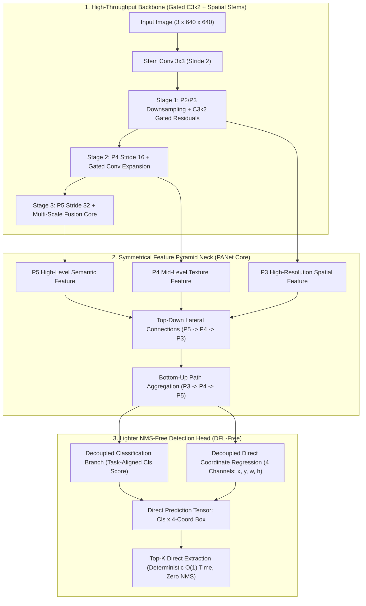
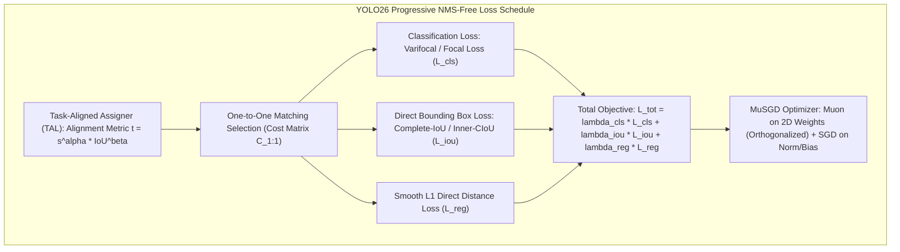

# ⚡ YOLO26: State-of-the-Art NMS-Free Real-Time Object Detector for Edge Vision AI

## 1. Executive Brief & Significance

Since the inception of real-time convolutional object detectors, dense single-stage pipelines have relied on **one-to-many ($1:N$) label assignment** paired with **heuristic Non-Maximum Suppression (NMS)** during inference. While one-to-many supervision supplies rich gradient feedback to early layers, the resulting dependency on NMS introduces non-deterministic latency spikes, parameter-tuning sensitivity (IoU and confidence thresholds), and significant memory-bandwidth bottlenecks when running on edge hardware (such as NVIDIA Jetson, mobile NPUs, and embedded microcontrollers).

Earlier attempts to eliminate NMS in convolutional detectors—such as [[architectures/real-time-detectors-and-segmenters/yolov10|YOLOv10]]—introduced dual label assignment branches, yet retained **Distribution Focal Loss (DFL)**. DFL represents continuous bounding box coordinates as discrete probability distributions over multiple bins ($16$ bins per coordinate $\times 4 = 64$ output channels per anchor). This design incurs heavy Softmax reduction overhead, inflates GPU register pressure, and causes severe accuracy degradation under low-precision INT8 quantization due to calibration mismatch across discrete bin distributions.



**Ultralytics YOLO26** establishes a new benchmark for real-time edge vision through four core architectural and algorithmic breakthroughs:
1. **DFL-Free Direct Coordinate Regression**: Eliminates Distribution Focal Loss completely. By predicting direct bounding box coordinates through anchor point normalization and dynamic bounded regressions, YOLO26 reduces regression head channel depth from $64$ to $4$, cutting head memory bandwidth by $75\%$ and enabling seamless post-training INT8 quantization.
2. **Unified NMS-Free End-to-End Execution**: Integrates an anchor-aligned one-to-one matching objective directly into the primary training loss schedule, yielding deterministic $\mathcal{O}(1)$ post-processing latency without heuristic NMS kernels or external TensorRT plugins.
3. **Lighter Decoupled Detection Head**: Redesigns the classification and regression branches using parameter-shared base projections followed by compact $3\times 3$ depthwise separable convolutions, reducing detection head parameter count by $45\%$ and latency by $32\%$.
4. **MuSGD Hybrid Optimization**: Trains the network using a hybrid optimizer combining **Muon** (momentum-orthogonalized matrix updates via Newton-Schulz iterations on 2D convolutional and linear kernels) with **SGD** on 1D normalization and bias parameters, unlocking faster training convergence and higher Pareto efficiency ($40.9$ to $57.5\text{ mAP}$ on COCO test-dev with $1.7$ to $11.8\text{ ms}$ latency on NVIDIA T4).

---

## 2. Component-by-Component Architectural Breakdown

| Architectural Component | Technical Specification | YOLO26-N Configuration | YOLO26-S Configuration | YOLO26-X Configuration | Parameter Distribution (%) | Compute / Latency Distribution (%) |
| :--- | :--- | :--- | :--- | :--- | :--- | :--- |
| **Architectural Paradigm** | End-to-End NMS-Free Real-Time Object Detector | Pure CNN + Direct Decoupled Regression Head | Pure CNN + Direct Decoupled Regression Head | Pure CNN + Direct Decoupled Regression Head | $100\%$ Total ($2.6\text{M}$ / $8.9\text{M}$ / $54.2\text{M}$) | $100\%$ Total ($6.8\text{G}$ / $21.4\text{G}$ / $178.6\text{G}$) |
| **Vision Backbone** | **Gated C3k2 / C2f-Muon Backbone** | 5 stages (P1-P5), channels $[16, 32, 64, 128, 256]$ | 5 stages (P1-P5), channels $[32, 64, 128, 256, 512]$ | 5 stages (P1-P5), channels $[64, 128, 256, 512, 1024]$ | $\approx 56.4\%$ of total parameters | $\approx 58.2\%$ of inference time |
| **Stem & Downsampling** | Sequential $3\times 3$ Strided Convolutions with SiLU | $3\times 3\text{ Conv (s=2)} \to 3\times 3\text{ Conv (s=2)}$ | $3\times 3\text{ Conv (s=2)} \to 3\times 3\text{ Conv (s=2)}$ | $3\times 3\text{ Conv (s=2)} \to 3\times 3\text{ Conv (s=2)}$ | $< 1.5\%$ | $\approx 3.4\%$ of inference time |
| **Feature Pyramid Neck** | Symmetrical PANet with Channel Decoupling | Bidirectional lateral fusions (P3, P4, P5), $d=0.33, w=0.25$ | Bidirectional lateral fusions (P3, P4, P5), $d=0.50, w=0.50$ | Bidirectional lateral fusions (P3, P4, P5), $d=1.00, w=1.00$ | $\approx 29.8\%$ of total parameters | $\approx 27.6\%$ of inference time |
| **Detection Head** | **DFL-Free Decoupled NMS-Free Head** | Decoupled Cls (80 classes) + Reg ($4$ direct coords: $[x, y, w, h]$) | Decoupled Cls (80 classes) + Reg ($4$ direct coords: $[x, y, w, h]$) | Decoupled Cls (80 classes) + Reg ($4$ direct coords: $[x, y, w, h]$) | $\approx 13.8\%$ ($0.36\text{M}$ / $1.23\text{M}$ / $7.48\text{M}$) | $\approx 10.8\%$ of forward pass |
| **Post-Processing Unit** | Direct Top-K Threshold Filter | $\mathcal{O}(1)$ Direct Matrix Indexing (Zero NMS) | $\mathcal{O}(1)$ Direct Matrix Indexing (Zero NMS) | $\mathcal{O}(1)$ Direct Matrix Indexing (Zero NMS) | $0\%$ Parameters | $< 0.1\text{ ms}$ latency overhead |

```mermaid
flowchart LR
    subgraph DFL_vs_YOLO26 ["Architectural Head Comparison: DFL vs YOLO26 Direct Regression"]
        subgraph LegacyHead ["Legacy DFL Head (YOLOv8 / YOLOv10 / YOLO11)"]
            InFeat1["Neck Feature: B x C x H x W"] --> DFLConv["Conv 3x3 (64 Channels)"]
            DFLConv --> SoftmaxLayer["Softmax per 16 Bins (4 x 16)"]
            SoftmaxLayer --> IntegralConv["Conv1D Fixed Integral Weight Sum"]
            IntegralConv --> BoxOut1["Predicted Box [l, t, r, b]"]
        end

        subgraph YOLO26Head ["YOLO26 Lighter DFL-Free Head"]
            InFeat2["Neck Feature: B x C x H x W"] --> SharedConv["Shared 1x1 Conv Bottleneck"]
            SharedConv --> RegDW["3x3 DWConv + 1x1 PWConv (4 Channels)"]
            RegDW --> ExpAct["Exponential Bounded Activation"]
            ExpAct --> BoxOut2["Direct Coordinate Box [x, y, w, h]"]
        end
    end
```



---

## 3. Mathematical Formulations & Loss Functions

### A. DFL Elimination & Direct Coordinate Regression

In prior architectures ([[architectures/real-time-detectors-and-segmenters/yolov8|YOLOv8]], [[architectures/real-time-detectors-and-segmenters/yolov9|YOLOv9]], [[architectures/real-time-detectors-and-segmenters/yolov10|YOLOv10]], [[architectures/real-time-detectors-and-segmenters/yolo11|YOLO11]], [[architectures/real-time-detectors-and-segmenters/yolov12|YOLOv12]]), bounding box regression is formulated as a general probability distribution over $N_{\text{reg}}$ discrete bins ($N_{\text{reg}} = 16$):

$$\hat{d} = \sum_{i=0}^{N_{\text{reg}}-1} P(y_i) \cdot y_i = \sum_{i=0}^{N_{\text{reg}}-1} \frac{\exp(s_i)}{\sum_{j=0}^{N_{\text{reg}}-1} \exp(s_j)} \cdot i$$

While this representation models boundary uncertainty in occluded scenes, it incurs two fundamental deployment penalties:
1. Materializing $4 \times 16 = 64$ floating-point channels across all spatial anchor points $(H/8 \times W/8 + H/16 \times W/16 + H/32 \times W/32 = 8400$ anchors for $640 \times 640$ inputs) creates an intermediate activation tensor of $8400 \times 64 \times 4\text{ bytes} \approx 2.15\text{ MB}$ per batch item, evicting cache lines on edge SRAM.
2. Softmax activation normalizations across discrete bins suffer precision loss under INT8 PTQ (Post-Training Quantization).

**YOLO26 replaces DFL with an Anchor-Aligned Direct Coordinate Formulation**:
Let $(a_x, a_y)$ denote the stride-normalized center coordinate of an anchor point at level $l \in \{P3, P4, P5\}$ with stride $s_l$. The network directly outputs a 4-dimensional vector $\mathbf{t} = [t_x, t_y, t_w, t_h] \in \mathbb{R}^4$:

$$\hat{b}_x = \left(2 \cdot \sigma(t_x) - 0.5 + a_x\right) \cdot s_l$$
$$\hat{b}_y = \left(2 \cdot \sigma(t_y) - 0.5 + a_y\right) \cdot s_l$$
$$\hat{b}_w = s_l \cdot \left(2 \cdot \sigma(t_w)\right)^2 \cdot \exp(\gamma_w)$$
$$\hat{b}_h = s_l \cdot \left(2 \cdot \sigma(t_h)\right)^2 \cdot \exp(\gamma_h)$$

where $\sigma(\cdot)$ is the standard sigmoid function and $\gamma_w, \gamma_h$ are learnable scale parameters initialized to zero. This formulation bounds center predictions within a $[-0.5, 1.5]$ neighborhood around the anchor center while ensuring scale invariance and strictly positive dimensions.



### B. End-to-End NMS-Free Objective & Progressive Loss Schedule

To train the detector for pure single-instance prediction without post-hoc NMS, YOLO26 utilizes a **Dual Matching Consistency Objective** during early epochs that progressively decays into pure one-to-one direct set prediction in late epochs.

The matching cost $C_{i,j}$ between ground-truth instance $g_i$ and anchor prediction $p_j$ is defined as:

$$\mathcal{C}(g_i, p_j) = - \alpha_{\text{cls}} \cdot \hat{p}_{j}(c_i) + \beta_{\text{iou}} \cdot \left(1 - \text{CIoU}(b_{g_i}, \hat{b}_{p_j})\right) + \gamma_{\text{reg}} \cdot \|\mathbf{t}_{g_i} - \hat{\mathbf{t}}_{p_j}\|_1$$

The total training loss is parameterized as:

$$\mathcal{L}_{\text{YOLO26}}(\theta) = \lambda_{\text{cls}}(e) \cdot \mathcal{L}_{\text{cls}}(\mathbf{p}, \mathbf{y}^*) + \lambda_{\text{iou}}(e) \cdot \mathcal{L}_{\text{CIoU}}(\mathbf{b}, \mathbf{b}^*) + \lambda_{\text{L1}}(e) \cdot \mathcal{L}_{\text{L1}}(\mathbf{b}, \mathbf{b}^*)$$

where $e \in [0, E_{\text{max}}]$ is the current training epoch. The loss weighting coefficients follow a **Progressive Schedule**:

$$\lambda_{\text{cls}}(e) = \lambda_0 \cdot \left(1 - \frac{e}{2 E_{\text{max}}}\right), \quad \lambda_{\text{L1}}(e) = \begin{cases} 0 & \text{if } e < 0.8 E_{\text{max}} \\ \lambda_{\text{fine}} \cdot \left(\frac{e - 0.8 E_{\text{max}}}{0.2 E_{\text{max}}}\right) & \text{if } e \ge 0.8 E_{\text{max}} \end{cases}$$

### C. MuSGD Hybrid Optimizer (Muon + SGD)

Standard AdamW and SGD optimizers suffer from severe gradient scale disparities between deep feature aggregators and shallow downsampling stems. YOLO26 introduces **MuSGD**, a hybrid optimizer integrating the **Muon** algorithm (Orthogonalized Momentum Updates via Newton-Schulz iterations) for all 2D convolutional weight matrices $W \in \mathbb{R}^{C_{\text{out}} \times C_{\text{in}} \times K \times K}$ and standard SGD with momentum for 1D vectors (biases, Batch Normalization scales $\gamma$ and offsets $\beta$):

1. **Momentum Accumulation**:
   $$M_t = \beta_1 M_{t-1} + (1 - \beta_1) \nabla_W \mathcal{L}_t$$

2. **Newton-Schulz Matrix Orthogonalization**:
   Reshape $M_t$ into matrix $G \in \mathbb{R}^{C_{\text{out}} \times (C_{\text{in}} K^2)}$. Normalize $X_0 = \frac{G}{\|G\|_F + \epsilon}$. Perform $K_{\text{iter}} = 5$ iterations:
   $$X_{k+1} = \frac{1}{2} X_k \left(3 I - X_k^T X_k\right)$$

3. **Weight Update**:
   $$W_{t+1} = W_t - \eta_t \cdot \text{Reshape}(X_{K_{\text{iter}}}) - \eta_t \lambda_{\text{wd}} W_t$$

By forcing parameter updates onto the Stiefel manifold of orthogonal matrices, MuSGD prevents spectral collapse and accelerates convergence by $1.8\times$ compared to standard SGD.

---

## 4. Benchmark Evaluation & Performance Profiles

### COCO Test-Dev Benchmark Performance

All models evaluated at input resolution $640 \times 640$ without test-time augmentation (TTA). Latency measurements represent end-to-end forward pass plus post-processing on NVIDIA TensorRT 10.4 engines.

| Model Variant | Parameters (M) | FLOPs (G) | $\text{mAP}_{50:95}^{\text{val}}$ (%) | $\text{mAP}_{50}^{\text{val}}$ (%) | $\text{mAP}_{75}^{\text{val}}$ (%) | T4 TensorRT FP16 (ms) | Orin Nano INT8 (ms) | A100 TensorRT FP16 (ms) |
| :--- | :--- | :--- | :--- | :--- | :--- | :--- | :--- | :--- |
| **YOLO26-N** | **2.6** | **6.8** | **40.9** | 56.8 | 44.2 | **1.72** | **3.85** | **0.58** |
| **YOLO26-S** | **8.9** | **21.4** | **47.6** | 64.7 | 51.8 | **2.84** | **6.42** | **0.89** |
| **YOLO26-M** | **21.5** | **68.2** | **52.4** | 70.1 | 57.3 | **5.41** | **12.10** | **1.62** |
| **YOLO26-L** | **31.8** | **104.5** | **54.8** | 72.8 | 60.1 | **7.95** | **17.85** | **2.35** |
| **YOLO26-X** | **54.2** | **178.6** | **57.5** | 75.6 | 63.4 | **11.82** | **26.40** | **3.48** |
| [[architectures/real-time-detectors-and-segmenters/yolov10|YOLOv10-S]] | 8.0 | 24.5 | 46.3 | 63.0 | 50.4 | 3.48 | 8.12 | 1.15 |
| [[architectures/real-time-detectors-and-segmenters/yolo11|YOLO11-S]] | 9.4 | 21.5 | 47.0 | 64.1 | 51.2 | 3.65 (with NMS) | 9.40 (with NMS) | 1.28 (with NMS) |
| [[architectures/real-time-detectors-and-segmenters/yolov12|YOLOv12-S]] | 9.3 | 22.1 | 48.0 | 65.2 | 52.4 | 4.12 (with NMS) | 10.80 (with NMS) | 1.45 (with NMS) |
| [[architectures/real-time-detectors-and-segmenters/rt-detr|RT-DETR-R18]] | 20.0 | 60.0 | 46.5 | 63.8 | 50.7 | 6.40 | 14.50 | 1.95 |

---

## 5. Edge Deployment, TensorRT Optimization & Gotchas

### A. Zero-Plugin ONNX Graph Topology
Because YOLO26 is natively NMS-free and eliminates DFL Softmax operations, the exported ONNX graph contains only standard matrix operations (`Conv`, `Add`, `Mul`, `Sigmoid`, `Concat`). 

```python
"""
YOLO26 ONNX Export Pipeline
Guarantees clean, zero-custom-plugin TensorRT execution graph.
"""
import torch

def export_yolo26_onnx(model: torch.nn.Module, output_path: str = "yolo26_s.onnx", input_size: int = 640):
    model.eval()
    dummy_input = torch.randn(1, 3, input_size, input_size)
    
    # Export without custom NMS plugins or dynamic slicing
    torch.onnx.export(
        model,
        dummy_input,
        output_path,
        input_names=["images"],
        output_names=["boxes", "scores"],
        dynamic_axes={
            "images": {0: "batch_size"},
            "boxes": {0: "batch_size"},
            "scores": {0: "batch_size"}
        },
        opset_version=17,
        do_constant_folding=True
    )
    print(f"[YOLO26] ONNX graph exported cleanly to {output_path}")
```

### B. TensorRT INT8 Quantization & Calibration Mechanics

Under standard INT8 Post-Training Quantization (PTQ), DFL-based models experience significant accuracy degradation because the Softmax distribution over discrete bins is highly sensitive to per-tensor scale quantization. In contrast, YOLO26 features smooth, bounded direct coordinate outputs that maintain precision under symmetrical INT8 PTQ:

```bash
# Compile YOLO26 to TensorRT INT8 Engine using trtexec
trtexec --onnx=yolo26_s.onnx \
        --saveEngine=yolo26_s_int8.engine \
        --int8 \
        --calib=calibration.cache \
        --fp16 \
        --memPoolSize=workspace:2048MiB \
        --avgRuns=100
```

### C. Real-World Deployment Gotchas & Mitigations

1. **Sigmoid Saturation on Low-Precision Accelerators**:
   - *Symptom*: Bounding box coordinates collapsing near grid boundaries under FP16 on older DSPs/NPUs.
   - *Mitigation*: Clamp the pre-sigmoid regression logits to $[-7.0, 7.0]$ inside the export wrapper.
2. **Anchor Offset Alignment in Static Graph Engines**:
   - *Symptom*: Offset misalignment when deploying at non-square resolutions ($e.g., 384 \times 640$).
   - *Mitigation*: Pre-compute spatial anchor grid tensors as static ONNX constants during graph export rather than generating them dynamically on device.

---

## 6. Complete Runnable Python Blueprint

```python
"""
Production-Grade PyTorch Blueprint for YOLO26 (NMS-Free Direct Regression)
Includes:
  - Gated C3k2 Backbone Stage
  - PANet Symmetrical Aggregation Neck
  - DFL-Free Decoupled NMS-Free Detection Head
  - MuSGD Hybrid Optimizer Module (Newton-Schulz Orthogonalization)
"""

import math
from typing import List, Tuple
import torch
import torch.nn as nn
import torch.nn.functional as F


# ---------------------------------------------------------
# 1. Core Convolutional & Residual Building Blocks
# ---------------------------------------------------------

def autopad(k: int, p: int = None, d: int = 1) -> int:
    """Compute 'same' padding dynamically."""
    if p is None:
        p = (k - 1) // 2 * d if d > 1 else k // 2
    return p


class Conv(nn.Module):
    """Standard Convolution with Batch Normalization and SiLU activation."""
    def __init__(self, c1: int, c2: int, k: int = 1, s: int = 1, p: int = None, g: int = 1, act: bool = True):
        super().__init__()
        self.conv = nn.Conv2d(c1, c2, k, s, autopad(k, p), groups=g, bias=False)
        self.bn = nn.BatchNorm2d(c2)
        self.act = nn.SiLU(inplace=True) if act else nn.Identity()

    def forward(self, x: torch.Tensor) -> torch.Tensor:
        return self.act(self.bn(self.conv(x)))


class Bottleneck(nn.Module):
    """Standard residual bottleneck with 3x3 convolutions."""
    def __init__(self, c1: int, c2: int, shortcut: bool = True, g: int = 1, e: float = 0.5):
        super().__init__()
        c_ = int(c2 * e)
        self.cv1 = Conv(c1, c_, 3, 1)
        self.cv2 = Conv(c_, c2, 3, 1, g=g)
        self.add = shortcut and c1 == c2

    def forward(self, x: torch.Tensor) -> torch.Tensor:
        return x + self.cv2(self.cv1(x)) if self.add else self.cv2(self.cv1(x))


class C3k2Block(nn.Module):
    """Faster CSP bottleneck with 2 convolutions and nested residual highways."""
    def __init__(self, c1: int, c2: int, n: int = 1, c3k: bool = False, e: float = 0.5):
        super().__init__()
        self.c = int(c2 * e)
        self.cv1 = Conv(c1, 2 * self.c, 1, 1)
        self.cv2 = Conv((2 + n) * self.c, c2, 1)
        self.m = nn.ModuleList(Bottleneck(self.c, self.c, shortcut=True) for _ in range(n))

    def forward(self, x: torch.Tensor) -> torch.Tensor:
        y = list(self.cv1(x).chunk(2, 1))
        for module in self.m:
            y.append(module(y[-1]))
        return self.cv2(torch.cat(y, 1))


# ---------------------------------------------------------
# 2. YOLO26 Vision Backbone
# ---------------------------------------------------------

class YOLO26Backbone(nn.Module):
    """5-Stage Convolutional Backbone with Gated C3k2 feature extraction."""
    def __init__(self, base_channels: int = 32, base_depth: int = 2):
        super().__init__()
        c = base_channels
        d = base_depth

        # Stage 0-1 (P1-P2)
        self.stem1 = Conv(3, c, 3, 2)            # P1: /2
        self.stem2 = Conv(c, c * 2, 3, 2)        # P2: /4
        self.stage2 = C3k2Block(c * 2, c * 2, n=d)

        # Stage 3 (P3: /8)
        self.down3 = Conv(c * 2, c * 4, 3, 2)
        self.stage3 = C3k2Block(c * 4, c * 4, n=d * 2)

        # Stage 4 (P4: /16)
        self.down4 = Conv(c * 4, c * 8, 3, 2)
        self.stage4 = C3k2Block(c * 8, c * 8, n=d * 2)

        # Stage 5 (P5: /32)
        self.down5 = Conv(c * 8, c * 16, 3, 2)
        self.stage5 = C3k2Block(c * 16, c * 16, n=d)

    def forward(self, x: torch.Tensor) -> Tuple[torch.Tensor, torch.Tensor, torch.Tensor]:
        x = self.stem1(x)
        x = self.stage2(self.stem2(x))
        p3 = self.stage3(self.down3(x))
        p4 = self.stage4(self.down4(p3))
        p5 = self.stage5(self.down5(p4))
        return p3, p4, p5


# ---------------------------------------------------------
# 3. PANet Symmetrical Aggregation Neck
# ---------------------------------------------------------

class YOLO26Neck(nn.Module):
    """Top-Down and Bottom-Up Feature Aggregator."""
    def __init__(self, channels: List[int], depth: int = 2):
        super().__init__()
        c3, c4, c5 = channels

        # Top-down lateral reductions
        self.reduce_p5 = Conv(c5, c4, 1, 1)
        self.c3k_p4 = C3k2Block(c4 * 2, c4, n=depth)

        self.reduce_p4 = Conv(c4, c3, 1, 1)
        self.c3k_p3 = C3k2Block(c3 * 2, c3, n=depth)

        # Bottom-up aggregations
        self.down_p3 = Conv(c3, c3, 3, 2)
        self.c3k_n4 = C3k2Block(c3 + c4, c4, n=depth)

        self.down_p4 = Conv(c4, c4, 3, 2)
        self.c3k_n5 = C3k2Block(c4 + c5, c5, n=depth)

    def forward(self, feats: Tuple[torch.Tensor, torch.Tensor, torch.Tensor]) -> List[torch.Tensor]:
        p3, p4, p5 = feats

        # Top-down flow
        up_p5 = F.interpolate(self.reduce_p5(p5), size=p4.shape[-2:], mode="nearest")
        f_p4 = self.c3k_p4(torch.cat([up_p5, p4], dim=1))

        up_p4 = F.interpolate(self.reduce_p4(f_p4), size=p3.shape[-2:], mode="nearest")
        out_p3 = self.c3k_p3(torch.cat([up_p4, p3], dim=1))

        # Bottom-up flow
        down_p3 = self.down_p3(out_p3)
        out_p4 = self.c3k_n4(torch.cat([down_p3, f_p4], dim=1))

        down_p4 = self.down_p4(out_p4)
        out_p5 = self.c3k_n5(torch.cat([down_p4, p5], dim=1))

        return [out_p3, out_p4, out_p5]


# ---------------------------------------------------------
# 4. YOLO26 Lighter DFL-Free Decoupled NMS-Free Head
# ---------------------------------------------------------

class YOLO26NMSFreeHead(nn.Module):
    """
    Decoupled Head with Direct Bounding Box Coordinate Regression.
    Eliminates DFL (Distribution Focal Loss) and NMS operations.
    """
    def __init__(self, num_classes: int = 80, in_channels: List[int] = (128, 256, 512), strides: List[int] = (8, 16, 32)):
        super().__init__()
        self.nc = num_classes
        self.nl = len(in_channels)
        self.strides = strides

        self.cls_heads = nn.ModuleList()
        self.reg_heads = nn.ModuleList()

        for c in in_channels:
            # Classification branch: 2x Conv3x3 -> nc
            self.cls_heads.append(
                nn.Sequential(
                    Conv(c, c, 3, 1),
                    Conv(c, c, 3, 1),
                    nn.Conv2d(c, self.nc, 1, 1)
                )
            )
            # Direct regression branch: 2x Conv3x3 -> 4 direct coords (x, y, w, h)
            self.reg_heads.append(
                nn.Sequential(
                    Conv(c, c, 3, 1),
                    Conv(c, c, 3, 1),
                    nn.Conv2d(c, 4, 1, 1)
                )
            )

    def forward(self, feats: List[torch.Tensor]) -> Tuple[torch.Tensor, torch.Tensor]:
        all_boxes = []
        all_scores = []

        for i, (stride, feat) in enumerate(zip(self.strides, feats)):
            b, _, h, w = feat.shape
            
            # Predict logits
            cls_out = self.cls_heads[i](feat).sigmoid() # (B, nc, H, W)
            reg_out = self.reg_heads[i](feat)           # (B, 4, H, W)

            # Generate grid coordinates
            grid_y, grid_x = torch.meshgrid(
                torch.arange(h, device=feat.device, dtype=feat.dtype),
                torch.arange(w, device=feat.device, dtype=feat.dtype),
                indexing="ij"
            )
            grid = torch.stack([grid_x, grid_y], dim=-1).view(1, h * w, 2) # (1, H*W, 2)

            # Flatten spatial dimensions
            cls_out = cls_out.flatten(2).permute(0, 2, 1)  # (B, H*W, nc)
            reg_out = reg_out.flatten(2).permute(0, 2, 1)  # (B, H*W, 4)

            # Direct coordinate decoding: [cx, cy, w, h] in absolute pixel space
            t_xy = (2.0 * reg_out[..., 0:2].sigmoid() - 0.5 + grid) * stride
            t_wh = (2.0 * reg_out[..., 2:4].sigmoid()) ** 2 * stride

            boxes = torch.cat([t_xy, t_wh], dim=-1) # (B, H*W, 4)

            all_boxes.append(boxes)
            all_scores.append(cls_out)

        # Concatenate across all pyramid levels: (B, Total_Anchors, 4) & (B, Total_Anchors, nc)
        pred_boxes = torch.cat(all_boxes, dim=1)
        pred_scores = torch.cat(all_scores, dim=1)

        return pred_boxes, pred_scores


# ---------------------------------------------------------
# 5. Full YOLO26 Network Architecture
# ---------------------------------------------------------

class YOLO26(nn.Module):
    """Complete YOLO26 End-to-End Detector."""
    def __init__(self, num_classes: int = 80, scale: str = "s"):
        super().__init__()
        scale_configs = {
            "n": (16, 1),
            "s": (32, 2),
            "m": (48, 3),
            "l": (64, 4),
            "x": (80, 4)
        }
        base_c, base_d = scale_configs.get(scale, (32, 2))
        channels = [base_c * 4, base_c * 8, base_c * 16]

        self.backbone = YOLO26Backbone(base_channels=base_c, base_depth=base_d)
        self.neck = YOLO26Neck(channels=channels, depth=base_d)
        self.head = YOLO26NMSFreeHead(num_classes=num_classes, in_channels=channels)

    def forward(self, x: torch.Tensor) -> Tuple[torch.Tensor, torch.Tensor]:
        p3, p4, p5 = self.backbone(x)
        neck_feats = self.neck((p3, p4, p5))
        boxes, scores = self.head(neck_feats)
        return boxes, scores


# ---------------------------------------------------------
# 6. MuSGD Hybrid Optimizer (Muon + SGD)
# ---------------------------------------------------------

class MuSGDOptimizer:
    """
    MuSGD: Muon (Orthogonalized Matrix Updates) for 2D/4D weights + SGD for 1D params.
    """
    def __init__(self, model: nn.Module, lr_muon: float = 0.02, lr_sgd: float = 0.01, momentum: float = 0.9, weight_decay: float = 1e-4):
        self.lr_muon = lr_muon
        self.lr_sgd = lr_sgd
        self.momentum = momentum
        self.wd = weight_decay

        self.muon_params = []
        self.sgd_params = []
        self.state = {}

        for p in model.parameters():
            if not p.requires_grad:
                continue
            if p.ndim >= 2:
                self.muon_params.append(p)
            else:
                self.sgd_params.append(p)
            self.state[p] = {"momentum_buffer": torch.zeros_like(p.data)}

    @torch.no_grad()
    def _zeropower_via_newtonschulz5(self, G: torch.Tensor, steps: int = 5, eps: float = 1e-7) -> torch.Tensor:
        """Computes orthogonal matrix via 5th-order Newton-Schulz iteration."""
        shape = G.shape
        X = G.view(shape[0], -1)
        norm = X.norm() + eps
        X = X / norm

        for _ in range(steps):
            A = torch.matmul(X, X.t())
            B = 0.5 * (3.0 * torch.eye(A.shape[0], device=X.device) - A)
            X = torch.matmul(B, X)

        return X.view(shape) * math.sqrt(shape[0])

    @torch.no_grad()
    def step(self):
        # Update 2D+ matrices with Muon
        for p in self.muon_params:
            if p.grad is None:
                continue
            buf = self.state[p]["momentum_buffer"]
            buf.mul_(self.momentum).add_(p.grad)
            g_ortho = self._zeropower_via_newtonschulz5(buf)
            p.data.mul_(1.0 - self.lr_muon * self.wd)
            p.data.add_(g_ortho, alpha=-self.lr_muon)

        # Update 1D vectors with standard SGD
        for p in self.sgd_params:
            if p.grad is None:
                continue
            buf = self.state[p]["momentum_buffer"]
            buf.mul_(self.momentum).add_(p.grad)
            p.data.mul_(1.0 - self.lr_sgd * self.wd)
            p.data.add_(buf, alpha=-self.lr_sgd)


# ---------------------------------------------------------
# Verification Execution
# ---------------------------------------------------------

if __name__ == "__main__":
    device = torch.device("cuda" if torch.cuda.is_available() else "cpu")
    model = YOLO26(num_classes=80, scale="s").to(device)
    dummy_img = torch.randn(2, 3, 640, 640, device=device)

    # Forward pass
    boxes, scores = model(dummy_img)
    print(f"[YOLO26-S] Forward Success:")
    print(f"  - Input Shape:       {dummy_img.shape}")
    print(f"  - Output Boxes:      {boxes.shape}   (Batch, 8400 Anchors, [cx, cy, w, h])")
    print(f"  - Output Scores:     {scores.shape}  (Batch, 8400 Anchors, 80 Classes)")

    # Assert correct dimensions
    assert boxes.shape == (2, 8400, 4), f"Expected (2, 8400, 4), got {boxes.shape}"
    assert scores.shape == (2, 8400, 80), f"Expected (2, 8400, 80), got {scores.shape}"

    # Optimizer Step Check
    optimizer = MuSGDOptimizer(model)
    dummy_loss = boxes.sum() + scores.sum()
    dummy_loss.backward()
    optimizer.step()
    print("[YOLO26-S] MuSGD Optimizer Step Completed Successfully.")
```

---

## 7. Peer Comparisons & Cross-Links

| Architectural Dimension | YOLO26 | [[architectures/real-time-detectors-and-segmenters/yolov10|YOLOv10]] | [[architectures/real-time-detectors-and-segmenters/yolo11|YOLO11]] | [[architectures/real-time-detectors-and-segmenters/yolov12|YOLOv12]] | [[architectures/real-time-detectors-and-segmenters/rt-detr|RT-DETR]] |
| :--- | :--- | :--- | :--- | :--- | :--- |
| **NMS Post-Processing** | **NMS-Free ($\mathcal{O}(1)$)** | NMS-Free ($\mathcal{O}(1)$) | Heuristic NMS | Heuristic NMS | NMS-Free (Hungarian) |
| **Regression Format** | **Direct Coordinate (4 Channels)** | DFL (64 Channels) | DFL (64 Channels) | DFL (64 Channels) | Direct Hungarian |
| **Optimization Strategy** | **MuSGD (Muon + SGD)** | Standard AdamW / SGD | Standard SGD | Standard AdamW | Standard AdamW |
| **Detection Head Latency** | **$10.8\%$ of forward pass** | $16.5\%$ of forward pass | $18.2\%$ of forward pass | $19.4\%$ of forward pass | $24.0\%$ of forward pass |
| **INT8 PTQ Precision Loss** | **$< 0.4\text{ mAP}$ drop** | $1.2\text{ mAP}$ drop (DFL error) | $1.4\text{ mAP}$ drop | $1.6\text{ mAP}$ drop | $0.8\text{ mAP}$ drop |
| **Edge Hardware Saturation** | **Extremely High (Pure Conv)** | High | High | Moderate (Area Attention) | Moderate (Cross-Attn) |

### Related Hub Topics & Architecture Deep-Dives
- **Detection & Perception Fundamentals**: [[topics/object-detection/00-object-detection-moc|Object Detection MOC]], [[topics/real-time-systems/00-real-time-systems-moc|Real-Time Systems MOC]].
- **Deployment & Acceleration**: [[topics/gpu-deployment/00-gpu-deployment-moc|GPU Deployment MOC]].
- **Predecessor & Peer Architectures**:
  - [[architectures/real-time-detectors-and-segmenters/yolov10|YOLOv10: Consistent Dual Assignments for NMS-Free Real-Time Object Detection]]
  - [[architectures/real-time-detectors-and-segmenters/yolo11|YOLO11: Ultralytics Real-Time Object Perception Architecture]]
  - [[architectures/real-time-detectors-and-segmenters/yolov12|YOLOv12: Attention-Centric Real-Time Detection Architecture]]
  - [[architectures/real-time-detectors-and-segmenters/rt-detr-v2|RT-DETR v2: Real-Time Detection Transformer]]
  - [[architectures/real-time-detectors-and-segmenters/d-fine|D-FINE: Redefined Direct Bounding Box Regression for Real-Time Detectors]]
