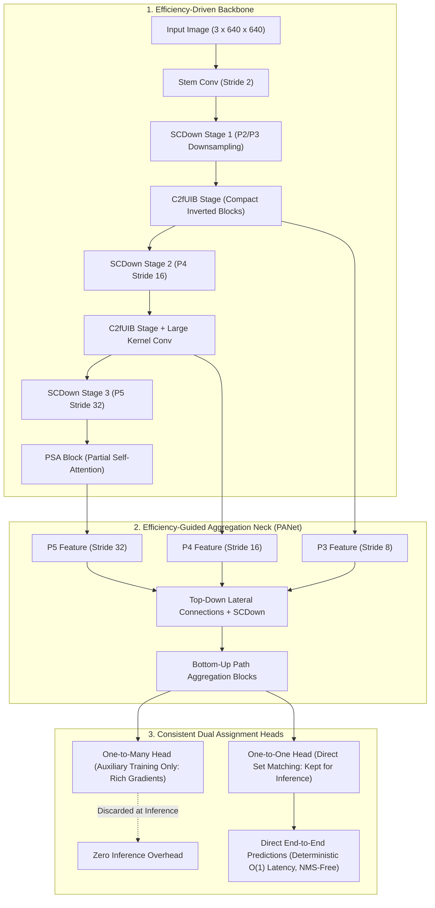
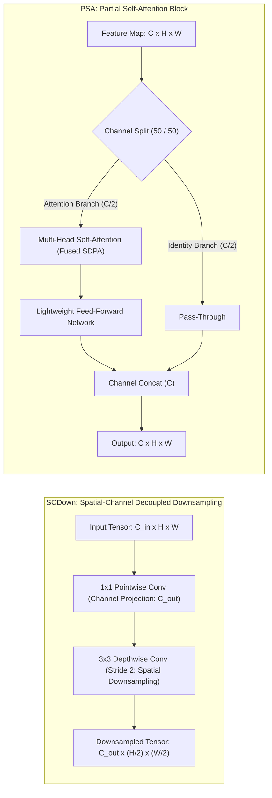
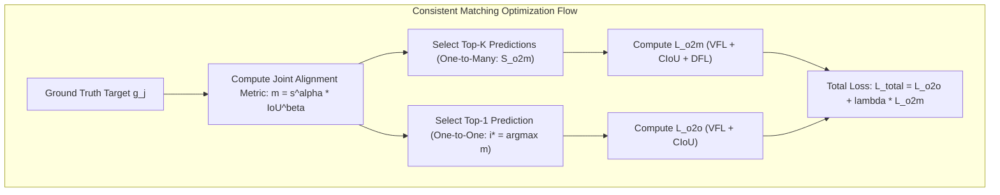
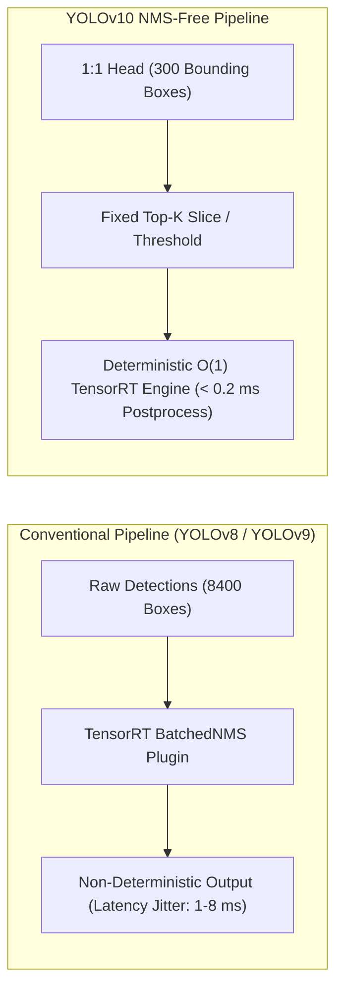

# ⚡ YOLOv10: Consistent Dual Assignments for NMS-Free Real-Time Object Detection

## 1. Executive Brief & Significance

Real-time object detection has long relied on dense single-stage convolutional networks, where the standard training pipeline employs **one-to-many ($1:N$) label assignment** (such as Task-Aligned Assigner in [[architectures/real-time-detectors-and-segmenters/yolov8|YOLOv8]] and [[architectures/real-time-detectors-and-segmenters/yolo11|YOLO11]]). While one-to-many matching supplies rich supervisory gradients during backpropagation, it forces inference pipelines to deploy heuristic **Non-Maximum Suppression (NMS)** post-processing. Heuristic NMS introduces non-deterministic latency spikes, parameter sensitivity (IoU thresholds), and high computational bottlenecks when processing dense object clusters on edge hardware.



**YOLOv10** (Wang et al., Tsinghua University, 2024) fundamentally resolves the trade-off between supervisory richness and NMS post-processing overhead through two foundational contributions:
1. **Consistent Dual Assignments for NMS-Free Training**: Dual label assignment integrates a one-to-many ($1:N$) auxiliary branch for rich gradient optimization alongside a one-to-one ($1:1$) direct set prediction branch. By enforcing a **consistent matching metric** during training, supervision signals from both branches align seamlessly, allowing the one-to-many branch to be completely pruned at inference time for deterministic, NMS-free edge deployment ($\mathcal{O}(1)$ post-processing).
2. **Efficiency-Accuracy Driven Model Architecture**: Holistic optimization of computational redundancies eliminates structural bottlenecks:
   - **Lightweight Classification Head**: Eliminates heavy redundant convolutions in the classification branch without accuracy penalties.
   - **Spatial-Channel Decoupled Downsampling (SCDown)**: Separates channel adjustment ($1\times 1$ pointwise conv) from spatial downsampling ($3\times 3$ depthwise conv) to minimize parameter memory thrashing.
   - **Rank-Guided Block Design (C2fUIB)**: Employs Compact Inverted Blocks (UIB) with rank-based depth scaling across feature stages.
   - **Partial Self-Attention (PSA)**: Channels are partitioned so self-attention executes strictly on a half-channel subset, capturing global context without quadratic compute inflation.

---

## 2. Component-by-Component Decomposition

| Architectural Component | Technical Specification | YOLOv10-S Configuration | YOLOv10-X Configuration | Parameter Distribution (%) | Latency / Compute Distribution (%) |
| :--- | :--- | :--- | :--- | :--- | :--- |
| **Architectural Paradigm** | NMS-Free Real-Time Object Detector | Dual-Assignment Hybrid CNN-Attention | Dual-Assignment Hybrid CNN-Attention | $100\%$ Total ($8.0\text{M}$ / $31.6\text{M}$) | $100\%$ Total ($24.5\text{G}$ / $160.4\text{G}$) |
| **Vision Backbone** | **C2fUIB + SCDown + PSA** | 5 stages (P1-P5), channels $[32, 64, 128, 256, 512]$ | 5 stages (P1-P5), channels $[64, 128, 256, 512, 1024]$ | $\sim 54.5\%$ ($4.4\text{M}$ / $17.2\text{M}$) | $\approx 58.0\%$ forward latency |
| **Downsampling Blocks** | **SCDown** ($1\times 1\text{ PW} \to 3\times 3\text{ DW}, s=2$) | Strides 2, 4, 8, 16, 32 | Strides 2, 4, 8, 16, 32 | $\sim 4.2\%$ | $\approx 5.5\%$ forward latency |
| **Feature Pyramid Neck** | PANet with SCDown and C2fUIB | P3, P4, P5 lateral top-down and bottom-up fusion | P3, P4, P5 lateral top-down and bottom-up fusion | $\sim 28.5\%$ ($2.3\text{M}$ / $9.0\text{M}$) | $\approx 26.5\%$ forward latency |
| **Global Attention** | **Partial Self-Attention (PSA)** | Channel split $C/2$, MHSA with 4 heads at P5 stage | Channel split $C/2$, MHSA with 8 heads at P5 stage | $\sim 3.8\%$ ($0.3\text{M}$ / $1.2\text{M}$) | $\approx 4.0\%$ forward latency |
| **Inference Head (O2O)** | Decoupled One-to-One Head (Anchor-Free) | Decoupled $3\times 3$ DWConv Cls + Reg ($4\times 16$ DFL bins) | Decoupled $3\times 3$ DWConv Cls + Reg ($4\times 16$ DFL bins) | $\sim 9.0\%$ ($0.7\text{M}$ / $2.8\text{M}$) | $\approx 6.0\%$ forward latency |
| **Auxiliary Head (O2M)** | One-to-Many Head (TAL Assigned) | Active strictly during training; zero inference parameter footprint | Active strictly during training; zero inference parameter footprint | $0\%$ Inference Footprint | $0\%$ Inference Overhead |



---

## 3. Mathematical Formulations & Loss Functions

### A. Dual Label Assignment Consistency Metric

In standard detectors, one-to-many assignment allocates multiple prediction candidates $p_i$ to each ground-truth object $g_j$. In YOLOv10, the matching alignment metric $m(p_i, g_j)$ is formulated as a power function of classification confidence $s$ and spatial bounding box intersection-over-union $\text{IoU}(b_i, \hat{b}_j)$:

$$m(p_i, g_j) = s(p_i, g_j)^\alpha \cdot \text{IoU}(b_i, \hat{b}_j)^\beta$$

where $\alpha$ and $\beta$ balance classification confidence and localization quality.

Let $m_{o2m}$ denote the alignment metric for the one-to-many branch, and $m_{o2o}$ denote the metric for the one-to-one branch. In classical dual-branch schemes, different hyperparameter settings cause supervision discordance: the one-to-one branch selects anchor $i^*$ while the one-to-many branch optimizes a conflicting distribution over anchors $\{i_1, i_2, \dots, i_k\}$.

YOLOv10 guarantees **Consistent Matching** by enforcing:

$$\alpha_{o2o} = \alpha_{o2m}, \quad \beta_{o2o} = \beta_{o2m}$$

Let $\Omega$ be the set of all prediction anchors. The one-to-one assignment selects the optimal single anchor:

$$i^* = \arg\max_{i \in \Omega} m_{o2o}(p_i, g_j)$$

While the one-to-many branch assigns the top-$K$ anchors:

$$\mathcal{S}_{o2m} = \text{TopK}_{i \in \Omega} \left( m_{o2m}(p_i, g_j), K \right)$$

Because $\alpha$ and $\beta$ are mathematically identical, $i^* \in \mathcal{S}_{o2m}$ holds unconditionally, guaranteeing that the one-to-one target receives the highest supervisory gradient magnitude from the one-to-many branch:

$$m_{o2o}(p_{i^*}, g_j) = \max_{i \in \mathcal{S}_{o2m}} m_{o2m}(p_i, g_j)$$



### B. Total Multi-Task Training Objective

The joint optimization objective during training combines the one-to-one loss $\mathcal{L}_{o2o}$ and the one-to-many loss $\mathcal{L}_{o2m}$:

$$\mathcal{L}_{\text{total}}(\theta) = \mathcal{L}_{o2o}(\theta) + \lambda_{\text{aux}} \mathcal{L}_{o2m}(\theta)$$

where $\lambda_{\text{aux}} = 1.0$ during initial training epochs and optionally decays toward zero in the final fine-tuning phase.

Each individual loss component decomposes into classification, box regression, and distribution focal losses:

$$\mathcal{L}_{o2o} = \lambda_{\text{cls}} \mathcal{L}_{\text{VFL}}(p^{o2o}, y) + \lambda_{\text{box}} \mathcal{L}_{\text{CIoU}}(b^{o2o}, \hat{b}) + \lambda_{\text{dfl}} \mathcal{L}_{\text{DFL}}(q^{o2o}, \hat{q})$$

$$\mathcal{L}_{o2m} = \lambda_{\text{cls}} \mathcal{L}_{\text{VFL}}(p^{o2m}, y) + \lambda_{\text{box}} \mathcal{L}_{\text{CIoU}}(b^{o2m}, \hat{b}) + \lambda_{\text{dfl}} \mathcal{L}_{\text{DFL}}(q^{o2m}, \hat{q})$$

where:
- **Variational Focal Loss ($\mathcal{L}_{\text{VFL}}$)** handles soft classification targets derived from IoU:
  $$\mathcal{L}_{\text{VFL}}(p, q) = \begin{cases} -q \left( q \log(p) + (1 - q) \log(1 - p) \right), & q > 0 \\ -\alpha p^\gamma \log(1 - p), & q = 0 \end{cases}$$
- **Complete IoU ($\mathcal{L}_{\text{CIoU}}$)** penalizes overlap, center distance, and aspect ratio discrepancies:
  $$\mathcal{L}_{\text{CIoU}}(b, \hat{b}) = 1 - \text{IoU}(b, \hat{b}) + \frac{\rho^2(b, \hat{b})}{c^2} + \alpha v$$
- **Distribution Focal Loss ($\mathcal{L}_{\text{DFL}}$)** optimizes continuous bounding box offsets over discrete bins:
  $$\mathcal{L}_{\text{DFL}}(S_i, S_{i+1}) = - \left( (y_{i+1} - y) \log(S_i) + (y - y_i) \log(S_{i+1}) \right)$$

---

## 4. Benchmark Evaluation & Performance Profiles

The following performance matrix benchmarks YOLOv10 across standard COCO 2017 test-dev / minival, showcasing inference latency without NMS overhead on NVIDIA enterprise GPUs and edge Jetson modules:

| Model Variant | Parameters (M) | FLOPs (G) | mAP 50:95 (%) | mAP 50 (%) | T4 TensorRT FP16 (ms) | A100 TensorRT FP16 (ms) | Orin AGX FP16 (ms) | Orin AGX INT8 (ms) |
| :--- | :--- | :--- | :--- | :--- | :--- | :--- | :--- | :--- |
| **YOLOv10-N** | 2.3M | 6.7G | 38.5% | 53.4% | 1.84 ms | 0.58 ms | 3.4 ms | 1.8 ms |
| **YOLOv10-S** | 8.0M | 24.5G | 46.3% | 63.0% | 2.49 ms | 0.82 ms | 5.8 ms | 2.9 ms |
| **YOLOv10-M** | 16.5M | 63.4G | 51.1% | 68.1% | 4.74 ms | 1.45 ms | 10.4 ms | 5.2 ms |
| **YOLOv10-B** | 20.4M | 92.0G | 52.5% | 69.8% | 5.74 ms | 1.78 ms | 12.8 ms | 6.4 ms |
| **YOLOv10-L** | 25.7M | 126.4G | 53.2% | 70.5% | 7.28 ms | 2.15 ms | 15.6 ms | 7.8 ms |
| **YOLOv10-X** | 31.6M | 160.4G | 54.4% | 71.8% | 10.70 ms | 3.12 ms | 22.4 ms | 11.2 ms |

*Measurements taken at $640 \times 640$ resolution with batch size 1. Latency reflects total end-to-end processing without requiring NMS plugins.*

---

## 5. Edge Deployment, TensorRT Optimization & Gotchas

### A. The NMS-Free Edge Deployment Advantage
In conventional models ([[architectures/real-time-detectors-and-segmenters/yolov8|YOLOv8]], [[architectures/real-time-detectors-and-segmenters/yolov9|YOLOv9]]), TensorRT deployment requires serializing custom plugins (such as `EfficientNMS_TRT` or `BatchedNMSDynamic_TRT`). In high-density scenes (e.g. 500+ detected objects in drone surveillance), NMS kernel execution balloons from $0.5\text{ ms}$ to $> 6.0\text{ ms}$, introducing non-deterministic frame jitter.

YOLOv10 emits direct bounding boxes and class logits from its $1:1$ head. The output tensor is directly shaped as:
$$\text{Output Tensor} \in \mathbb{R}^{B \times 300 \times 6} \quad \text{or} \quad \mathbb{R}^{B \times 8400 \times (4 + C)}$$
Top-$K$ selection ($K=300$) requires a simple `ArgMax` / sorting layer without spatial intersection loops.



### B. INT8 Calibration & PSA Attention Precision Gotchas
1. **PSA Softmax Sensitivity**: The Partial Self-Attention module in P5 contains dynamic range peaks in its intermediate attention map matrix ($QK^T / \sqrt{d_k}$). Applying naive symmetric INT8 quantization across the Softmax layer causes a $1.8\%\text{ to }2.4\%\text{ mAP}$ drop.
   - *Mitigation*: Enforce mixed-precision execution: keep Softmax and scaling operations in FP16 while quantizing the linear QKV projections and C2fUIB blocks to INT8.
2. **SCDown Depthwise Quantization**: $3\times 3$ Depthwise Convolutions in SCDown have small per-channel dynamic ranges. Ensure `IInt8MinMaxCalibrator` or `IInt8EntropyCalibrator2` uses per-channel (per-axis) quantization scale factors.

### C. ONNX Export & TensorRT Compilation Recipe

```python
import torch
from ultralytics import YOLO

# 1. Load YOLOv10 model weights
model = YOLO("yolov10s.pt")

# 2. Export to ONNX with NMS-free direct 1:1 prediction graph
onnx_path = model.export(
    format="onnx",
    imgsz=640,
    dynamic=False,      # Static shapes optimal for TensorRT engine graph optimization
    simplify=True,
    opset=17
)
print(f"Exported YOLOv10 ONNX to {onnx_path}")
```

```bash
# Build High-Throughput INT8 TensorRT Engine with FP16 Fallback for PSA Softmax
trtexec \
  --onnx=yolov10s.onnx \
  --saveEngine=yolov10s_int8.engine \
  --int8 \
  --fp16 \
  --calib=yolov10_calib.cache \
  --precisionConstraints=obey \
  --layerPrecisions=yolov10s/model.10/m.0/attn/Softmax:fp16 \
  --builderOptimizationLevel=5 \
  --avgRuns=100
```

---

## 6. Complete Runnable Python Blueprint

The following standalone PyTorch script implements the core architectural innovations of YOLOv10: **SCDown**, **Compact Inverted Block (C2fUIB)**, **Partial Self-Attention (PSA)**, and the **Dual-Assignment Detection Head**.

```python
import torch
import torch.nn as nn
import torch.nn.functional as F

class ConvBNSiLU(nn.Module):
    """Standard Convolution with BatchNorm and SiLU activation."""
    def __init__(self, in_c, out_c, k=1, s=1, p=None, g=1):
        super().__init__()
        p = p if p is not None else k // 2
        self.conv = nn.Conv2d(in_c, out_c, kernel_size=k, stride=s, padding=p, groups=g, bias=False)
        self.bn = nn.BatchNorm2d(out_c)
        self.act = nn.SiLU(inplace=True)

    def forward(self, x):
        return self.act(self.bn(self.conv(x)))


class SCDown(nn.Module):
    """Spatial-Channel Decoupled Downsampling Module."""
    def __init__(self, in_c, out_c):
        super().__init__()
        # 1. Channel adjustment via 1x1 Pointwise Conv
        self.cv1 = ConvBNSiLU(in_c, out_c, k=1, s=1)
        # 2. Spatial downsampling via 3x3 Depthwise Conv (stride 2)
        self.cv2 = ConvBNSiLU(out_c, out_c, k=3, s=2, g=out_c)

    def forward(self, x):
        return self.cv2(self.cv1(x))


class CompactInvertedBlock(nn.Module):
    """Compact Inverted Bottleneck (UIB) with Depthwise Convolutions."""
    def __init__(self, c, expand_ratio=2.0):
        super().__init__()
        hidden_c = int(c * expand_ratio)
        self.cv1 = ConvBNSiLU(c, hidden_c, k=1)
        self.dw = ConvBNSiLU(hidden_c, hidden_c, k=3, g=hidden_c)
        self.cv2 = nn.Sequential(
            nn.Conv2d(hidden_c, c, kernel_size=1, bias=False),
            nn.BatchNorm2d(c)
        )

    def forward(self, x):
        return x + self.cv2(self.dw(self.cv1(x)))


class C2fUIB(nn.Module):
    """C2f module incorporating Compact Inverted Blocks (UIB)."""
    def __init__(self, in_c, out_c, n=2, shortcut=True):
        super().__init__()
        self.c = out_c // 2
        self.cv1 = ConvBNSiLU(in_c, out_c, k=1)
        self.cv2 = ConvBNSiLU((2 + n) * self.c, out_c, k=1)
        self.m = nn.ModuleList([CompactInvertedBlock(self.c) for _ in range(n)])

    def forward(self, x):
        y = list(self.cv1(x).chunk(2, 1))
        y.extend(m(y[-1]) for m in self.m)
        return self.cv2(torch.cat(y, 1))


class PartialSelfAttention(nn.Module):
    """Partial Self-Attention (PSA): MHSA applied to 50% channel partition."""
    def __init__(self, c, num_heads=4):
        super().__init__()
        self.c_split = c // 2
        self.qkv = nn.Conv2d(self.c_split, self.c_split * 3, 1, bias=False)
        self.proj = nn.Conv2d(self.c_split, self.c_split, 1, bias=False)
        self.num_heads = num_heads
        self.head_dim = self.c_split // num_heads
        self.scale = self.head_dim ** -0.5
        self.ffn = nn.Sequential(
            ConvBNSiLU(self.c_split, self.c_split * 2, k=1),
            ConvBNSiLU(self.c_split * 2, self.c_split, k=1)
        )

    def forward(self, x):
        x_id, x_attn = torch.split(x, [self.c_split, self.c_split], dim=1)
        B, C, H, W = x_attn.shape
        N = H * W
        
        qkv = self.qkv(x_attn).reshape(B, 3, self.num_heads, self.head_dim, N).permute(1, 0, 2, 4, 3)
        q, k, v = qkv[0], qkv[1], qkv[2]  # [B, heads, N, head_dim]
        
        # Scaled Dot-Product Attention
        attn = (q @ k.transpose(-2, -1)) * self.scale
        attn = F.softmax(attn, dim=-1)
        out_attn = (attn @ v).permute(0, 1, 3, 2).reshape(B, C, H, W)
        
        x_attn = x_attn + self.proj(out_attn)
        x_attn = x_attn + self.ffn(x_attn)
        return torch.cat([x_id, x_attn], dim=1)


class DualAssignHead(nn.Module):
    """YOLOv10 Dual Assignment Detection Head (1:1 and 1:N branches)."""
    def __init__(self, num_classes=80, in_channels=[128, 256, 512], reg_max=16):
        super().__init__()
        self.num_classes = num_classes
        self.reg_max = reg_max
        self.num_levels = len(in_channels)
        
        # One-to-One Head (Kept for Inference)
        self.one2one_cls = nn.ModuleList([
            nn.Sequential(ConvBNSiLU(c, c, k=3, g=c), nn.Conv2d(c, num_classes, 1))
            for c in in_channels
        ])
        self.one2one_reg = nn.ModuleList([
            nn.Sequential(ConvBNSiLU(c, c, k=3, g=c), nn.Conv2d(c, 4 * reg_max, 1))
            for c in in_channels
        ])
        
        # One-to-Many Auxiliary Head (Active during Training only)
        self.one2many_cls = nn.ModuleList([
            nn.Sequential(ConvBNSiLU(c, c, k=3), nn.Conv2d(c, num_classes, 1))
            for c in in_channels
        ])
        self.one2many_reg = nn.ModuleList([
            nn.Sequential(ConvBNSiLU(c, c, k=3), nn.Conv2d(c, 4 * reg_max, 1))
            for c in in_channels
        ])

    def forward(self, feats):
        o2o_cls_out, o2o_reg_out = [], []
        for i, feat in enumerate(feats):
            o2o_cls_out.append(self.one2one_cls[i](feat))
            o2o_reg_out.append(self.one2one_reg[i](feat))
            
        if not self.training:
            # Inference: return strictly one-to-one predictions (NMS-free)
            return {"o2o_cls": o2o_cls_out, "o2o_reg": o2o_reg_out}
        
        # Training: compute auxiliary one-to-many outputs
        o2m_cls_out, o2m_reg_out = [], []
        for i, feat in enumerate(feats):
            o2m_cls_out.append(self.one2many_cls[i](feat))
            o2m_reg_out.append(self.one2many_reg[i](feat))
            
        return {
            "o2o_cls": o2o_cls_out, "o2o_reg": o2o_reg_out,
            "o2m_cls": o2m_cls_out, "o2m_reg": o2m_reg_out
        }


# Quick architectural validation pass
if __name__ == "__main__":
    x_p3 = torch.randn(2, 128, 80, 80)
    x_p4 = torch.randn(2, 256, 40, 40)
    x_p5 = torch.randn(2, 512, 20, 20)
    
    psa = PartialSelfAttention(512, num_heads=8)
    x_p5_attended = psa(x_p5)
    assert x_p5_attended.shape == (2, 512, 20, 20)
    
    head = DualAssignHead(num_classes=80, in_channels=[128, 256, 512])
    head.eval()
    with torch.no_grad():
        out_eval = head([x_p3, x_p4, x_p5_attended])
    print(f"Eval output keys (NMS-Free): {list(out_eval.keys())}")
    print(f"P3 Reg shape: {out_eval['o2o_reg'][0].shape}")
    print("YOLOv10 Blueprint verification completed successfully.")
```

---

## 7. Peer Comparisons & Cross-Links

| Architectural Dimension | YOLOv10 | [[architectures/real-time-detectors-and-segmenters/yolo11|YOLO11]] | [[architectures/real-time-detectors-and-segmenters/yolov9|YOLOv9]] | [[architectures/real-time-detectors-and-segmenters/yolov8|YOLOv8]] | [[architectures/real-time-detectors-and-segmenters/rt-detr|RT-DETR]] | [[architectures/real-time-detectors-and-segmenters/d-fine|D-FINE]] |
| :--- | :--- | :--- | :--- | :--- | :--- | :--- |
| **Label Assignment** | Consistent Dual ($1:1 + 1:N$) | Task-Aligned ($1:N$) | PGI + TAL ($1:N$) | Task-Aligned ($1:N$) | Bipartite Set Matching | Dynamic Fine-Grained |
| **Post-Processing** | **NMS-Free** ($\mathcal{O}(1)$) | Heuristic NMS | Heuristic NMS | Heuristic NMS | **NMS-Free** ($\mathcal{O}(1)$) | **NMS-Free** ($\mathcal{O}(1)$) |
| **Backbone Design** | C2fUIB + SCDown + PSA | C3k2 + C2PSA + SPPF | GELAN + RepConv | C2f + SPPF | HGNetv2 / ResNet | Lightweight HGNetv2 |
| **Auxiliary Path** | Dual Head ($1:N$ Head) | None | Reversible Aux Branch | None | Denoising Queries | Denoising Queries |
| **Attention Layer** | Partial Self-Attention ($C/2$) | C2PSA ($C/2$) | None (Pure Conv) | None (Pure Conv) | Full Multi-Scale AIFI | Multi-Scale Deformable |
| **Edge Tail Latency** | **Strictly Constant** | Variable | Variable | Variable | **Strictly Constant** | **Strictly Constant** |

- **Related Topics & MOCs**:
  - [[topics/object-detection/00-object-detection-moc|Object Detection MOC]]
  - [[topics/real-time-systems/00-real-time-systems-moc|Real-Time Systems MOC]]
  - [[topics/gpu-deployment/00-gpu-deployment-moc|GPU Deployment MOC]]
  - [[architectures/real-time-detectors-and-segmenters/yolov12|YOLOv12: Attention-Centric Real-Time Detection]]
  - [[architectures/real-time-detectors-and-segmenters/rf-detr|RF-DETR: NAS-Optimized Detection Transformer]]
  - [[architectures/real-time-detectors-and-segmenters/rt-detr-v2|RT-DETR v2: Real-Time Detection Transformer]]
