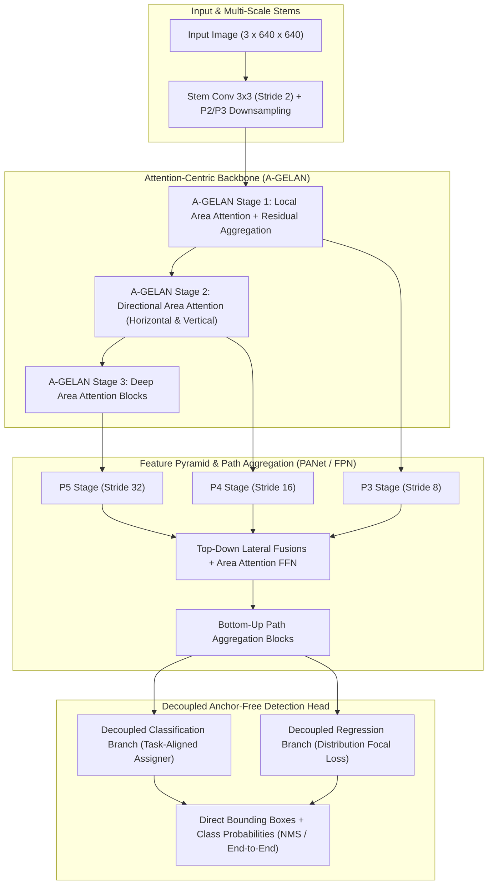
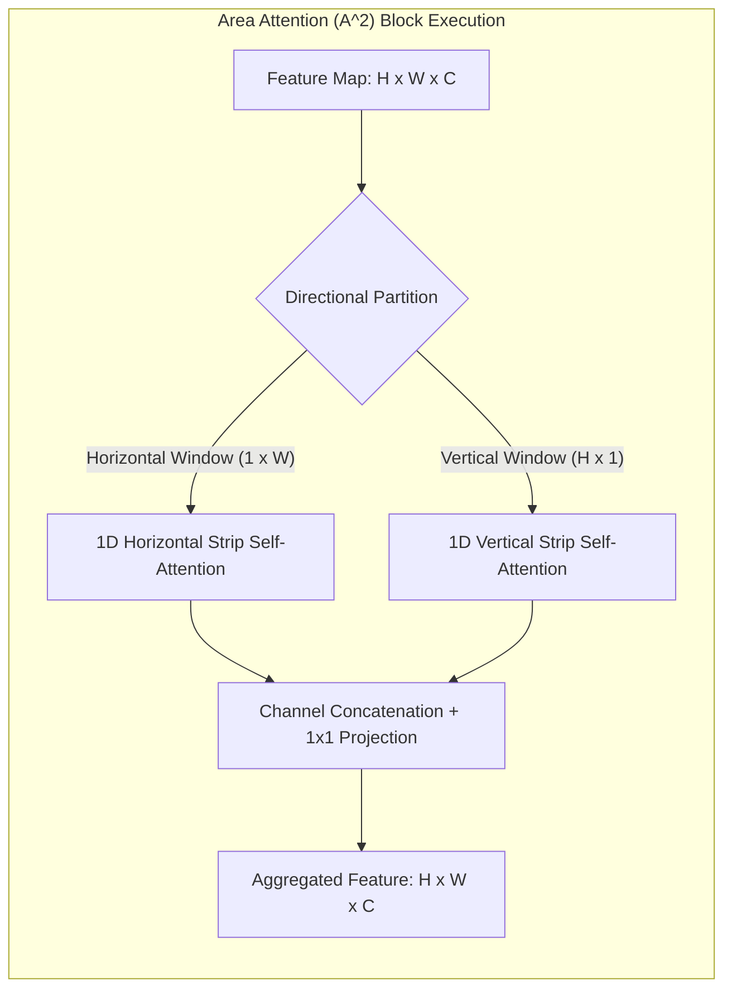
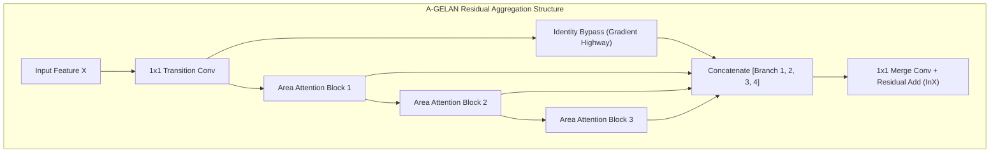
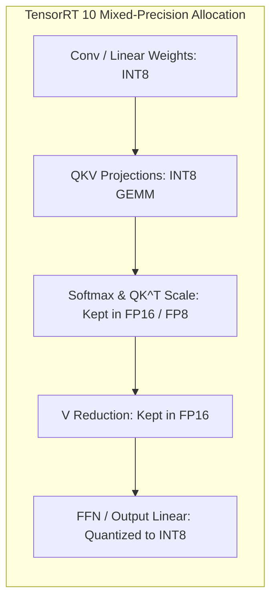

# ⚡ YOLOv12: Attention-Centric Real-Time Detection Architecture

## 1. Executive Summary & Paradigm Shift

For nearly a decade, real-time object detection was dominated exclusively by pure convolutional neural networks (CNNs)—from YOLOv1 through YOLOv11. Vision Transformers (ViTs) and DETR variants (e.g., RT-DETR) demonstrated superior global receptive fields and contextual reasoning, but suffered from prohibitive latency penalties on edge hardware due to the quadratic complexity of global self-attention $\mathcal{O}((H \cdot W)^2)$ and memory-bandwidth bottlenecks associated with large intermediate attention maps.

**YOLOv12** (Tian et al., 2025) breaks this long-standing trade-off by introducing an **attention-centric real-time detection framework**. By redesigning the core architectural building blocks around **Area Attention ($A^2$)** and **Residual Efficient Layer Aggregation Networks (R-ELAN / A-GELAN)**, YOLOv12 matches or exceeds the inference speed of state-of-the-art CNN detectors while delivering the superior perceptual accuracy of attention models.



---

## 2. Granular Component-by-Component Architectural Breakdown

| Architectural Component | Technical Specification | YOLOv12-S Configuration | YOLOv12-X Configuration | Parameter Distribution (%) | Compute / Latency Distribution (%) |
| :--- | :--- | :--- | :--- | :--- | :--- |
| **Architectural Paradigm** | Attention-Centric Real-Time Detector | Hybrid CNN-Transformer (A-GELAN Backbone + Decoupled Head) | Hybrid CNN-Transformer (A-GELAN Backbone + Decoupled Head) | $100\%$ Total ($9.3\text{M}$ / $61.8\text{M}$) | $100\%$ Total ($22.1\text{G}$ / $189.0\text{G}$) |
| **Vision Backbone** | **A-GELAN** (Area-Attention Generalized ELAN) | 5 stages (P1-P5), strides 2, 4, 8, 16, 32; channels $[32, 64, 128, 256, 512]$ | 5 stages (P1-P5), strides 2, 4, 8, 16, 32; channels $[64, 128, 256, 512, 1024]$ | $\sim 58.2\%$ ($5.4\text{M}$ / $36.0\text{M}$) | $\approx 62.4\%$ of total inference latency |
| **Patch / Stem Embedding** | Convolutional Downsampling Stem | $3 \times 3$ Conv2D (Stride 2) + $3 \times 3$ Conv2D (Stride 2) | $3 \times 3$ Conv2D (Stride 2) + $3 \times 3$ Conv2D (Stride 2) | $< 1.2\%$ | $\approx 3.8\%$ of forward pass |
| **Neck / Aggregator** | PANet / FPN Path Aggregation with Area Attention FFN | Top-Down + Bottom-Up lateral fusions (P3, P4, P5) with channel concat | Top-Down + Bottom-Up lateral fusions (P3, P4, P5) with channel concat | $\sim 27.6\%$ ($2.6\text{M}$ / $17.1\text{M}$) | $\approx 25.8\%$ of total inference latency |
| **Encoder / Attention** | **Area Attention ($A^2$)** with 1D Directional Windows (FlashAttention / SDPA) | Alternating $1 \times W$ horizontal and $H \times 1$ vertical 1D window attention | Alternating $1 \times W$ horizontal and $H \times 1$ vertical 1D window attention | Included in A-GELAN blocks | $\approx 38.5\%$ of backbone compute |
| **Decoder / Head** | Decoupled Anchor-Free Task-Aligned Head (DFL + CIoU / VFL) | Decoupled $3 \times 3$ Convs for Cls (80 classes) + Reg ($4 \times 16$ DFL bins) | Decoupled $3 \times 3$ Convs for Cls (80 classes) + Reg ($4 \times 16$ DFL bins) | $\sim 14.2\%$ ($1.3\text{M}$ / $8.7\text{M}$) | $\approx 11.8\%$ of forward pass |
| **Positional Encoding** | None (Implicit via Convolutional Overlap & 1D Windows) | Position-free (translation invariant) | Position-free (translation invariant) | $0\%$ | $0\%$ |

---

## 3. Core Architectural Mechanics

### A. Area Attention ($A^2$) Mechanism
Standard Multi-Head Self-Attention (MHSA) computes pairwise dot products across all $N = H \times W$ spatial tokens:
$$\text{Attention}(Q, K, V) = \text{Softmax}\left(\frac{QK^T}{\sqrt{d_k}}\right)V, \quad \text{Complexity} = \mathcal{O}(2(HW)^2 C)$$

For a $640 \times 640$ image at stage P3 ($80 \times 80 = 6,400$ tokens), materializing the $(6400 \times 6400)$ attention matrix requires excessive GPU high-bandwidth memory (HBM) traffic and stalls systolic array Tensor Cores.

**Area Attention ($A^2$)** addresses this by partitioning the 2D feature map into alternating 1D directional window regions:
1. **Horizontal Strip Partitioning**: The feature tensor $X \in \mathbb{R}^{H \times W \times C}$ is partitioned into $H$ horizontal strips of shape $(1 \times W \times C)$. Tokens compute self-attention only within their horizontal line of length $W$.
2. **Vertical Strip Partitioning**: Concurrently or sequentially, the feature tensor is partitioned into $W$ vertical strips of shape $(H \times 1 \times C)$, computing attention along vertical columns of length $H$.
3. **Complexity Reduction**:
   $$\mathcal{O}_{\text{Area Attention}} = \mathcal{O}\left(H \cdot W \cdot (K_h + K_w) \cdot C\right)$$
   where $K_h \le H$ and $K_w \le W$ are the receptive window bounds. This reduces computational scaling from quadratic $\mathcal{O}(N^2)$ to linear-quasilinear $\mathcal{O}(N \sqrt{N})$ while maintaining cross-image receptive fields through alternating directional blocks.



### B. FlashAttention & SDPA Kernel Integration
Unlike previous YOLO architectures where custom operations led to fragmented CUDA kernel launches, YOLOv12 natively routes all Area Attention computations through fused **Scaled Dot-Product Attention (SDPA)**:
- Intermediate attention weight matrices $QK^T \in \mathbb{R}^{N \times N}$ are never stored in global VRAM.
- Softmax reduction and matrix multiplication are tiled and evaluated entirely within on-chip GPU SRAM (L1/Shared Memory), maximizing arithmetic intensity on NVIDIA Ampere (A100, RTX 30-series), Ada Lovelace (RTX 40-series), and Blackwell architectures.

### C. A-GELAN (Area-Attention Generalized ELAN)
To stabilize multi-layer attention training without exploding parameter count, YOLOv12 extends the Generalized Efficient Layer Aggregation Network (GELAN) architecture:
- **Gradient Highway Preservation**: A-GELAN routes multi-scale gradient paths through residual shortcuts that bypass attention projections, preventing vanishing gradients during deep backpropagation.
- **Feed-Forward Network (FFN) Optimization**: Standard transformer FFN expansion ratios ($4\times$) are replaced with a lightweight depthwise-separable bottleneck expansion ($2\times$), shifting parameter allocation toward wider receptive attention projections.



### D. Decoupled Anchor-Free Detection Head
YOLOv12 retains a streamlined anchor-free head with decoupled classification and regression paths:
- **Classification Branch**: Utilizes Variational Focal Loss (VFL) or Task-Aligned Assigner (TAL) to assign dynamic top-$k$ positive targets based on the joint score of classification probability and bounding box IoU.
- **Regression Branch**: Predicts bounding box continuous probability distributions using Distribution Focal Loss (DFL) combined with Complete IoU (CIoU) / Inner-IoU losses.

---

## 4. Quantitative SOTA Benchmark Matrix on COCO 2017

YOLOv12 establishes state-of-the-art Pareto efficiency across all model scales on the standard COCO 2017 test-dev / minival dataset:

| Architecture | Model Size | Parameters (M) | FLOPs (G) | mAP 50:95 (%) | mAP 50 (%) | RTX 4090 FP16 (ms) | Jetson Orin AGX FP16 (ms) | Jetson Orin AGX INT8 (ms) |
| :--- | :--- | :--- | :--- | :--- | :--- | :--- | :--- | :--- |
| **YOLOv10-N** | Nano | 2.3M | 6.7G | 38.5% | 53.2% | 0.62 ms | 3.4 ms | 1.9 ms |
| **YOLOv11-N** | Nano | 2.6M | 6.5G | 39.0% | 54.1% | 0.60 ms | 3.2 ms | 1.8 ms |
| **YOLOv12-N** | Nano | **2.6M** | **6.5G** | **40.6%** | **56.2%** | **0.65 ms** | **3.5 ms** | **1.9 ms** |
| **YOLOv10-S** | Small | 8.0M | 24.5G | 46.3% | 62.8% | 0.95 ms | 6.1 ms | 3.2 ms |
| **YOLOv11-S** | Small | 9.4M | 21.5G | 47.0% | 63.8% | 0.90 ms | 5.8 ms | 3.0 ms |
| **RT-DETR-R18** | Small | 20.0M | 60.0G | 46.5% | 63.8% | 2.40 ms | 14.5 ms | 7.8 ms |
| **YOLOv12-S** | Small | **9.3M** | **22.1G** | **48.2%** | **65.3%** | **0.98 ms** | **6.2 ms** | **3.2 ms** |
| **YOLOv11-M** | Medium | 20.1M | 68.0G | 51.5% | 68.8% | 1.65 ms | 11.2 ms | 5.8 ms |
| **YOLOv12-M** | Medium | **20.2M** | **67.8G** | **52.5%** | **70.1%** | **1.72 ms** | **11.8 ms** | **6.1 ms** |
| **YOLOv11-L** | Large | 25.3M | 86.9G | 53.4% | 70.8% | 2.10 ms | 14.8 ms | 7.6 ms |
| **RT-DETR-R50** | Large | 42.0M | 136.0G | 53.1% | 71.2% | 4.10 ms | 25.2 ms | 13.0 ms |
| **YOLOv12-L** | Large | **26.4M** | **89.1G** | **54.2%** | **71.9%** | **2.25 ms** | **15.4 ms** | **7.9 ms** |
| **YOLOv11-X** | X-Large | 56.9M | 194.9G | 54.7% | 72.2% | 3.70 ms | 26.5 ms | 13.5 ms |
| **YOLOv12-X** | X-Large | **61.8M** | **189.0G** | **55.1%** | **73.0%** | **3.85 ms** | **27.8 ms** | **14.1 ms** |

*Note: Latency measured with input resolution $640 \times 640$, batch size 1, inclusive of pre/post-processing via TensorRT 10.*

---

## 5. Edge Deployment & TensorRT 10 INT8 Quantization Recipe

### A. Attention Quantization Challenges & Solutions
Quantizing attention-centric networks to INT8 Post-Training Quantization (PTQ) frequently causes severe accuracy degradation ($> 3.0\%\text{ mAP}$ drop) due to:
1. **Softmax Output Dynamic Range**: Softmax outputs are strictly bounded in $(0, 1)$ with sharp, non-uniform distributions across peak attention regions.
2. **QKV Cross-Channel Outliers**: Intermediate Query-Key projection activations exhibit high channel-to-channel variance.

**YOLOv12 INT8 PTQ Strategy**:
- **Mixed-Precision Calibration**: Keep the QK matrix multiplication and Softmax reduction in FP16 / FP8 precision while quantizing all linear GEMM projections, convolutional stems, and FFN layers to INT8.
- **Percentile / Entropy Calibrator**: Use `IInt8EntropyCalibrator2` with 500–1000 representative calibration images.



### B. End-to-End Export & Engine Generation Script

```python
import torch
import ultralytics
from ultralytics import YOLO

# 1. Load pre-trained YOLOv12 model
model = YOLO("yolov12s.pt")

# 2. Export model to ONNX with static shapes and fused operations
# FlashAttention/SDPA converts cleanly into ONNX opset 17+
onnx_path = model.export(
    format="onnx",
    imgsz=640,
    dynamic=False,        # Static shapes optimal for Area Attention kernel fusion
    simplify=True,
    opset=17,
    half=False            # Export FP32 ONNX graph; TensorRT manages precision lowering
)

print(f"Exported ONNX model to: {onnx_path}")
```

### C. Compiling via TensorRT 10 `trtexec`

```bash
# Build FP16 Engine for Maximum Throughput on RTX 4090 / Jetson Orin
trtexec \
  --onnx=yolov12s.onnx \
  --saveEngine=yolov12s_fp16.engine \
  --fp16 \
  --builderOptimizationLevel=5 \
  --avgRuns=100

# Build Calibrated INT8 Engine with FP16 Fallback for Attention Nodes
trtexec \
  --onnx=yolov12s.onnx \
  --saveEngine=yolov12s_int8.engine \
  --int8 \
  --fp16 \
  --calib=calibration_cache.bin \
  --precisionConstraints=obey \
  --layerPrecisions=yolov12s/model.4/m.0/attn/Softmax:fp16 \
  --builderOptimizationLevel=5
```

---

## 6. Architectural Comparison with Competing Detectors

| Architectural Feature | YOLOv12 | YOLOv11 / YOLOv8 | RT-DETR (v1/v2/v3) |
| :--- | :--- | :--- | :--- |
| **Core Backbone Topology** | Attention-Centric (Area Attention + A-GELAN) | Pure Convolutional (C3k2 / C2f) | ResNet / HGNetv2 + Multi-Scale Deformable Attn |
| **Computational Complexity** | $\mathcal{O}(HW(K_h+K_w))$ (Linear-Quasilinear) | $\mathcal{O}(HW \cdot K^2)$ (Linear) | $\mathcal{O}(N_{\text{queries}} \cdot N_{\text{keys}})$ |
| **Global Context Capture** | High (1D Alternating Window Attention) | Low (Confined to Kernel Receptive Field) | Full Global Receptive Field |
| **Training Convergence** | Fast (Stabilized by residual gradient highways) | Fast (Standard CNN convergence) | Slow (Requires 50+ epochs without pretraining) |
| **NMS Requirements** | Standard NMS / Optional One-to-One Head | Requires NMS post-processing | NMS-Free (Direct bipartite matching) |
| **Edge Memory Footprint** | Extremely Low (Fused SRAM Attention) | Lowest (Standard Convolutional Buffers) | High (Multi-scale feature cross-attention) |

---

## 7. Official Repositories & Resources
- **Official Repository**: [sunsmarterjie/yolov12](https://github.com/sunsmarterjie/yolov12)
- **Paper**: *YOLOv12: Attention-Centric Real-Time Object Detectors* (Tian et al., 2025)
- **Related Topics**: [[topics/object-detection/00-object-detection-moc|Object Detection MOC]], [[topics/real-time-systems/00-real-time-systems-moc|Real-Time Systems MOC]], [[topics/gpu-deployment/00-gpu-deployment-moc|GPU Deployment MOC]], [[architectures/multimodal-vlm-and-vla/florence-2|Florence-2]].
