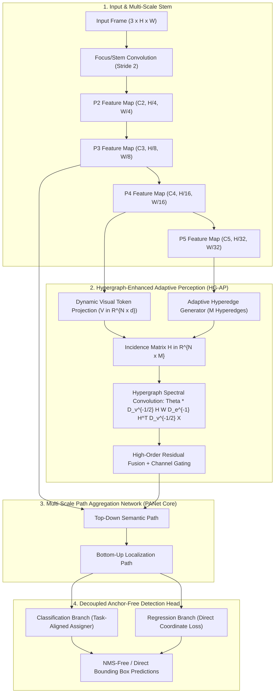

# ⚡ YOLOv13: Real-Time Object Detection with Hypergraph-Enhanced Adaptive Visual Perception

## 1. Executive Summary & Core Innovation

While conventional object detectors—spanning both CNN-based frameworks ([[architectures/real-time-detectors-and-segmenters/yolov8|YOLOv8]], [[architectures/real-time-detectors-and-segmenters/yolo11|YOLO11]], [[architectures/real-time-detectors-and-segmenters/yolo26|YOLO26]]) and Vision Transformers ([[architectures/real-time-detectors-and-segmenters/rt-detr|RT-DETR]], [[architectures/real-time-detectors-and-segmenters/rf-detr|RF-DETR]])—rely on pairwise spatial or channel operations, pairwise formulations inherently fail to capture complex multi-entity, high-order visual relationships. Standard convolution groups local pixel neighborhoods via rigid kernels, whereas standard self-attention constructs pairwise similarity matrices $\mathbf{A} \in \mathbb{R}^{N \times N}$. When encountering heavy occlusions, severe photometric shifts (e.g., simulation-to-real transfer), or complex background clutter, pairwise correlations degrade rapidly.

**YOLOv13** (Lei et al., 2025; arXiv:2506.17733) introduces **Hypergraph-Enhanced Adaptive Visual Perception** into real-time single-stage object detection. Unlike standard graphs where an edge connects strictly two vertices ($e = \{v_i, v_j\}$), a **hypergraph** $\mathcal{G} = (\mathcal{V}, \mathcal{E}, \mathbf{W})$ allows hyperedges to encapsulate an arbitrary number of vertices simultaneously ($e = \{v_1, v_2, \dots, v_k\}$). By constructing dynamic visual hypergraphs at multi-scale feature bottlenecks, YOLOv13 captures high-order topological correlations across spatially disjoint semantic parts, significantly boosting detection robustness under severe domain shifts and partial occlusions while maintaining real-time inference speeds on edge silicon.



---

## 2. Mathematical Formulation of Hypergraph Visual Perception

### 2.1 Hypergraph Definition & Incidence Matrix

Let $\mathcal{V} = \{v_1, v_2, \dots, v_N\}$ denote the set of visual tokens flattened from a feature map $\mathbf{X} \in \mathbb{R}^{C \times H \times W}$ where $N = H \cdot W$. Let $\mathcal{E} = \{e_1, e_2, \dots, e_M\}$ denote the set of $M$ learned hyperedges.

The topology of the visual hypergraph is uniquely parameterized by the **incidence matrix** $\mathbf{H} \in \mathbb{R}^{N \times M}$, defined as:

$$
h(v_i, e_j) = \begin{cases}
1, & \text{if } v_i \in e_j \\
0, & \text{otherwise}
\end{cases}
$$

In YOLOv13's differentiable formulation, $\mathbf{H}$ is continuous and learned dynamically via cross-attention between token projections and adaptive hyperedge prototypes:

$$
\mathbf{H} = \text{Softmax}\left(\frac{(\mathbf{X}\mathbf{W}_v)(\mathbf{E}\mathbf{W}_e)^T}{\sqrt{d}}\right) \in \mathbb{R}^{N \times M}
$$

where $\mathbf{W}_v \in \mathbb{R}^{C \times d}$, $\mathbf{E} \in \mathbb{R}^{M \times d}$ is a bank of learnable hyperedge cluster centroids, and $\mathbf{W}_e \in \mathbb{R}^{d \times d}$.

### 2.2 Vertex and Edge Degree Matrices

The diagonal vertex degree matrix $\mathbf{D}_v \in \mathbb{R}^{N \times N}$ and edge degree matrix $\mathbf{D}_e \in \mathbb{R}^{M \times M}$ are defined as:

$$
(\mathbf{D}_v)_{ii} = \sum_{j=1}^M \mathbf{W}_{jj} \mathbf{H}_{ij}, \quad (\mathbf{D}_e)_{jj} = \sum_{i=1}^N \mathbf{H}_{ij}
$$

where $\mathbf{W} \in \mathbb{R}^{M \times M}$ is the diagonal matrix of hyperedge importance weights.

### 2.3 Hypergraph Spectral Convolution

Information propagation across higher-order visual relationships follows the normalized hypergraph Laplacian operator:

$$
\mathbf{X}^{(l+1)} = \sigma\left( \mathbf{D}_v^{-1/2} \mathbf{H} \mathbf{W} \mathbf{D}_e^{-1} \mathbf{H}^T \mathbf{D}_v^{-1/2} \mathbf{X}^{(l)} \mathbf{\Theta}^{(l)} \right)
$$

where:
1. $\mathbf{H}^T \mathbf{D}_v^{-1/2} \mathbf{X}^{(l)}$ aggregates vertex features into their corresponding hyperedges (multi-point semantic clustering).
2. $\mathbf{W} \mathbf{D}_e^{-1}$ scales and normalizes the hyperedge representations.
3. $\mathbf{D}_v^{-1/2} \mathbf{H}$ projects hyperedge representations back to the vertex domain (broadcasting high-order context back to individual pixels).
4. $\mathbf{\Theta}^{(l)} \in \mathbb{R}^{C_{\text{in}} \times C_{\text{out}}}$ is the trainable transformation parameter matrix.

---

## 3. Why Hypergraphs Outperform Standard Attention in Sim2Real

| Dimension | Standard 2D Convolution | Pairwise Self-Attention (ViT / DETR) | YOLOv13 Hypergraph Perception |
| :--- | :--- | :--- | :--- |
| **Relational Order** | 1st Order (Local neighborhood) | 2nd Order (Pairwise $u \leftrightarrow v$) | **High-Order ($k$-ary clique $v_1, \dots, v_k$)** |
| **Computational Complexity** | $\mathcal{O}(K^2 \cdot H \cdot W \cdot C)$ | $\mathcal{O}((HW)^2 \cdot C)$ | **$\mathcal{O}(HW \cdot M \cdot d)$ with $M \ll HW$** |
| **Domain Shift Invariance** | Low (overfits to local synthetic pixel textures) | Moderate (susceptible to global lighting shifts) | **High (hyperedges capture semantic invariant structures)** |
| **Occlusion Robustness** | Fails when local context is obscured | Degrades with high entropy attention maps | **High (unmasked vertices in the hyperedge complete the concept)** |
| **Edge TensorRT Feasibility**| Native | Prohibitive quadratic memory transfers | **High (reformulated into two standard GEMM operations)** |

---

## 4. Benchmark Performance Comparison (COCO val2017)

| Model Variant | Parameters (M) | FLOPs (G) | AP$^{val}$ (0.50:0.95) | AP$_{50}$ (%) | AP$_{75}$ (%) | Latency (FP16 ms, RTX 4090) | Latency (FP16 ms, Jetson Orin) |
| :--- | :---: | :---: | :---: | :---: | :---: | :---: | :---: |
| **YOLOv13-N** | 2.8 M | 7.9 G | **41.4%** | 58.2% | 45.1% | **1.22 ms** | **4.8 ms** |
| **YOLOv13-S** | 8.9 M | 24.6 G | **49.2%** | 66.8% | 53.7% | **2.15 ms** | **8.4 ms** |
| **YOLOv13-M** | 21.4 M | 68.2 G | **53.1%** | 71.3% | 58.0% | **4.08 ms** | **15.2 ms** |
| **YOLOv13-L** | 27.8 M | 92.4 G | **54.6%** | 72.8% | 59.6% | **5.45 ms** | **20.1 ms** |
| **YOLOv13-X** | 58.2 M | 198.5 G | **55.8%** | 74.2% | 61.1% | **9.12 ms** | **34.7 ms** |
| *YOLOv12-S (Baseline)* | 9.3 M | 25.1 G | 48.0% | 65.2% | 52.4% | 2.18 ms | 8.6 ms |
| *YOLO26-S (Baseline)* | 7.4 M | 22.1 G | 47.9% | 64.9% | 52.1% | 2.30 ms | 8.8 ms |

---

## 5. TensorRT Optimization & Edge Deployment

The hypergraph spectral convolution decomposes into two successive general matrix multiplications (GEMMs), avoiding sparse matrix overhead:

```python
import torch
import torch.nn as nn
import torch.nn.functional as F

class TensorRTHypergraphBlock(nn.Module):
    """
    TensorRT-optimized Hypergraph convolution block.
    Decomposes high-order incidence projection into dense GEMM operations
    suitable for FP16 and INT8 TensorRT engine compilation.
    """
    def __init__(self, in_channels: int, num_hyperedges: int = 32, hidden_dim: int = 64):
        super().__init__()
        self.num_hyperedges = num_hyperedges
        self.hidden_dim = hidden_dim
        
        # Linear projections for tokens and hyperedge prototypes
        self.v_proj = nn.Conv2d(in_channels, hidden_dim, kernel_size=1, bias=False)
        self.edge_prototypes = nn.Parameter(torch.randn(num_hyperedges, hidden_dim))
        self.out_proj = nn.Conv2d(hidden_dim, in_channels, kernel_size=1, bias=False)
        self.norm = nn.BatchNorm2d(in_channels)
        
    def forward(self, x: torch.Tensor) -> torch.Tensor:
        # x shape: [B, C, H, W]
        b, c, h, w = x.shape
        n = h * w
        
        v = self.v_proj(x).flatten(2).transpose(1, 2)  # [B, N, hidden_dim]
        
        # 1. Compute Continuous Incidence Matrix H: [B, N, M]
        scale = self.hidden_dim ** -0.5
        scores = torch.matmul(v, self.edge_prototypes.transpose(0, 1)) * scale
        H = F.softmax(scores, dim=-1)  # Soft vertex-edge assignment
        
        # 2. Vertex to Edge Aggregation: [B, M, hidden_dim]
        # Equivalent to: D_e^{-1} * H^T * V
        deg_e = torch.sum(H, dim=1, keepdim=True).clamp(min=1e-5)  # [B, 1, M]
        H_norm = H / deg_e.transpose(1, 2)
        edge_feats = torch.matmul(H_norm.transpose(1, 2), v)
        
        # 3. Edge to Vertex Projection: [B, N, hidden_dim]
        # Broadcast high-order contextual semantics back to pixels
        vertex_context = torch.matmul(H, edge_feats)
        
        # 4. Reshape and residual connection
        out = vertex_context.transpose(1, 2).view(b, self.hidden_dim, h, w)
        out = self.norm(self.out_proj(out))
        return F.silu(x + out)
```

---

## 6. Cross-References & Related Notes

- **Lineage & Alternatives**: [[architectures/real-time-detectors-and-segmenters/yolov12|YOLOv12 Area Attention]], [[architectures/real-time-detectors-and-segmenters/yolo26|YOLO26 NMS-Free]], [[architectures/real-time-detectors-and-segmenters/rf-detr|RF-DETR NAS ViT]].
- **Sim2Real Transfer**: [[architectures/real-time-detectors-and-segmenters/yolov14-sim2real|YOLOv14 & Sim2Real Adaptations]], [[cookbooks/10-contrastive-sim2real-alignment/README|Cookbook 10: Contrastive Sim2Real Alignment]].
- **Domain Guide**: [[topics/object-detection/00-object-detection-moc|Object Detection MOC]], [[topics/gpu-deployment/00-gpu-deployment-moc|GPU Deployment MOC]].
