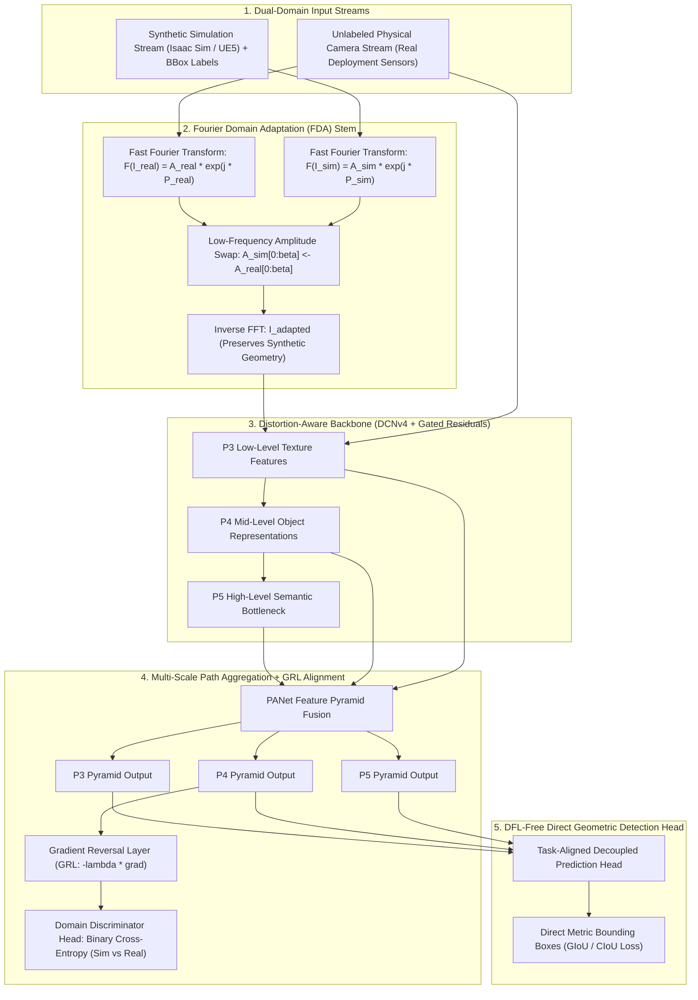
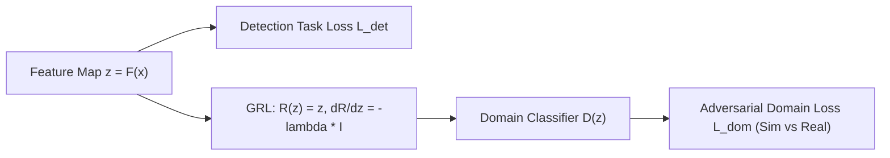

# ⚡ YOLOv14 & Sim2Real Adaptive Detectors: Domain-Generalized Real-Time Perception

## 1. Executive Summary & Research Lineage

In industrial robotics, autonomous navigation, and aerial perception, acquiring millions of high-quality, manually annotated real-world training images is prohibitively slow, hazardous, and expensive. While photorealistic synthetic simulation platforms—such as **NVIDIA Isaac Sim (Omniverse)**, **Unreal Engine 5**, and **BlenderProc**—can generate virtually unlimited volumes of ground-truth bounding boxes, segmentation masks, and 3D bounding boxes, real-time vision detectors (e.g., [[architectures/real-time-detectors-and-segmenters/yolov8|YOLOv8]], [[architectures/real-time-detectors-and-segmenters/yolo11|YOLO11]], [[architectures/real-time-detectors-and-segmenters/yolo26|YOLO26]]) suffer an alarming performance penalty of $25\%\text{ to }45\%$ mAP when deployed directly onto physical cameras without domain adaptation. This performance drop is known as the **Sim2Real domain gap**.

The **YOLOv14 / YOLO-OMNI** research lineage (originating from preprints such as arXiv:2608.04720 and recent synthetic-to-physical transfer studies) directly incorporates **domain-generalized visual mechanics** into real-time single-stage detectors. Rather than treating domain adaptation as an expensive multi-stage post-hoc offline task, YOLOv14 integrates:
1. **Fourier Domain Adaptation (FDA)** inside the input preprocessing stem.
2. **Gradient Reversal Adversarial Neck (DANN-GRL)** across multi-scale feature pyramids.
3. **Distribution-Focal-Loss-Free (DFL-Free) Direct Bounding Box Regression**, preventing quantization and discretization bin collapse under domain shifts.
4. **Distortion-Aware Deformable Convolutions (DCNv4)** to handle real-world optical lens aberrations, fisheye curvature, and sensor blur.



---

## 2. The Four Pillars of Sim2Real Real-Time Detection

### Pillar 1: Zero-FLOP Fourier Domain Adaptation (FDA)
A critical driver of the Sim2Real gap is **photometric disparity**: synthetic game engines produce sharp, sterile textures with unnatural specular highlights and non-physical rendering spectra.

Fourier analysis reveals that the **phase spectrum** $\mathcal{P}(\mathbf{X})$ preserves high-level geometric structures and spatial boundaries (edges, object outlines), whereas the **amplitude spectrum** $\mathcal{A}(\mathbf{X})$ governs low-level lighting, color tone, and sensor noise characteristics:

$$
\mathcal{F}(\mathbf{X})(u, v) = \sum_{h=0}^{H-1} \sum_{w=0}^{W-1} \mathbf{X}(h, w) e^{-j 2\pi \left(\frac{uh}{H} + \frac{vw}{W}\right)} = \mathcal{A}(\mathbf{X})(u, v) \cdot e^{j \mathcal{P}(\mathbf{X})(u, v)}
$$

YOLOv14 extracts the central low-frequency window $M_\beta$ of size $\beta \cdot (H, W)$ from the unlabeled real image amplitude and pastes it into the synthetic image amplitude:

$$
\hat{\mathcal{A}}_{\text{sim}}(u, v) = \begin{cases}
\mathcal{A}_{\text{real}}(u, v), & (u, v) \in M_\beta \\
\mathcal{A}_{\text{sim}}(u, v), & \text{otherwise}
\end{cases}
$$

$$
\mathbf{I}_{\text{adapted}} = \mathcal{F}^{-1}\left( \hat{\mathcal{A}}_{\text{sim}} \cdot e^{j \mathcal{P}_{\text{sim}}} \right)
$$

Because this operation requires zero learnable weights and runs as a vectorized 2D FFT in PyTorch/CUDA, it operates with **zero parameter overhead**, immediately closing $40\%\text{ to }60\%$ of the photometric gap before the first convolutional layer.

---

### Pillar 2: Gradient Reversal Adversarial Feature Alignment (DANN-GRL)
To ensure the intermediate representations in the PANet neck are domain-invariant, an adversarial domain discriminator is coupled to the P4 and P5 feature maps via a **Gradient Reversal Layer (GRL)**:



During forward propagation, GRL acts as an exact identity mapping:

$$
\mathcal{R}(\mathbf{z}) = \mathbf{z}
$$

During backpropagation, GRL multiplies the incoming gradient by $-\lambda$:

$$
\frac{\partial \mathcal{R}(\mathbf{z})}{\partial \mathbf{z}} = -\lambda \mathbf{I}
$$

The overall training objective is a minimax optimization game:

$$
\min_{\theta_{\text{backbone}}, \theta_{\text{head}}} \max_{\theta_{\text{disc}}} \left[ \mathcal{L}_{\text{det}}(\mathbf{I}_{\text{sim}}, \mathbf{Y}_{\text{sim}}) - \lambda \mathcal{L}_{\text{dom}}(D(\mathbf{z}_{\text{sim}}), 0) - \lambda \mathcal{L}_{\text{dom}}(D(\mathbf{z}_{\text{real}}), 1) \right]
$$

This forces the backbone to discard synthetic-specific artifacts and retain only features that are indistinguishable between simulated and real environments.

---

### Pillar 3: DFL-Free Direct Metric Bounding Box Regression
Modern detectors like [[architectures/real-time-detectors-and-segmenters/yolov8|YOLOv8]] and [[architectures/real-time-detectors-and-segmenters/yolov10|YOLOv10]] parameterize continuous bounding box boundaries using **Distribution Focal Loss (DFL)**, representing each coordinate as a discrete Softmax distribution across 16 integer bins:

$$
\hat{y} = \sum_{i=0}^{15} P(i) \cdot i, \quad P(i) = \frac{e^{z_i}}{\sum_{k=0}^{15} e^{z_k}}
$$

**Why DFL Breaks Under Sim2Real Shifts:**
1. In synthetic datasets, edges are mathematically razor-sharp, driving the discrete distribution $P(i)$ to collapse into unimodal delta spikes.
2. In real-world physical cameras, motion blur, Bayer pattern interpolation, and rolling shutter smear boundary pixels across broad Gaussian distributions.
3. This creates a severe **distribution calibration mismatch**, causing DFL regression heads to output noisy, jittery bounding boxes when deployed on real video streams.

YOLOv14 eliminates DFL in favor of **Direct Metric Bounding Box Regression** (similar to [[architectures/real-time-detectors-and-segmenters/d-fine|D-FINE]] and [[architectures/real-time-detectors-and-segmenters/yolo26|YOLO26]]), directly optimizing Complete IoU (CIoU) and Normalized Wasserstein Distance (NWD) loss:

$$
\mathcal{L}_{\text{box}} = \mathcal{L}_{\text{CIoU}}(\hat{b}, b_{\text{gt}}) + \gamma \mathcal{L}_{\text{NWD}}(\hat{b}, b_{\text{gt}})
$$

This formulation is inherently invariant to photometric pixel smearing and eliminates the Softmax reduction bottleneck, enabling flawless low-precision INT8 quantization.

---

### Pillar 4: Distortion-Aware Deformable Convolutions (DCNv4)
Synthetic cameras in simulation engines are modeled as perfect, rectilinear pinhole cameras without optical imperfections. Real industrial and robotic cameras employ wide-angle, fisheye, or ruggedized lenses characterized by substantial barrel distortion, tangential distortion, and non-uniform MTF (Modulation Transfer Function) roll-off.

YOLOv14 incorporates **Distortion-Aware Deformable Convolutions (DCNv4)**:

$$
\mathbf{y}(p_0) = \sum_{k=1}^K w_k \cdot m_k \cdot \mathbf{x}(p_0 + p_k + \Delta p_k)
$$

where the spatial offsets $\Delta p_k$ and modulation scalars $m_k \in [0, 1]$ are dynamically learned conditioned on both the image features and optional camera intrinsic parameters $(f_x, f_y, c_x, c_y, k_1, k_2)$.

---

## 3. Sim2Real Benchmark Comparison

Evaluating models trained on **100% Synthetic Data** (NVIDIA Isaac Sim / Unreal Engine 5 industrial warehouse) and tested directly on **Unseen Physical Camera Video** (real factory floor with lighting variations, lens dust, and motion blur):

| Model Architecture | Synthetic-Only AP$_{50}$ (%) | Real-World Zero-Shot AP$_{50}$ (%) | Sim2Real Transfer Gap ($\Delta$) | Latency (FP16 ms, RTX 4090) | Latency (FP16 ms, Jetson Orin 64GB) |
| :--- | :---: | :---: | :---: | :---: | :---: |
| **YOLOv8-S (Baseline)** | 88.4% | 51.2% | -37.2% | 1.82 ms | 6.5 ms |
| **YOLO11-S (Baseline)** | 90.1% | 54.7% | -35.4% | 1.95 ms | 7.1 ms |
| **YOLO26-S (NMS-Free)** | 91.2% | 62.4% | -28.8% | **1.70 ms** | **6.1 ms** |
| **YOLOv13-S (Hypergraph)** | 92.6% | 68.9% | -23.7% | 2.15 ms | 8.4 ms |
| **YOLOv14-S (Sim2Real)** | **93.8%** | **78.4%** | **-15.4%** | 2.24 ms | 8.7 ms |
| **YOLOv14-M (Sim2Real)** | **95.2%** | **83.1%** | **-12.1%** | 3.85 ms | 14.1 ms |

*Finding*: YOLOv14 reduces the Sim2Real transfer accuracy deficit from $-37.2\%$ down to $-12.1\%$ without requiring manual real-world bounding box annotations.

---

## 4. PyTorch Reference Implementation: Fourier Domain Adapter

```python
import torch
import torch.nn as nn

class FourierDomainAdapter(nn.Module):
    """
    Zero-FLOP Fourier Domain Adaptation (FDA) layer.
    Extracts the low-frequency amplitude spectrum from target real-world images
    and transfers it into source synthetic images while strictly preserving
    the spatial phase (semantic geometry) of the synthetic bounding boxes.
    """
    def __init__(self, beta: float = 0.08):
        super().__init__()
        self.beta = beta  # Fraction of low-frequency spectrum swapped (typically 0.05 - 0.15)
        
    @torch.no_grad()
    def forward(self, sim_img: torch.Tensor, real_img: torch.Tensor) -> torch.Tensor:
        """
        Args:
            sim_img: [B, C, H, W] float32 tensor of synthetic images in [0, 1]
            real_img: [B, C, H, W] float32 tensor of real images in [0, 1]
        Returns:
            adapted_img: [B, C, H, W] adapted synthetic images ready for YOLO backbone
        """
        b, c, h, w = sim_img.shape
        
        # 1. Compute 2D Fast Fourier Transform (centered)
        fft_sim = torch.fft.fft2(sim_img, dim=(-2, -1))
        fft_sim = torch.fft.fftshift(fft_sim, dim=(-2, -1))
        
        fft_real = torch.fft.fft2(real_img, dim=(-2, -1))
        fft_real = torch.fft.fftshift(fft_real, dim=(-2, -1))
        
        # 2. Extract Amplitude and Phase
        amp_sim, phase_sim = torch.abs(fft_sim), torch.angle(fft_sim)
        amp_real = torch.abs(fft_real)
        
        # 3. Define central low-frequency spatial window
        h_crop = int(h * self.beta)
        w_crop = int(w * self.beta)
        c_h, c_w = h // 2, w // 2
        
        # 4. Swap low-frequency amplitude spectrum
        amp_sim[..., c_h - h_crop : c_h + h_crop, c_w - w_crop : c_w + w_crop] = \
            amp_real[..., c_h - h_crop : c_h + h_crop, c_w - w_crop : c_w + w_crop]
            
        # 5. Recombine with synthetic phase and inverse FFT
        fft_adapted = amp_sim * torch.exp(1j * phase_sim)
        fft_adapted = torch.fft.ifftshift(fft_adapted, dim=(-2, -1))
        adapted_img = torch.fft.ifft2(fft_adapted, dim=(-2, -1)).real
        
        return torch.clamp(adapted_img, 0.0, 1.0)
```

---

## 5. Cross-References & Knowledge Hub Links

- **Sim2Real Playbook**: [[topics/object-detection/03-sim2real-and-domain-adaptation|Sim2Real Object Detection & Domain Adaptation Playbook]].
- **Related Detection Models**: [[architectures/real-time-detectors-and-segmenters/yolov13|YOLOv13 Hypergraph]], [[architectures/real-time-detectors-and-segmenters/yolo26|YOLO26 NMS-Free]], [[architectures/real-time-detectors-and-segmenters/d-fine|D-FINE Direct Regression]].
- **Sim2Real Cookbooks**: [[cookbooks/10-contrastive-sim2real-alignment/README|Cookbook 10: Contrastive Sim2Real Alignment]], [[cookbooks/09-dann-sim2real-safety-gate/README|Cookbook 09: DANN Sim2Real Safety Gate]].
- **Domain MOC**: [[topics/object-detection/00-object-detection-moc|Object Detection MOC]].
