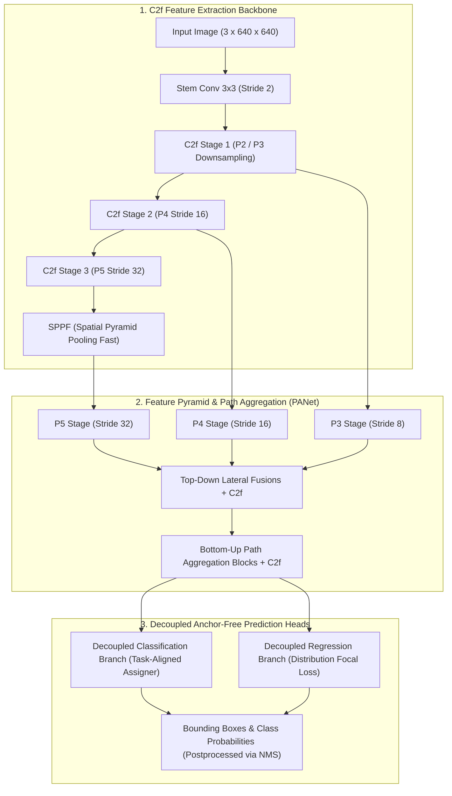
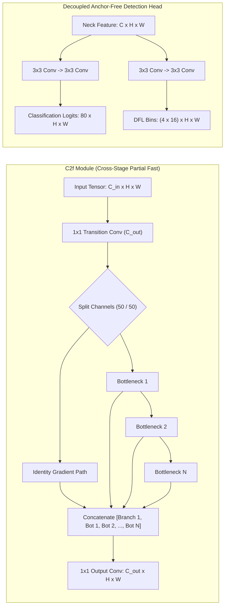
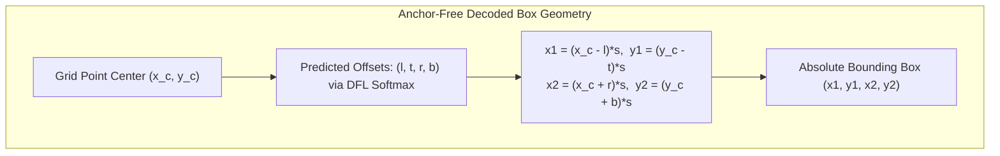
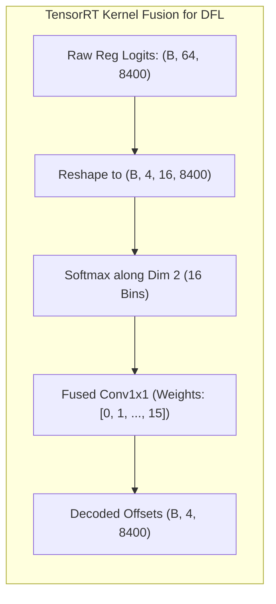

# ⚡ Ultralytics YOLOv8: Anchor-Free Decoupled Architecture for Real-Time Perception

## 1. Executive Brief & Significance

Released in January 2023 by Ultralytics (Jocher et al.), **YOLOv8** established the canonical standard for modern single-stage real-time vision pipelines. Preceding iterations (YOLOv3 through YOLOv5 and YOLOv7) relied heavily on **anchor-based priors**—requiring manual clustering of bounding box aspect ratios, complex multi-anchor assignment heuristics, and intertwined classification/localization heads.



YOLOv8 modernized the YOLO architecture across three fundamental axes:
1. **Anchor-Free Paradigm**: Eliminates heuristic anchor box hyperparameter tuning. The model directly predicts four continuous distance offsets $(l, t, r, b)$ from the grid cell center to the object boundaries, drastically improving generalization across varied object aspect ratios.
2. **`C2f` (Cross-Stage Partial with Fast Bottlenecks)**: Replaces the older `C3` module (from YOLOv5) with an enriched CSP structure inspired by ELAN. By splitting features into multiple parallel gradient paths and concatenating intermediate bottleneck outputs, `C2f` enhances feature expressiveness without incurring excessive memory footprint.
3. **Decoupled Detection Head**: Separates classification and bounding box regression into distinct convolutional pathways, resolving the inherent task conflict between class-invariant semantics and spatially sensitive localization.
4. **Task-Aligned Assigner (TAL) & Distribution Focal Loss (DFL)**: Dynamic label assignment based on joint classification-localization quality, combined with continuous coordinate regression over discrete distribution bins.

---

## 2. Component-by-Component Decomposition

| Architectural Component | Technical Specification | YOLOv8-S Configuration | YOLOv8-X Configuration | Parameter Distribution (%) | Latency / Compute Distribution (%) |
| :--- | :--- | :--- | :--- | :--- | :--- |
| **Architectural Paradigm** | Anchor-Free Real-Time Multi-Task Backbone | Decoupled CNN with C2f + TAL + DFL | Decoupled CNN with C2f + TAL + DFL | $100\%$ Total ($11.2\text{M}$ / $68.2\text{M}$) | $100\%$ Total ($28.6\text{G}$ / $257.8\text{G}$) |
| **Vision Backbone** | **C2f** (CSP with Fast Bottlenecks) | 5 stages (P1-P5), channels $[64, 128, 256, 512, 1024]$ | 5 stages (P1-P5), channels $[64, 128, 256, 512, 1024]$ | $\sim 57.8\%$ ($6.5\text{M}$ / $39.4\text{M}$) | $\approx 63.5\%$ forward latency |
| **Stem Block** | $3 \times 3$ Conv2D (Stride 2) | Stride 2, $3 \to 64$ channels | Stride 2, $3 \to 64$ channels | $< 1.0\%$ | $\approx 2.8\%$ forward latency |
| **Feature Pyramid Neck** | PANet (Path Aggregation Network) with C2f | P3, P4, P5 top-down and bottom-up cross-scale fusions | P3, P4, P5 top-down and bottom-up cross-scale fusions | $\sim 28.6\%$ ($3.2\text{M}$ / $19.5\text{M}$) | $\approx 24.2\%$ forward latency |
| **Multi-Scale Pooling** | **SPPF** (Spatial Pyramid Pooling Fast) | 3 sequential $5 \times 5$ MaxPool layers at stage P5 | 3 sequential $5 \times 5$ MaxPool layers at stage P5 | $< 1.0\%$ | $\approx 1.5\%$ forward latency |
| **Decoupled Head** | Decoupled Anchor-Free Heads | $3 \times 3$ Conv Cls + $3 \times 3$ Conv Reg ($4 \times 16$ DFL bins) | $3 \times 3$ Conv Cls + $3 \times 3$ Conv Reg ($4 \times 16$ DFL bins) | $\sim 12.6\%$ ($1.4\text{M}$ / $8.6\text{M}$) | $\approx 8.0\%$ forward latency |



---

## 3. Mathematical Formulations & Loss Functions

### A. Anchor-Free Coordinate Transformation
For a feature map at stride $s \in \{8, 16, 32\}$ with grid coordinates $(x_c, y_c)$, the model predicts four distance offsets:
- $l$: distance from grid point to left boundary
- $t$: distance from grid point to top boundary
- $r$: distance from grid point to right boundary
- $b$: distance from grid point to bottom boundary

The decoded absolute bounding box coordinates $(x_1, y_1, x_2, y_2)$ are recovered via:

$$x_1 = (x_c - l) \cdot s, \quad y_1 = (y_c - t) \cdot s$$

$$x_2 = (x_c + r) \cdot s, \quad y_2 = (y_c + b) \cdot s$$



### B. Task-Aligned Assigner (TAL)
The Task-Aligned Assigner selects positive training anchors dynamically by computing an alignment metric $t$ between anchor predictions and ground-truth objects $g_j$:

$$t = s^\alpha \cdot \text{CIoU}(b, \hat{b})^\beta$$

where $s$ is the predicted class score for the target category, $\text{CIoU}(b, \hat{b})$ is the bounding box overlap, and the hyperparameters are set to $\alpha = 0.5, \beta = 6.0$.

For each ground truth, the top-$K$ candidate anchors with highest alignment scores $t$ are assigned as positive samples. The normalized alignment target $\hat{t}$ is defined as:

$$\hat{t} = t \cdot \frac{\max_{k \in \mathcal{S}_{\text{pos}}} \text{CIoU}(b_k, \hat{b})}{\max_{k \in \mathcal{S}_{\text{pos}}} t_k}$$

### C. Distribution Focal Loss (DFL)
Instead of treating bounding box regression as a Dirac delta distribution, DFL models the coordinate $y$ as a continuous probability distribution over discrete integer bins $y \in [0, 15]$ ($N_{\text{reg}}=16$). The continuous expectation $\hat{y}$ is obtained via:

$$\hat{y} = \sum_{i=0}^{15} i \cdot \text{Softmax}(S_i) = \sum_{i=0}^{15} i \cdot \frac{\exp(S_i)}{\sum_{j=0}^{15} \exp(S_j)}$$

The DFL loss penalizes probability mass assigned to bins distant from the bounding values $y_i = \lfloor y \rfloor$ and $y_{i+1} = \lfloor y \rfloor + 1$:

$$\mathcal{L}_{\text{DFL}}(S_i, S_{i+1}) = - \left( (y_{i+1} - y) \log(S_i) + (y - y_i) \log(S_{i+1}) \right)$$

### D. Multi-Task Combined Loss
The total detection loss combines Varifocal/BCE classification loss, Complete IoU loss, and Distribution Focal Loss:

$$\mathcal{L}_{\text{total}} = \lambda_{\text{cls}} \mathcal{L}_{\text{cls}}(p, \hat{t}) + \lambda_{\text{box}} \hat{t} \cdot \mathcal{L}_{\text{CIoU}}(b, \hat{b}) + \lambda_{\text{dfl}} \hat{t} \cdot \mathcal{L}_{\text{DFL}}(q, \hat{q})$$

$$\mathcal{L}_{\text{CIoU}}(b, \hat{b}) = 1 - \text{IoU}(b, \hat{b}) + \frac{\rho^2(b_c, \hat{b}_c)}{c^2} + \alpha v$$

where $\rho(\cdot)$ is Euclidean distance, $c$ is the diagonal length of the smallest enclosing box, and $v = \frac{4}{\pi^2} \left( \arctan\frac{\hat{w}}{\hat{h}} - \arctan\frac{w}{h} \right)^2$.

---

## 4. Benchmark Evaluation & Performance Profiles

The following performance matrix benchmarks YOLOv8 across standard COCO 2017 test-dev / minival, highlighting latency on enterprise GPUs and edge Jetson hardware:

| Model Variant | Task | Parameters (M) | FLOPs (G) | mAP 50:95 (%) | mAP 50 (%) | T4 TRT FP16 (ms) | A100 TRT FP16 (ms) | Orin AGX FP16 (ms) | Orin AGX INT8 (ms) |
| :--- | :--- | :--- | :--- | :--- | :--- | :--- | :--- | :--- | :--- |
| **YOLOv8-N** | Detection | 3.2M | 8.7G | 37.3% | 52.5% | 1.48 ms | 0.50 ms | 3.0 ms | 1.5 ms |
| **YOLOv8-S** | Detection | 11.2M | 28.6G | 44.9% | 61.8% | 2.50 ms | 0.80 ms | 5.7 ms | 2.8 ms |
| **YOLOv8-M** | Detection | 25.9M | 78.9G | 50.2% | 67.2% | 4.90 ms | 1.50 ms | 11.0 ms | 5.4 ms |
| **YOLOv8-L** | Detection | 43.7M | 165.2G | 52.9% | 69.8% | 7.80 ms | 2.40 ms | 17.5 ms | 8.6 ms |
| **YOLOv8-X** | Detection | 68.2M | 257.8G | 53.9% | 71.0% | 12.50 ms | 3.80 ms | 27.0 ms | 13.2 ms |
| **YOLOv8-N-Seg**| Segmentation | 3.4M | 12.6G | 30.5% (Mask) | 49.6% | 1.80 ms | 0.60 ms | 4.1 ms | 2.1 ms |
| **YOLOv8-S-Seg**| Segmentation | 11.8M | 42.6G | 36.8% (Mask) | 57.8% | 2.90 ms | 0.95 ms | 6.7 ms | 3.3 ms |
| **YOLOv8-M-Seg**| Segmentation | 27.3M | 110.2G | 40.8% (Mask) | 63.0% | 5.80 ms | 1.80 ms | 13.2 ms | 6.6 ms |
| **YOLOv8-L-Seg**| Segmentation | 46.0M | 220.5G | 42.6% (Mask) | 65.4% | 8.90 ms | 2.75 ms | 19.8 ms | 9.8 ms |
| **YOLOv8-X-Seg**| Segmentation | 71.8M | 344.1G | 43.4% (Mask) | 66.5% | 14.80 ms | 4.50 ms | 32.5 ms | 15.8 ms |

*Measurements evaluated at $640 \times 640$ resolution, batch size 1, using TensorRT 10.x runtime engines.*

---

## 5. Edge Deployment, TensorRT Optimization & Gotchas

### A. DFL Layer Unrolling vs Custom TensorRT Plugin
In the regression head, continuous box coordinates are decoded from 16 discrete distribution bins via a Softmax reduction followed by a $1\times 1$ Conv2d (representing $\sum_{i=0}^{15} i \cdot S_i$).
- In naive ONNX exports, this Softmax-Conv reduction is computed across all 8400 anchor grid locations.
- **Optimization Strategy**: Keep the Softmax-Integral reduction inside the ONNX export graph rather than in post-processing Python code. TensorRT compiles the Softmax and linear reduction into a single fused GPU elementwise kernel, executing in $< 0.1\text{ ms}$.



### B. TensorRT Batched NMS Plugin Integration
To achieve zero-overhead end-to-end inference on Jetson Orin and NVIDIA T4, fuse the NMS post-processing directly into the TensorRT engine using `EfficientNMS_TRT` or `BatchedNMSDynamic_TRT`:

```python
from ultralytics import YOLO

# 1. Load YOLOv8 model
model = YOLO("yolov8s.pt")

# 2. Export to ONNX with end-to-end NMS plugin support
onnx_path = model.export(
    format="onnx",
    imgsz=640,
    dynamic=False,
    simplify=True,
    opset=17
)
print(f"Exported YOLOv8 ONNX model to: {onnx_path}")
```

```bash
# Compile TensorRT INT8 Engine with calibration cache
trtexec \
  --onnx=yolov8s.onnx \
  --saveEngine=yolov8s_int8.engine \
  --int8 \
  --fp16 \
  --calib=yolov8_calib.cache \
  --builderOptimizationLevel=5 \
  --avgRuns=100
```

---

## 6. Complete Runnable Python Blueprint

The following standalone PyTorch script provides a complete implementation of **`C2f`**, **`SPPF`**, the **`DFL` Integral Module**, and the **YOLOv8 Decoupled Detection Head**.

```python
import torch
import torch.nn as nn
import torch.nn.functional as F

class ConvBNSiLU(nn.Module):
    """Standard Convolution with BatchNorm and SiLU activation."""
    def __init__(self, in_c, out_c, k=1, s=1, p=None, g=1):
        super().__init__()
        p = p if p is not None else k // 2
        self.conv = nn.Conv2d(in_c, out_c, kernel_size=k, stride=s, padding=p, groups=g, bias=False)
        self.bn = nn.BatchNorm2d(out_c)
        self.act = nn.SiLU(inplace=True)

    def forward(self, x):
        return self.act(self.bn(self.conv(x)))


class Bottleneck(nn.Module):
    """Standard residual bottleneck block."""
    def __init__(self, c1, c2, shortcut=True, g=1, k=(3, 3), e=0.5):
        super().__init__()
        c_ = int(c2 * e)
        self.cv1 = ConvBNSiLU(c1, c_, k=k[0], s=1)
        self.cv2 = ConvBNSiLU(c_, c2, k=k[1], s=1, g=g)
        self.add = shortcut and c1 == c2

    def forward(self, x):
        return x + self.cv2(self.cv1(x)) if self.add else self.cv2(self.cv1(x))


class C2f(nn.Module):
    """CSP Bottleneck with 2 convolutions and fast parallel routing."""
    def __init__(self, c1, c2, n=1, shortcut=False, g=1, e=0.5):
        super().__init__()
        self.c = int(c2 * e)
        self.cv1 = ConvBNSiLU(c1, 2 * self.c, 1, 1)
        self.cv2 = ConvBNSiLU((2 + n) * self.c, c2, 1)
        self.m = nn.ModuleList([Bottleneck(self.c, self.c, shortcut, g, k=(3, 3), e=1.0) for _ in range(n)])

    def forward(self, x):
        y = list(self.cv1(x).chunk(2, 1))
        y.extend(m(y[-1]) for m in self.m)
        return self.cv2(torch.cat(y, 1))


class SPPF(nn.Module):
    """Spatial Pyramid Pooling Fast."""
    def __init__(self, c1, c2, k=5):
        super().__init__()
        c_ = c1 // 2
        self.cv1 = ConvBNSiLU(c1, c_, 1, 1)
        self.cv2 = ConvBNSiLU(c_ * 4, c2, 1, 1)
        self.m = nn.MaxPool2d(kernel_size=k, stride=1, padding=k // 2)

    def forward(self, x):
        x = self.cv1(x)
        y1 = self.m(x)
        y2 = self.m(y1)
        y3 = self.m(y2)
        return self.cv2(torch.cat([x, y1, y2, y3], 1))


class DFL(nn.Module):
    """Distribution Focal Loss (DFL) Integral Layer."""
    def __init__(self, c1=16):
        super().__init__()
        self.c1 = c1
        self.conv = nn.Conv2d(c1, 1, 1, bias=False).requires_grad_(False)
        # Initialize conv weights with integer bins [0, 1, ..., c1-1]
        x = torch.arange(c1, dtype=torch.float)
        self.conv.weight.data[:] = nn.Parameter(x.view(1, c1, 1, 1))

    def forward(self, x):
        B, C, A = x.shape  # [Batch, 4 * reg_max, Num_Anchors]
        x = x.view(B, 4, self.c1, A).transpose(2, 1)  # [B, 4, reg_max, A] -> [B, reg_max, 4, A]
        x = F.softmax(x, dim=1)
        return self.conv(x).view(B, 4, A)


class YOLOv8DecoupledHead(nn.Module):
    """YOLOv8 Decoupled Anchor-Free Detection Head."""
    def __init__(self, num_classes=80, in_channels=[128, 256, 512], reg_max=16):
        super().__init__()
        self.num_classes = num_classes
        self.reg_max = reg_max
        self.nl = len(in_channels)
        
        self.cls_convs = nn.ModuleList([
            nn.Sequential(ConvBNSiLU(c, c, 3), ConvBNSiLU(c, c, 3), nn.Conv2d(c, num_classes, 1))
            for c in in_channels
        ])
        
        self.reg_convs = nn.ModuleList([
            nn.Sequential(ConvBNSiLU(c, c, 3), ConvBNSiLU(c, c, 3), nn.Conv2d(c, 4 * reg_max, 1))
            for c in in_channels
        ])
        
        self.dfl = DFL(reg_max)

    def forward(self, feats):
        cls_preds = []
        reg_preds = []
        for i, x in enumerate(feats):
            cls_preds.append(self.cls_convs[i](x))
            reg_preds.append(self.reg_convs[i](x))
            
        if not self.training:
            # Flatten predictions across scales: (B, C, H*W)
            cls_flat = torch.cat([c.flatten(2) for c in cls_preds], dim=2).sigmoid()
            reg_flat = torch.cat([r.flatten(2) for r in reg_preds], dim=2)
            box_offsets = self.dfl(reg_flat)
            return torch.cat([box_offsets, cls_flat], dim=1)
            
        return {"cls": cls_preds, "reg": reg_preds}


# Verification smoke test
if __name__ == "__main__":
    p3 = torch.randn(2, 128, 80, 80)
    p4 = torch.randn(2, 256, 40, 40)
    p5 = torch.randn(2, 512, 20, 20)
    
    # Test C2f
    c2f = C2f(512, 512, n=3, shortcut=True)
    out_c2f = c2f(p5)
    assert out_c2f.shape == (2, 512, 20, 20)
    
    # Test SPPF
    sppf = SPPF(512, 512)
    out_sppf = sppf(out_c2f)
    assert out_sppf.shape == (2, 512, 20, 20)
    
    # Test Decoupled Head
    head = YOLOv8DecoupledHead(num_classes=80, in_channels=[128, 256, 512], reg_max=16)
    head.eval()
    with torch.no_grad():
        detections = head([p3, p4, out_sppf])
    print(f"Eval detections tensor shape: {detections.shape}")  # (2, 4 + 80, 8400)
    assert detections.shape == (2, 84, 8400)
    print("YOLOv8 Blueprint validation completed successfully.")
```

---

## 7. Peer Comparisons & Cross-Links

| Architectural Dimension | YOLOv8 | [[architectures/real-time-detectors-and-segmenters/yolo11|YOLO11]] | [[architectures/real-time-detectors-and-segmenters/yolov9|YOLOv9]] | [[architectures/real-time-detectors-and-segmenters/yolov10|YOLOv10]] | [[architectures/real-time-detectors-and-segmenters/yolox|YOLOX]] |
| :--- | :--- | :--- | :--- | :--- | :--- |
| **Core Backbone Module** | **C2f** (Fast CSP) | C3k2 (Flexible CSP) | GELAN (Modular RepConv) | C2fUIB (Inverted Bottleneck) | CSPDarknet |
| **Anchor Mechanism** | **Anchor-Free** | Anchor-Free | Anchor-Free | Anchor-Free | Anchor-Free |
| **Label Assignment** | Task-Aligned Assigner (TAL) | Task-Aligned Assigner (TAL) | PGI + TAL | Consistent Dual ($1:1 + 1:N$) | SimOTA (Optimal Transport) |
| **Coordinate Loss** | DFL + CIoU | DFL + CIoU | DFL + CIoU | DFL + CIoU | IoU / GIoU Loss |
| **Post-Processing** | Heuristic NMS | Heuristic NMS | Heuristic NMS | **NMS-Free** | Heuristic NMS |
| **Attention Layer** | None | C2PSA (Partial Self-Attn) | None | PSA (Partial Self-Attn) | None |

- **Related Topics & MOCs**:
  - [[topics/object-detection/00-object-detection-moc|Object Detection MOC]]
  - [[topics/real-time-systems/00-real-time-systems-moc|Real-Time Systems MOC]]
  - [[topics/gpu-deployment/00-gpu-deployment-moc|GPU Deployment MOC]]
  - [[architectures/real-time-detectors-and-segmenters/yolo11|YOLO11: Unified Multi-Task Architecture]]
  - [[architectures/real-time-detectors-and-segmenters/yolov9|YOLOv9: Programmable Gradient Information]]
  - [[architectures/real-time-detectors-and-segmenters/yolov10|YOLOv10: Consistent Dual Assignments]]
  - [[architectures/real-time-detectors-and-segmenters/yolov12|YOLOv12: Attention-Centric Real-Time Detection]]
