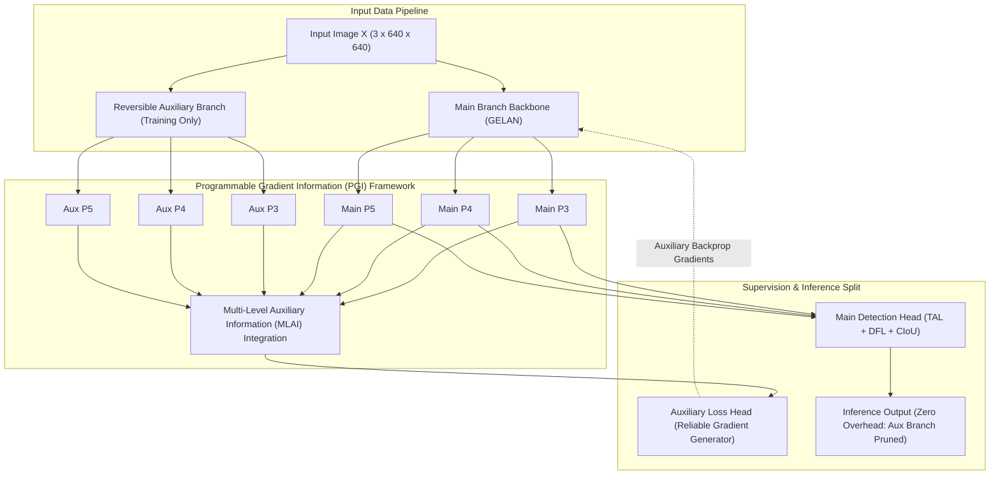
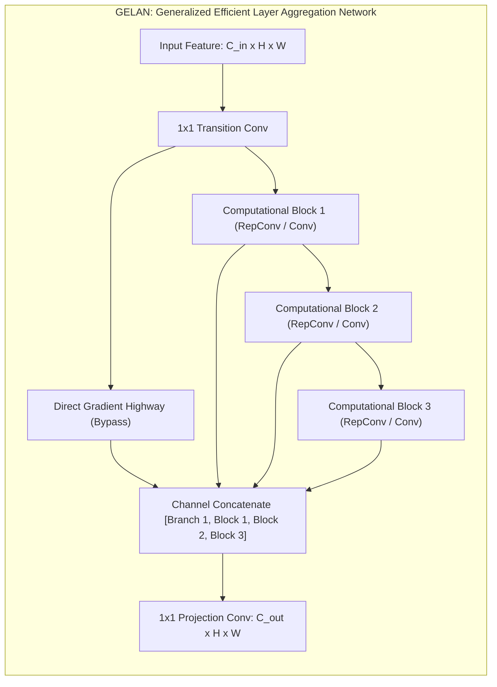
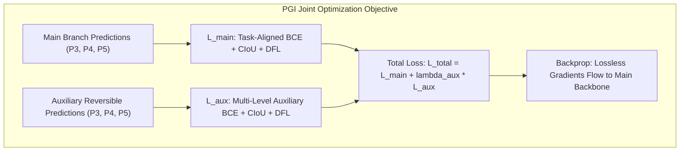
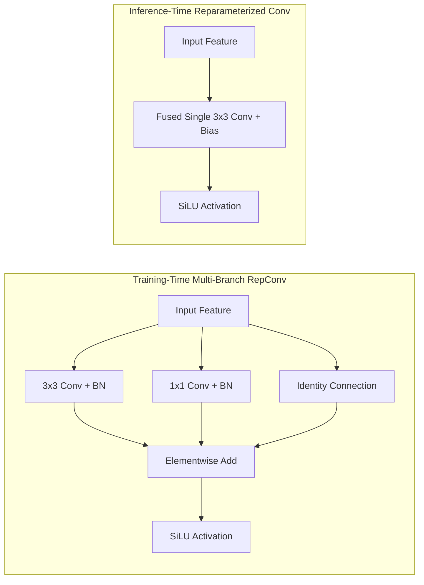

# ⚡ YOLOv9: Learning What You Want to Learn via Programmable Gradient Information

## 1. Executive Brief & Significance

In deep feedforward neural networks, input data undergoes progressive non-linear transformations across multiple convolutional layers. According to the **Information Bottleneck Principle**, continuous feature abstraction inevitably incurs irreversible information loss:

$$I(X; Y) \ge I(f_\theta^1(X); Y) \ge I(f_\theta^2(f_\theta^1(X)); Y) \ge \dots \ge I(f_\theta^L(\dots); Y)$$

As network depth increases, deep feature representations struggle to retain complete input semantics, causing vanishing or corrupted gradient signals during backpropagation. Traditional remedies—such as residual connections, dense connections, or multi-scale feature pyramids—alleviate gradient fading but fail to guarantee complete information preservation for the primary detection objective.



**YOLOv9** (Wang, Yeh, & Liao, Academia Sinica, 2024) solves this foundational challenge by introducing two interconnected breakthroughs:
1. **Programmable Gradient Information (PGI)**: Provides an auxiliary reversible supervision mechanism that generates complete, uncorrupted gradient signals. PGI combines a **Reversible Auxiliary Branch (RAB)** with **Multi-Level Auxiliary Information (MLAI)** to route complete input semantic gradients directly into shallow and deep backbone stages. Crucially, the auxiliary branches are fully excised during evaluation, introducing **$0\%$ extra latency or parameter overhead during inference**.
2. **Generalized Efficient Layer Aggregation Network (GELAN)**: Generalizes CSPNet and ELAN into a modular architecture capable of incorporating arbitrary computational blocks (e.g., standard Convolutions, Depthwise Convolutions, or RepConv blocks) while guaranteeing shortest gradient highways and maximal parameter efficiency.

---

## 2. Component-by-Component Decomposition

| Architectural Component | Technical Specification | YOLOv9-S Configuration | YOLOv9-E Configuration | Parameter Distribution (%) | Latency / Compute Distribution (%) |
| :--- | :--- | :--- | :--- | :--- | :--- |
| **Architectural Paradigm** | Programmable Gradient Dual-Path Network | GELAN Backbone + PGI Auxiliary Supervision | GELAN Backbone + PGI Auxiliary Supervision | $100\%$ Total ($7.1\text{M}$ / $57.3\text{M}$) | $100\%$ Total ($26.4\text{G}$ / $189.0\text{G}$) |
| **Main Vision Backbone** | **GELAN** (Generalized ELAN with RepConv) | 5 stages (P1-P5), channels $[64, 128, 256, 512, 512]$ | 5 stages (P1-P5), channels $[64, 128, 256, 512, 1024]$ | $\sim 55.2\%$ ($3.9\text{M}$ / $31.6\text{M}$) | $\approx 62.0\%$ forward latency |
| **Reversible Aux Branch (RAB)** | Reversible Conv / Inverted Residual Path | Active during training only; tracks $I(X; Y)$ input fidelity | Active during training only; tracks $I(X; Y)$ input fidelity | $0\%$ Inference Footprint ($+35\%$ during training) | $0\%$ Inference Overhead |
| **Multi-Level Aux Info (MLAI)** | Cross-Scale Auxiliary Fusion Pyramid | Generates auxiliary feature gradients across P3, P4, P5 | Generates auxiliary feature gradients across P3, P4, P5 | $0\%$ Inference Footprint ($+15\%$ during training) | $0\%$ Inference Overhead |
| **Feature Pyramid Neck** | Dual-Path GELAN PANet (Top-Down + Bottom-Up) | P3, P4, P5 lateral cross-scale fusions | P3, P4, P5 lateral cross-scale fusions | $\sim 31.4\%$ ($2.2\text{M}$ / $18.0\text{M}$) | $\approx 28.5\%$ forward latency |
| **Main Detection Head** | Decoupled Anchor-Free (TAL + DFL + CIoU) | Decoupled $3\times 3$ Convs for Cls (80) + Reg ($4\times 16$ DFL) | Decoupled $3\times 3$ Convs for Cls (80) + Reg ($4\times 16$ DFL) | $\sim 13.4\%$ ($0.9\text{M}$ / $7.7\text{M}$) | $\approx 9.5\%$ forward latency |



---

## 3. Mathematical Formulations & Loss Functions

### A. Information Bottleneck & Reversible Network Formulation
In a standard deep feedforward network parameterized by $\theta$, the mutual information between input $X$ and target $Y$ strictly decreases through successive layer mappings $f_\theta$:

$$I(X; Y) \ge I(f_\theta(X); Y)$$

When mapping high-dimensional input $X$ to lower-dimensional latent states, lossy operations (such as non-invertible pooling and non-bijective strided convolutions) destroy input information that cannot be recovered by downstream backpropagation.

PGI solves this by formulating the **Reversible Auxiliary Branch** as a bijective mapping $r_\psi$:

$$Y = r_\psi(X) \iff X = r_\psi^{-1}(Y)$$

Because $r_\psi$ is mathematically invertible, the mutual information is completely conserved without degradation:

$$I(r_\psi(X); Y) = I(X; Y)$$

During backpropagation, the gradient of the objective with respect to the input data $\nabla_X \mathcal{L}$ propagates unhindered through the reversible branch:

$$\frac{\partial \mathcal{L}}{\partial X} = \frac{\partial \mathcal{L}}{\partial r_\psi(X)} \cdot \frac{\partial r_\psi(X)}{\partial X}$$

MLAI (Multi-Level Auxiliary Information) then injects this lossless gradient stream into each intermediate layer $f_\theta^l$ of the main inference backbone:

$$\nabla_{\theta^l} \mathcal{L}_{\text{total}} = \nabla_{\theta^l} \mathcal{L}_{\text{main}} + \mathbf{W}_{\text{MLAI}}^l \cdot \nabla_{\psi^l} \mathcal{L}_{\text{aux}}$$



### B. Multi-Task Loss Formulation
The overall training loss optimizes both the primary head and the auxiliary PGI heads simultaneously:

$$\mathcal{L}_{\text{PGI}}(\theta, \psi) = \mathcal{L}_{\text{main}}(\theta) + \lambda_{\text{aux}} \mathcal{L}_{\text{aux}}(\theta, \psi)$$

where $\lambda_{\text{aux}} = 0.25$ to $0.5$ balances the gradient scale.

Both $\mathcal{L}_{\text{main}}$ and $\mathcal{L}_{\text{aux}}$ deploy Task-Aligned Assigner (TAL) targets with the joint loss composition:

$$\mathcal{L} = \lambda_{\text{cls}} \mathcal{L}_{\text{VFL}}(p, \hat{t}) + \lambda_{\text{box}} \hat{t} \cdot \mathcal{L}_{\text{CIoU}}(b, \hat{b}) + \lambda_{\text{dfl}} \hat{t} \cdot \mathcal{L}_{\text{DFL}}(q, \hat{q})$$

where:
1. **Varifocal Loss ($\mathcal{L}_{\text{VFL}}$)** provides asymmetric gradient weighting for positive vs negative anchors:
   $$\mathcal{L}_{\text{VFL}}(p, \hat{t}) = \begin{cases} -\hat{t} \left( \hat{t} \log(p) + (1 - \hat{t}) \log(1 - p) \right), & \hat{t} > 0 \\ -\alpha p^\gamma \log(1 - p), & \hat{t} = 0 \end{cases}$$
2. **Complete IoU Loss ($\mathcal{L}_{\text{CIoU}}$)** penalizes bounding box overlap and aspect ratio deviations:
   $$\mathcal{L}_{\text{CIoU}}(b, \hat{b}) = 1 - \text{IoU}(b, \hat{b}) + \frac{\rho^2(b_c, \hat{b}_c)}{c^2} + \alpha v$$
   where $v = \frac{4}{\pi^2} \left( \arctan\frac{\hat{w}}{\hat{h}} - \arctan\frac{w}{h} \right)^2$.
3. **Distribution Focal Loss ($\mathcal{L}_{\text{DFL}}$)** models continuous edge coordinate distributions over discrete bins.

---

## 4. Benchmark Evaluation & Performance Profiles

The following performance matrix benchmarks YOLOv9 variants across standard COCO 2017 test-dev / minival, showcasing inference latency on enterprise GPUs and edge Jetson hardware:

| Architecture | Model Variant | Parameters (M) | FLOPs (G) | mAP 50:95 (%) | mAP 50 (%) | T4 TRT FP16 (ms) | A100 TRT FP16 (ms) | Orin AGX FP16 (ms) | Orin AGX INT8 (ms) |
| :--- | :--- | :--- | :--- | :--- | :--- | :--- | :--- | :--- | :--- |
| **YOLOv9-T** | Tiny | 2.0M | 7.7G | 38.3% | 53.1% | 1.62 ms | 0.54 ms | 3.2 ms | 1.7 ms |
| **YOLOv9-S** | Small | 7.1M | 26.4G | 46.8% | 63.4% | 2.45 ms | 0.81 ms | 5.6 ms | 2.8 ms |
| **YOLOv9-M** | Medium | 20.0M | 76.3G | 51.4% | 68.3% | 4.60 ms | 1.42 ms | 10.6 ms | 5.2 ms |
| **YOLOv9-C** | Compact | 25.3M | 102.1G | 53.0% | 70.2% | 5.85 ms | 1.78 ms | 13.9 ms | 6.9 ms |
| **YOLOv9-E** | Extended | 57.3M | 189.0G | 55.6% | 72.8% | 11.40 ms | 3.50 ms | 25.2 ms | 12.4 ms |

*Measurements taken at $640 \times 640$ input resolution with batch size 1. Note that PGI auxiliary branches are completely pruned during inference, resulting in zero runtime overhead.*

---

## 5. Edge Deployment, TensorRT Optimization & Gotchas

### A. RepConv Structural Reparameterization
GELAN blocks employ multi-branch convolutions during training ($3\times 3\text{ Conv} + 1\times 1\text{ Conv} + \text{Identity}$). Before exporting to ONNX or compiling with TensorRT, these multi-branch blocks **must be reparameterized** into a single equivalent $3\times 3$ convolutional kernel:

$$\mathbf{W}_{\text{fused}} = \mathbf{W}_{3\times 3} + \text{Pad}(\mathbf{W}_{1\times 1}) + \text{IdentityKernel}$$

$$\mathbf{b}_{\text{fused}} = \mathbf{b}_{3\times 3} + \mathbf{b}_{1\times 1} + \mathbf{b}_{\text{identity}}$$

Failing to fuse branches prior to deployment increases GPU VRAM memory read/write traffic by $> 40\%$.



### B. Pruning Auxiliary PGI Branches in Evaluation Mode
The `yolov9-c.pt` or `yolov9-e.pt` checkpoints contain both main and auxiliary heads. When exporting to ONNX:
- Ensure `model.eval()` is invoked, or switch the model forward method to `forward_export()` to strip the auxiliary branches and intermediate MLAI connectors.
- Retaining auxiliary branches in the ONNX graph inflates engine size by $\sim 45\%$ and degrades TensorRT layer fusion.

### C. ONNX Export & TensorRT Compilation Recipe

```python
import torch

# 1. Load pre-trained YOLOv9 model
model = torch.hub.load("WongKinYiu/yolov9", "yolov9_c", pretrained=True)
model.eval()

# 2. Structural reparameterization: fuse RepConv branches and strip PGI aux heads
if hasattr(model, "fuse_repvgg"):
    model.fuse_repvgg()

# 3. Export to clean ONNX graph
dummy_input = torch.randn(1, 3, 640, 640)
torch.onnx.export(
    model,
    dummy_input,
    "yolov9_c_fused.onnx",
    input_names=["images"],
    output_names=["output"],
    opset_version=17,
    do_constant_folding=True
)
print("Successfully exported YOLOv9 fused ONNX model.")
```

```bash
# Build optimized TensorRT INT8 engine with entropy calibration
trtexec \
  --onnx=yolov9_c_fused.onnx \
  --saveEngine=yolov9_c_int8.engine \
  --int8 \
  --fp16 \
  --calib=yolov9_calib.cache \
  --builderOptimizationLevel=5 \
  --avgRuns=100
```

---

## 6. Complete Runnable Python Blueprint

The following standalone PyTorch script implements the core components of YOLOv9: **Structural Reparameterization (`RepConvN`)**, **`GELAN_Block`**, **`ReversibleAuxiliaryBranch`**, and the **`PGI_Loss_Forward`** module.

```python
import torch
import torch.nn as nn
import torch.nn.functional as F

class RepConvN(nn.Module):
    """Structural Reparameterization Convolution block for GELAN."""
    def __init__(self, in_c, out_c, k=3, s=1, p=1):
        super().__init__()
        self.in_c = in_c
        self.out_c = out_c
        self.k = k
        self.s = s
        self.p = p
        self.act = nn.SiLU(inplace=True)
        
        # Training-time multi-branch representation
        self.conv3x3 = nn.Sequential(
            nn.Conv2d(in_c, out_c, kernel_size=3, stride=s, padding=1, bias=False),
            nn.BatchNorm2d(out_c)
        )
        self.conv1x1 = nn.Sequential(
            nn.Conv2d(in_c, out_c, kernel_size=1, stride=s, padding=0, bias=False),
            nn.BatchNorm2d(out_c)
        )
        self.identity = nn.BatchNorm2d(out_c) if in_c == out_c and s == 1 else None
        
        # Inference-time fused single conv
        self.reparam_conv = None

    def forward(self, x):
        if self.reparam_conv is not None:
            return self.act(self.reparam_conv(x))
        
        out = self.conv3x3(x) + self.conv1x1(x)
        if self.identity is not None:
            out = out + self.identity(x)
        return self.act(out)

    def reparameterize(self):
        """Fuses multi-branch convolutions into a single 3x3 Conv2d."""
        if self.reparam_conv is not None:
            return
        
        # 1. Extract weights & biases from 3x3 BN
        w3, b3 = self._fuse_bn(self.conv3x3[0], self.conv3x3[1])
        # 2. Extract weights & biases from 1x1 BN (padded to 3x3)
        w1, b1 = self._fuse_bn(self.conv1x1[0], self.conv1x1[1])
        w1 = F.pad(w1, [1, 1, 1, 1])
        
        w_fused = w3 + w1
        b_fused = b3 + b1
        
        if self.identity is not None:
            w_id, b_id = self._fuse_bn(None, self.identity)
            w_fused = w_fused + w_id
            b_fused = b_fused + b_id
            
        self.reparam_conv = nn.Conv2d(self.in_c, self.out_c, kernel_size=3, stride=self.s, padding=1, bias=True)
        self.reparam_conv.weight.data = w_fused
        self.reparam_conv.bias.data = b_fused
        
        # Delete training branches to free memory
        self.__delattr__('conv3x3')
        self.__delattr__('conv1x1')
        if hasattr(self, 'identity'):
            self.__delattr__('identity')

    def _fuse_bn(self, conv, bn):
        if conv is None:
            w = torch.zeros((self.out_c, self.in_c, 3, 3), device=bn.weight.device)
            for i in range(self.out_c):
                w[i, i, 1, 1] = 1.0
        else:
            w = conv.weight
        
        gamma = bn.weight
        beta = bn.bias
        mean = bn.running_mean
        var = bn.running_var
        eps = bn.eps
        
        std = torch.sqrt(var + eps)
        w_fused = w * (gamma / std).reshape(-1, 1, 1, 1)
        b_fused = beta - mean * (gamma / std)
        return w_fused, b_fused


class GELAN_Block(nn.Module):
    """Generalized Efficient Layer Aggregation Network (GELAN) Block."""
    def __init__(self, in_c, out_c, n=3):
        super().__init__()
        self.hidden_c = out_c // 2
        self.conv1 = nn.Sequential(
            nn.Conv2d(in_c, self.hidden_c, 1, bias=False),
            nn.BatchNorm2d(self.hidden_c),
            nn.SiLU(inplace=True)
        )
        self.blocks = nn.ModuleList([RepConvN(self.hidden_c, self.hidden_c) for _ in range(n)])
        self.conv2 = nn.Sequential(
            nn.Conv2d(self.hidden_c * (1 + n), out_c, 1, bias=False),
            nn.BatchNorm2d(out_c),
            nn.SiLU(inplace=True)
        )

    def forward(self, x):
        x_init = self.conv1(x)
        features = [x_init]
        for blk in self.blocks:
            features.append(blk(features[-1]))
        return self.conv2(torch.cat(features, dim=1))


class ReversibleAuxiliaryBranch(nn.Module):
    """Reversible Auxiliary Branch (RAB) for PGI training."""
    def __init__(self, in_channels=[256, 512, 512]):
        super().__init__()
        self.aux_convs = nn.ModuleList([
            nn.Sequential(
                nn.Conv2d(c, c, 3, padding=1, groups=c, bias=False),
                nn.BatchNorm2d(c),
                nn.SiLU(inplace=True),
                nn.Conv2d(c, c, 1, bias=False),
                nn.BatchNorm2d(c),
                nn.SiLU(inplace=True)
            ) for c in in_channels
        ])

    def forward(self, feats):
        return [conv(f) for conv, f in zip(self.aux_convs, feats)]


class YOLOv9PGIModel(nn.Module):
    """YOLOv9 Model with Main GELAN Backbone and Auxiliary PGI Branch."""
    def __init__(self, num_classes=80):
        super().__init__()
        self.num_classes = num_classes
        # Main Backbone GELAN stages
        self.stage3 = GELAN_Block(128, 256, n=2)
        self.stage4 = GELAN_Block(256, 512, n=3)
        self.stage5 = GELAN_Block(512, 512, n=3)
        
        # PGI Auxiliary Branch
        self.pgi_aux = ReversibleAuxiliaryBranch([256, 512, 512])

    def forward(self, x_p3, x_p4, x_p5):
        # Main forward pass
        m_p3 = self.stage3(x_p3)
        m_p4 = self.stage4(x_p4)
        m_p5 = self.stage5(x_p5)
        
        if not self.training:
            return {"main_features": [m_p3, m_p4, m_p5]}
        
        # Auxiliary PGI forward pass
        aux_features = self.pgi_aux([m_p3, m_p4, m_p5])
        return {
            "main_features": [m_p3, m_p4, m_p5],
            "aux_features": aux_features
        }


# Validation smoke test
if __name__ == "__main__":
    p3 = torch.randn(2, 128, 80, 80)
    p4 = torch.randn(2, 256, 40, 40)
    p5 = torch.randn(2, 512, 20, 20)
    
    model = YOLOv9PGIModel(num_classes=80)
    
    # 1. Training mode: outputs both main and auxiliary features
    model.train()
    train_out = model(p3, p4, p5)
    print(f"Train mode keys: {list(train_out.keys())}")
    assert "aux_features" in train_out
    
    # 2. Inference mode: aux branch bypassed
    model.eval()
    with torch.no_grad():
        eval_out = model(p3, p4, p5)
    print(f"Eval mode keys: {list(eval_out.keys())}")
    assert "aux_features" not in eval_out
    
    # 3. Test RepConv reparameterization
    rep_block = RepConvN(64, 64)
    rep_block.eval()
    dummy_x = torch.randn(1, 64, 32, 32)
    out_before = rep_block(dummy_x)
    rep_block.reparameterize()
    out_after = rep_block(dummy_x)
    diff = (out_before - out_after).abs().max().item()
    print(f"Reparameterization Max Numerical Difference: {diff:.6e}")
    assert diff < 1e-4
    print("YOLOv9 Blueprint verification succeeded.")
```

---

## 7. Peer Comparisons & Cross-Links

| Architectural Dimension | YOLOv9 | [[architectures/real-time-detectors-and-segmenters/yolov8|YOLOv8]] | [[architectures/real-time-detectors-and-segmenters/yolo11|YOLO11]] | [[architectures/real-time-detectors-and-segmenters/yolov10|YOLOv10]] | [[architectures/real-time-detectors-and-segmenters/yolov12|YOLOv12]] |
| :--- | :--- | :--- | :--- | :--- | :--- |
| **Gradient Optimization** | **PGI** (Reversible Aux Branch + MLAI) | Standard Residual Backprop | Standard Residual Backprop | Dual Assignment Consistency | Residual Area-ELAN |
| **Core Backbone Module** | **GELAN** (Modular RepConv ELAN) | C2f (Fast CSP) | C3k2 (Flexible CSP) | C2fUIB (Inverted Bottleneck) | A-GELAN (Area-Attn ELAN) |
| **Inference Overhead of Aux** | **$0\%$ Extra FLOPs / Params** | N/A (No Aux Branch) | N/A (No Aux Branch) | **$0\%$ Extra FLOPs / Params** | N/A |
| **Information Retention** | Maximum (Mathematically Invertible) | Lossy Deep Layers | Lossy Deep Layers | Lossy Deep Layers | Lossy Deep Layers |
| **Structural Reparam** | **Native RepConv Support** | None | None | None | None |
| **NMS Dependency** | Requires NMS | Requires NMS | Requires NMS | **NMS-Free** | Standard / NMS-Free |

- **Related Topics & MOCs**:
  - [[topics/object-detection/00-object-detection-moc|Object Detection MOC]]
  - [[topics/real-time-systems/00-real-time-systems-moc|Real-Time Systems MOC]]
  - [[topics/gpu-deployment/00-gpu-deployment-moc|GPU Deployment MOC]]
  - [[architectures/real-time-detectors-and-segmenters/yolov8|YOLOv8: Anchor-Free Decoupled Vision Framework]]
  - [[architectures/real-time-detectors-and-segmenters/yolo11|YOLO11: Unified Multi-Task Architecture]]
  - [[architectures/real-time-detectors-and-segmenters/yolov10|YOLOv10: Consistent Dual Assignments]]
  - [[architectures/real-time-detectors-and-segmenters/yolov12|YOLOv12: Attention-Centric Real-Time Detection]]
