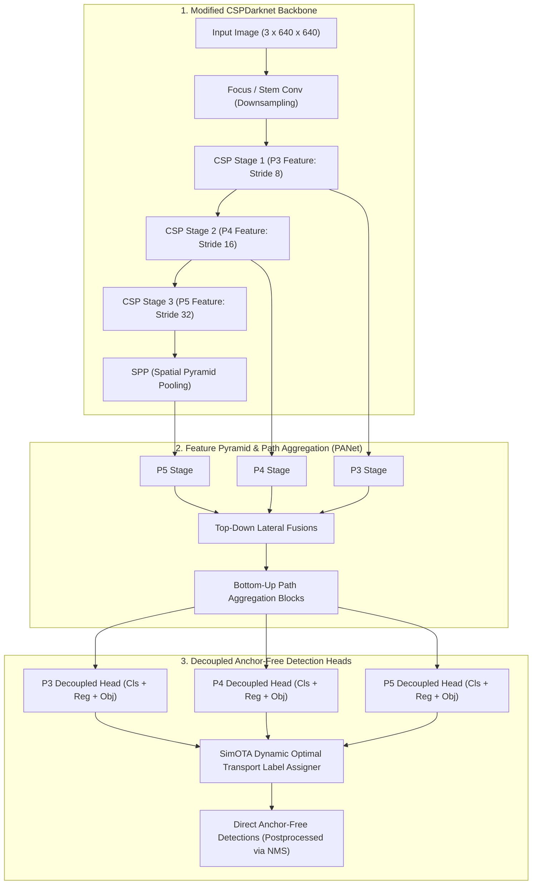
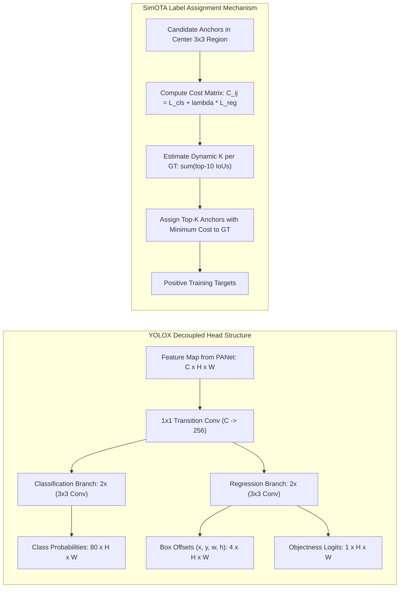
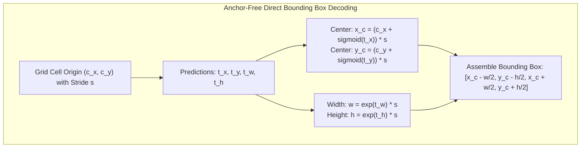
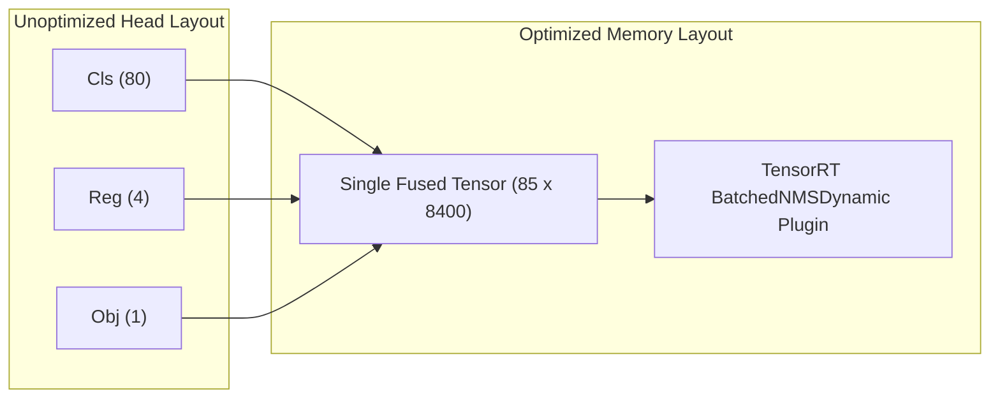

# ⚡ YOLOX: High-Performance Anchor-Free YOLO with Dynamic Optimal Transport Assignment

## 1. Executive Brief & Significance

Prior to 2021, real-time object detection was dominated by anchor-based architectures (YOLOv3, YOLOv4, YOLOv5) which inherited handcrafted anchor box priors from Faster R-CNN. These anchor mechanisms required heuristic clustering algorithms (such as k-means over dataset bounding box distributions), complex multi-anchor assignment rules, and coupled classification-regression heads that suffered from spatial gradient interference.



**YOLOX** (Ge et al., Megvii Technology, 2021) revolutionized the modern YOLO lineage by introducing three seminal innovations:
1. **Decoupled Detection Head**: Separates the shared output feature map into independent convolutional pathways for classification, bounding box coordinate regression, and foreground objectness confidence. This separation accelerates convergence speed by $> 2.5\times$ and yields consistent $+1.1\%\text{ mAP}$ improvements.
2. **Anchor-Free Detection Mechanism**: Eliminates anchor box priors by reducing the number of candidate predictions per grid cell from 3 to 1 ($x_c, y_c, w, h$). This reduces heuristic hyperparameter search spaces and inference decoding compute by $66\%$.
3. **SimOTA (Simplified Optimal Transport Assignment)**: Formulates label assignment as an Optimal Transport problem where candidate anchors dynamically compete for ground-truth objects based on joint classification-regression cost. SimOTA estimates dynamic positive assignment budgets ($k$), eliminating rigid hyperparameter thresholds.

---

## 2. Component-by-Component Decomposition

| Architectural Component | Technical Specification | YOLOX-S Configuration | YOLOX-X Configuration | Parameter Distribution (%) | Latency / Compute Distribution (%) |
| :--- | :--- | :--- | :--- | :--- | :--- |
| **Architectural Paradigm** | Anchor-Free Real-Time Object Detector | Decoupled CSPDarknet + SimOTA | Decoupled CSPDarknet + SimOTA | $100\%$ Total ($9.0\text{M}$ / $99.1\text{M}$) | $100\%$ Total ($26.8\text{G}$ / $281.9\text{G}$) |
| **Vision Backbone** | **Modified CSPDarknet53** | 5 stages (P1-P5), channels $[32, 64, 128, 256, 512]$ | 5 stages (P1-P5), channels $[80, 160, 320, 640, 1280]$ | $\sim 56.5\%$ ($5.1\text{M}$ / $56.0\text{M}$) | $\approx 64.0\%$ forward latency |
| **Stem / Focus Block** | $3 \times 3$ Conv2D (Stride 2) / Focus slice | $3 \to 32$ channels downsampling | $3 \to 80$ channels downsampling | $< 1.2\%$ | $\approx 3.0\%$ forward latency |
| **Feature Pyramid Neck** | PANet (Path Aggregation Network) | P3, P4, P5 lateral top-down and bottom-up fusions | P3, P4, P5 lateral top-down and bottom-up fusions | $\sim 28.5\%$ ($2.6\text{M}$ / $28.2\text{M}$) | $\approx 23.5\%$ forward latency |
| **Multi-Scale Pooling** | **SPP** (Spatial Pyramid Pooling) | Multi-kernel max pooling ($5\times 5, 9\times 9, 13\times 13$) | Multi-kernel max pooling ($5\times 5, 9\times 9, 13\times 13$) | $< 1.5\%$ | $\approx 1.5\%$ forward latency |
| **Decoupled Head** | Decoupled Anchor-Free Heads (Cls, Reg, Obj) | $1\times 1\text{ Conv} \to 2\times (3\times 3\text{ Conv})$ per branch | $1\times 1\text{ Conv} \to 2\times (3\times 3\text{ Conv})$ per branch | $\sim 13.8\%$ ($1.2\text{M}$ / $13.7\text{M}$) | $\approx 9.5\%$ forward latency |



---

## 3. Mathematical Formulations & Loss Functions

### A. Anchor-Free Coordinate Decoding
Unlike anchor-based models that predict relative offsets to fixed anchor priors $(p_w, p_h)$, YOLOX predicts coordinates directly from each grid cell top-left origin $(c_x, c_y)$ on feature map level $s$:

$$\hat{x}_c = (c_x + t_x) \cdot s, \quad \hat{y}_c = (c_y + t_y) \cdot s$$

$$\hat{w} = \exp(t_w) \cdot s, \quad \hat{h} = \exp(t_h) \cdot s$$

where $(t_x, t_y)$ are sigmoid-bounded grid offsets and $(t_w, t_h)$ are log-space scale factors.



### B. SimOTA (Simplified Optimal Transport Assignment)
SimOTA formulates label assignment as an optimal transport problem: mapping $m$ ground-truth objects to $n$ candidate anchor locations.

1. **Pairwise Matching Cost**: The transport cost $c_{ij}$ between anchor prediction $i$ and ground truth $j$ is:
   $$c_{ij} = \mathcal{L}_{\text{cls}}(p_i, g_j) + \lambda \mathcal{L}_{\text{reg}}(b_i, g_j) + \alpha \mathcal{C}_{\text{center}}(i, g_j)$$
   where:
   $$\mathcal{L}_{\text{cls}} = \text{BCE}(p_i, y_j) = - y_j \log(p_i) - (1 - y_j) \log(1 - p_i)$$
   $$\mathcal{L}_{\text{reg}} = 1 - \text{IoU}(b_i, \hat{b}_j)$$
   $\mathcal{C}_{\text{center}}$ enforces candidate selection strictly within the center $3 \times 3$ grid cells of ground truth $g_j$.

2. **Dynamic $k$ Estimation**: The number of positive anchors allocated to ground truth $j$ is dynamically determined by summing the IoU values of the top-10 candidate predictions:
   $$k_j = \max \left( 1, \left\lfloor \sum_{i \in \text{Top10}(\text{IoU}_j)} \text{IoU}(b_i, g_j) \right\rfloor \right)$$

3. **Top-$k$ Minimum Cost Assignment**: Ground truth $j$ selects its top-$k_j$ anchors with the lowest cost $c_{ij}$. If an anchor is selected by multiple ground-truth objects, it is resolved to the ground truth with the minimum transport cost.

### C. Multi-Task Training Objective
The complete training loss combines classification, IoU regression, and objectness losses:

$$\mathcal{L}_{\text{total}} = \frac{1}{N_{\text{pos}}} \left( \sum_{i \in \mathcal{S}_{\text{pos}}} \mathcal{L}_{\text{cls}}(p_i, y_i) + \lambda_{\text{reg}} \sum_{i \in \mathcal{S}_{\text{pos}}} \mathcal{L}_{\text{IoU}}(b_i, \hat{b}_i) \right) + \frac{1}{N_{\text{all}}} \sum_{j \in \mathcal{S}_{\text{all}}} \mathcal{L}_{\text{obj}}(o_j, \hat{o}_j)$$

where $\mathcal{L}_{\text{IoU}}$ is the GIoU/IoU loss and $\mathcal{L}_{\text{obj}}$ is Binary Cross-Entropy supervised by ground-truth IoU overlap.

---

## 4. Benchmark Evaluation & Performance Profiles

The following performance matrix benchmarks YOLOX variants across the standard COCO 2017 test-dev / minival dataset:

| Model Variant | Parameters (M) | FLOPs (G) | mAP 50:95 (%) | mAP 50 (%) | T4 TRT FP16 (ms) | V100 FP16 (ms) | Orin AGX FP16 (ms) | Orin AGX INT8 (ms) |
| :--- | :--- | :--- | :--- | :--- | :--- | :--- | :--- | :--- |
| **YOLOX-Nano** | 0.91M | 1.08G | 25.8% | 40.8% | 0.85 ms | 0.45 ms | 1.8 ms | 0.9 ms |
| **YOLOX-Tiny** | 5.06M | 6.45G | 32.8% | 50.3% | 1.35 ms | 0.70 ms | 2.8 ms | 1.4 ms |
| **YOLOX-S** | 8.96M | 26.8G | 40.5% | 59.8% | 2.40 ms | 1.20 ms | 5.5 ms | 2.7 ms |
| **YOLOX-M** | 25.3M | 73.8G | 46.9% | 66.3% | 4.80 ms | 2.40 ms | 10.8 ms | 5.3 ms |
| **YOLOX-L** | 54.2M | 155.6G | 50.1% | 69.7% | 7.90 ms | 3.90 ms | 18.2 ms | 8.9 ms |
| **YOLOX-X** | 99.1M | 281.9G | 51.5% | 70.5% | 12.80 ms | 6.20 ms | 28.5 ms | 13.8 ms |

*Measurements taken at $640 \times 640$ resolution ($416 \times 416$ for Nano/Tiny) with batch size 1 under TensorRT 10 runtime.*

---

## 5. Edge Deployment, TensorRT Optimization & Gotchas

### A. Decoupled Head Graph Flattening
In YOLOX, each scale head produces three separate output tensors:
- Classification: $\mathbb{R}^{B \times 80 \times H \times W}$
- Regression: $\mathbb{R}^{B \times 4 \times H \times W}$
- Objectness: $\mathbb{R}^{B \times 1 \times H \times W}$

**Optimization Gotcha**:
- If exported naively, the three heads generate fragmented memory allocations in TensorRT.
- **Recipe**: Concatenate the outputs into a single unified tensor $\mathbb{R}^{B \times (80 + 4 + 1) \times 8400}$ inside the ONNX graph prior to NMS plugin invocation, enabling maximum memory coalescing on NVIDIA Tensor Cores.



### B. TensorRT INT8 Calibration Recipe

```python
import torch

# 1. Load pre-trained YOLOX model
model = torch.hub.load("Megvii-BaseDetection/YOLOX", "yolox_s", pretrained=True)
model.eval()

# 2. Export to ONNX with concatenated output layout
dummy_input = torch.randn(1, 3, 640, 640)
torch.onnx.export(
    model,
    dummy_input,
    "yolox_s.onnx",
    input_names=["images"],
    output_names=["output"],
    opset_version=17,
    do_constant_folding=True
)
print("Exported YOLOX-S ONNX model.")
```

```bash
# Build Calibrated INT8 Engine on Jetson Orin / NVIDIA T4
trtexec \
  --onnx=yolox_s.onnx \
  --saveEngine=yolox_s_int8.engine \
  --int8 \
  --fp16 \
  --calib=yolox_calib.cache \
  --builderOptimizationLevel=5 \
  --avgRuns=100
```

---

## 6. Complete Runnable Python Blueprint

The following standalone PyTorch script implements the core architectural components of YOLOX: **`CSPDarknet_Stage`**, **`YOLOX_DecoupledHead`**, and the **`SimOTA` Dynamic Assigner**.

```python
import torch
import torch.nn as nn
import torch.nn.functional as F

class ConvBNSiLU(nn.Module):
    """Standard Convolution with BatchNorm and SiLU activation."""
    def __init__(self, in_c, out_c, k=1, s=1, p=None, g=1):
        super().__init__()
        p = p if p is not None else k // 2
        self.conv = nn.Conv2d(in_c, out_c, kernel_size=k, stride=s, padding=p, groups=g, bias=False)
        self.bn = nn.BatchNorm2d(out_c)
        self.act = nn.SiLU(inplace=True)

    def forward(self, x):
        return self.act(self.bn(self.conv(x)))


class CSPDarknetBottleneck(nn.Module):
    """Standard CSPDarknet Bottleneck unit."""
    def __init__(self, in_c, out_c, shortcut=True):
        super().__init__()
        hidden_c = out_c // 2
        self.conv1 = ConvBNSiLU(in_c, hidden_c, k=1)
        self.conv2 = ConvBNSiLU(hidden_c, out_c, k=3)
        self.use_add = shortcut and in_c == out_c

    def forward(self, x):
        out = self.conv2(self.conv1(x))
        return x + out if self.use_add else out


class CSPDarknetStage(nn.Module):
    """CSPDarknet Stage with cross-stage feature splitting."""
    def __init__(self, in_c, out_c, num_blocks=3):
        super().__init__()
        self.downsample = ConvBNSiLU(in_c, out_c, k=3, s=2)
        hidden_c = out_c // 2
        self.conv1 = ConvBNSiLU(out_c, hidden_c, k=1)
        self.conv2 = ConvBNSiLU(out_c, hidden_c, k=1)
        self.blocks = nn.Sequential(*[CSPDarknetBottleneck(hidden_c, hidden_c) for _ in range(num_blocks)])
        self.conv3 = ConvBNSiLU(hidden_c * 2, out_c, k=1)

    def forward(self, x):
        x = self.downsample(x)
        b1 = self.conv1(x)
        b2 = self.blocks(self.conv2(x))
        return self.conv3(torch.cat([b1, b2], dim=1))


class YOLOXDecoupledHead(nn.Module):
    """YOLOX Decoupled Detection Head (Cls, Reg, Obj)."""
    def __init__(self, num_classes=80, in_channels=[128, 256, 512], feat_dim=256):
        super().__init__()
        self.num_classes = num_classes
        self.strides = [8, 16, 32]
        
        self.stems = nn.ModuleList([ConvBNSiLU(c, feat_dim, k=1) for c in in_channels])
        
        self.cls_convs = nn.ModuleList([
            nn.Sequential(ConvBNSiLU(feat_dim, feat_dim, 3), ConvBNSiLU(feat_dim, feat_dim, 3))
            for _ in in_channels
        ])
        self.reg_convs = nn.ModuleList([
            nn.Sequential(ConvBNSiLU(feat_dim, feat_dim, 3), ConvBNSiLU(feat_dim, feat_dim, 3))
            for _ in in_channels
        ])
        
        self.cls_preds = nn.ModuleList([nn.Conv2d(feat_dim, num_classes, 1) for _ in in_channels])
        self.reg_preds = nn.ModuleList([nn.Conv2d(feat_dim, 4, 1) for _ in in_channels])
        self.obj_preds = nn.ModuleList([nn.Conv2d(feat_dim, 1, 1) for _ in in_channels])

    def forward(self, feats):
        outputs = []
        for i, (x, stride) in enumerate(zip(feats, self.strides)):
            stem = self.stems[i](x)
            
            # Classification Path
            cls_feat = self.cls_convs[i](stem)
            cls_out = self.cls_preds[i](cls_feat)
            
            # Regression + Objectness Path
            reg_feat = self.reg_convs[i](stem)
            reg_out = self.reg_preds[i](reg_feat)
            obj_out = self.obj_preds[i](reg_feat)
            
            B, _, H, W = cls_out.shape
            
            if not self.training:
                # Direct Anchor-Free Box Decoding
                grid_y, grid_x = torch.meshgrid(torch.arange(H, device=x.device), torch.arange(W, device=x.device), indexing="ij")
                grid = torch.stack([grid_x, grid_y], dim=0).float().unsqueeze(0)  # [1, 2, H, W]
                
                # Coordinate decoding: (c_x + t_x) * s, (c_y + t_y) * s, exp(t_w) * s, exp(t_h) * s
                box_xy = (reg_out[:, :2, :, :] + grid) * stride
                box_wh = torch.exp(reg_out[:, 2:4, :, :]) * stride
                box_out = torch.cat([box_xy, box_wh], dim=1)
                
                # Score computation: class_prob * objectness
                scores = cls_out.sigmoid() * obj_out.sigmoid()
                
                # Reshape and append: [B, 4 + 80, H*W]
                out_scale = torch.cat([box_out.flatten(2), scores.flatten(2)], dim=1)
                outputs.append(out_scale)
            else:
                outputs.append((cls_out, reg_out, obj_out))
                
        if not self.training:
            return torch.cat(outputs, dim=2)  # [B, 84, 8400]
        return outputs


class SimOTAAssigner:
    """Simplified Optimal Transport Assigner (SimOTA) Blueprint."""
    def __init__(self, num_classes=80, center_radius=2.5):
        self.num_classes = num_classes
        self.center_radius = center_radius

    def assign(self, cost_matrix, pair_ious, gt_classes, num_gt):
        """Calculates dynamic top-k assignment matrix."""
        # 1. Estimate dynamic k per ground truth
        top10_ious, _ = torch.topk(pair_ious, min(10, pair_ious.shape[1]), dim=1)
        dynamic_k = torch.clamp(top10_ious.sum(dim=1).int(), min=1)
        
        # 2. Allocate top-k predictions per GT with lowest cost
        matching_matrix = torch.zeros_like(cost_matrix)
        for gt_idx in range(num_gt):
            k = dynamic_k[gt_idx].item()
            _, pos_idx = torch.topk(cost_matrix[gt_idx], k, largest=False)
            matching_matrix[gt_idx, pos_idx] = 1.0
            
        # 3. Resolve conflicts where one anchor is claimed by >1 ground truth
        anchor_matching_count = matching_matrix.sum(dim=0)
        if (anchor_matching_count > 1).any():
            conflict_mask = anchor_matching_count > 1
            for anchor_idx in torch.where(conflict_mask)[0]:
                best_gt = torch.argmin(cost_matrix[:, anchor_idx])
                matching_matrix[:, anchor_idx] = 0.0
                matching_matrix[best_gt, anchor_idx] = 1.0
                
        return matching_matrix


# Smoke validation run
if __name__ == "__main__":
    p3 = torch.randn(2, 128, 80, 80)
    p4 = torch.randn(2, 256, 40, 40)
    p5 = torch.randn(2, 512, 20, 20)
    
    head = YOLOXDecoupledHead(num_classes=80, in_channels=[128, 256, 512])
    head.eval()
    with torch.no_grad():
        out = head([p3, p4, p5])
    print(f"YOLOX Inference Output Shape: {out.shape}")  # (2, 84, 8400)
    assert out.shape == (2, 84, 8400)
    print("YOLOX Blueprint verification completed successfully.")
```

---

## 7. Peer Comparisons & Cross-Links

| Architectural Dimension | YOLOX | [[architectures/real-time-detectors-and-segmenters/yolov8|YOLOv8]] | [[architectures/real-time-detectors-and-segmenters/yolov9|YOLOv9]] | [[architectures/real-time-detectors-and-segmenters/yolov10|YOLOv10]] | [[architectures/real-time-detectors-and-segmenters/rt-detr|RT-DETR]] |
| :--- | :--- | :--- | :--- | :--- | :--- |
| **Pioneering Milestone** | **Decoupled Head & SimOTA** | Modern C2f & DFL | PGI Gradient Preservation | Consistent Dual Matching | Real-Time Transformer |
| **Anchor Paradigm** | **Anchor-Free** | Anchor-Free | Anchor-Free | Anchor-Free | Anchor-Free (Queries) |
| **Head Design** | Decoupled (Cls + Reg + Obj) | Decoupled (Cls + Reg) | Decoupled TAL Head | Dual Decoupled Head | Transformer Decoder |
| **Label Assigner** | **SimOTA** (Optimal Transport) | Task-Aligned Assigner | Task-Aligned Assigner | Consistent Dual ($1:1 + 1:N$) | Hungarian Matching |
| **Post-Processing** | Heuristic NMS | Heuristic NMS | Heuristic NMS | **NMS-Free** | **NMS-Free** |
| **Coordinate Loss** | GIoU / IoU Loss | DFL + CIoU | DFL + CIoU | DFL + CIoU | L1 + GIoU Loss |

- **Related Topics & MOCs**:
  - [[topics/object-detection/00-object-detection-moc|Object Detection MOC]]
  - [[topics/real-time-systems/00-real-time-systems-moc|Real-Time Systems MOC]]
  - [[topics/gpu-deployment/00-gpu-deployment-moc|GPU Deployment MOC]]
  - [[architectures/real-time-detectors-and-segmenters/yolov8|YOLOv8: Anchor-Free Decoupled Vision Framework]]
  - [[architectures/real-time-detectors-and-segmenters/yolov9|YOLOv9: Programmable Gradient Information]]
  - [[architectures/real-time-detectors-and-segmenters/yolov10|YOLOv10: Consistent Dual Assignments]]
  - [[architectures/real-time-detectors-and-segmenters/rt-detr|RT-DETR: Real-Time Detection Transformer]]
