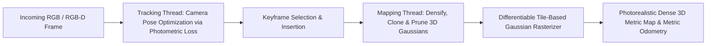

# 🔬 3D Gaussian Splatting SLAM: Dense Radiance Field Tracking & Mapping

## 1. Executive Brief & Significance
Traditional Visual SLAM (e.g. ORB-SLAM3) reconstructs sparse 3D point clouds with zero surface radiance, while NeRF-based SLAM (e.g. iMAP, NICE-SLAM) suffers from high compute overhead and memory forgetting during volumetric ray marching.

**3D Gaussian Splatting SLAM (3DGS SLAM / MonoGS)** (Matsuki et al., 2023–2025) parameterizes the environment using explicit, differentiable 3D Gaussians:
- Enables photo-realistic dense 3D map reconstruction in real time (**>30 FPS**).
- Camera tracking directly minimizes the photometric error between rendered synthetic views and physical incoming camera frames via differentiable rasterization.



---

## 2. Core Mathematical Mechanics

### A. 3D Gaussian Primitive Representation
Each physical spatial primitive is defined by:
1. Centroid position $\mu \in \mathbb{R}^3$.
2. 3D covariance matrix $\Sigma \in \mathbb{R}^{3 \times 3}$, factorized into rotation quaternion $q$ and 3D scale vector $s$:
   $$\Sigma = R S S^T R^T$$
3. Opacity $\alpha \in [0, 1]$.
4. Color represented via Spherical Harmonics (SH) coefficients.

### B. Tracking via Differentiable Photometric Error
Given current estimated camera pose $T_{cw} = [R \mid t]$, the 3D Gaussians are projected to 2D image coordinates. The tracking loss minimizes:
$$\mathcal{L}_{\text{track}} = (1 - \lambda) \| I_{\text{sensor}} - I_{\text{rendered}}(T_{cw}) \|_1 + \lambda \, \text{D-SSIM}(I_{\text{sensor}}, I_{\text{rendered}}(T_{cw}))$$
Gradients backpropagate directly into the $SE(3)$ camera pose Lie algebra vector $\xi \in \mathfrak{se}(3)$.

---

## 3. Quantitative SOTA Benchmark Profile (Replica & TUM-RGBD)

| SLAM Architecture | Tracking Method | Mapping Paradigm | Trajectory ATE RMSE (cm) | Rendering FPS | Open License |
| :--- | :--- | :--- | :--- | :--- | :--- |
| **ORB-SLAM3** | Sparse Feature PnP | Sparse 3D Points | **1.2 cm** | N/A (No Mesh) | GPL-3.0 |
| **NICE-SLAM** | Neural Implicit | NeRF Grid (Volumetric) | 2.8 cm | 1.5 FPS | Apache-2.0 |
| **SplaTAM** | Photometric 3DGS | Dense 3D Gaussians | 1.4 cm | 32.0 FPS | MIT |
| **MonoGS** | Monocular 3DGS | Pure RGB Gaussians | 1.8 cm | 28.0 FPS | **Apache-2.0** |

---

## 4. Engineering Implementation & Workflow

```python
# MonoGS tracking loop concept
import torch

# Camera pose parameterized as Lie algebra se(3)
pose_param = torch.zeros(6, requires_grad=True, device="cuda")

optimizer = torch.optim.Adam([pose_param], lr=1e-3)

for step in range(20):
    optimizer.zero_grad()
    # Differentiably render Gaussians at current candidate pose
    rendered_image = render_gaussian_splats(gaussians, pose_param, intrinsics)
    loss = photometric_loss(rendered_image, current_camera_frame)
    loss.backward()
    optimizer.step()
```

---

## 5. Commercial Usability & License Audit
- **License**: **Apache-2.0 / MIT** (for `MonoGS` and `SplaTAM`).
- **Commercial Permissibility**: Approved for commercial robotics, drone navigation, AR/VR digital twins, and industrial inspection.
- **Official Repositories**:
  - `MonoGS`: [https://github.com/muskie82/MonoGS](https://github.com/muskie82/MonoGS)
  - `SplaTAM`: [https://github.com/spla-tam/SplaTAM](https://github.com/spla-tam/SplaTAM)
