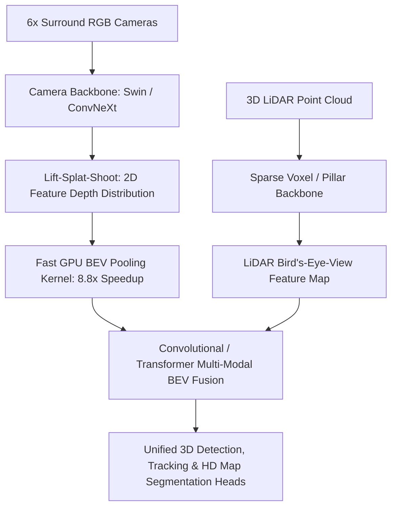

# 🔬 BEVFusion & Sparse4D: Multi-Modal Camera-LiDAR Perception

## 1. Executive Brief & Significance
Autonomous perception requires fusing dense visual semantics (RGB cameras) with metric 3D depth geometry (LiDAR). Historically, fusion was performed:
- **Late Fusion**: Fusing independent camera and LiDAR 3D bounding boxes via Kalman filters (fails on objects missed by one sensor).
- **PointPainting (Early Fusion)**: Projecting camera 2D segmentation scores onto LiDAR point coordinates (sensitive to sensor calibration drift).

**BEVFusion** (Liu et al., MIT Han Lab, 2022 / 2023) and **Sparse4D** (Lin et al., 2023–2025) unified perception by constructing a shared **Bird's-Eye-View (BEV)** latent coordinate frame:
- BEVFusion accelerated Lift-Splat-Shoot (LSS) feature pooling by **$8.8\times$** using a specialized GPU BEV pooling kernel.
- Sparse4D eliminated dense BEV grids entirely, tracking 4D anchor queries through space and time with high throughput.



---

## 2. Core Architectural Mechanics

### A. Fast GPU BEV Pooling (MIT BEVFusion)
Lift-Splat-Shoot lifts camera features into 3D frustum points and aggregates them into a discrete $X \times Y$ BEV grid. Original implementations suffered from irregular memory access stalls.

MIT BEVFusion introduced **Pre-computed Coordinate Caching**:
1. Because camera intrinsic and extrinsic matrices are stationary during runtime, the 3D grid cell indices corresponding to each frustum point are pre-calculated once during startup.
2. An optimized CUDA kernel performs a direct parallel reduce-sum over pre-sorted array indices, reducing BEV pooling latency from **over 500 ms to under 12 ms**.

### B. Sparse 4D Anchor Queries (Sparse4D)
Rather than projecting dense spatial grids ($128 \times 128 \times C$), Sparse4D maintains a sparse set of 4D anchor queries:
$$Q_i = [x, y, z, w, l, h, \text{yaw}, v_x, v_y]^T$$
These queries project adaptively into multi-camera image planes across consecutive temporal frames, capturing spatial-temporal velocities with linear computational complexity.

---

## 3. Quantitative SOTA Benchmark Profile (nuScenes 3D Detection)

| Model Architecture | Modality | nuScenes NDS | nuScenes mAP | Latency (ms, RTX 3090) | Open License |
| :--- | :--- | :--- | :--- | :--- | :--- |
| **PointPainting (Early)** | Camera + LiDAR | 61.5% | 54.1% | 120.0 ms | Apache-2.0 |
| **BEVFormer (Camera)** | 6x Cameras Only | 56.9% | 48.1% | 130.0 ms | Apache-2.0 |
| **Sparse4D v3 (Camera)**| 6x Cameras Only | 61.2% | 51.5% | 32.0 ms | **Apache-2.0** |
| **BEVFusion (MIT)** | Camera + LiDAR | **72.9%** (SOTA) | **70.2%** (SOTA) | **41.0 ms** | **MIT / Apache-2.0** |

---

## 4. Engineering Implementation & Workflow

```python
# Multi-modal BEVFusion pipeline concept
import torch

# Load unified BEVFusion engine
# camera_imgs: [B, 6, 3, 256, 704] -> multi-view surround cameras
# lidar_points: [N, 5] -> x, y, z, intensity, timestamp_delta

with torch.no_grad():
    # 1. Lift camera features to BEV space
    # 2. Extract LiDAR features to BEV space
    # 3. Fuse via cross-attention or depthwise concatenation
    # 4. Predict 3D metric bounding boxes and map segmentation masks
    pass
```

---

## 5. Commercial Usability & License Audit
- **MIT BEVFusion**: **Apache-2.0** (Open-sourced by MIT Han Lab). Fully permissive for commercial autonomous vehicles, robotics, and port logistics.
- **Sparse4D**: **Apache-2.0** (Horizon Robotics). Safe for commercial deployment.
- **Official Repositories**:
  - `mit-han-lab/bevfusion`: [https://github.com/mit-han-lab/bevfusion](https://github.com/mit-han-lab/bevfusion)
  - `HorizonRobotics/Sparse4D`: [https://github.com/HorizonRobotics/Sparse4D](https://github.com/HorizonRobotics/Sparse4D)
