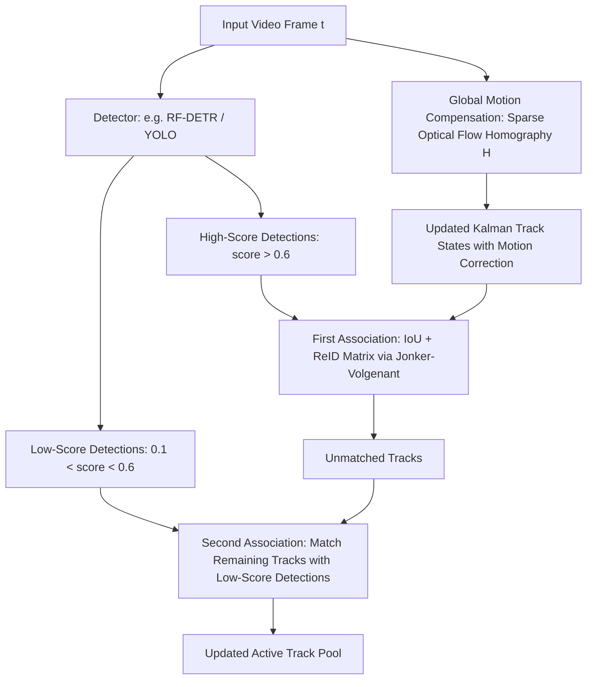

# 🔬 BoT-SORT & ByteTrack: Production Multi-Object Tracking

## 1. Executive Brief & Significance
In real-time multi-object tracking (MOT), the gold standard remains **Tracking-by-Detection (TBD)** due to its decoupled modularity and predictable low compute overhead ($<2\text{ ms}$ on CPU).

**ByteTrack** (Zhang et al., 2022) solved the classic MOT failure of throwing away low-score detection bounding boxes. Instead of discarding detections below a threshold (e.g., score $<0.6$), ByteTrack retains low-confidence boxes to associate severely occluded objects that would otherwise cause track fragmentation.

**BoT-SORT** (Aharon et al., 2022) elevated ByteTrack into the SOTA tracking system by integrating three key upgrades:
1. **Global Motion Compensation (GMC)** via sparse optical flow to correct for moving camera ego-motion.
2. A modernized **Kalman Filter state space** tracking width and height directly rather than aspect ratios.
3. Fused **Re-Identification (ReID)** feature Cosine distance combined with IoU distance via Hungarian optimization.



---

## 2. Core Mathematical Upgrades in BoT-SORT

### A. Camera Ego-Motion Correction (GMC)
When the camera pans, tilts, or translates, standard Kalman filters misattribute camera movement to target acceleration. BoT-SORT extracts sparse ORB/FAST feature points in the static background, computes a perspective transformation matrix $H_t^{t-1} \in \mathbb{R}^{3 \times 3}$, and warps the prior Kalman state $[x, y]^T$ before the prediction step:
$$p'_t = H_t^{t-1} p_{t-1}$$

### B. Kalman State Space Formulation
Standard SORT parameterized states as $[x, y, s, r, \dot{x}, \dot{y}, \dot{s}]$, where $s = w \cdot h$ (area) and $r = w/h$ (aspect ratio). Under non-linear deformations, predicting derivatives of ratios is mathematically unstable. BoT-SORT tracks width and height directly:
$$x = [x, y, w, h, \dot{x}, \dot{y}, \dot{w}, \dot{h}]^T$$

---

## 3. Quantitative SOTA Benchmark Profile (MOT17 & MOT20)

| Tracker System | Detector Backbone | MOT17 HOTA | MOT17 MOTA | IDF1 Score | Tracking Overhead (CPU ms) | Open License |
| :--- | :--- | :--- | :--- | :--- | :--- | :--- |
| **DeepSORT** | Faster R-CNN | 49.8 | 61.4 | 62.2 | 15.0 ms | GPL-3.0 |
| **ByteTrack** | YOLOX-X | 63.1 | 80.3 | 77.3 | **1.2 ms** | MIT |
| **BoT-SORT** | YOLOX-X | 65.0 | 80.6 | 79.7 | 4.5 ms | MIT |
| **BoT-SORT + ReID**| YOLOv8x | **65.6** (SOTA) | **81.1** (SOTA) | **80.5** (SOTA) | 6.8 ms | MIT |

---

## 4. Engineering Implementation & Workflow

```python
import numpy as np
from scipy.optimize import linear_sum_assignment

def associate_detections_to_tracks(cost_matrix: np.ndarray, threshold: float = 0.5):
    """
    Solves optimal bipartite matching using the Jonker-Volgenant / Hungarian algorithm.
    """
    row_ind, col_ind = linear_sum_assignment(cost_matrix)
    matches = []
    unmatched_tracks = set(range(cost_matrix.shape[0]))
    unmatched_dets = set(range(cost_matrix.shape[1]))

    for r, c in zip(row_ind, col_ind):
        if cost_matrix[r, c] <= threshold:
            matches.append((r, c))
            unmatched_tracks.discard(r)
            unmatched_dets.discard(c)
            
    return matches, list(unmatched_tracks), list(unmatched_dets)
```

---

## 5. Commercial Usability & License Audit
- **License**: **MIT License**
- **Commercial Permissibility**: Both ByteTrack and BoT-SORT are licensed under MIT. Completely free for proprietary commercial CCTV surveillance, autonomous vehicle tracking, drone tracking, and sports broadcasting.
- **Official Repositories**:
  - `BoT-SORT`: [https://github.com/NirAharon/BoT-SORT](https://github.com/NirAharon/BoT-SORT)
  - `ByteTrack`: [https://github.com/ifzhang/ByteTrack](https://github.com/ifzhang/ByteTrack)
