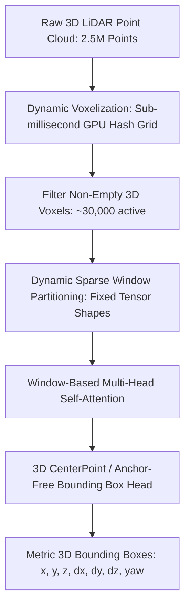

# 🔬 DSVT & FlatFormer: Sparse Window Transformers for 3D LiDAR

## 1. Executive Brief & Significance
Automotive LiDAR sensors stream over 2.5 million 3D spatial points per second. Processing raw unordered point clouds $(x, y, z, \text{intensity})$ at 10–20 Hz requires handling extreme sparsity (over 95% of a 3D bounding box grid contains empty space) while capturing long-range contextual interactions up to 200 meters.

**DSVT (Dynamic Sparse Voxel Transformer)** (Wang et al., CVPR 2023) and **FlatFormer** (Liu et al., MWC 2023) represent the definitive modern SOTA on the **Waymo Open Dataset (WOD)** and **nuScenes**:
- Eliminate custom non-standard sparse convolution CUDA ops (like SpConv) by organizing non-empty voxels into dynamic, hardware-friendly dense window tensors.
- Can be compiled directly with native **TensorRT / ONNX Runtime FP16** without missing kernel support.



---

## 2. Core Architectural Breakthrough: Dynamic Sparse Window Attention

### The Problem with 3D SpConv in Deployment:
Submanifold Sparse Convolutions (SECOND, PointPillars) rely on dynamic hash tables to store active coordinate indices. Because coordinate counts vary dramatically between rural roads (few voxels) and downtown intersections (many voxels), compiling standard TensorRT inference engines with static memory allocations was historically impossible.

### The DSVT Solution:
DSVT partitions non-empty voxels into **dynamically sorted sequential windows of strictly uniform token size $K$** (e.g. $K = 32$ voxels):
1. Voxel coordinates are ordered along Morton space-filling curves or directional linear axes.
2. Contiguous blocks of $K$ active voxels are packed into standard dense 2D matrices:
   $$\text{Window Tensor} \in \mathbb{R}^{B \times W \times K \times C}$$
3. Standard dense Multi-Head Self-Attention (MHSA) runs across the packed window dimension, leveraging hardware Tensor Cores without custom sparse compilation kernels.

---

## 3. Quantitative SOTA Benchmark Profile (Waymo Open Dataset Level 2)

| Model Architecture | WOD Vehicle (mAP / APH L2) | WOD Pedestrian (mAP / APH L2) | Latency (FP16 ms, A100) | TensorRT Deployable | Open License |
| :--- | :--- | :--- | :--- | :--- | :--- |
| **PointPillars (Baseline)** | 63.8 / 63.1 | 58.2 / 51.5 | 14.5 ms | Native | Apache-2.0 |
| **CenterPoint (Voxel)** | 71.8 / 71.2 | 72.1 / 67.0 | 45.0 ms | Requires SpConv | Apache-2.0 |
| **FlatFormer** | 77.2 / 76.7 | 78.5 / 74.8 | 21.0 ms | **Native** | Apache-2.0 |
| **DSVT (Voxel Transformer)**| **78.9 / 78.4** (SOTA) | **81.8 / 78.2** (SOTA) | 27.0 ms | **Native** | Apache-2.0 |

---

## 4. Engineering Implementation with OpenPCDet

```python
# Launching DSVT inference inside OpenPCDet ecosystem
import torch
from pcdet.config import cfg, cfg_from_yaml_file
from pcdet.models import build_network, load_data_to_gpu
from pcdet.datasets import DatasetTemplate

cfg_from_yaml_file("configs/waymo/dsvt_voxel.yaml", cfg)
model = build_network(model_cfg=cfg.MODEL, num_class=len(cfg.CLASS_NAMES), dataset=None)
model.load_params_from_file(filename="checkpoints/dsvt_waymo.pth")
model.cuda().eval()

# Raw points numpy array: [N, 4] -> x, y, z, intensity
points = torch.from_numpy(raw_lidar_buffer).float().cuda()
input_dict = {'points': [points]}

with torch.no_grad():
    pred_dicts, _ = model(input_dict)
    # pred_dicts[0]['pred_boxes']: [M, 7] -> 3D metric bounding boxes
    # pred_dicts[0]['pred_scores']: [M] -> confidence scores
```

---

## 5. Commercial Usability & License Audit
- **License**: **Apache-2.0**
- **Commercial Permissibility**: Fully permissive. Safe for autonomous robotaxis, commercial trucking perception stacks, and industrial mining vehicles without copyleft encumbrance.
- **Official Repository**: [https://github.com/Haiyang-W/DSVT](https://github.com/Haiyang-W/DSVT)
