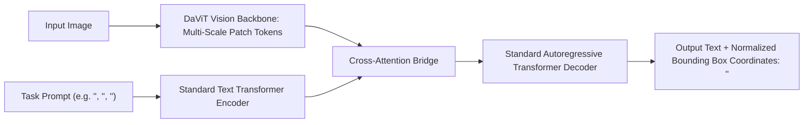

# 🌐 Florence-2: Unified Sequence-to-Sequence Vision Foundation Model

Florence-2 is Microsoft's compact foundation model that unifies diverse computer vision perception tasks—including captioning, 2D object detection, OCR text reading, visual grounding, and polygonal region segmentation—into a single **sequence-to-sequence language formulation** powered by the massive **FLD-5B** dataset.

Related notes: [[topics/object-detection/00-object-detection-moc|Object Detection MOC]], [[topics/object-segmentation/00-object-segmentation-moc|Object Segmentation MOC]].

---

## 1. The Unified Seq2Seq Formulation

### Discrete Spatial Coordinate Quantization
Instead of using complex task-specific heads (Anchor heads, FPNs, RPNs, or Mask decoders), Florence-2 discretizes spatial image coordinates into $1000$ discrete coordinate bins:
$$\text{Coordinates } (x, y) \in [0, 1000] \implies \text{Tokens } \langle \text{loc\_}x \rangle, \langle \text{loc\_}y \rangle$$
A bounding box is generated simply by predicting 4 discrete text tokens:
$$\langle \text{loc\_}x_1 \rangle \langle \text{loc\_}y_1 \rangle \langle \text{loc\_}x_2 \rangle \langle \text{loc\_}y_2 \rangle$$

---

## 2. Model Scale & Edge Efficiency

Unlike massive multi-billion parameter VLMs, Florence-2 was engineered specifically for edge execution:

| Variant | Parameters | Vision Backbone | Text Seq2Seq | Inference Latency (A100) | Inference Latency (Jetson Orin) |
| :--- | :--- | :--- | :--- | :--- | :--- |
| **Florence-2-Base** | **0.23B (232M)** | DaViT-Base | Custom Transformer | **18 ms** | **45 ms** |
| **Florence-2-Large** | **0.77B (771M)** | DaViT-Large | Custom Transformer | **32 ms** | **85 ms** |

---

## 3. Production Deployment & ONNX / TensorRT Execution

- **Single Model Multi-Task Serving**: Instead of deploying 4 separate networks (YOLO for detection, Segment Anything for segmentation, PaddleOCR for text, and ResNet for classification), a single Florence-2-Base engine handles all four tasks.
- **ONNX Runtime Web & Mobile**: Because the model has only 232M parameters, it can be exported directly to ONNX FP16 and deployed in browser environments via WebGPU or on mobile smartphones via ExecuTorch.

---

## 4. Official Repositories & Resources
- **Hugging Face Model**: [microsoft/Florence-2-large](https://huggingface.co/microsoft/Florence-2-large)
- **License**: MIT (Fully open for commercial use)
