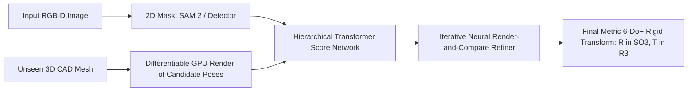

# 🔬 FoundationPose & MegaPose: Foundation Models for 6-DoF Pose Estimation

## 1. Executive Brief & Significance
Estimating the 6-Degrees-of-Freedom (6-DoF: 3D translation $X, Y, Z$ and 3D rotation roll, pitch, yaw) of arbitrary objects in cluttered scenes is essential for robotic grasping, pick-and-place, and augmented reality.

Historically, models were trained for a single specific object class (e.g. PVNet, DenseFusion) or required days of instance retraining for every new object.

**FoundationPose** (Wen et al., NVIDIA Research, CVPR 2024 Best Paper Nominee) and **MegaPose** (Labbé et al., 2022) represent a paradigm shift to **zero-shot 6-DoF pose estimation**:
- Given only a raw RGB-D image and an untextured 3D CAD model mesh, FoundationPose estimates the full 6-DoF pose instantly without any fine-tuning or prior training on that specific object.
- Achieves real-time object tracking at **32 ms latency ($\sim 31$ FPS)**.



---

## 2. Core Mathematical Upgrades: Disentangled 6-DoF Representation

### The Problem with Quaternions and Euler Angles:
Euler angles suffer from gimbal lock, while 4D unit quaternions $q$ suffer from antipodal ambiguity ($q$ and $-q$ represent the identical physical rotation), causing gradient conflicts during neural network optimization.

### 6D Continuous Rotation Representation (Zhou et al.):
FoundationPose and modern 6-DoF networks predict a continuous 6D rotation vector:
$$R_{6D} = [a_1, a_2] \in \mathbb{R}^6$$
The orthonormal 3D rotation matrix $R = [r_1, r_2, r_3] \in SO(3)$ is reconstructed through continuous Gram-Schmidt orthogonalization:
$$r_1 = \frac{a_1}{\|a_1\|_2}, \quad r_2 = \frac{a_2 - (r_1 \cdot a_2)r_1}{\|a_2 - (r_1 \cdot a_2)r_1\|_2}, \quad r_3 = r_1 \times r_2$$
This mapping is globally continuous and free from topological discontinuities.

---

## 3. Quantitative SOTA Benchmark Profile (BOP Challenge: YCB-V & Linemod)

| Model Architecture | Paradigm | YCB-V (ADD-S AUC) | Linemod-Occluded (ADD-0.1d) | Latency (ms) | Commercial Open License |
| :--- | :--- | :--- | :--- | :--- | :--- |
| **PVNet (Classic)** | Per-Object Instance | 72.8% | 40.8% | 80.0 ms | Apache-2.0 |
| **GDR-Net** | Per-Object Direct | 91.6% | 62.2% | 45.0 ms | Apache-2.0 |
| **MegaPose** | Zero-Shot CAD-based | 88.5% | 71.0% | 150.0 ms | **Apache-2.0** |
| **FoundationPose** | Zero-Shot Foundation | **96.2%** (SOTA) | **89.5%** (SOTA) | **32.0 ms** | ⚠️ Non-Commercial (NVIDIA) |

---

## 4. Engineering Implementation & Workflow

```python
# FoundationPose inference pipeline concept
import numpy as np
import trimesh

# Load CAD mesh (.ply or .obj)
mesh = trimesh.load("cad_models/industrial_gear.ply")

# Camera intrinsic matrix K (fx, fy, cx, cy)
K = np.array([[615.0, 0.0, 320.0],
              [0.0, 615.0, 240.0],
              [0.0, 0.0, 1.0]], dtype=np.float32)

# FoundationPose tracks object pose iteratively at 30 FPS using render-and-compare:
# pose: 4x4 homogenous transformation matrix [R | T]
#                                            [0 | 1]
```

---

## 5. Commercial Usability & License Audit
- **MegaPose**: **Apache-2.0** (Completely permissive; recommended for closed-source commercial robotics and warehouse pick-and-place automation).
- **FoundationPose**: **NVIDIA Source Code License (Non-Commercial)**. Strictly prohibited for commercial sale or revenue-generating services without an explicit enterprise license from NVIDIA.
- **Official Repositories**:
  - `MegaPose`: [https://github.com/facebookresearch/megapose](https://github.com/facebookresearch/megapose)
  - `FoundationPose`: [https://github.com/NVlabs/FoundationPose](https://github.com/NVlabs/FoundationPose)
