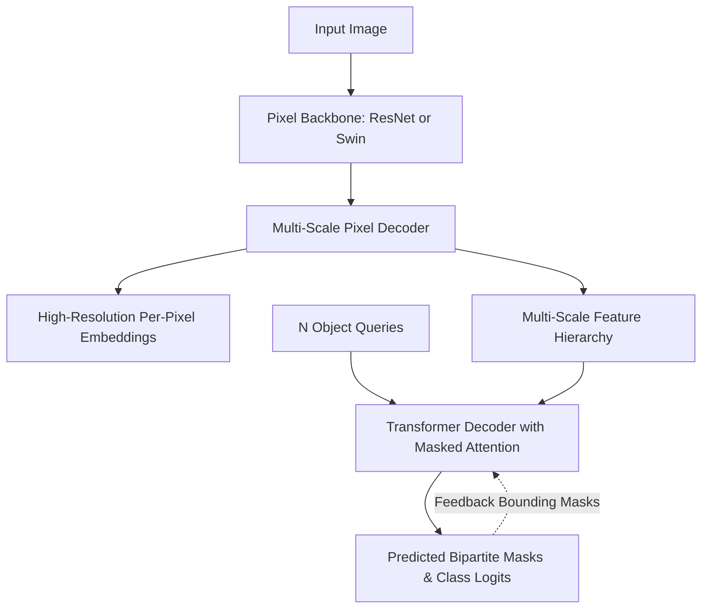

# 🔬 Mask2Former: Universal Image Segmentation

## 1. Executive Brief & Significance
Prior to **Mask2Former** (Cheng et al., Meta / UIUC, 2022 / 2023), Computer Vision fragmented segmentation into three isolated tasks requiring specialized architectures:
1. *Semantic Segmentation* used per-pixel FCN/U-Net classification.
2. *Instance Segmentation* used proposal-based RoIAlign (Mask R-CNN).
3. *Panoptic Segmentation* glued together two separate heads with complex fusion heuristics.

Mask2Former unified all three paradigms into a single, elegant formulation using **Masked-Attention Queries**, outperforming specialized models on all three tasks simultaneously.



---

## 2. Core Architectural Mechanics: Masked Cross-Attention

Standard Transformer cross-attention allows each query to attend to all pixels in the feature map ($H \times W$):
$$\text{Attention}(Q, K, V) = \text{softmax}\left(\frac{QK^T}{\sqrt{d}}\right)V$$
On high-resolution images, this results in slow convergence because queries spend hundreds of training iterations learning where the object is located.

### The Masked Attention Innovation:
Mask2Former constrains cross-attention to the **foreground region** predicted by the query in the preceding decoder layer:
$$\text{MaskedAttention}(Q, K, V) = \text{softmax}\left(\frac{QK^T}{\sqrt{d}} + \mathcal{M}\right)V$$
Where the attention mask $\mathcal{M}$ is defined as:
$$\mathcal{M}(x, y) = \begin{cases} 0 & \text{if } (x, y) \text{ is inside the binarized predicted mask} \\ -\infty & \text{otherwise} \end{cases}$$
- By zeroing out attention outside the object's localized boundaries, queries focus exclusively on fine contours, speeding up training convergence by 3x and achieving state-of-the-art boundary accuracy.

---

## 3. Quantitative SOTA Benchmark Profile

| Task | Benchmark Dataset | Metric | Score | Latency (A100 FP16) | Backbone |
| :--- | :--- | :--- | :--- | :--- | :--- |
| **Panoptic Segmentation** | COCO 2017 Panoptic | PQ (Panoptic Quality) | 58.3% | 185 ms | Swin-L |
| **Instance Segmentation** | COCO 2017 Instance | AP (Mask) | 50.1% | 185 ms | Swin-L |
| **Semantic Segmentation** | ADE20K Validation | mIoU | 57.7% | 185 ms | Swin-L |
| **Panoptic Segmentation** | Cityscapes Panoptic | PQ | 66.6% | 120 ms | ResNet-50 |

---

## 4. Engineering Implementation & Workflow

```python
# Minimal inference with Detectron2 / Mask2Former
from detectron2.config import get_cfg
from detectron2.engine import DefaultPredictor
from detectron2.projects.deeplab import add_deeplab_config
from mask2former import add_maskformer2_config
import cv2

cfg = get_cfg()
add_deeplab_config(cfg)
add_maskformer2_config(cfg)
cfg.merge_from_file("configs/coco/panoptic-segmentation/swin/maskformer2_swin_large_IN21k_384_bs16_100ep.yaml")
cfg.MODEL.WEIGHTS = "model_final.pkl"

predictor = DefaultPredictor(cfg)
im = cv2.imread("urban_street.jpg")
outputs = predictor(im)

# Unified panoptic output: {'panoptic_seg': (panoptic_img, segments_info)}
panoptic_seg, segments_info = outputs["panoptic_seg"]
```

---

## 5. Commercial Usability & License Audit
- **License**: **Apache-2.0**
- **Commercial Permissibility**: Fully permissive for commercial SaaS, medical image diagnostic tools, and robotic mapping systems.
- **Production Trade-off**: High VRAM and latency (~120–185 ms) make it unsuitable for high-speed 60 FPS edge robotics, but ideal for offline mapping, surveying, and gold-standard dataset annotation.
- **Official Repository**: [https://github.com/facebookresearch/Mask2Former](https://github.com/facebookresearch/Mask2Former)
