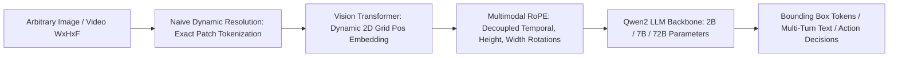

# 👁️ Qwen2-VL: Dynamic Resolution Vision-Language Foundation Model

Qwen2-VL is a multimodal foundation model featuring **Native Dynamic Resolution** and **Multimodal Rotary Position Embedding (M-RoPE)**, enabling native aspect-ratio processing, 20+ minute long-form video reasoning, and fine-grained visual coordinate grounding.

Related notes: [[topics/visual-guidance-and-robotics/00-visual-guidance-and-robotics-moc|Visual Guidance & Robotics MOC]], [[topics/object-detection/03-backends-and-open-problems|Object Detection Backends]].

---

## 1. Architectural Breakthroughs

### 1. Naive Dynamic Resolution
Standard VLMs (LLaVA, CLIP) forcibly resize or crop images to fixed squares ($224\times 224$ or $448\times 448$). Qwen2-VL processes images at their **native pixel resolution**:
- Any input image is mapped to a variable number of visual tokens determined directly by its aspect ratio:
  $$N_{\text{tokens}} = \left\lceil \frac{H}{14} \right\rceil \times \left\lceil \frac{W}{14} \right\rceil \times \frac{1}{4}$$
- Fine-grained text documents (DocVQA) and high-resolution industrial defects are read directly without bilinear blur artifacts.

### 2. Multimodal Rotary Position Embedding (M-RoPE)
Standard 1D RoPE scrambles multidimensional spatial coordinates. M-RoPE factorizes the rotary position matrix into three independent components:
$$R_{\text{M-RoPE}}(t, h, w) = R_t \oplus R_h \oplus R_w$$
This gives the attention mechanism an explicit awareness of 3D spatio-temporal geometry across long video sequences.

---

## 2. Benchmark Comparisons

| Benchmark Domain | Task | GPT-4o (Omni) | Claude 3.5 Sonnet | Qwen2-VL-7B (Open) | Qwen2-VL-72B (Open) |
| :--- | :--- | :--- | :--- | :--- | :--- |
| **DocVQA** | Document Understanding | 92.8% | 95.2% | **94.5%** | **96.5%** |
| **MathVista** | Visual Mathematical Reasoning | 63.8% | 67.7% | **58.2%** | **70.5%** |
| **Video-MME** | Long-form Video Understanding | 71.9% | 71.0% | **69.0%** | **77.2%** |
| **RefCOCOg** | Visual Grounding (Bounding Box AP) | 86.5% | 88.1% | **88.2%** | **91.4%** |

---

## 3. Production Deployment & vLLM / SGLang Integration

- **Dynamic Token Management**: Because batch elements produce variable visual token counts, standard static batching causes extreme padding waste. Deploy Qwen2-VL using **PagedAttention** engines (vLLM $\ge 0.6.0$ or SGLang) with continuous chunked prefill.
- **AWQ / FP8 Quantization**: The 72B parameter variant requires $\sim 144\text{ GB}$ VRAM in FP16 (two A100-80GB GPUs). Utilizing **FP8 W8A8** quantization compresses the footprint to $76\text{ GB}$, allowing deployment on a single 80GB GPU node.

---

## 4. Official Repositories & Resources
- **Official Model & Weights**: [Qwen/Qwen2-VL-7B-Instruct](https://huggingface.co/Qwen/Qwen2-VL-7B-Instruct)
- **Codebase**: [QwenLM/Qwen2-VL](https://github.com/QwenLM/Qwen2-VL)
- **License**: Apache-2.0 (Commercial permissive)
