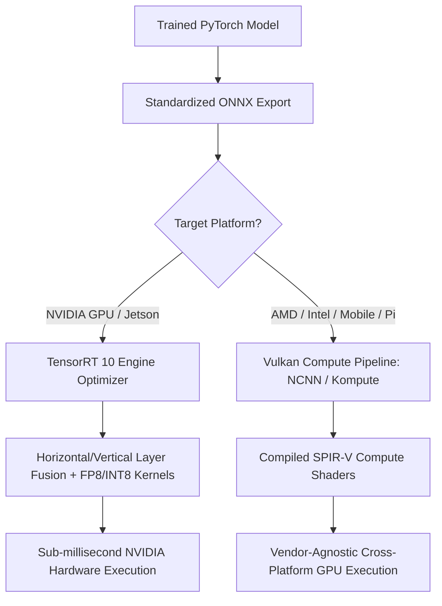

# 🔬 TensorRT 10 & Vulkan Kompute: State-of-the-Art GPU Inference Runtimes

## 1. Executive Brief & Significance
Deploying deep vision networks onto modern GPUs requires maximizing arithmetic intensity and saturating specialized hardware matrix units (NVIDIA Tensor Cores, AMD Matrix Cores, Apple Neural Engine, and Qualcomm Adreno GPUs).

In production, two complementary runtimes dominate:
- **NVIDIA TensorRT 10 / 10.x**: The definitive gold-standard compiler for NVIDIA architectures (Ada Lovelace, Hopper, Blackwell, Jetson Orin). Integrates **FP8 quantization**, **FlashAttention-2/3** kernel fusion, and CUDA Graph execution.
- **Vulkan Kompute & NCNN**: Cross-platform, vendor-agnostic GPU computing using Vulkan compute shaders. Delivers hardware-accelerated deep learning on AMD GPUs, Intel Arc, Raspberry Pi 5 VideoCore, and ARM Mali mobile phones without proprietary driver lock-in.



---

## 2. Core Architectural Mechanics: TensorRT Kernel Optimization

### A. Graph Optimization & Kernel Fusion
TensorRT transforms an unoptimized computation graph by performing:
1. **Vertical Fusion**: Merging sequential operations (e.g. `Conv + Bias + BatchNorm + ReLU`) into a single fused GPU kernel call, eliminating high-latency global memory round-trips.
2. **Horizontal Fusion**: Combining identical operations that share inputs (e.g. Multi-Head Attention linear projection heads $W_q, W_k, W_v$) into a single batched kernel.

### B. FP8 Floating-Point Format (E4M3 vs. E5M2)
TensorRT 10 leverages Ada Lovelace and Hopper 8-bit floating-point (FP8) Tensor Cores:
- **E4M3 (1 sign, 4 exponent, 3 mantissa)**: Optimized for forward inference activation maps where numerical range is bounded but precision is critical.
- Yields **$2\times$ throughput** over FP16 with negligible accuracy degradation ($<0.2\%$ drop), bypassing complex INT8 calibration.

---

## 3. Quantitative SOTA Benchmark Profile (Inference Latency)

| Model Architecture | Input Resolution | PyTorch FP32 (RTX 4090) | TensorRT FP16 (RTX 4090) | TensorRT FP8 (RTX 4090) | Vulkan NCNN (Mobile) |
| :--- | :--- | :--- | :--- | :--- | :--- |
| **ResNet-50** | $3 \times 224 \times 224$ | 2.80 ms | 0.45 ms | **0.25 ms** | 4.80 ms |
| **YOLOv8x** | $3 \times 640 \times 640$ | 18.50 ms | 5.10 ms | **3.10 ms** | 42.0 ms |
| **DINOv2-Base (ViT)** | $3 \times 224 \times 224$ | 24.00 ms | 6.80 ms | **3.80 ms** | 68.0 ms |
| **RF-DETR (Large)** | $3 \times 640 \times 640$ | 32.00 ms | 8.20 ms | **4.90 ms** | 85.0 ms |

---

## 4. Engineering Implementation: Compiling Engines with `trtexec`

```bash
# Compile ONNX model to optimized TensorRT 10 Engine with FP16 and CUDA Graphs
trtexec --onnx=model.onnx \
        --saveEngine=model.engine \
        --fp16 \
        --optShapes=input:1x3x640x640 \
        --minShapes=input:1x3x640x640 \
        --maxShapes=input:8x3x640x640 \
        --builderOptimizationLevel=5 \
        --useCudaGraph
```

---

## 5. Commercial Usability & License Audit
- **TensorRT**: The Open Source Software (OSS) components are licensed under **Apache-2.0**. The binary runtime drivers are governed by the **NVIDIA TensorRT Software License Agreement** (free for commercial software distribution on NVIDIA hardware).
- **Vulkan / NCNN**: **BSD-3-Clause** / **Apache-2.0**. Free for all commercial systems.
- **Official Repositories**:
  - `NVIDIA/TensorRT`: [https://github.com/NVIDIA/TensorRT](https://github.com/NVIDIA/TensorRT)
  - `Tencent/ncnn`: [https://github.com/Tencent/ncnn](https://github.com/Tencent/ncnn)
