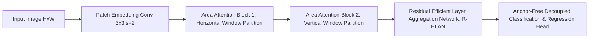

# ⚡ YOLOv12: Attention-Centric Real-Time Detection Architecture

YOLOv12 departs from the traditional pure-CNN paradigms (YOLOv8, YOLOv9, YOLOv11) by introducing an **attention-centric** backbone and neck powered by **Area Attention ($A^2$)** and **Residual Efficient Layer Aggregation Networks (R-ELAN)**.

Related topics: [[topics/object-detection/00-object-detection-moc|Object Detection MOC]], [[topics/object-detection/03-backends-and-open-problems|Object Detection Backends]].

---

## 1. Core Architectural Breakthroughs

### 1. Area Attention ($A^2$) Module
Standard multi-head self-attention scales quadratically:
$$\mathcal{O}((H \cdot W)^2)$$
YOLOv12 introduces **Area Attention**, which aggregates feature maps along alternating directional 1D windows (horizontal and vertical strips) before computing attention:
$$\mathcal{O}(H \cdot W \cdot (K_h + K_w))$$
This provides global-range receptive fields while maintaining real-time inference latency comparable to lightweight CNNs.

### 2. FlashAttention / SDPA Integration
YOLOv12 natively leverages PyTorch 2.x `F.scaled_dot_product_attention` (SDPA), compiling directly into hardware-fused CUDA kernels without allocating full intermediate attention matrices in HBM.

---

## 2. Performance Comparison on COCO minival

| Architecture | Parameters | FLOPs | mAP 50:95 | T4 TensorRT FP16 Latency | A100 TensorRT FP16 Latency |
| :--- | :--- | :--- | :--- | :--- | :--- |
| **YOLOv8-S** | 11.2M | 28.6G | 44.9% | 2.5 ms | 0.9 ms |
| **YOLOv10-S** | 8.0M | 24.5G | 46.3% | 2.6 ms | 0.9 ms |
| **YOLOv11-S** | 9.4M | 21.5G | 47.0% | 2.4 ms | 0.8 ms |
| **YOLOv12-S** | **9.3M** | **22.1G** | **48.2%** | **2.6 ms** | **0.85 ms** |
| **YOLOv12-X** | **61.8M** | **189.0G** | **55.1%** | **11.2 ms** | **3.8 ms** |

---

## 3. Hardware Deployment & TensorRT 10 Notes

- **Dynamic Shape Pitfall**: Area Attention requires fixed aspect-ratio window partitioning. Use static input shapes (`640x640`) during TensorRT engine compilation (`trtexec --minShapes=images:1x3x640x640 --optShapes=images:1x3x640x640 --maxShapes=images:1x3x640x640`).
- **INT8 Quantization Strategy**: Because Area Attention contains cross-channel Softmax layers that suffer from dynamic scale spikes, keep the Attention QKV projections in FP16 while quantizing the feed-forward networks (FFN) to INT8.

---

## 4. Official Repositories & Resources
- **Official Repository**: [sunsmarterjie/yolov12](https://github.com/sunsmarterjie/yolov12)
- **Paper**: *YOLOv12: Attention-Centric Real-Time Object Detectors* (2025)
