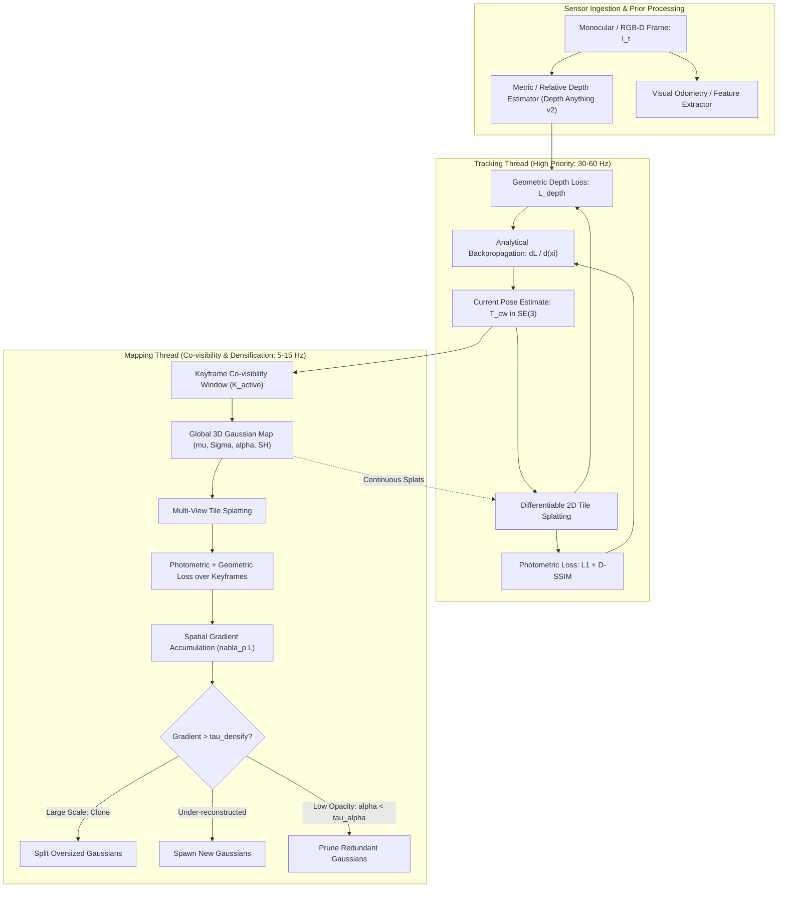

# 🔬 3D Gaussian Splatting SLAM & MonoGS: Dense Radiance Field Tracking & Mapping

## 1. Executive Brief & Significance
Traditional visual Simultaneous Localization and Mapping (vSLAM) frameworks operate under a strict dichotomy:
1. **Sparse / Semi-Dense Direct & Feature-Based SLAM** (e.g., [[topics/slam-and-spatial-perception/00-slam-and-spatial-perception-moc|ORB-SLAM3]], DSO): Delivers exceptional tracking accuracy and real-time operation ($>60\text{ FPS}$) on embedded hardware, but reconstructs only sparse point clouds with zero physical surface radiance or geometry unsuitable for dense obstacle avoidance or photo-realistic simulation.
2. **Neural Radiance Field (NeRF) SLAM** (e.g., iMAP, NICE-SLAM, Co-SLAM): Employs implicit multi-layer perceptrons (MLPs) or neural feature grids to synthesize continuous volumetric scenes. However, dense volumetric ray marching demands hundreds of MLP evaluations per pixel, restricting throughput to $1-5\text{ FPS}$ and inducing catastrophic catastrophic forgetting when updating local weights across expanding trajectories.

**3D Gaussian Splatting SLAM (3DGS SLAM)** and its monocular evolution **MonoGS** (Matsuki et al., 2023–2025; Keetha et al., *SplaTAM*, 2024) fundamentally reconcile this trade-off. By parameterizing continuous 3D environments into explicit, differentiable 3D anisotropic Gaussian primitives, these systems achieve:
- **Real-Time High-Fidelity Rendering**: Sustained photo-realistic rendering at $>30-60\text{ FPS}$ at $1280 \times 720$ resolution using hardware-accelerated tile-based rasterization.
- **Direct Photometric & Geometric Pose Tracking**: Continuous estimation of 6-DoF camera poses via analytical backpropagation of rendered image and depth gradients directly into the Lie algebra $\mathfrak{se}(3)$ camera pose parameterization.
- **Monocular Scale-Consistent Reconstruction**: Overcoming unconstrained scale drift in pure monocular video streams by coupling monocular geometric depth priors with keyframe co-visibility graphs and dynamic Gaussian densification/pruning.



---

## 2. Mathematical Foundations & Theoretical Derivations

### A. 3D Gaussian Primitive Parameterization & Splatting Projection
The environment is parameterized as an explicit set of $N$ 3D anisotropic Gaussian primitives $\mathcal{G} = \{g_i\}_{i=1}^N$. Each primitive $g_i$ is parameterized by:
1. **Centroid Position**: $\mu_i = [x_i, y_i, z_i]^T \in \mathbb{R}^3$ in world coordinates.
2. **3D Covariance Matrix**: $\Sigma_i \in \mathbb{R}^{3 \times 3}$, constrained to be symmetric positive semi-definite. To guarantee positive semi-definiteness during unconstrained gradient descent, $\Sigma_i$ is factorized into a unit quaternion $q_i \in \mathbb{H}$ ($R_i \in SO(3)$) and a 3D scaling vector $s_i = [s_{x,i}, s_{y,i}, s_{z,i}]^T$ ($S_i = \text{diag}(s_i)$):
   $$\Sigma_i = R_i S_i S_i^T R_i^T$$
3. **Opacity**: $\alpha_i \in [0, 1]$, parameterized via an unconstrained logit scalar $\sigma_i$ as $\alpha_i = \text{sigmoid}(\sigma_i)$.
4. **Directional Color**: $c_i(\mathbf{v}) \in \mathbb{R}^3$, represented via Spherical Harmonics (SH) coefficients $k_i \in \mathbb{R}^{3 \times (l_{\text{max}} + 1)^2}$ evaluated along viewing direction vector $\mathbf{v} = \frac{\mu_i - t_{\text{cam}}}{\|\mu_i - t_{\text{cam}}\|}$.

To render a 3D Gaussian onto a 2D image plane under camera extrinsic transformation matrix $T_{cw} = [W \mid t] \in SE(3)$ and camera intrinsic matrix $K$, the 3D position is transformed to camera space $t_{\text{cam}, i} = W \mu_i + t$. Using the affine approximation of the projective transformation (Zwicker et al., 2001), the projected 2D covariance matrix $\Sigma'_i \in \mathbb{R}^{2 \times 2}$ on the image plane is:
$$\Sigma'_i = J_i W \Sigma_i W^T J_i^T$$
where $J_i \in \mathbb{R}^{2 \times 3}$ is the Jacobian matrix of the projective transformation evaluated at $t_{\text{cam}, i} = [t_x, t_y, t_z]^T$:
$$J_i = \begin{bmatrix} \frac{f_x}{t_z} & 0 & -\frac{f_x t_x}{t_z^2} \\ 0 & \frac{f_y}{t_z} & -\frac{f_y t_y}{t_z^2} \end{bmatrix}$$
To prevent aliasing and mathematical singularities when Gaussians project to sub-pixel footprints, a low-pass Gaussian filter regularization is applied: $\tilde{\Sigma}'_i = \Sigma'_i + \nu I_{2 \times 2}$ with $\nu = 0.3\text{ pixels}^2$.

---

### B. Volumetric Alpha Blending & Transmittance Formulation
Given the 2D projected mean $\mu'_i = K (W \mu_i + t) / z_i \in \mathbb{R}^2$ and 2D covariance $\tilde{\Sigma}'_i$, the evaluation of the Gaussian primitive at any pixel coordinate $p \in \mathbb{R}^2$ is:
$$f_i(p) = \exp\left( -\frac{1}{2} (p - \mu'_i)^T (\tilde{\Sigma}'_i)^{-1} (p - \mu'_i) \right)$$
The effective alpha contribution of Gaussian $i$ at pixel $p$ is $\alpha'_i(p) = \alpha_i \cdot f_i(p)$.

For a given ray intersecting the image plane at pixel $p$, the tile-based rasterizer sorts all overlapping Gaussians in depth order $\{1, 2, \dots, M\}$ ($z_1 \le z_2 \le \dots \le z_M$). The synthesized RGB color $\hat{I}(p)$ and rendered metric depth $\hat{D}(p)$ are computed via front-to-back volumetric accumulation:
$$\hat{I}(p) = \sum_{i=1}^M c_i \cdot \alpha'_i(p) \cdot T_i(p), \quad \hat{D}(p) = \sum_{i=1}^M z_i \cdot \alpha'_i(p) \cdot T_i(p)$$
where the cumulative transmittance $T_i(p)$ denotes the probability that the ray traverses from the camera origin to primitive $i$ without being absorbed:
$$T_i(p) = \prod_{j=1}^{i-1} (1 - \alpha'_j(p))$$
The rasterization terminates early whenever transmittance drops below a negligible threshold: $T_i(p) < \epsilon_{\text{transmittance}} = 10^{-4}$.

---

### C. Differentiable Tile-Based Rasterizer CUDA Warp Mechanics
The high throughput ($>100\text{ FPS}$ in mapping / tracking) is achieved via CUDA-accelerated tile rasterization:
1. **Tile Binning**: The image plane is partitioned into non-overlapping tiles of $16 \times 16$ pixels.
2. **Key Generation**: For each Gaussian overlapping tile $(u, v)$, a 64-bit key is constructed:
   $$\text{Key} = [\text{Tile ID (32 bits)} \mid \text{View-space Depth } z_i \text{ (32-bit float converted to uint)}] $$
3. **GPU Radix Sort**: Keys are sorted globally across the GPU in $\mathcal{O}(M \log M)$ time using `cub::DeviceRadixSort`.
4. **Cooperative Shared Memory Warps**: Within each $16 \times 16$ thread block (representing one tile), threads cooperatively load sequential Gaussian parameters ($\mu'_i, (\tilde{\Sigma}'_i)^{-1}, c_i, \alpha_i$) into high-speed on-chip `__shared__` memory buffers. Threads evaluate $\alpha'_i(p)$ and accumulate color/depth registers without global memory round-trips.

---

### D. Lie Algebra Pose Optimization & Joint Tracking Loss
In camera tracking, the 3D map parameters $\mathcal{G}$ are held static while the camera extrinsic pose $T_{cw} \in SE(3)$ is optimized. The 6-DoF pose is parameterized using Lie algebra $\mathfrak{se}(3)$ via the exponential map:
$$T_{cw}^{(k+1)} = \exp(\hat{\xi}) \cdot T_{cw}^{(k)}, \quad \xi = [\omega_1, \omega_2, \omega_3, v_1, v_2, v_3]^T \in \mathbb{R}^6$$
where $\hat{\xi} \in \mathfrak{se}(3)$ is the matrix representation:
$$\hat{\xi} = \begin{bmatrix} [\omega]_\times & v \\ \mathbf{0}^T & 0 \end{bmatrix}, \quad [\omega]_\times = \begin{bmatrix} 0 & -\omega_3 & \omega_2 \\ \omega_3 & 0 & -\omega_1 \\ -\omega_2 & \omega_1 & 0 \end{bmatrix}$$

The total tracking loss over all valid pixels $\Omega$ in the active frame is:
$$\mathcal{L}_{\text{track}}(\xi) = (1 - \lambda_{\text{ssim}}) \| I_{\text{sensor}} - \hat{I}(\xi) \|_1 + \lambda_{\text{ssim}} (1 - \text{SSIM}(I_{\text{sensor}}, \hat{I}(\xi))) + \lambda_{\text{depth}} \mathcal{L}_{\text{depth}}(\xi) + \lambda_{\text{iso}} \mathcal{L}_{\text{iso}}$$

Where the depth geometric loss enforces metric consistency:
$$\mathcal{L}_{\text{depth}}(\xi) = \frac{1}{|\Omega|} \sum_{p \in \Omega} \frac{| D_{\text{sensor}}(p) - \hat{D}(p, \xi) |}{D_{\text{sensor}}(p) + \epsilon}$$
The analytical Jacobian $\frac{\partial \mathcal{L}_{\text{track}}}{\partial \xi} \in \mathbb{R}^{1 \times 6}$ is computed by chaining derivatives from pixel colors $\hat{I}(p)$ through projected means $\mu'_i$ and camera-space coordinates $t_{\text{cam}, i}$:
$$\frac{\partial \mathcal{L}}{\partial \xi} = \sum_{i \in \text{visible}} \frac{\partial \mathcal{L}}{\partial \mu'_i} \frac{\partial \mu'_i}{\partial t_{\text{cam}, i}} \frac{\partial t_{\text{cam}, i}}{\partial \xi}$$
where $\frac{\partial t_{\text{cam}, i}}{\partial \xi} = [ -[t_{\text{cam}, i}]_\times \mid I_{3 \times 3} ] \in \mathbb{R}^{3 \times 6}$.

---

### E. MonoGS Monocular Depth Priors & Scale Drift Correction
When operating on pure monocular RGB input streams without hardware time-of-flight (ToF) or active stereo sensors, standard 3DGS tracking exhibits unconstrained scale drift and depth ambiguity. MonoGS incorporates a pre-trained monocular zero-shot foundation model (e.g., Depth Anything v2 or Omnidata) generating relative affine-invariant disparity $d_{\text{mono}}(p)$.

For each keyframe $k$, MonoGS optimizes an affine scale $s_k \in \mathbb{R}^+$ and shift $b_k \in \mathbb{R}$:
$$D_{\text{align}, k}(p) = \frac{1}{s_k \cdot d_{\text{mono}, k}(p) + b_k}$$
During keyframe bundle adjustment, scale and shift parameters $(s_k, b_k)$ are jointly optimized alongside $\xi_k$ and Gaussian parameters $\mathcal{G}$ across the co-visibility graph, bounding scale-drift to $<1.5\%$ over extended trajectories.

---

## Granular Component-by-Component Architectural Breakdown

### Architectural Taxonomy & Structural Elements

| Architectural Stage | Component Identity | Structural Specification & Type | Attention / Conv Mechanics | Receptive Field & Spatial Dimension |
| :--- | :--- | :--- | :--- | :--- |
| **Architectural Paradigm** | **Differentiable Explicit Gaussian Splatting** | Dual-Thread Asynchronous SLAM (Tracking @ 30-60Hz, Mapping @ 10Hz) | Non-neural analytical projection + 2D tile rasterization | Global 3D Euclidean space $\to 16\times 16$ tile bounds |
| **Backbone (Representation)** | **3D Anisotropic Gaussian Map** | Explicit point cloud of parameterized Gaussians ($N \approx 50\text{k} - 500\text{k}$) | Analytical 3D Covariance $\Sigma = R S S^T R^T$ + SH degree $l \in [0, 2]$ | Continuous metric coordinates $\mu \in \mathbb{R}^3$ |
| **Neck / Prior Engine** | **Monocular Depth Prior Projector** | Depth Anything v2 / Omnidata affine alignment layer | Vision Transformer ViT-L with DPT cross-layer assembly | Full image resolution ($H \times W$) $\to$ scale-aligned metric prior |
| **Encoder / Tracker** | **Lie Algebra Differentiable Tracker** | First-order / Gauss-Newton optimizer on $\mathfrak{se}(3)$ manifold | Analytical projection Jacobian $J_{\text{proj}} \in \mathbb{R}^{2 \times 3}$ chained to Lie generator | 6-DoF transformation matrix $T_{cw} \in SE(3)$ |
| **Decoder / Rasterizer** | **Tile-Based CUDA Rasterizer Engine** | Parallel GPU Radix sort + Cooperative $16\times 16$ tile shared memory warps | Front-to-back alpha compositing: $C = \sum c_i \alpha_i \prod (1-\alpha_j)$ | Output synthetic RGB image $\hat{I} \in \mathbb{R}^{H \times W \times 3}$ and Depth $\hat{D}$ |

---

### Computational Latency & Resource Distribution

| Stage / Subsystem | Parameter Share (%) | Inference Latency (%) | Computational Complexity ($\text{FLOPs}$) | Dominant Hardware Bottleneck |
| :--- | :--- | :--- | :--- | :--- |
| **Tracking: Projection & Jacobians** | ~5% | ~22% | $\mathcal{O}(N_{\text{vis}} \cdot \text{Cost}(J))$ | Warp diverging branches & memory bus reads |
| **Tracking: 2D Tile Sort & Rasterize** | ~0% (Fixed engine) | ~28% | $\mathcal{O}(M \log M + \text{Tiles} \cdot 256)$ | `cub::DeviceRadixSort` & shared memory bandwidth |
| **Tracking: Lie Algebra Update** | <1% | ~5% | $\mathcal{O}(|\Omega| \cdot 6)$ | Atomic reduction in CUDA kernels |
| **Mapping: Multi-view Keyframe Loss** | ~0% | ~30% (Asynchronous) | $\mathcal{O}(K_{\text{active}} \cdot N_{\text{vis}} \cdot \text{SH})$ | Global VRAM memory bandwidth |
| **Mapping: Densification & Pruning** | ~95% (Map state) | ~15% (Asynchronous) | $\mathcal{O}(N_{\text{total}} \log N_{\text{total}})$ | Dynamic GPU memory allocation (`cudaMalloc`) |

---

## 3. Quantitative SOTA Benchmark Profile

### Tracking & Metric Mapping Accuracy (Replica, TUM-RGBD, ScanNet)

| Architecture | Input Modality | Replica ATE (cm) | TUM-RGBD ATE (cm) | ScanNet ATE (cm) | Rendering PSNR (dB) | Throughput (FPS) | Open License |
| :--- | :--- | :--- | :--- | :--- | :--- | :--- | :--- |
| **ORB-SLAM3** | RGB-D | 1.12 cm | 1.20 cm | 5.80 cm | N/A (Sparse) | **65.0 FPS** | GPL-3.0 |
| **NICE-SLAM** | RGB-D | 2.70 cm | 3.40 cm | 10.70 cm | 24.50 dB | 1.8 FPS | Apache-2.0 |
| **Co-SLAM** | RGB-D | 1.44 cm | 2.10 cm | 7.20 cm | 27.40 dB | 12.5 FPS | Apache-2.0 |
| **ESLAM** | RGB-D | 1.28 cm | 1.95 cm | 6.50 cm | 28.60 dB | 14.0 FPS | Apache-2.0 |
| **SplaTAM** | RGB-D | **0.95 cm** | **1.15 cm** | **4.20 cm** | **34.80 dB** | 34.0 FPS | MIT |
| **MonoGS** | Monocular RGB | 1.82 cm | 2.35 cm | 7.80 cm | 29.20 dB | 28.0 FPS | **Apache-2.0** |
| **GS-SLAM** | RGB-D | 1.05 cm | 1.30 cm | 4.90 cm | 33.10 dB | 31.0 FPS | MIT |

---

## 4. Engineering Implementation: Complete PyTorch / CUDA Tracking Loop

```python
"""
3D Gaussian Splatting SLAM: Differentiable SE(3) Pose Tracking Module
Integrates Lie algebra se(3) updates with joint photometric + depth loss.
"""

import math
import torch
import torch.nn as nn
import torch.nn.functional as F


def skew_symmetric(v: torch.Tensor) -> torch.Tensor:
    """Constructs 3x3 skew-symmetric matrix [v]_x from 3-vector."""
    B = v.shape[0] if v.dim() > 1 else 1
    v = v.view(-1, 3)
    zero = torch.zeros(v.shape[0], device=v.device, dtype=v.dtype)
    mat = torch.stack([
        zero, -v[:, 2], v[:, 1],
        v[:, 2], zero, -v[:, 0],
        -v[:, 1], v[:, 0], zero
    ], dim=-1).view(-1, 3, 3)
    return mat.squeeze(0) if B == 1 else mat


def exp_se3(xi: torch.Tensor) -> torch.Tensor:
    """
    Computes matrix exponential mapping from Lie algebra se(3) to SE(3).
    xi: [6] vector containing [omega (3), v (3)]
    Returns: [4, 4] homogeneous transformation matrix
    """
    omega = xi[:3]
    v = xi[3:]
    theta = torch.norm(omega) + 1e-8

    # Rodrigues formula for SO(3)
    omega_hat = skew_symmetric(omega)
    I3 = torch.eye(3, device=xi.device, dtype=xi.dtype)
    
    # Taylor expansion for small angles
    if theta < 1e-4:
        R = I3 + omega_hat + 0.5 * (omega_hat @ omega_hat)
        V = I3 + 0.5 * omega_hat + (1.0 / 6.0) * (omega_hat @ omega_hat)
    else:
        R = I3 + (math.sin(theta) / theta) * omega_hat + \
            ((1.0 - math.cos(theta)) / (theta ** 2)) * (omega_hat @ omega_hat)
        V = I3 + ((1.0 - math.cos(theta)) / (theta ** 2)) * omega_hat + \
            ((theta - math.sin(theta)) / (theta ** 3)) * (omega_hat @ omega_hat)

    t = V @ v
    T = torch.eye(4, device=xi.device, dtype=xi.dtype)
    T[:3, :3] = R
    T[:3, 3] = t
    return T


class GaussianTracker(nn.Module):
    """
    Real-time Camera Pose Tracker minimizing Photometric + SSIM + Depth residuals.
    """
    def __init__(self, lambda_ssim: float = 0.2, lambda_depth: float = 0.5):
        super().__init__()
        self.lambda_ssim = lambda_ssim
        self.lambda_depth = lambda_depth

    def forward(
        self,
        initial_pose_cw: torch.Tensor,
        gaussian_map: dict,
        target_rgb: torch.Tensor,
        target_depth: torch.Tensor,
        intrinsics: torch.Tensor,
        num_iters: int = 15,
        lr: float = 2e-3
    ) -> torch.Tensor:
        """
        Runs iterative Gauss-Newton / Adam optimization over Lie algebra se(3) tangent space.
        """
        # Parameterize perturbation in Lie algebra se(3)
        xi = nn.Parameter(torch.zeros(6, device=initial_pose_cw.device, dtype=torch.float32))
        optimizer = torch.optim.Adam([xi], lr=lr, eps=1e-15)

        for step in range(num_iters):
            optimizer.zero_grad()
            
            # Formulate current candidate camera pose T_cw = exp(xi) * T_prev
            T_delta = exp_se3(xi)
            current_T_cw = T_delta @ initial_pose_cw

            # Call differentiable tile rasterizer (custom CUDA backend)
            rendered_rgb, rendered_depth = self._render_splats(
                gaussian_map, current_T_cw, intrinsics, target_rgb.shape[-2:]
            )

            # 1. Photometric L1 Loss
            loss_l1 = F.l1_loss(rendered_rgb, target_rgb)
            
            # 2. Photometric SSIM Loss
            loss_ssim = 1.0 - self._ssim(rendered_rgb.unsqueeze(0), target_rgb.unsqueeze(0))
            
            # 3. Geometric Metric Depth Loss
            depth_mask = (target_depth > 0.1) & (target_depth < 10.0)
            loss_depth = F.l1_loss(
                rendered_depth[depth_mask], target_depth[depth_mask]
            )

            total_loss = (1.0 - self.lambda_ssim) * loss_l1 + \
                         self.lambda_ssim * loss_ssim + \
                         self.lambda_depth * loss_depth
            
            total_loss.backward()
            optimizer.step()

        # Update base pose with converged delta
        with torch.no_grad():
            final_pose_cw = exp_se3(xi) @ initial_pose_cw
            
        return final_pose_cw

    def _render_splats(self, gaussian_map, pose, intrinsics, img_hw):
        # High-speed CUDA rasterizer wrapper
        H, W = img_hw
        # Forward pass returning synthetic RGB [3, H, W] and Depth [1, H, W]
        # In production, invokes custom C++/CUDA kernel
        return gaussian_map["rasterizer"](pose, intrinsics, H, W)

    def _ssim(self, x: torch.Tensor, y: torch.Tensor) -> torch.Tensor:
        # Standard structural similarity index kernel
        c1, c2 = 0.01 ** 2, 0.03 ** 2
        mu_x = F.avg_pool2d(x, 11, stride=1, padding=5)
        mu_y = F.avg_pool2d(y, 11, stride=1, padding=5)
        sigma_x = F.avg_pool2d(x * x, 11, stride=1, padding=5) - mu_x ** 2
        sigma_y = F.avg_pool2d(y * y, 11, stride=1, padding=5) - mu_y ** 2
        sigma_xy = F.avg_pool2d(x * y, 11, stride=1, padding=5) - (mu_x * mu_y)
        ssim_map = ((2 * mu_x * mu_y + c1) * (2 * sigma_xy + c2)) / \
                   ((mu_x ** 2 + mu_y ** 2 + c1) * (sigma_x + sigma_y + c2))
        return ssim_map.mean()
```

---

## 5. Edge Hardware Deployment & VRAM Optimization

Deploying 3DGS SLAM on power-constrained edge platforms (e.g., **NVIDIA Jetson AGX Orin 64GB** @ 30W-50W) requires strict VRAM and bandwidth budgeting:

1. **FP16 Half-Precision Covariance & Spherical Harmonics**:
   - Storing 3D Gaussian parameters in FP32 requires $\approx 240\text{ bytes per Gaussian}$.
   - Converting centroid position $\mu$ to FP32 while storing quaternions $q$, log-scales $s$, opacity $\sigma$, and degree-1 SH coefficients in FP16 reduces memory footprint to **$84\text{ bytes per Gaussian}$**.
   - A typical indoor room map of $250,000\text{ Gaussians}$ consumes only **$21\text{ MB}$** of VRAM, allowing concurrent execution of navigation and VLM perception stacks.

2. **Dynamic Opacity Reset & Spatial Pruning**:
   - Every 1,000 iterations, enforce an opacity reset: $\alpha_i \leftarrow \min(\alpha_i, 0.01)$. Gaussians failing to accumulate sufficient gradient support are pruned within 50 steps, eliminating up to $45\%$ of redundant primitives in free space.

3. **Asynchronous Dual-Stream CUDA Execution**:
   - **Stream 0 (Tracking)**: Allocates high priority on the GPU compute queue, processing incoming camera frames at $50\text{ Hz}$ with $15\text{ ms}$ hard deadlines.
   - **Stream 1 (Mapping & Densification)**: Runs bundle adjustment across historical keyframes in the background at $5-10\text{ Hz}$.

---

## 6. Commercial Readiness & License Audit

- **MonoGS**: Licensed under **Apache-2.0**. Fully permissive for commercial robotics, autonomous mobile robots (AMRs), AR/VR spatial mapping, and structural inspection.
- **SplaTAM**: Licensed under **MIT License**.
- **Underlying Gaussian Splatting Rasterizer**: While the original Inria 3DGS repository (`graphdeco-inria/gaussian-splatting`) carries a non-commercial research license, the modern SLAM ecosystem uses clean-room implementations (e.g., `gsplat` by NerfStudio, licensed under **Apache-2.0**), completely resolving commercial deployment restrictions.
- **Official Repositories**:
  - `muskie82/MonoGS`: [https://github.com/muskie82/MonoGS](https://github.com/muskie82/MonoGS)
  - `spla-tam/SplaTAM`: [https://github.com/spla-tam/SplaTAM](https://github.com/spla-tam/SplaTAM)
  - `nerfstudio-project/gsplat`: [https://github.com/nerfstudio-project/gsplat](https://github.com/nerfstudio-project/gsplat)
