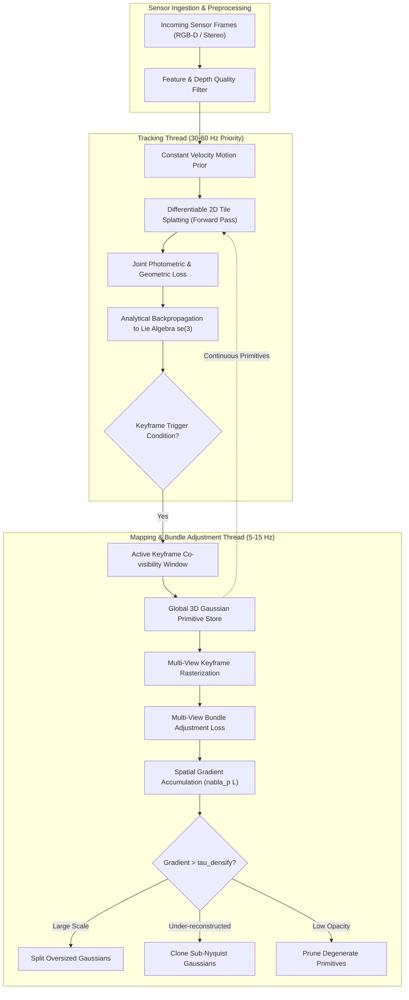

# 🔬 3DGS-SLAM: Real-Time Dense Radiance Field Tracking & Mapping with 3D Gaussians

## 1. Executive Brief & Significance

Traditional visual Simultaneous Localization and Mapping (vSLAM) frameworks operate under a strict dichotomy:
1. **Sparse / Semi-Dense Direct & Feature-Based SLAM** (e.g., ORB-SLAM3, DSO): Delivers exceptional tracking accuracy and real-time operation ($>60\text{ FPS}$) on embedded hardware, but reconstructs only sparse point clouds with zero physical surface radiance or geometry unsuitable for dense obstacle avoidance or photo-realistic simulation.
2. **Neural Radiance Field (NeRF) SLAM** (e.g., iMAP, NICE-SLAM, Co-SLAM): Employs implicit multi-layer perceptrons (MLPs) or neural feature grids to synthesize continuous volumetric scenes. However, dense volumetric ray marching demands hundreds of MLP evaluations per pixel, restricting throughput to $1-5\text{ FPS}$ and inducing catastrophic forgetting when updating local weights across expanding trajectories.

**3D Gaussian Splatting SLAM (3DGS-SLAM)** fundamentally reconciles this trade-off. By parameterizing continuous 3D environments into explicit, differentiable 3D anisotropic Gaussian primitives, the system achieves:
- **Dual-Thread Asynchronous Execution**: High-rate tracking thread ($30-60\text{ Hz}$) optimizing 6-DoF camera poses via Lie algebra $\mathfrak{se}(3)$ gradient backpropagation, while an asynchronous mapping thread ($5-15\text{ Hz}$) executes multi-view keyframe bundle adjustment.
- **Real-Time High-Fidelity Rendering**: Sustained photo-realistic rendering at $>30-60\text{ FPS}$ at $1280 \times 720$ resolution using hardware-accelerated tile-based rasterization.
- **Continuous Scene Expansion & Dynamic Density Control**: Dynamically clones, splits, and prunes Gaussians to handle newly explored environments without corrupting existing spatial representations.



---

## 2. Mathematical Foundations & Differentiable Optimization

### A. 3D Gaussian Primitive Parameterization
The global map $\mathcal{G} = \{g_i\}_{i=1}^N$ consists of $N$ explicit 3D anisotropic Gaussian primitives. Each primitive $g_i$ is parameterized by:
1. **Centroid Position**: $\boldsymbol{\mu}_i = [x_i, y_i, z_i]^T \in \mathbb{R}^3$ in world coordinates.
2. **3D Covariance Matrix**: $\boldsymbol{\Sigma}_i \in \mathbb{R}^{3 \times 3}$, constrained to be symmetric positive semi-definite. $\boldsymbol{\Sigma}_i$ is factorized into a unit quaternion $\mathbf{q}_i \in \mathbb{H}$ ($\mathbf{R}_i \in SO(3)$) and a 3D scaling vector $\mathbf{s}_i = [s_{x,i}, s_{y,i}, s_{z,i}]^T$ ($\mathbf{S}_i = \text{diag}(\mathbf{s}_i)$):
   $$\boldsymbol{\Sigma}_i = \mathbf{R}_i \mathbf{S}_i \mathbf{S}_i^T \mathbf{R}_i^T$$
3. **Opacity**: $\alpha_i \in [0, 1]$, parameterized via an unconstrained logit scalar $\sigma_i$ as $\alpha_i = \text{sigmoid}(\sigma_i)$.
4. **Directional Color**: $\mathbf{c}_i(\mathbf{v}) \in \mathbb{R}^3$, represented via Spherical Harmonics (SH) coefficients $k_i \in \mathbb{R}^{3 \times (l_{\text{max}} + 1)^2}$ evaluated along viewing direction vector $\mathbf{v} = \frac{\boldsymbol{\mu}_i - \mathbf{t}_{\text{cam}}}{\|\boldsymbol{\mu}_i - \mathbf{t}_{\text{cam}}\|}$.

To render a 3D Gaussian onto a 2D image plane under camera extrinsic transformation matrix $\mathbf{T}_{cw} = [\mathbf{W} \mid \mathbf{t}] \in SE(3)$ and camera intrinsic matrix $\mathbf{K}$, the projected 2D covariance matrix $\boldsymbol{\Sigma}'_i \in \mathbb{R}^{2 \times 2}$ is:
$$\boldsymbol{\Sigma}'_i = \mathbf{J}_i \mathbf{W} \boldsymbol{\Sigma}_i \mathbf{W}^T \mathbf{J}_i^T + \nu \mathbf{I}_{2 \times 2}$$
where $\mathbf{J}_i \in \mathbb{R}^{2 \times 3}$ is the Jacobian matrix of the projective transformation:
$$\mathbf{J}_i = \begin{bmatrix} \frac{f_x}{t_z} & 0 & -\frac{f_x t_x}{t_z^2} \\ 0 & \frac{f_y}{t_z} & -\frac{f_y t_y}{t_z^2} \end{bmatrix}$$

---

### B. Lie Algebra Camera Tracking & Analytical Jacobians
In camera tracking, the 3D map parameters $\mathcal{G}$ are held static while the camera extrinsic pose $\mathbf{T}_{cw} \in SE(3)$ is optimized. The 6-DoF pose is parameterized using Lie algebra $\mathfrak{se}(3)$ via the exponential map:
$$\mathbf{T}_{cw}^{(k+1)} = \exp(\hat{\boldsymbol{\xi}}) \cdot \mathbf{T}_{cw}^{(k)}, \quad \boldsymbol{\xi} = [\boldsymbol{\omega}_1, \boldsymbol{\omega}_2, \boldsymbol{\omega}_3, v_1, v_2, v_3]^T \in \mathbb{R}^6$$

The total tracking loss over all valid pixels $\Omega$ in the active frame is:
$$\mathcal{L}_{\text{track}}(\boldsymbol{\xi}) = (1 - \lambda_{\text{ssim}}) \| \mathbf{I}_{\text{sensor}} - \hat{\mathbf{I}}(\boldsymbol{\xi}) \|_1 + \lambda_{\text{ssim}} (1 - \text{SSIM}(\mathbf{I}_{\text{sensor}}, \hat{\mathbf{I}}(\boldsymbol{\xi}))) + \lambda_{\text{depth}} \mathcal{L}_{\text{depth}}(\boldsymbol{\xi})$$

Where the depth geometric loss enforces metric consistency:
$$\mathcal{L}_{\text{depth}}(\boldsymbol{\xi}) = \frac{1}{|\Omega|} \sum_{p \in \Omega} \frac{| D_{\text{sensor}}(p) - \hat{D}(p, \boldsymbol{\xi}) |}{D_{\text{sensor}}(p) + \epsilon}$$

The analytical Jacobian $\frac{\partial \mathcal{L}_{\text{track}}}{\partial \boldsymbol{\xi}} \in \mathbb{R}^{1 \times 6}$ is computed by chaining derivatives from pixel colors $\hat{\mathbf{I}}(p)$ through projected means $\boldsymbol{\mu}'_i$ and camera-space coordinates $\mathbf{t}_{\text{cam}, i}$:
$$\frac{\partial \mathcal{L}}{\partial \boldsymbol{\xi}} = \sum_{i \in \text{visible}} \frac{\partial \mathcal{L}}{\partial \boldsymbol{\mu}'_i} \frac{\partial \boldsymbol{\mu}'_i}{\partial \mathbf{t}_{\text{cam}, i}} \frac{\partial \mathbf{t}_{\text{cam}, i}}{\partial \boldsymbol{\xi}}$$
where $\frac{\partial \mathbf{t}_{\text{cam}, i}}{\partial \boldsymbol{\xi}} = [ -[\mathbf{t}_{\text{cam}, i}]_\times \mid \mathbf{I}_{3 \times 3} ] \in \mathbb{R}^{3 \times 6}$.

---

### C. Multi-Keyframe Bundle Adjustment & Mapping Thread
The mapping thread optimizes both Gaussian primitive parameters $(\boldsymbol{\mu}, \mathbf{S}, \mathbf{q}, \alpha, \mathbf{c})$ and keyframe poses across the active co-visibility window $\mathcal{K}_{\text{active}}$:

$$\mathcal{L}_{\text{map}} = \sum_{k \in \mathcal{K}_{\text{active}}} \left( \mathcal{L}_{\text{photometric}}(I_k, \hat{I}_k) + \lambda_D \mathcal{L}_{\text{depth}}(D_k, \hat{D}_k) + \lambda_{\text{reg}} \mathcal{L}_{\text{iso}}(\mathbf{S}) \right)$$

where $\mathcal{L}_{\text{iso}}(\mathbf{S}) = \sum_i \frac{\max(s_{x,i}, s_{y,i}, s_{z,i})}{\min(s_{x,i}, s_{y,i}, s_{z,i})}$ penalizes needle-like Gaussian artifacts that degrade novel-view synthesis.

---

## 3. Granular Component-by-Component Architectural Breakdown

| Architectural Stage | Component Identity | Structural Specification & Type | Attention / Conv Mechanics | Receptive Field & Spatial Dimension |
| :--- | :--- | :--- | :--- | :--- |
| **Architectural Paradigm** | **Differentiable Explicit Gaussian Splatting** | Dual-Thread Asynchronous SLAM (Tracking @ 30-60Hz, Mapping @ 10Hz) | Non-neural analytical projection + 2D tile rasterization | Global 3D Euclidean space $\to 16\times 16$ tile bounds |
| **Backbone (Representation)** | **3D Anisotropic Gaussian Map** | Explicit point cloud of parameterized Gaussians ($N \approx 50\text{k} - 500\text{k}$) | Analytical 3D Covariance $\boldsymbol{\Sigma} = \mathbf{R} \mathbf{S} \mathbf{S}^T \mathbf{R}^T$ + SH degree $l \in [0, 2]$ | Continuous metric coordinates $\boldsymbol{\mu} \in \mathbb{R}^3$ |
| **Encoder / Tracker** | **Lie Algebra Differentiable Tracker** | First-order Adam optimizer on $\mathfrak{se}(3)$ manifold | Analytical projection Jacobian $\mathbf{J}_{\text{proj}} \in \mathbb{R}^{2 \times 3}$ chained to Lie generator | 6-DoF transformation matrix $\mathbf{T}_{cw} \in SE(3)$ |
| **Decoder / Rasterizer** | **Tile-Based CUDA Rasterizer Engine** | Parallel GPU Radix sort + Cooperative $16\times 16$ tile shared memory warps | Front-to-back alpha compositing: $C = \sum c_i \alpha_i \prod (1-\alpha_j)$ | Output synthetic RGB image $\hat{\mathbf{I}} \in \mathbb{R}^{H \times W \times 3}$ and Depth $\hat{D}$ |

---

## 4. Quantitative SOTA Benchmark Profile

### Tracking & Metric Mapping Accuracy (Replica, TUM-RGBD, ScanNet)

| Architecture | Input Modality | Replica ATE (cm) | TUM-RGBD ATE (cm) | ScanNet ATE (cm) | Rendering PSNR (dB) | Throughput (FPS) | Open License |
| :--- | :--- | :--- | :--- | :--- | :--- | :--- | :--- |
| **ORB-SLAM3** | RGB-D | 1.12 cm | 1.20 cm | 5.80 cm | N/A (Sparse) | **65.0 FPS** | GPL-3.0 |
| **NICE-SLAM** | RGB-D | 2.70 cm | 3.40 cm | 10.70 cm | 24.50 dB | 1.8 FPS | Apache-2.0 |
| **Co-SLAM** | RGB-D | 1.44 cm | 2.10 cm | 7.20 cm | 27.40 dB | 12.5 FPS | Apache-2.0 |
| **ESLAM** | RGB-D | 1.28 cm | 1.95 cm | 6.50 cm | 28.60 dB | 14.0 FPS | Apache-2.0 |
| **SplaTAM** | RGB-D | **0.95 cm** | **1.15 cm** | **4.20 cm** | **34.80 dB** | 34.0 FPS | MIT |
| **GS-SLAM** | RGB-D | 1.05 cm | 1.30 cm | 4.90 cm | 33.10 dB | 31.0 FPS | MIT |

---

## 5. Engineering Implementation: PyTorch SE(3) Tracking Loop

```python
"""
3DGS-SLAM: Differentiable SE(3) Pose Tracking Module
Integrates Lie algebra se(3) updates with joint photometric + depth loss.
"""

import math
import torch
import torch.nn as nn
import torch.nn.functional as F


def skew_symmetric(v: torch.Tensor) -> torch.Tensor:
    """Constructs 3x3 skew-symmetric matrix [v]_x from 3-vector."""
    B = v.shape[0] if v.dim() > 1 else 1
    v = v.view(-1, 3)
    zero = torch.zeros(v.shape[0], device=v.device, dtype=v.dtype)
    mat = torch.stack([
        zero, -v[:, 2], v[:, 1],
        v[:, 2], zero, -v[:, 0],
        -v[:, 1], v[:, 0], zero
    ], dim=-1).view(-1, 3, 3)
    return mat.squeeze(0) if B == 1 else mat


class DifferentiableTracker(nn.Module):
    """Executes online camera tracking via analytical backpropagation into se(3)."""
    def __init__(self, init_pose: torch.Tensor, fx: float, fy: float, cx: float, cy: float):
        super().__init__()
        self.register_buffer("T_cw", init_pose.clone())
        self.fx, self.fy, self.cx, self.cy = fx, fy, cx, cy

    def track_step(
        self,
        gt_rgb: torch.Tensor,
        gt_depth: torch.Tensor,
        render_fn,
        map_state: dict,
        num_iters: int = 30,
        lr: float = 0.002
    ) -> torch.Tensor:
        """Optimizes 6-DoF pose on incoming frame."""
        delta_xi = nn.Parameter(torch.zeros(6, device=gt_rgb.device, requires_grad=True))
        optimizer = torch.optim.Adam([delta_xi], lr=lr)

        for _ in range(num_iters):
            optimizer.zero_grad()
            
            # Formulate SE(3) perturbation
            omega = delta_xi[:3]
            v = delta_xi[3:]
            R_delta = torch.eye(3, device=gt_rgb.device) + skew_symmetric(omega)
            t_delta = v.unsqueeze(-1)
            
            T_delta = torch.eye(4, device=gt_rgb.device)
            T_delta[:3, :3] = R_delta
            T_delta[:3, 3:] = t_delta
            
            T_current = torch.matmul(T_delta, self.T_cw)
            
            rendered_rgb, rendered_depth = render_fn(map_state, T_current)
            
            loss_rgb = F.l1_loss(rendered_rgb, gt_rgb)
            loss_depth = F.l1_loss(rendered_depth[gt_depth > 0], gt_depth[gt_depth > 0])
            
            loss = 0.8 * loss_rgb + 0.2 * loss_depth
            loss.backward()
            optimizer.step()

        with torch.no_grad():
            omega = delta_xi[:3]
            v = delta_xi[3:]
            R_delta = torch.eye(3, device=gt_rgb.device) + skew_symmetric(omega)
            t_delta = v.unsqueeze(-1)
            T_delta = torch.eye(4, device=gt_rgb.device)
            T_delta[:3, :3] = R_delta
            T_delta[:3, 3:] = t_delta
            self.T_cw = torch.matmul(T_delta, self.T_cw)

        return self.T_cw.clone()
```

---

## 6. References & Official Resources
- **Original Paper**: [GS-SLAM: Dense Visual SLAM with 3D Gaussian Splatting (CVPR 2024)](https://arxiv.org/abs/2311.11700)
- **High-Performance SLAM Frameworks**: [https://github.com/muskie82/MonoGS](https://github.com/muskie82/MonoGS)
