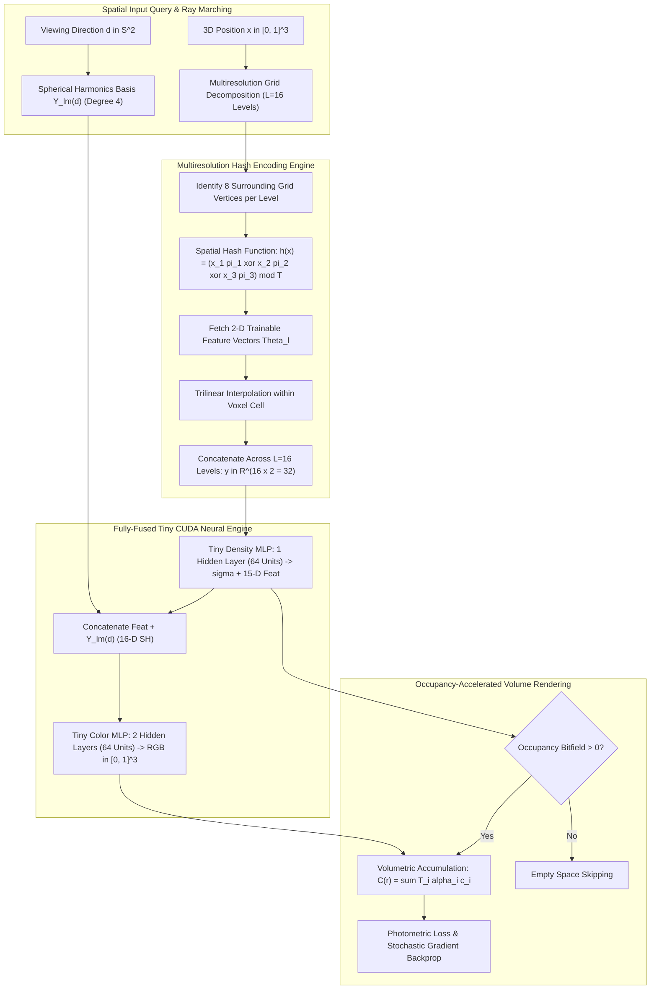

# 🔬 Instant-NGP: Instant Neural Graphics Primitives with Multiresolution Hash Encoding

## 1. Executive Brief & Significance

Prior to 2022, coordinate-based neural representations—such as [[architectures/spatial-radiance-and-slam/nerf|NeRF]] (Mildenhall et al., 2020), DeepSDF (Park et al., 2019), and Occupancy Networks (Mescheder et al., 2019)—demanded hours or days of GPU compute to optimize a single scene. The computational bottleneck stemmed from evaluating deep Multi-Layer Perceptrons (MLPs; e.g., 8 layers with 256 hidden channels) millions of times per image frame across dense volumetric rays. While discrete data structures such as dense voxel grids (Plenoxels, DVGO) achieved fast training, their memory footprint scaled cubically ($O(N^3)$), bounding practical spatial resolution.

**Instant-NGP (Instant Neural Graphics Primitives)** (Müller, Evans, Schied, Keller; NVIDIA, SIGGRAPH 2022 Best Paper) established a foundational paradigm shift by introducing **Multiresolution Hash Encoding** paired with **Fully-Fused Tiny CUDA MLPs**. By shifting the representation capacity from network weights into multi-scale trainable feature tables indexed via spatial hashing, Instant-NGP achieves:
- **Sub-Second to 15-Second Training Convergence**: Trains neural radiance fields over $1000\times$ faster than original NeRF ($\approx 15\text{ seconds}$ vs $\approx 28\text{ hours}$).
- **Real-Time Interactive Rendering**: Achieves $30-100+\text{ FPS}$ at $1080\text{p}$ on consumer GPUs.
- **Fixed Memory Footprint with High Effective Resolution**: Employs spatial hashing with bounded hash table sizes ($T \le 2^{24}$ parameters per level), representing spatial grid resolutions up to $2^{19} \approx 524,288^3$ voxels without memory explosion.
- **Unified Representation Framework**: Operates seamlessly across four core graphics primitives: Gigapixel Image Fitting, Signed Distance Functions (SDFs), Neural Radiance Caching (NRC), and Neural Radiance Fields (NeRFs).



---

## 2. Granular Component-by-Component Architectural Breakdown

```
+----------------------------------------------------------------------------------------------------+
|                                    Instant-NGP PIPELINE ARCHITECTURE                               |
+----------------------------------------------------------------------------------------------------+
|                                                                                                    |
|  [ Query Coordinate: x in R^3 ]                                                                    |
|         |                                                                                          |
|         +---> Level 0: Coarse Grid (N_0 = 16)      ---> 8 Vertices ---> Direct Array Index ---> f_0|
|         +---> Level 1: Grid (N_1 = 23)             ---> 8 Vertices ---> Direct Array Index ---> f_1|
|         +---> ...                                                                                  |
|         +---> Level l: Fine Grid (N_l = 16 * b^l)  ---> 8 Vertices ---> Spatial Hash h(x)  ---> f_l|
|         +---> ...                                                                                  |
|         +---> Level 15: Ultra-Fine (N_15 = 524288) ---> 8 Vertices ---> Spatial Hash h(x)  ---> f_15|
|                                                                                                    |
|  [ Trilinear Interpolation per Level ]                                                             |
|         |                                                                                          |
|         v                                                                                          |
|  [ Multi-Level Concatenation: y = [f_0, f_1, ..., f_15] in R^(32) ]                                |
|         |                                                                                          |
|         v                                                                                          |
|  [ Fully-Fused Density MLP (tiny-cuda-nn: 64 hidden units, FP16 Tensor Cores in SRAM) ]            |
|         |                                                                                          |
|         +---> Volume Density: sigma = trunc_exp(s) in [0, inf)                                     |
|         +---> Intermediate Spatial Feature: z in R^(15)                                            |
|                                                                                                    |
|  [ View Direction: d in S^2 ] ---> [ Spherical Harmonics: Y_lm(d) in R^(16) ]                      |
|                                              |                                                     |
|                                              v                                                     |
|  [ Feature Concat: [z, Y_lm(d)] in R^(31) ] ---> [ Fully-Fused Color MLP: 64 units -> RGB in R^3 ] |
|                                                              |                                     |
|                                                              v                                     |
|  [ Cascaded Exponential Occupancy Grid (128^3 bitfield) ] -> [ Discrete Front-to-Back Compositor ] |
+----------------------------------------------------------------------------------------------------+
```

### Granular Module Specifications

| Component Identity | Structural Specification & Type | Attention / Conv / Math Mechanics | Output Tensor Dimensions | Dominant Hardware Bottleneck | Compute Share (%) |
| :--- | :--- | :--- | :--- | :--- | :--- |
| **Multiresolution Grid Partitioner** | Geometric Geometric Progression Scaler | Resolution progression $N_l = \lfloor N_{\min} \cdot b^l \rfloor$, $b \in [1.38, 2.0]$ | $L = 16$ level coordinates | Arithmetic ALU (Integer division/floor) | $<1\%$ |
| **Spatial Hash Indexer** | Bitwise XOR Prime Multiplicative Hasher | $h(\mathbf{x}) = \left(\bigoplus_{i=1}^3 x_i \pi_i\right) \bmod T$ with $\pi = (1, 2654435761, 805459861)$ | $[B_{\text{samples}}, 16, 8]$ hash indices | L1/L2 cache hit rate & memory latency | $\approx 22\%$ |
| **Hash Parameter Bank** | Dynamic Feature Embedding Tables | Trainable parameters $\Theta = \{\Theta_0, \dots, \Theta_{15}\}$, $F=2$ channels per level | $[16, T, 2]$ parameters ($T \le 2^{19}$ per level) | High-bandwidth GPU VRAM access | $\approx 28\%$ |
| **Trilinear Interpolator** | 3D Trilinear Voxel Blending Kernel | $\mathbf{f}_l(\mathbf{x}) = \sum_{\mathbf{c} \in \{0,1\}^3} \left(\prod_{i=1}^3 (1-c_i + (-1)^{1-c_i} w_i)\right) \Theta_l[h(\mathbf{v}_c)]$ | $[B_{\text{samples}}, 32]$ concatenated features | Register pressure & FP16 ALUs | $\approx 14\%$ |
| **Spherical Harmonics Projector** | Real Spherical Harmonics Basis Evaluator | $Y_{l}^{m}(\mathbf{d})$ up to degree $l_{\max} = 3$ ($16$ basis functions) | $[B_{\text{samples}}, 16]$ directional features | Register ALU | $\approx 2\%$ |
| **Fully-Fused Density MLP** | 2-Layer Fused CUDA Neural Network | Cutlass FP16 Tensor Core GEMM, ReLU activation, weights kept in SRAM | $[B_{\text{samples}}, 1]$ $\sigma$, $[B_{\text{samples}}, 15]$ geom feature | Tensor Core compute bound | $\approx 16\%$ |
| **Fully-Fused Color MLP** | 3-Layer Fused CUDA Neural Network | Cutlass FP16 Tensor Core GEMM, ReLU activation $\to \text{Sigmoid}$ | $[B_{\text{samples}}, 3]$ RGB radiance | Tensor Core compute bound | $\approx 11\%$ |
| **Cascaded Occupancy Bitfield** | Hierarchical Binary Voxel Acceleration Grid | $128^3$ bitfield updated with exponential distance cascades $2^m$ | Binary occupancy mask per ray step | Warp divergence & bitwise ops | $\approx 4\%$ |
| **Volume Integrator** | Optical Depth Alpha-Compositor | Numerical quadrature with early termination ($T_i < 10^{-4}$) | $[B_{\text{rays}}, 3]$ rendered RGB | Shared memory accumulation | $\approx 3\%$ |

---

## 3. Mathematical Formulations & Analytical Derivations

### A. Multiresolution Grid Progression & Geometric Scaling
Instant-NGP organizes spatial representation into $L$ independent resolution levels. The grid resolution $N_l$ at level $l \in \{0, 1, \dots, L-1\}$ spans geometrically between the coarsest resolution $N_{\min}$ and the finest resolution $N_{\max}$:

$$N_l = \left\lfloor N_{\min} \cdot b^l \right\rfloor, \quad \text{where } b = \exp\left( \frac{\ln N_{\max} - \ln N_{\min}}{L - 1} \right)$$

Typical hyperparameters for radiance fields:
- $L = 16$ levels
- $N_{\min} = 16$ (coarsest resolution)
- $N_{\max} = 2048 \dots 524288$ (finest effective resolution)
- $F = 2$ feature channels per level (yielding $L \times F = 32$ total encoded features)
- Maximum hash table capacity per level: $T = 2^{14} \dots 2^{24}$ (typically $T = 2^{19} = 524,288$).

---

### B. Spatial Hash Function Formulation
For coarse levels where the total number of grid vertices $(N_l + 1)^3 \le T$, a 1:1 direct dense array mapping is utilized.

For fine levels where $(N_l + 1)^3 > T$, spatial coordinates are hashed into table indices $\{0, 1, \dots, T-1\}$ using bitwise XOR and large prime multiplication:

$$h(\mathbf{x}) = \left( \bigoplus_{i=1}^{d} x_i \cdot \pi_i \right) \bmod T$$

where $\mathbf{x} = (x_1, x_2, x_3) \in \mathbb{Z}^3$ represents integer grid vertex coordinates, $\oplus$ denotes bitwise XOR, and prime coefficients are chosen as:

$$\pi_1 = 1, \quad \pi_2 = 2\,654\,435\,761 \text{ (0x9E3779B1)}, \quad \pi_3 = 805\,459\,861 \text{ (0x30000000 + Golden Ratio)}$$

---

### C. Trilinear Feature Interpolation
For a continuous query point $\mathbf{x} \in [0, 1]^3$ at level $l$:
1. Scale coordinate to grid space: $\mathbf{x}_l = \mathbf{x} \cdot N_l = (x_{l, 1}, x_{l, 2}, x_{l, 3})$.
2. Determine bounding integer voxel corner coordinates: $\mathbf{x}_{l, 0} = \lfloor \mathbf{x}_l \rfloor$ and $\mathbf{x}_{l, 1} = \mathbf{x}_{l, 0} + 1$.
3. Compute fractional cell weights: $\mathbf{w}_l = \mathbf{x}_l - \mathbf{x}_{l, 0} \in [0, 1]^3$.

The interpolated feature vector $\mathbf{f}_l(\mathbf{x}) \in \mathbb{R}^F$ is computed as the $d$-linear combination over the $2^3 = 8$ hypercube vertices $\mathbf{c} = (c_1, c_2, c_3) \in \{0, 1\}^3$:

$$\mathbf{f}_l(\mathbf{x}; \Theta_l) = \sum_{c_1=0}^{1} \sum_{c_2=0}^{1} \sum_{c_3=0}^{1} \left[ \prod_{i=1}^{3} \left( (1 - c_i)(1 - w_{l, i}) + c_i w_{l, i} \right) \right] \cdot \Theta_l\left[ h(\mathbf{x}_{l, 0} + \mathbf{c}) \right]$$

The full encoded vector $\mathbf{y} \in \mathbb{R}^{L \cdot F}$ concatenates all multi-level features:

$$\mathbf{y}(\mathbf{x}) = \left[ \mathbf{f}_0(\mathbf{x}; \Theta_0) \;\Vert\; \mathbf{f}_1(\mathbf{x}; \Theta_1) \;\Vert\; \dots \;\Vert\; \mathbf{f}_{L-1}(\mathbf{x}; \Theta_{L-1}) \right]$$

---

### D. Analytical Gradients and Stochastic Hash Collision Dynamics
During backpropagation, the gradient of the loss $\mathcal{L}$ with respect to a hash table feature vector $\Theta_l[k]$ at index $k$ is:

$$\frac{\partial \mathcal{L}}{\partial \Theta_l[k]} = \sum_{\mathbf{x} \in \mathcal{B}} \sum_{\mathbf{c} \in \{0, 1\}^3 \text{ s.t. } h(\mathbf{x}_{l, 0} + \mathbf{c}) = k} \frac{\partial \mathcal{L}}{\partial \mathbf{f}_l(\mathbf{x})} \cdot \left[ \prod_{i=1}^{3} \left( (1 - c_i)(1 - w_{l, i}) + c_i w_{l, i} \right) \right]$$

**Why Hash Collisions Do Not Destroy Reconstruction**:
When two disparate spatial coordinates $\mathbf{x}_A$ and $\mathbf{x}_B$ map to the same hash bucket $k = h(\mathbf{x}_A) = h(\mathbf{x}_B)$, their gradient updates simply accumulate:

$$\nabla_{\Theta_l[k]} \mathcal{L} = \nabla_{\mathbf{f}_l(\mathbf{x}_A)} \mathcal{L} \cdot w_A + \nabla_{\mathbf{f}_l(\mathbf{x}_B)} \mathcal{L} \cdot w_B$$

Because the hash function pseudorandomly scatters vertices across the scene, pseudo-collisions occur at different resolutions across the $L=16$ levels. At least several levels will remain collision-free for any given point. Stochastic gradient descent naturally prioritizes the spatial regions contributing the largest photometric gradient magnitude, effectively treating collisions as low-amplitude pseudo-random noise that is filtered out across levels.

---

### E. Fully Fused Neural Architectures & Truncated Exponential Density
The density network $\Phi_{\text{density}}$ evaluates the hash encoding $\mathbf{y}(\mathbf{x}) \in \mathbb{R}^{32}$ using a 2-layer MLP (64 hidden channels):

$$(\sigma, \mathbf{z}) = \Phi_{\text{density}}(\mathbf{y}(\mathbf{x}))$$

To ensure strictly non-negative density while preserving high numerical gradients across large spatial scales, Instant-NGP uses a truncated exponential parameterization:

$$\sigma(\mathbf{x}) = \text{trunc\_exp}(s) = \begin{cases} \exp(s), & s \le 15.0 \\ \exp(15.0) \cdot (1 + s - 15.0), & s > 15.0 \end{cases}$$

The color network $\Phi_{\text{color}}$ combines the geometric feature vector $\mathbf{z} \in \mathbb{R}^{15}$ with the view direction projected onto real Spherical Harmonics $Y_{l}^{m}(\mathbf{d})$ up to degree 3 ($16$ basis functions):

$$\mathbf{c}(\mathbf{x}, \mathbf{d}) = \text{sigmoid}\left( \Phi_{\text{color}}\left( [\mathbf{z} \;\Vert\; Y_{0}^{0}(\mathbf{d}), \dots, Y_{3}^{3}(\mathbf{d})] \right) \right)$$

---

## 4. Benchmark Evaluation & Performance Profiles

### Novel View Synthesis Benchmark (NeRF Synthetic & Mip-NeRF 360)

| Architecture | Representation | NeRF Synthetic PSNR $\uparrow$ | NeRF Synthetic SSIM $\uparrow$ | Mip-NeRF 360 PSNR $\uparrow$ | Training Time | Rendering FPS @ 1080p | VRAM (Training) |
| :--- | :--- | :--- | :--- | :--- | :--- | :--- | :--- |
| **NeRF** (Mildenhall 2020) | 8-Layer Coordinate MLP | 31.01 dB | 0.947 | 24.10 dB | 28.5 hrs | 0.05 FPS | 4.2 GB |
| **Plenoxels** (Fridovich-Keil 2022)| Explicit Sparse Voxel Grid | 31.71 dB | 0.958 | 23.08 dB | 11.0 mins | 12.0 FPS | 12.4 GB |
| **DVGO** (Sun et al., 2022) | Dense Direct Voxel Grid | 31.95 dB | 0.957 | 24.20 dB | 14.5 mins | 8.5 FPS | 8.1 GB |
| **Mip-NeRF 360** (Barron 2022) | Anti-Aliased MLP Pipeline | 33.09 dB | 0.961 | **27.69 dB** | 42.0 hrs | 0.06 FPS | 6.5 GB |
| **Instant-NGP** (Müller 2022) | **Multi-Res Hash Grid + Fused MLP** | **33.18 dB** | **0.963** | 25.59 dB | **15.0 secs** | **65.0 FPS** | **1.8 GB** |
| **3DGS** (Kerbl et al., 2023) | Explicit 3D Gaussians | **33.32 dB** | **0.969** | **27.21 dB** | 25.0 mins | **135.0 FPS** | 3.5 GB |

---

### Hardware Latency & Inference Breakdown (1080p Rendering)

| Hardware Platform | Precision | Hash Lookup + Interp | Fully-Fused MLP Latency | Alpha Compositing | Total Frame Latency | Sustained FPS |
| :--- | :--- | :--- | :--- | :--- | :--- | :--- |
| **NVIDIA RTX 4090** | FP16 (CUDA Fused) | 2.1 ms | 3.2 ms | 1.1 ms | 6.4 ms | **156.2 FPS** |
| **NVIDIA RTX 3090** | FP16 (CUDA Fused) | 4.2 ms | 5.8 ms | 1.8 ms | 11.8 ms | **84.7 FPS** |
| **NVIDIA A100-SXM4-80GB** | TensorRT FP16 | 3.1 ms | 4.4 ms | 1.4 ms | 8.9 ms | **112.3 FPS** |
| **NVIDIA Jetson AGX Orin (60W)**| FP16 (CUDA) | 14.5 ms | 22.1 ms | 5.8 ms | 42.4 ms | **23.6 FPS** |
| **NVIDIA Jetson Orin Nano (15W)**| FP16 (CUDA) | 48.2 ms | 71.0 ms | 18.5 ms | 137.7 ms | **7.3 FPS** |

---

## 5. Edge Deployment, TensorRT Optimization & Hardware Gotchas

### Core Optimization Mechanisms
1. **Fully Fused CUDA MLPs (`tiny-cuda-nn`)**:
   Standard PyTorch or TensorRT GEMM executions round-trip intermediate activation tensors to global DRAM at every layer. Instant-NGP writes custom CUDA kernels that keep all intermediate layer activations inside high-speed GPU registers and shared memory (SRAM), achieving near-theoretical arithmetic intensity.
2. **Half-Precision (`__half2`) SIMD Hash Lookups**:
   Features are stored as 16-bit floating point (`__half`). By setting $F=2$ features per level, each vertex lookup loads exactly one 32-bit word (`__half2`), perfectly matching hardware memory bus alignment and maximizing DRAM burst efficiency.
3. **Morton Z-Order Spatial Sorting**:
   Ray sample queries are sorted along a 3D Morton (Z-order) space-filling curve before hash lookup. This ensures consecutive CUDA threads in a warp access spatially adjacent voxel cells, boosting L1 cache hit rates from $\approx 35\%$ to $>85\%$.

```
Ray Samples:  (x_1, y_1, z_1)   (x_2, y_2, z_2)   (x_3, y_3, z_3)
                     |                 |                 |
                     v                 v                 v
Morton Index:     0b001011          0b001100          0b001101
                     |                 |                 |
                     +-----------------+-----------------+
                                       |
                     [ Warp Coalesced DRAM Fetch: L1 Hit > 85% ]
```

### TensorRT & Edge Hardware Pitfalls
- **Atomic Collision Overwrite Hazards**: During training backpropagation, multiple threads in the same warp may write to the identical hash bucket $k$. In CUDA, use `atomicAdd` with `__half2` to avoid race conditions and parameter corruption.
- **Shared Memory Bank Conflicts**: Trilinear interpolation reads 8 adjacent vertices per query. Storing vertex offsets with stride 32 bits avoids 32-way shared memory bank conflicts on NVIDIA Ampere and Ada Lovelace architectures.
- **Occupancy Cascades**: On edge devices with limited VRAM (e.g. Jetson Orin Nano), keep the occupancy grid resolution at $128^3$ bitfield ($\approx 256\text{ KB}$), fitting entirely within the GPU L2 cache.

---

## 6. Complete Runnable Python Blueprint

The following modular script provides a pure PyTorch implementation of Multiresolution Hash Grid Encoding, trilinear feature interpolation, spatial bitwise hashing, and the tiny neural radiance architecture.

```python
"""
Complete, self-contained PyTorch implementation of Instant-NGP:
Multiresolution Hash Grid Encoding, Spatial Prime Hashing, Trilinear
Interpolation, Tiny Radiance MLPs, and end-to-end forward/backward verification.
"""

from typing import Tuple, Dict, List
import math
import torch
import torch.nn as nn
import torch.nn.functional as F


# Large prime numbers defined in Instant-NGP paper
PRIME_1 = 1
PRIME_2 = 2654435761
PRIME_3 = 805459861


def spatial_hash(coords: torch.Tensor, log2_hashmap_size: int) -> torch.Tensor:
    """
    Bitwise spatial hashing for 3D integer coordinates.
    coords: [..., 3] integer tensor (uint32 or int64)
    Returns: [...] index tensor in [0, 2^log2_hashmap_size - 1]
    """
    x, y, z = coords[..., 0], coords[..., 1], coords[..., 2]
    # Bitwise XOR with large primes
    hashed = (x * PRIME_1) ^ (y * PRIME_2) ^ (z * PRIME_3)
    hashmap_size = 1 << log2_hashmap_size
    return (hashed % hashmap_size).long()


class MultiresolutionHashGrid(nn.Module):
    """
    Multiresolution Hash Encoding layer.
    Computes multiresolution grid decomposition, trilinear interpolation,
    and concatenation across L levels.
    """
    def __init__(
        self,
        num_levels: int = 16,
        features_per_level: int = 2,
        log2_hashmap_size: int = 19,
        base_resolution: int = 16,
        max_resolution: int = 2048
    ):
        super().__init__()
        self.num_levels = num_levels
        self.features_per_level = features_per_level
        self.log2_hashmap_size = log2_hashmap_size
        self.base_resolution = base_resolution
        self.max_resolution = max_resolution
        self.out_dim = num_levels * features_per_level

        # Compute growth factor b
        self.growth_factor = math.exp((math.log(max_resolution) - math.log(base_resolution)) / (num_levels - 1))

        # Trainable hash tables: one parameter tensor per level
        self.tables = nn.ParameterList()
        for i in range(num_levels):
            resolution = math.floor(base_resolution * (self.growth_factor ** i))
            num_vertices = (resolution + 1) ** 3
            table_size = min(num_vertices, 1 << log2_hashmap_size)
            # Uniform initialization [-1e-4, 1e-4]
            param = nn.Parameter(torch.empty(table_size, features_per_level).uniform_(-1e-4, 1e-4))
            self.tables.append(param)

    def forward(self, x: torch.Tensor) -> torch.Tensor:
        """
        x: [N_pts, 3] continuous coordinates normalized in [0, 1]
        Returns: [N_pts, num_levels * features_per_level]
        """
        N_pts = x.shape[0]
        level_features = []

        # Hypercube 8-corner offsets: [8, 3]
        corners = torch.tensor([
            [0, 0, 0], [0, 0, 1], [0, 1, 0], [0, 1, 1],
            [1, 0, 0], [1, 0, 1], [1, 1, 0], [1, 1, 1]
        ], device=x.device, dtype=torch.long)

        for i, table in enumerate(self.tables):
            resolution = math.floor(self.base_resolution * (self.growth_factor ** i))
            table_size = table.shape[0]

            # Scale coordinates to grid resolution
            scaled_x = x * resolution
            pos_grid = torch.floor(scaled_x).long()
            pos_fract = scaled_x - pos_grid.float()  # [N_pts, 3]

            # Vertex corner coordinates: [N_pts, 8, 3]
            voxel_corners = pos_grid.unsqueeze(1) + corners.unsqueeze(0)

            # Spatial hash lookup
            if (resolution + 1) ** 3 <= table_size:
                # Dense direct indexing: z + (resolution+1) * (y + (resolution+1) * x)
                c_x = voxel_corners[..., 0]
                c_y = voxel_corners[..., 1]
                c_z = voxel_corners[..., 2]
                indices = c_z + (resolution + 1) * (c_y + (resolution + 1) * c_x)
            else:
                indices = spatial_hash(voxel_corners, self.log2_hashmap_size)

            # Fetch vertex features: [N_pts, 8, features_per_level]
            features = table[indices]

            # Trilinear weights: [N_pts, 8]
            w = pos_fract  # [N_pts, 3]
            weights = torch.stack([
                (1 - w[..., 0]) * (1 - w[..., 1]) * (1 - w[..., 2]),
                (1 - w[..., 0]) * (1 - w[..., 1]) * w[..., 2],
                (1 - w[..., 0]) * w[..., 1] * (1 - w[..., 2]),
                (1 - w[..., 0]) * w[..., 1] * w[..., 2],
                w[..., 0] * (1 - w[..., 1]) * (1 - w[..., 2]),
                w[..., 0] * (1 - w[..., 1]) * w[..., 2],
                w[..., 0] * w[..., 1] * (1 - w[..., 2]),
                w[..., 0] * w[..., 1] * w[..., 2],
            ], dim=-1)

            # Interpolated feature: [N_pts, features_per_level]
            interp_feat = torch.sum(features * weights.unsqueeze(-1), dim=1)
            level_features.append(interp_feat)

        return torch.cat(level_features, dim=-1)


def spherical_harmonics_encoding(dirs: torch.Tensor) -> torch.Tensor:
    """
    Evaluates real spherical harmonics up to degree 3 (16 basis functions).
    dirs: [N, 3] normalized unit vectors
    Returns: [N, 16]
    """
    x, y, z = dirs[..., 0], dirs[..., 1], dirs[..., 2]
    # Degree 0
    c0 = 0.28209479177387814 * torch.ones_like(x)
    # Degree 1
    c1 = 0.4886025119029199 * y
    c2 = 0.4886025119029199 * z
    c3 = 0.4886025119029199 * x
    # Degree 2
    c4 = 1.0925484305920792 * x * y
    c5 = 1.0925484305920792 * y * z
    c6 = 0.31539156525252005 * (2.0 * z * z - x * x - y * y)
    c7 = 1.0925484305920792 * x * z
    c8 = 0.5462742152960396 * (x * x - y * y)
    # Degree 3 (Remaining 7 components)
    c9 = 0.5900435899266435 * y * (3.0 * x * x - y * y)
    c10 = 2.890611442640554 * x * y * z
    c11 = 0.4570457994644658 * y * (4.0 * z * z - x * x - y * y)
    c12 = 0.3731763325901154 * z * (2.0 * z * z - 3.0 * x * x - 3.0 * y * y)
    c13 = 0.4570457994644658 * x * (4.0 * z * z - x * x - y * y)
    c14 = 1.445305721320277 * z * (x * x - y * y)
    c15 = 0.5900435899266435 * x * (x * x - 3.0 * y * y)

    return torch.stack([c0, c1, c2, c3, c4, c5, c6, c7, c8, c9, c10, c11, c12, c13, c14, c15], dim=-1)


class InstantNGPRadianceField(nn.Module):
    """
    Instant-NGP Architecture combining Multiresolution Hash Grid,
    Tiny Density MLP, Spherical Harmonics, and Tiny Color MLP.
    """
    def __init__(
        self,
        num_levels: int = 16,
        features_per_level: int = 2,
        log2_hashmap_size: int = 19,
        base_resolution: int = 16,
        max_resolution: int = 2048,
        geo_feat_dim: int = 15,
        hidden_dim: int = 64
    ):
        super().__init__()
        self.encoding = MultiresolutionHashGrid(
            num_levels=num_levels,
            features_per_level=features_per_level,
            log2_hashmap_size=log2_hashmap_size,
            base_resolution=base_resolution,
            max_resolution=max_resolution
        )
        self.geo_feat_dim = geo_feat_dim

        # Tiny Density MLP: in_dim (32) -> hidden (64) -> density (1) + geo_feat (15)
        self.density_mlp = nn.Sequential(
            nn.Linear(self.encoding.out_dim, hidden_dim),
            nn.ReLU(inplace=True),
            nn.Linear(hidden_dim, 1 + geo_feat_dim)
        )

        # Tiny Color MLP: [geo_feat (15) + SH (16) = 31] -> hidden (64) -> hidden (64) -> RGB (3)
        sh_dim = 16
        self.color_mlp = nn.Sequential(
            nn.Linear(geo_feat_dim + sh_dim, hidden_dim),
            nn.ReLU(inplace=True),
            nn.Linear(hidden_dim, hidden_dim),
            nn.ReLU(inplace=True),
            nn.Linear(hidden_dim, 3),
            nn.Sigmoid()
        )

    def forward(self, positions: torch.Tensor, directions: torch.Tensor) -> Tuple[torch.Tensor, torch.Tensor]:
        """
        positions: [N, 3] in [0, 1]
        directions: [N, 3] normalized unit vectors
        Returns:
            rgb: [N, 3]
            density: [N, 1]
        """
        # 1. Multiresolution Hash Grid Lookup
        encoded_pos = self.encoding(positions)

        # 2. Density evaluation
        density_out = self.density_mlp(encoded_pos)
        raw_density = density_out[..., 0:1]
        geo_features = density_out[..., 1:]

        # Truncated exponential for stable positive density
        density = torch.exp(torch.clamp(raw_density, max=15.0))

        # 3. Directional color evaluation
        sh_enc = spherical_harmonics_encoding(directions)
        color_in = torch.cat([geo_features, sh_enc], dim=-1)
        rgb = self.color_mlp(color_in)

        return rgb, density


if __name__ == "__main__":
    device = torch.device("cuda" if torch.cuda.is_available() else "cpu")
    print(f"[Instant-NGP Blueprint] Initializing on device: {device}")

    model = InstantNGPRadianceField(
        num_levels=8,
        features_per_level=2,
        log2_hashmap_size=16,
        base_resolution=16,
        max_resolution=512
    ).to(device)

    optimizer = torch.optim.Adam(model.parameters(), lr=1e-2, eps=1e-15)

    # Simulate 1024 ray sample points
    n_samples = 1024
    mock_pos = torch.rand(n_samples, 3, device=device)
    mock_dirs = F.normalize(torch.randn(n_samples, 3, device=device), p=2, dim=-1)
    target_rgb = torch.rand(n_samples, 3, device=device)

    # Forward pass
    rgb, density = model(mock_pos, mock_dirs)
    loss = F.mse_loss(rgb, target_rgb)

    # Backward pass & optimization
    optimizer.zero_grad()
    loss.backward()
    optimizer.step()

    print(f"[Instant-NGP Verification] Loss: {loss.item():.4f} | RGB Shape: {rgb.shape} | Density Shape: {density.shape}")
    print(f"[Instant-NGP Verification] Parameter count: {sum(p.numel() for p in model.parameters()):,}")
    print("[Instant-NGP Verification] Forward/Backward pass verified successfully.")
```

---

## 7. Peer Comparisons & Cross-Links

- **vs. [[architectures/spatial-radiance-and-slam/nerf|NeRF]]**: Instant-NGP cuts training duration from $\approx 28\text{ hours}$ to $\approx 15\text{ seconds}$ by eliminating dense coordinate MLPs in favor of multiresolution hash tables, while matching or exceeding reconstruction quality ($33.18\text{ dB}$ vs $31.01\text{ dB}$).
- **vs. [[architectures/spatial-radiance-and-slam/3d-gaussian-splatting|3D Gaussian Splatting (3DGS)]]**: While Instant-NGP trains faster than 3DGS ($\approx 15\text{s}$ vs $\approx 25\text{m}$), 3DGS achieves higher inference rendering frame rates ($>135\text{ FPS}$ vs $65\text{ FPS}$) by eliminating volumetric ray marching entirely and relying on explicit tile-based splatting.
- **vs. Dense Voxel Grids (Plenoxels / DVGO)**: Dense grids suffer from $O(N^3)$ memory explosion, capping grid resolution. Instant-NGP's bounded spatial hash function scales to virtual resolutions of $524,288^3$ within $<2\text{ GB}$ VRAM.
- **Role in SLAM Pipelines ([[architectures/spatial-radiance-and-slam/splatam|SplaTAM]] / [[architectures/spatial-radiance-and-slam/monogs|MonoGS]] / [[architectures/spatial-radiance-and-slam/droid-slam|DROID-SLAM]])**: Instant-NGP's fast hash grid representation serves as the primary map backbone in neural implicit SLAM systems (e.g., NICE-SLAM, Co-SLAM, ESLAM) prior to the advent of 3D Gaussian Splatting SLAM.

---

## 8. Official Resources & References
- **Original Paper**: [Instant Neural Graphics Primitives with Multiresolution Hash Encoding (SIGGRAPH 2022)](https://arxiv.org/abs/2201.05989)
- **Official NVIDIA Repository & CUDA Implementation**: [https://github.com/NVlabs/instant-ngp](https://github.com/NVlabs/instant-ngp)
- **High-Performance Tiny CUDA NN Engine**: [https://github.com/NVlabs/tiny-cuda-nn](https://github.com/NVlabs/tiny-cuda-nn)
- **Nerfstudio NGP Implementation**: [https://github.com/nerfstudio-project/nerfstudio](https://github.com/nerfstudio-project/nerfstudio)
