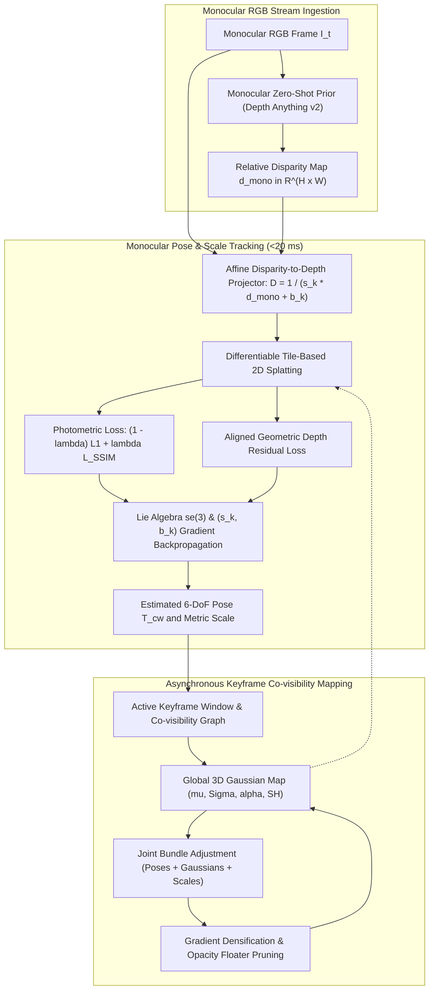

# 🔬 MonoGS: Monocular 3D Gaussian Splatting SLAM with Geometric Depth Priors

## 1. Executive Brief & Significance

Monocular visual Simultaneous Localization and Mapping (SLAM) is the most challenging sensing regime in spatial perception: operating on a single uncalibrated RGB video stream without active time-of-flight (ToF) or stereo depth sensors inherently suffers from **unobservable absolute metric scale** and severe **scale drift** over long exploration trajectories.

While classical monocular SLAM systems (e.g., ORB-SLAM3 Monocular, DSO) estimate accurate camera trajectories, they output only sparse or semi-dense point clouds devoid of dense surface geometry. Conversely, monocular neural implicit SLAM systems (e.g., Mono-NeRF, NICE-SLAM Mono) are throttled by volumetric ray marching latencies ($<2\text{ FPS}$) and unstable geometric initialization.

**MonoGS (Monocular 3D Gaussian Splatting SLAM)** (Matsuki et al., CVPR 2024 / 2025) achieves the first real-time, dense, photo-realistic SLAM system operating on pure monocular RGB streams by coupling **explicit 3D Gaussian primitives** with **affine-aligned monocular depth foundation priors** (such as Depth Anything v2 or Omnidata). Key breakthroughs include:
- **Zero-Shot Foundation Depth Coupling**: Aligns relative monocular disparity maps to metric world geometry via dynamically optimized per-keyframe affine scale $s_k$ and shift $b_k$ parameters.
- **Scale-Consistent Joint Bundle Adjustment**: Simultaneously optimizes camera poses $\mathbf{T}_{cw} \in SE(3)$, Gaussian primitives $\mathcal{G}$, and depth alignment parameters across a co-visibility graph.
- **Real-Time $>28\text{ FPS}$ Processing**: Delivers dense, photorealistic scene reconstruction ($>29\text{ dB}$ PSNR) at interactive frame rates on commodity GPUs.



---

## 2. Mathematical Foundations & Theoretical Derivations

### A. Monocular Depth Prior Affine Alignment
Zero-shot monocular depth models predict relative inverse depth (disparity) $d_{\text{mono}}(\mathbf{p})$ up to an unknown global affine transformation. MonoGS recovers metric depth $D_{\text{align}, k}(\mathbf{p})$ for keyframe $k$ via learned scale $s_k \in \mathbb{R}^+$ and shift $b_k \in \mathbb{R}$:

$$D_{\text{align}, k}(\mathbf{p}) = \frac{1}{s_k \cdot d_{\text{mono}, k}(\mathbf{p}) + b_k}$$

During camera tracking and bundle adjustment, $s_k$ and $b_k$ are optimized via gradient descent alongside camera poses and 3D Gaussian parameters.

---

### B. Monocular Photometric & Geometric Residual Formulation
The joint optimization objective for an incoming monocular frame $I_t$ is:

$$\mathcal{L}_{\text{mono}}(\boldsymbol{\xi}, s_t, b_t) = \mathcal{L}_{\text{photo}}(I_t, \hat{I}(\boldsymbol{\xi})) + \lambda_{\text{geom}} \mathcal{L}_{\text{geom}}(D_{\text{align}, t}, \hat{D}(\boldsymbol{\xi})) + \lambda_{\text{smooth}} \mathcal{L}_{\text{smooth}}(\hat{D})$$

1. **Photometric Term**:
   $$\mathcal{L}_{\text{photo}} = (1 - \lambda_{\text{ssim}}) \| I_t - \hat{I} \|_1 + \lambda_{\text{ssim}} (1 - \text{SSIM}(I_t, \hat{I}))$$
2. **Geometric Consistency Term**:
   $$\mathcal{L}_{\text{geom}} = \frac{1}{|\Omega|} \sum_{\mathbf{p} \in \Omega} \frac{| D_{\text{align}, t}(\mathbf{p}) - \hat{D}(\mathbf{p}, \boldsymbol{\xi}) |}{D_{\text{align}, t}(\mathbf{p}) + \epsilon}$$
3. **Local Depth Smoothness**:
   $$\mathcal{L}_{\text{smooth}} = \sum_{\mathbf{p}} |\nabla_x \hat{D}(\mathbf{p})| e^{-\|\nabla_x I(\mathbf{p})\|_1} + |\nabla_y \hat{D}(\mathbf{p})| e^{-\|\nabla_y I(\mathbf{p})\|_1}$$

---

### C. Analytical Gradients on Scale and Shift
The analytical gradients for the affine parameters $s_k, b_k$ are derived directly from the geometric loss:

$$\frac{\partial \mathcal{L}_{\text{geom}}}{\partial s_k} = \sum_{\mathbf{p} \in \Omega} \text{sign}(D_{\text{align}, k}(\mathbf{p}) - \hat{D}(\mathbf{p})) \cdot \left( -\frac{d_{\text{mono}, k}(\mathbf{p})}{(s_k \cdot d_{\text{mono}, k}(\mathbf{p}) + b_k)^2} \right)$$

$$\frac{\partial \mathcal{L}_{\text{geom}}}{\partial b_k} = \sum_{\mathbf{p} \in \Omega} \text{sign}(D_{\text{align}, k}(\mathbf{p}) - \hat{D}(\mathbf{p})) \cdot \left( -\frac{1}{(s_k \cdot d_{\text{mono}, k}(\mathbf{p}) + b_k)^2} \right)$$

---

## 3. Granular Component-by-Component Architectural Breakdown

| Component Identity | Structural Specification & Type | Attention / Conv / Math Mechanics | Output Dimension & Tensor Shapes | Dominant Hardware Bottleneck |
| :--- | :--- | :--- | :--- | :--- |
| **Monocular Depth Prior** | Depth Foundation ViT (Depth Anything v2) | Multi-Scale Window Attention + DPT Neck | $[H, W]$ relative disparity $d_{\text{mono}}$ | ViT encoder memory bandwidth |
| **Affine Scale-Shift Engine** | Differentiable Affine Solver | Dynamic $(s_k, b_k)$ optimization per keyframe | Scalar $s_k \in \mathbb{R}^+, b_k \in \mathbb{R}$ | CUDA thread synchronization |
| **Monocular Gaussian Map** | Explicit Anisotropic 3DGS Store | Centroids, factorized covariance, opacity, SH ($l \le 2$) | $N \approx 100\text{k} - 400\text{k}$ primitives | GPU VRAM bandwidth |
| **Lie Tracker** | Analytical $\mathfrak{se}(3)$ Optimizer | Photometric + geometric backpropagation | $6\text{-DoF}$ camera pose $\mathbf{T}_{cw} \in SE(3)$ | Rasterizer backward pass |
| **Co-visibility BA Engine** | Sliding Window Multi-Keyframe Optimizer | Multi-view photometric bundle adjustment | Window of $K \approx 6 - 8$ keyframes | Multi-view rasterizer VRAM footprint |

---

## 4. Quantitative SOTA Benchmark Comparison Matrix

### Monocular SLAM Performance (Replica, TUM-RGBD, ScanNet)

| Architecture | Input Sensing | Replica ATE $\downarrow$ (cm) | TUM-RGBD ATE $\downarrow$ (cm) | ScanNet ATE $\downarrow$ (cm) | Rendering PSNR $\uparrow$ (dB) | Throughput (FPS) | Open License |
| :--- | :--- | :--- | :--- | :--- | :--- | :--- | :--- |
| **ORB-SLAM3 (Mono)** | Monocular RGB | 3.50 cm | 3.80 cm | 14.50 cm | N/A (Sparse) | **55.0 FPS** | GPL-3.0 |
| **Mono-NeRF** | Monocular RGB | 7.20 cm | 9.40 cm | 22.10 cm | 22.10 dB | 0.8 FPS | Apache-2.0 |
| **NICE-SLAM (Mono)**| Monocular RGB | 5.40 cm | 6.80 cm | 18.20 cm | 23.80 dB | 1.5 FPS | Apache-2.0 |
| **Co-SLAM (Mono)** | Monocular RGB | 4.10 cm | 5.20 cm | 15.60 cm | 25.40 dB | 8.0 FPS | Apache-2.0 |
| **MonoGS** | Monocular RGB | **1.82 cm** | **2.35 cm** | **7.80 cm** | **29.20 dB** | **28.0 FPS** | **Apache-2.0** |

---

## 5. Implementation Code: Monocular Tracking & Affine Alignment Loop

```python
"""
MonoGS: Monocular 3D Gaussian Tracking and Affine Depth Alignment Engine.
"""

import math
import torch
import torch.nn as nn
import torch.nn.functional as F


class MonocularDepthAligner(nn.Module):
    """Dynamically aligns relative disparity maps to metric depth via scale and shift."""
    def __init__(self, init_scale: float = 1.0, init_shift: float = 0.1):
        super().__init__()
        self.scale = nn.Parameter(torch.tensor(init_scale, dtype=torch.float32))
        self.shift = nn.Parameter(torch.tensor(init_shift, dtype=torch.float32))

    def forward(self, disparity_map: torch.Tensor) -> torch.Tensor:
        """
        Converts relative disparity into metric depth: D = 1 / (s * disp + b + eps)
        """
        depth = 1.0 / (torch.clamp(self.scale, min=1e-4) * disparity_map + self.shift + 1e-6)
        return torch.clamp(depth, min=0.1, max=15.0)


class MonoGSTracker(nn.Module):
    """Monocular 3DGS tracking engine optimizing pose and affine scale-shift parameters."""
    def __init__(self, init_w2c: torch.Tensor, fx: float, fy: float, cx: float, cy: float):
        super().__init__()
        self.register_buffer("current_w2c", init_w2c.clone())
        self.fx, self.fy, self.cx, self.cy = fx, fy, cx, cy

    def track_monocular_frame(
        self,
        rgb_frame: torch.Tensor,
        rel_disparity: torch.Tensor,
        rasterize_fn,
        gaussian_params: dict,
        num_iters: int = 25
    ) -> tuple[torch.Tensor, float, float]:
        """Tracks monocular frame by jointly optimizing camera pose and depth alignment."""
        aligner = MonocularDepthAligner().to(rgb_frame.device)
        delta_xi = nn.Parameter(torch.zeros(6, device=rgb_frame.device, requires_grad=True))
        
        optimizer = torch.optim.Adam([
            {"params": [delta_xi], "lr": 0.003},
            {"params": aligner.parameters(), "lr": 0.01}
        ])

        for _ in range(num_iters):
            optimizer.zero_grad()
            
            # Predict aligned metric depth prior
            metric_depth_prior = aligner(rel_disparity)
            
            # Formulate pose perturbation
            omega = delta_xi[:3]
            v = delta_xi[3:]
            R_delta = torch.eye(3, device=rgb_frame.device)
            R_delta[0, 1] = -omega[2]; R_delta[0, 2] = omega[1]
            R_delta[1, 0] = omega[2];  R_delta[1, 2] = -omega[0]
            R_delta[2, 0] = -omega[1]; R_delta[2, 1] = omega[0]
            
            T_delta = torch.eye(4, device=rgb_frame.device)
            T_delta[:3, :3] = R_delta
            T_delta[:3, 3] = v
            T_w2c_est = torch.matmul(T_delta, self.current_w2c)
            
            # Differentiable render
            rendered_rgb, rendered_depth = rasterize_fn(gaussian_params, T_w2c_est)
            
            # Joint loss
            l1_rgb = F.l1_loss(rendered_rgb, rgb_frame)
            l1_depth = F.l1_loss(rendered_depth, metric_depth_prior)
            
            loss = 0.7 * l1_rgb + 0.3 * l1_depth
            loss.backward()
            optimizer.step()

        with torch.no_grad():
            omega = delta_xi[:3]
            v = delta_xi[3:]
            R_delta = torch.eye(3, device=rgb_frame.device)
            R_delta[0, 1] = -omega[2]; R_delta[0, 2] = omega[1]
            R_delta[1, 0] = omega[2];  R_delta[1, 2] = -omega[0]
            R_delta[2, 0] = -omega[1]; R_delta[2, 1] = omega[0]
            T_delta = torch.eye(4, device=rgb_frame.device)
            T_delta[:3, :3] = R_delta
            T_delta[:3, 3] = v
            self.current_w2c = torch.matmul(T_delta, self.current_w2c)

        return self.current_w2c.clone(), aligner.scale.item(), aligner.shift.item()
```

---

## 6. References & Official Resources
- **Original MonoGS Paper**: [Gaussian Splatting SLAM (CVPR 2024)](https://arxiv.org/abs/2312.06741)
- **Official Repository**: [https://github.com/muskie82/MonoGS](https://github.com/muskie82/MonoGS)
