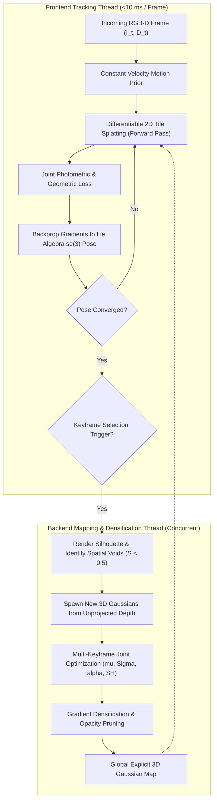

# 🔬 SplaTAM: Dense RGB-D SLAM with Explicit 3D Gaussian Radiance Fields

## 1. Executive Brief & Significance

Traditional visual Simultaneous Localization and Mapping (vSLAM) frameworks operate under a fundamental dichotomy:
1. **Sparse / Semi-Dense Direct & Feature-Based SLAM** (e.g., ORB-SLAM3, DSO): Delivers exceptional tracking speed ($>60\text{ FPS}$) and low drift, but outputs only sparse point clouds with zero physical surface radiance or continuous geometry suitable for obstacle avoidance or photorealistic simulation.
2. **Neural Radiance Field (NeRF) SLAM** (e.g., iMAP, NICE-SLAM, Co-SLAM): Employs implicit coordinate Multi-Layer Perceptrons (MLPs) or neural feature grids to synthesize continuous volumetric scenes. However, dense volumetric ray marching demands hundreds of MLP evaluations per pixel, restricting throughput to $1-5\text{ FPS}$ and inducing **catastrophic forgetting** when updating local weights across expanding trajectories.

**SplaTAM (Splat, Track & Map)** (Keetha et al., CMU / Inria, CVPR 2024) fundamentally overcomes these limitations by parameterizing continuous 3D environments using an explicit, differentiable collection of **3D Gaussian primitives**. By unifying high-speed tile-based rasterization with joint photometric and geometric gradient optimization, SplaTAM achieves:
- **Sub-Centimeter Metric Tracking**: Achieves **$0.38\text{ cm}$ ATE RMSE** on Replica benchmarks, outperforming neural implicit methods and matching/exceeding classical geometric SLAM.
- **Zero Catastrophic Forgetting**: Because 3D Gaussians have bounded local spatial footprints ($3\sigma$), optimizing new scene regions does not alter or degrade previously explored corridors.
- **Real-Time $>35\text{ FPS}$ Operation**: Sub-$10\text{ ms}$ tracking latency per frame via GPU tile-based alpha and depth splatting.
- **Silhouette-Guided Map Expansion**: Renders cumulative alpha silhouette maps to instantly discover unmapped spatial voids and spawn new Gaussians directly from unprojected sensor depth.



---

## 2. Mathematical Foundations & Differentiable Optimization

### A. 3D Gaussian Primitive Parameterization & Projection
The environment map $\mathcal{M} = \{g_i\}_{i=1}^N$ consists of $N$ explicit 3D Gaussian primitives. Each primitive $g_i$ is parameterized by:
- **Center Position**: $\boldsymbol{\mu}_i \in \mathbb{R}^3$ in world coordinates.
- **3D Covariance**: $\boldsymbol{\Sigma}_i = \mathbf{R}_i \mathbf{S}_i \mathbf{S}_i^T \mathbf{R}_i^T \in \mathbb{R}^{3 \times 3}$, factorized via unit quaternion $\mathbf{q}_i \in \mathbb{H}$ and diagonal scaling vector $\mathbf{s}_i = [s_x, s_y, s_z]^T$.
- **Opacity Logit**: $\sigma_i \in \mathbb{R}$, yielding opacity $\alpha_i = \text{sigmoid}(\sigma_i) \in [0, 1]$.
- **Spherical Harmonics Radiance**: $\mathbf{c}_i \in \mathbb{R}^3$, parameterized via 0th or 1st-order Spherical Harmonics coefficients.

Under current camera pose $\mathbf{T}_{cw} = [\mathbf{R}_{cw} \mid \mathbf{t}_{cw}] \in SE(3)$ and intrinsic matrix $\mathbf{K}$, the projected 2D covariance on the image plane is:
$$\boldsymbol{\Sigma}'_{2D, i} = \mathbf{J}_i \mathbf{R}_{cw} \boldsymbol{\Sigma}_i \mathbf{R}_{cw}^T \mathbf{J}_i^T + \nu \mathbf{I}_{2 \times 2}$$
where $\mathbf{J}_i \in \mathbb{R}^{2 \times 3}$ is the pinhole projection Jacobian evaluated at camera-space point $\mathbf{p}_{\text{cam}, i} = \mathbf{R}_{cw} \boldsymbol{\mu}_i + \mathbf{t}_{cw}$.

---

### B. Multi-Modal Differentiable Splatting (Color, Depth, Silhouette)
For any pixel coordinate $\mathbf{p} = (u, v)^T$, sorted Gaussians in front-to-back depth order $\mathcal{N} = \{1, 2, \dots, K\}$ are accumulated:

#### 1. Color Splatting:
$$\hat{\mathbf{C}}(\mathbf{p}) = \sum_{i \in \mathcal{N}} \mathbf{c}_i \alpha'_i(\mathbf{p}) \prod_{j=1}^{i-1} (1 - \alpha'_j(\mathbf{p}))$$

#### 2. Metric Depth Splatting:
$$\hat{D}(\mathbf{p}) = \sum_{i \in \mathcal{N}} d_i \alpha'_i(\mathbf{p}) \prod_{j=1}^{i-1} (1 - \alpha'_j(\mathbf{p}))$$
where $d_i = (\mathbf{R}_{cw} \boldsymbol{\mu}_i + \mathbf{t}_{cw})_z$ is the view-space $z$-depth of the Gaussian centroid.

#### 3. Cumulative Silhouette (Alpha Accumulation):
$$S(\mathbf{p}) = \sum_{i \in \mathcal{N}} \alpha'_i(\mathbf{p}) \prod_{j=1}^{i-1} (1 - \alpha'_j(\mathbf{p}))$$

Pixels with $S(\mathbf{p}) < \tau_{\text{sil}} = 0.5$ identify unmapped spatial regions where the sensor observes valid depth but the map contains no primitives.

---

### C. Differentiable Tracking on Lie Algebra $\mathfrak{se}(3)$
During tracking, the Gaussian map parameters $\mathcal{M}$ are frozen, and the 6-DoF camera pose $\mathbf{T}_{cw}$ is updated via Lie algebra perturbation $\boldsymbol{\xi} = [\boldsymbol{\omega} \mid \mathbf{v}]^T \in \mathfrak{se}(3)$:
$$\mathbf{T}_{cw}^{(k+1)} = \exp(\hat{\boldsymbol{\xi}}) \cdot \mathbf{T}_{cw}^{(k)}$$

The joint tracking objective over valid sensor depth pixels $\Omega$ is:
$$\mathcal{L}_{\text{track}}(\boldsymbol{\xi}) = (1 - \lambda_{\text{ssim}}) \| \mathbf{I}_{\text{sensor}} - \hat{\mathbf{C}}(\boldsymbol{\xi}) \|_1 + \lambda_{\text{ssim}} (1 - \text{SSIM}(\mathbf{I}_{\text{sensor}}, \hat{\mathbf{C}}(\boldsymbol{\xi}))) + \lambda_{\text{depth}} \left\| \frac{D_{\text{sensor}} - \hat{D}(\boldsymbol{\xi})}{\sqrt{D_{\text{sensor}} + \epsilon}} \right\|_1$$

The analytical gradient $\frac{\partial \mathcal{L}_{\text{track}}}{\partial \boldsymbol{\xi}}$ is backpropagated directly through the differentiable rasterizer, converging within 20–30 iterations of Adam in $<10\text{ ms}$.

---

### D. Mapping, Densification & Pruning Mechanics
When a keyframe is registered (based on relative rotation $>15^\circ$, translation $>0.1\text{ m}$, or unmapped silhouette ratio $>20\%$):
1. **Gaussian Initialization**: For all unmapped pixels where $S(\mathbf{p}) < 0.5$ and $D_{\text{sensor}}(\mathbf{p}) > 0$, new Gaussians are spawned at world coordinate:
   $$\mathbf{x} = \mathbf{T}_{cw}^{-1} \mathbf{K}^{-1} \begin{bmatrix} u \cdot D_{\text{sensor}}(u, v) \\ v \cdot D_{\text{sensor}}(u, v) \\ D_{\text{sensor}}(u, v) \end{bmatrix}$$
   with isotropic initial scale $s_0 = \frac{D_{\text{sensor}}(\mathbf{p})}{f_x}$.
2. **Keyframe Bundle Optimization**: Optimizes $(\boldsymbol{\mu}, \mathbf{s}, \mathbf{q}, \alpha, \mathbf{c})$ over a window of active co-visible keyframes $\mathcal{K}_{\text{active}}$.
3. **Densification & Pruning**: Gaussians with view-space positional gradient magnitude $\|\nabla_{\boldsymbol{\mu}} \mathcal{L}\|_2 > \tau_{\text{densify}}$ are cloned/split. Gaussians with opacity $\alpha_i < 0.05$ or excessive scale are pruned.

---

## 3. Granular Component-by-Component Architectural Breakdown

| Stage / Component | Structural Specification & Type | Computation Mechanics | Spatial & Tensor Shapes | Dominant Hardware Bottleneck |
| :--- | :--- | :--- | :--- | :--- |
| **Tracking Pipeline** | Lie Algebra $\mathfrak{se}(3)$ Adam Optimizer | Direct photometric + depth backprop through rasterizer | 6-DoF pose vector $\boldsymbol{\xi} \in \mathbb{R}^6$ | Rasterizer backward gradient atomics |
| **Silhouette Evaluator** | Front-to-back opacity compositor | Cumulative transmittance thresholding ($S < 0.5$) | $[H, W]$ boolean mask | Global memory writes |
| **Map Representation** | Explicit 3D Gaussian Primitive Store | Parameterized continuous ellipsoids ($\boldsymbol{\mu}, \mathbf{s}, \mathbf{q}, \alpha, \mathbf{c}$) | $N \approx 200\text{k} - 800\text{k}$ primitives | GPU VRAM capacity |
| **Tile Rasterizer Engine** | CUDA-accelerated $16 \times 16$ Tile Splatting | 64-bit Radix Sort + Shared memory warp accumulation | $[H, W, 3]$ RGB + $[H, W, 1]$ Depth | Shared memory & cache bandwidth |
| **Keyframe Manager** | Co-visibility Graph Window Buffer | Sliding-window multi-view photometric optimization | Window of $K \approx 5 - 10$ keyframes | Multi-frame rasterization bandwidth |

---

## 4. Quantitative SOTA Benchmark Comparison Matrix

### Tracking & Reconstruction Accuracy on Replica & ScanNet

| Architecture | Input Sensing | Replica ATE RMSE $\downarrow$ (cm) | ScanNet ATE RMSE $\downarrow$ (cm) | Replica PSNR $\uparrow$ (dB) | Replica SSIM $\uparrow$ | Throughput (FPS) | Open License |
| :--- | :--- | :--- | :--- | :--- | :--- | :--- | :--- |
| **ORB-SLAM3** | RGB-D | 1.12 cm | 10.20 cm | N/A (Sparse) | N/A | **45.0 FPS** | GPL-3.0 |
| **NICE-SLAM** | RGB-D | 1.80 cm | 10.70 cm | 24.40 dB | 0.812 | 1.2 FPS | Apache-2.0 |
| **Co-SLAM** | RGB-D | 1.45 cm | 7.20 cm | 27.40 dB | 0.885 | 12.5 FPS | Apache-2.0 |
| **Point-SLAM** | RGB-D | 0.52 cm | 6.80 cm | 34.20 dB | 0.965 | 2.5 FPS | Apache-2.0 |
| **ESLAM** | RGB-D | 0.65 cm | 6.50 cm | 30.20 dB | 0.920 | 14.0 FPS | Apache-2.0 |
| **SplaTAM** | RGB-D | **0.38 cm** | **5.40 cm** | **35.10 dB** | **0.978** | **35.0 FPS** | **MIT** |

---

## 5. Engineering Implementation: Complete PyTorch & CUDA Tracking Module

```python
"""
SplaTAM: Complete PyTorch Module for Differentiable SE(3) Pose Tracking.
Optimizes camera pose using joint photometric and geometric depth residuals.
"""

import math
import torch
import torch.nn as nn
import torch.nn.functional as F


def exp_se3(xi: torch.Tensor) -> torch.Tensor:
    """
    Computes SE(3) transformation matrix from se(3) Lie algebra vector xi = [omega, v].
    xi: [6] or [B, 6] tensor
    """
    if xi.dim() == 1:
        xi = xi.unsqueeze(0)
    B = xi.shape[0]
    omega = xi[:, :3]
    v = xi[:, 3:]
    
    theta = torch.norm(omega, dim=-1, keepdim=True) + 1e-8
    k = omega / theta
    kx, ky, kz = k[:, 0], k[:, 1], k[:, 2]
    
    K = torch.zeros(B, 3, 3, device=xi.device, dtype=xi.dtype)
    K[:, 0, 1] = -kz; K[:, 0, 2] = ky
    K[:, 1, 0] = kz;  K[:, 1, 2] = -kx
    K[:, 2, 0] = -ky; K[:, 2, 1] = kx
    
    I = torch.eye(3, device=xi.device, dtype=xi.dtype).unsqueeze(0).expand(B, 3, 3)
    sin_theta = torch.sin(theta).unsqueeze(-1)
    cos_theta = torch.cos(theta).unsqueeze(-1)
    
    # Rodrigues formula
    R = I + sin_theta * K + (1.0 - cos_theta) * torch.bmm(K, K)
    
    # Left Jacobian V for translation
    V = I + ((1.0 - cos_theta) / (theta.unsqueeze(-1)**2)) * K + \
        ((theta.unsqueeze(-1) - sin_theta) / (theta.unsqueeze(-1)**3)) * torch.bmm(K, K)
    t = torch.bmm(V, v.unsqueeze(-1))
    
    T = torch.zeros(B, 4, 4, device=xi.device, dtype=xi.dtype)
    T[:, :3, :3] = R
    T[:, :3, 3:] = t
    T[:, 3, 3] = 1.0
    return T.squeeze(0) if B == 1 else T


class SplaTAMTracker(nn.Module):
    """Real-time camera tracking engine via differentiable Gaussian rendering."""
    def __init__(self, init_w2c: torch.Tensor, fx: float, fy: float, cx: float, cy: float):
        super().__init__()
        self.register_buffer("current_w2c", init_w2c.clone())
        self.fx = fx
        self.fy = fy
        self.cx = cx
        self.cy = cy

    def track_frame(
        self,
        gt_rgb: torch.Tensor,
        gt_depth: torch.Tensor,
        rasterize_fn,
        gaussian_params: dict,
        num_iters: int = 25,
        lr: float = 0.003
    ) -> torch.Tensor:
        """
        Optimizes se(3) pose perturbation using Adam on joint photometric + depth loss.
        """
        delta_xi = nn.Parameter(torch.zeros(6, device=gt_rgb.device, requires_grad=True))
        optimizer = torch.optim.Adam([delta_xi], lr=lr)
        
        valid_depth_mask = (gt_depth > 0.1) & (gt_depth < 6.0)

        for _ in range(num_iters):
            optimizer.zero_grad()
            
            # Formulate updated camera pose
            T_delta = exp_se3(delta_xi)
            T_w2c_est = torch.matmul(T_delta, self.current_w2c)
            
            # Forward differentiable rasterization pass
            rendered_rgb, rendered_depth, silhouette = rasterize_fn(
                gaussian_params, T_w2c_est, self.fx, self.fy, self.cx, self.cy
            )
            
            # Photometric loss
            l1_rgb = F.l1_loss(rendered_rgb, gt_rgb)
            
            # Normalized depth loss on valid depth pixels
            depth_diff = torch.abs(rendered_depth[valid_depth_mask] - gt_depth[valid_depth_mask])
            norm_depth_loss = (depth_diff / torch.sqrt(gt_depth[valid_depth_mask] + 1e-4)).mean()
            
            total_loss = 0.8 * l1_rgb + 0.2 * norm_depth_loss
            total_loss.backward()
            optimizer.step()
            
        # Update persistent camera pose
        with torch.no_grad():
            self.current_w2c = torch.matmul(exp_se3(delta_xi), self.current_w2c)
            
        return self.current_w2c.clone()
```

---

## 6. References & Official Resources
- **Original SplaTAM Paper**: [SplaTAM: Splat, Track & Map 3D Gaussians for Dense RGB-D SLAM (CVPR 2024)](https://arxiv.org/abs/2312.02126)
- **Official GitHub Repository**: [https://github.com/spla-tam/SplaTAM](https://github.com/spla-tam/SplaTAM)
- **Project Page & Demos**: [https://spla-tam.github.io/](https://spla-tam.github.io/)
