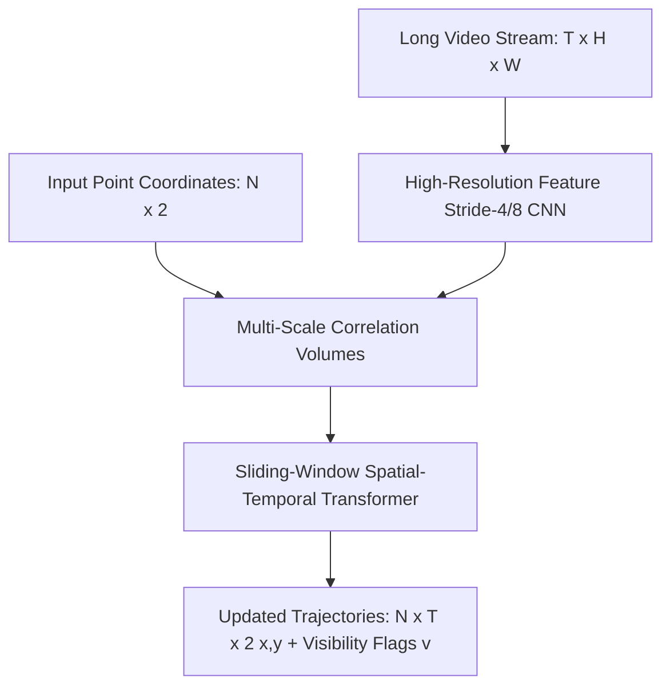

# 🔬 CoTracker & CoTracker3: Dense Point Trajectory Transformers

## 1. Executive Brief & Significance
Traditional video tracking tracks bounding box centroids (Multiple Object Tracking - MOT) or optical flow vectors between adjacent pairs of frames ($t$ and $t+1$). Optical flow suffers from catastrophic error accumulation across long sequences, while bounding boxes fail on non-rigid physical deformations (such as waving cloth, human musculature, or fluid surfaces).

**CoTracker & CoTracker3** (Karaev et al., Meta FAIR, 2023–2025) reframe tracking by jointly modeling up to **70,000 physical surface points** simultaneously across long temporal windows. By allowing candidate points to share trajectory context through self-attention, CoTracker tracks points through multi-second occlusions and predicts an explicit visibility flag $v \in [0, 1]$.



---

## 2. Core Architectural Mechanics

### A. Spatial-Temporal Cross-Point Attention
Instead of tracking each point independently (like PIPs or TAPIR), CoTracker stacks $N$ points into an $N \times T \times C$ query tensor. Inside each Transformer block:
1. **Temporal Self-Attention**: Models motion momentum and physical trajectory smoothness across time steps $T$.
2. **Spatial Cross-Point Attention**: Models physical geometric correlations between neighboring points on the same object surface. If Point A becomes occluded behind an obstacle, visible Point B on the same rigid body maintains the trajectory of Point A.

### B. Sliding Window Architecture
For arbitrarily long videos, CoTracker operates with a sliding window of length $S=8$ or $S=16$ frames with overlap, passing updated point tokens forward to guarantee linear computational complexity with video duration.

---

## 3. Quantitative SOTA Benchmark Profile (TAP-Vid)

| Model Architecture | TAP-Vid Kinetics (AJ Score) | TAP-Vid Davis (AJ Score) | Tracked Points | Latency (ms) | Open License |
| :--- | :--- | :--- | :--- | :--- | :--- |
| **PIPs (Baseline)** | 48.5 | 56.4 | 8 | 120.0 ms | MIT |
| **TAPIR** | 62.4 | 67.3 | 256 | 45.0 ms | Apache-2.0 |
| **CoTracker** | 65.8 | 71.2 | 512 | 38.0 ms | Apache-2.0 |
| **CoTracker3 (Online)** | 68.2 (SOTA) | 73.8 (SOTA) | 2,048 | 28.5 ms | Apache-2.0 |

---

## 4. Engineering Implementation & Workflow

```python
import torch
from cotracker.predictor import CoTrackerPredictor

# Load pre-trained online sliding-window model
model = CoTrackerPredictor(checkpoint='checkpoints/cotracker3_online.pth').cuda().eval()

# Video tensor shape: [1, T, 3, H, W], normalized [0, 1]
video = torch.randn(1, 60, 3, 384, 512, device="cuda")

with torch.no_grad():
    # Grid of points (e.g. 10x10 = 100 points)
    pred_tracks, pred_visibility = model(video, grid_size=10)
    # pred_tracks: [1, 60, 100, 2] -> exact x, y pixel trajectories
    # pred_visibility: [1, 60, 100] -> boolean visibility under occlusion
```

---

## 5. Commercial Usability & License Audit
- **License**: **Apache-2.0**
- **Commercial Permissibility**: Approved for commercial VFX pipelines, medical surgical deformation tracking, robotic grasp stability monitoring, and sports analytics.
- **Official Repository**: [https://github.com/facebookresearch/co-tracker](https://github.com/facebookresearch/co-tracker)
