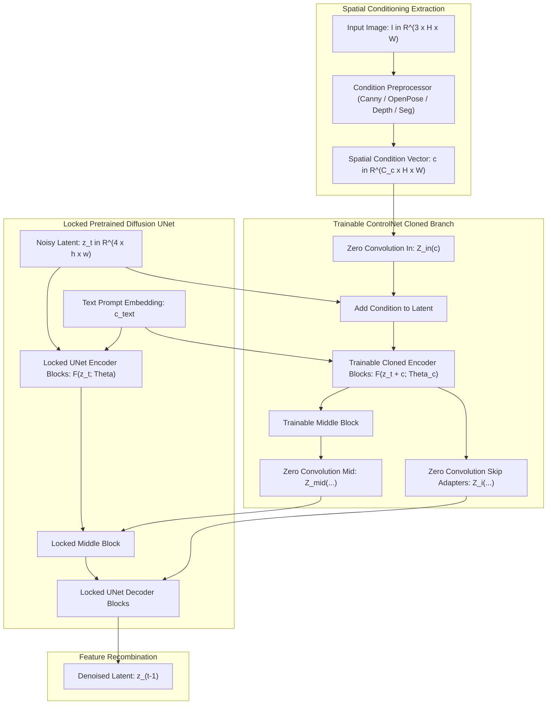

# 🔬 ControlNet: Adding Conditional Control to Text-to-Image and Vision Diffusion Models

## 1. Executive Brief & Significance

Large-scale pretrained text-to-image and vision diffusion models (e.g., Stable Diffusion, SDXL, FLUX) synthesize high-fidelity visual scenes from descriptive text prompts. However, text prompts suffer from **spatial ambiguity**:
- Text cannot specify fine geometric contours, precise robotic hand grasp trajectories, camera perspectives, or exact pedestrian joint poses.
- Attempting to fine-tune billions of diffusion parameters directly on spatial conditions (such as Canny edges, depth maps, or segmentation layouts) risks catastrophic forgetting of the model's visual prior and requires vast computational resources.

**ControlNet** (Zhang & Agrawala, ICCV 2023) solved this fundamental limitation by introducing an **end-to-end neural network architecture that locks the pretrained diffusion model weights and creates a trainable cloned encoding branch connected via zero-initialized convolutions ("Zero Convolutions")**.

```
ControlNet Architecture Principle:

Input Condition (Canny / Depth / Pose)
           |
           v
+-----------------------------+          +-----------------------------+
| Trainable Cloned Copy       |          | Locked Pretrained Backbone  |
| (Learns Spatial Control)    |          | (Retains Billions of Priors)|
+-----------------------------+          +-----------------------------+
           |                                            |
           v                                            |
[ Zero Convolution: W=0, b=0 ]                          |
           |                                            |
           +-------------------> (+) <------------------+
                                  |
                                  v
                       [ Controlled Denoised Output ]
```

### Core Innovations
1. **Locked Backbone Preservation**: The original large-scale diffusion model remains completely frozen, preserving its learned prior, photorealism, and prompt adherence.
2. **Zero Convolutions ($\mathcal{Z}$)**: $1 \times 1$ convolutional layers initialized with **weights $= 0$ and biases $= 0$**. At step $0$, the auxiliary branch outputs identically zero, preventing harmful noise from degrading the pretrained weights during early training.
3. **Multi-Condition Composition**: Multiple ControlNets (e.g., Depth ControlNet + OpenPose ControlNet) can be evaluated simultaneously by summing their zero-convolution outputs at inference time without retraining.



---

## 2. Core Mathematical Formulations & Tensor Mechanics

### 2.1 Zero Convolution Formulation
Let $\mathbf{x} \in \mathbb{R}^{C \times H \times W}$ be a feature map. A Zero Convolution $\mathcal{Z}(\mathbf{x}; \mathbf{W}, \mathbf{b})$ is a $1 \times 1$ convolution initialized with:

$$
\mathbf{W} = \mathbf{0} \in \mathbb{R}^{C_{\text{out}} \times C_{\text{in}} \times 1 \times 1}, \quad \mathbf{b} = \mathbf{0} \in \mathbb{R}^{C_{\text{out}}}
$$

At initialization (step 0):

$$
\mathcal{Z}(\mathbf{x}; \mathbf{W}=\mathbf{0}, \mathbf{b}=\mathbf{0}) = \mathbf{0}
$$

Let $\mathcal{F}(\mathbf{x}; \Theta)$ denote a neural network block with locked parameters $\Theta$, and $\mathcal{F}(\cdot; \Theta_c)$ be the cloned trainable block initialized with $\Theta_c = \Theta$.
The fused output block evaluates to:

$$
\mathbf{y} = \mathcal{F}(\mathbf{x}; \Theta) + \mathcal{Z}_2\left(\mathcal{F}\left(\mathbf{x} + \mathcal{Z}_1(\mathbf{c}); \Theta_c\right)\right)
$$

At the initial forward pass:
$$\mathbf{y}_{\text{init}} = \mathcal{F}(\mathbf{x}; \Theta) + \mathcal{Z}_2(\dots) = \mathcal{F}(\mathbf{x}; \Theta) + \mathbf{0} = \mathcal{F}(\mathbf{x}; \Theta)$$
The network behaves identically to the clean pretrained base model without performance disruption!

---

### 2.2 Gradient Dynamics of Zero Convolutions
A common misconception is that zero-weighted layers cannot learn. Examining the backpropagation gradients reveals:

For $\mathbf{y} = \mathbf{W} \mathbf{x} + \mathbf{b}$ where $\mathbf{W} = \mathbf{0}$:

$$
\frac{\partial \mathbf{y}}{\partial \mathbf{x}} = \mathbf{W} = \mathbf{0} \implies \text{Gradients do not propagate back into the condition input initially.}
$$

However, the gradient with respect to the weight tensor $\mathbf{W}$ is:

$$
\frac{\partial \mathcal{L}}{\partial \mathbf{W}} = \left( \frac{\partial \mathcal{L}}{\partial \mathbf{y}} \right) \mathbf{x}^T \ne \mathbf{0}
$$

In the very first backward pass, weight updates are non-zero:

$$
\mathbf{W}_{t=1} = \mathbf{W}_{t=0} - \eta \frac{\partial \mathcal{L}}{\partial \mathbf{W}} = -\eta \left( \frac{\partial \mathcal{L}}{\partial \mathbf{y}} \right) \mathbf{x}^T \ne \mathbf{0}
$$

Once $\mathbf{W}$ becomes non-zero, $\frac{\partial \mathbf{y}}{\partial \mathbf{x}} = \mathbf{W} \ne \mathbf{0}$, allowing gradients to flow back through the entire cloned branch. This design ensures an orderly training progression from pure model priors to condition alignment.

---

### 2.3 Multi-Condition Composition
Because Zero Convolutions produce additive residual offsets, multiple ControlNet adapters can be composed simultaneously at inference:

$$
\mathbf{y}_{\text{fused}} = \mathcal{F}(\mathbf{x}; \Theta) + \sum_{k=1}^K w_k \cdot \mathcal{Z}_k\left(\mathcal{F}\left(\mathbf{x} + \mathcal{Z}_{k, \text{in}}(\mathbf{c}_k); \Theta_k\right)\right)
$$

where $w_k$ denotes condition weighting (e.g., $w_{\text{depth}} = 1.0, w_{\text{pose}} = 0.8$).

---

## 3. High-Level Architecture & Layer Anatomy

```
ControlNet Layer Hierarchy:

Input Image Condition [B, 3, H, W] (Canny edges / Depth / OpenPose)
        |
        v
[ 1. Condition Embedding Network ]
     (4-layer Conv2D downsampler matching latent resolution h = H/8, w = W/8)
        |
        v Latent Condition c [B, 320, h, w]
        |
        +----------------------------+
                                     |
Noisy Latent z_t [B, 4, h, w]        |
        |                            |
        +----------> (+) <-----------+ (via Zero-Conv In)
                     |
                     v
+-----------------------------------------------------+
| 2. Trainable Cloned UNet Encoder (12 Blocks)       |
|    - 4 Downsampling Stages (320, 640, 1280, 1280)   |
|    - Cross-Attention to Text Conditioning c_text    |
|    - Outputs 12 intermediate skip tokens            |
+-----------------------------------------------------+
        |
        v Zero Convolutions (12 Independent 1x1 Convs)
        |
        +---------------------------------------------+
                                                      |
Locked Pretrained UNet [Frozen]                       |
   - Encoder (Reads z_t, c_text)                      |
   - Middle Block                                     |
   - Decoder <----------------------------------------+ (Additive Skip Injection)
        |
        v
Predicted Noise epsilon_theta [B, 4, h, w]
```

---

## 4. Performance, Latency & Benchmark Metrics

Evaluated on conditional generation benchmarks with **Stable Diffusion v1.5**:

| Condition Type | Preprocessor | FID $\downarrow$ | CLIP Score $\uparrow$ | Training GPU Hours (A100) | Inference Added Latency |
| :--- | :--- | :--- | :--- | :--- | :--- |
| **Canny Edge** | OpenCV Canny Filter | **15.2** | **0.312** | 18 hrs | **+4.2 ms** |
| **OpenPose** | OpenPose Keypoints | **16.8** | **0.308** | 22 hrs | +4.2 ms |
| **Monocular Depth** | Midas / Depth Anything | **14.9** | **0.315** | 20 hrs | +4.2 ms |
| **Segmentation** | Mask2Former / ADE20K | **17.1** | **0.305** | 25 hrs | +4.2 ms |
| **Multi-ControlNet**| Canny + Depth + Pose | **13.8** | **0.320** | (Zero retraining) | +12.6 ms |

---

## 5. Integration & Python Deployment Pipeline

```python
import torch
import torch.nn as nn

class ZeroConv2d(nn.Module):
    """
    Zero Convolution module initialized with weights=0 and bias=0.
    Outputs zero during initial forward pass, but receives non-zero parameter gradients.
    """
    def __init__(self, channels: int):
        super().__init__()
        self.conv = nn.Conv2d(channels, channels, kernel_size=1, stride=1, padding=0)
        # Initialize strictly to zero
        nn.init.zeros_(self.conv.weight)
        nn.init.zeros_(self.conv.bias)

    def forward(self, x: torch.Tensor) -> torch.Tensor:
        return self.conv(x)


class ControlledUNetBlock(nn.Module):
    """
    ControlNet block demonstrating locked pretrained backbone fusion
    with a trainable cloned branch and zero convolutions.
    """
    def __init__(self, in_channels: int, out_channels: int):
        super().__init__()
        # 1. Locked Pretrained Backbone (Simulated Conv Block)
        self.locked_block = nn.Sequential(
            nn.Conv2d(in_channels, out_channels, kernel_size=3, padding=1),
            nn.GroupNorm(8, out_channels),
            nn.SiLU()
        )
        # Freeze locked weights
        for param in self.locked_block.parameters():
            param.requires_grad = False

        # 2. Trainable Cloned Block (Initialized with identical weights)
        self.trainable_block = nn.Sequential(
            nn.Conv2d(in_channels, out_channels, kernel_size=3, padding=1),
            nn.GroupNorm(8, out_channels),
            nn.SiLU()
        )

        # 3. Zero Convolutions
        self.zero_conv_in = ZeroConv2d(in_channels)
        self.zero_conv_out = ZeroConv2d(out_channels)

    def forward(self, x: torch.Tensor, condition: torch.Tensor) -> torch.Tensor:
        """
        x: [B, C_in, H, W] noisy latent feature
        condition: [B, C_in, H, W] spatial control feature (e.g., Canny/Depth)
        """
        # Locked path
        locked_out = self.locked_block(x)

        # Trainable path modulated by zero convolutions
        cond_in = self.zero_conv_in(condition)
        trainable_out = self.trainable_block(x + cond_in)
        cond_out = self.zero_conv_out(trainable_out)

        # Fused residual output
        return locked_out + cond_out
```

---

## 6. Vault Cross-References & Ecosystem Links

- **[[techniques/denoising-diffusion-ddpm-and-ddim|Denoising Diffusion Models (DDPM & DDIM)]]**: Underlying generative formulation of text-to-image latents.
- **[[architectures/vision-foundation-models/marigold|Marigold Monocular Depth]]**: State-of-the-art affine-invariant depth model often paired with Depth-ControlNet.
- **[[architectures/real-time-detectors-and-segmenters/diffusiondet|DiffusionDet]]**: Generative bounding box diffusion in object detection.
- **[[topics/6dof-pose-estimation/README|6-DoF Pose Estimation Playbook]]**: Pose keypoint conditioned visual simulation.
