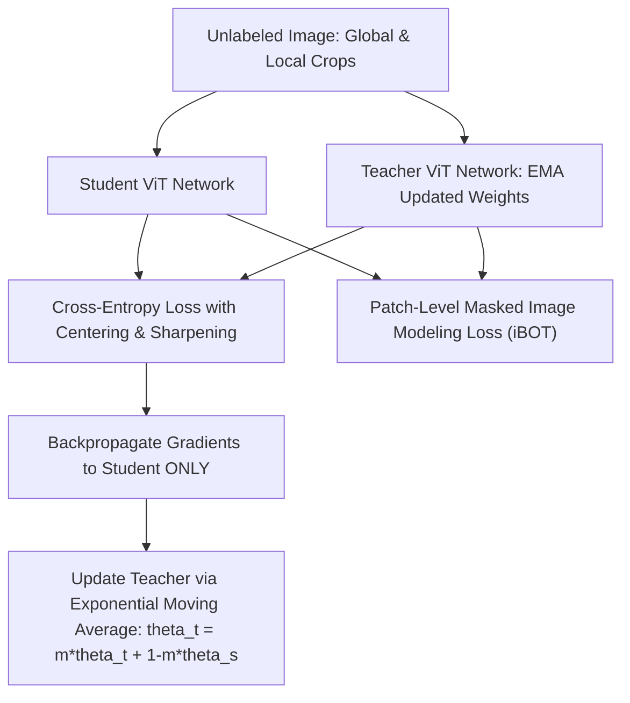

# 🔬 DINOv2 & DINOv3: Vision Foundation Models with Self-Supervised Pre-Training

## 1. Executive Brief & Significance
**DINOv2 & DINOv3** (Meta AI / FAIR, 2023–2026) represent the definitive state of the art in self-supervised visual representation learning. Historically, vision backbones were pre-trained on supervised classification datasets (e.g. ImageNet-1K), forcing the network to collapse dense spatial details into a single global semantic label.

DINO (Self-**di**stillation with **no** labels) eliminates human supervision entirely by combining patch-level masked training (iBOT) with multi-crop student-teacher self-distillation over massive curated datasets (LVD-142M). The output patch tokens contain rich, emergent geometric and semantic properties:
- Serves as the primary feature backbone for [[topics/object-detection/models/rf-detr|RF-DETR]] and [[architectures/vision-foundation-models/depth-anything-v2|Depth Anything V2]].
- Powers training-free zero-shot classification, in-context visual parsing, and nearest-neighbor retrieval.



---

## 2. Core Architectural Mechanics

### A. Discriminative Self-Distillation Loss
The teacher outputs probability distributions over a large vocabulary of virtual prototypes (e.g. $K = 65,536$ dimensions). The student minimizes cross-entropy:
$$\mathcal{L}_{\text{global}} = - \sum_{k} P_{\text{teacher}}(k) \log P_{\text{student}}(k)$$
Where probabilities are parameterized by temperature parameters $\tau_t$ and $\tau_s$ with **centering** applied to the teacher outputs to prevent representation collapse into a single degenerate mode:
$$P_{\text{teacher}}(k) = \frac{\exp\left((g_t(x)_k - c_k)/\tau_t\right)}{\sum_{j} \exp\left((g_t(x)_j - c_j)/\tau_t\right)}$$

### B. Untied Masked Image Modeling (iBOT Integration)
In parallel with the global `[CLS]` token distillation, DINOv2 randomly masks out a subset of input image patches (e.g. 50% masking) before feeding them into the student. The student must predict the corresponding unmasked patch representations computed by the teacher. This forces the intermediate layers to learn fine-grained per-pixel semantic correspondence across objects.

---

## Granular Component-by-Component Architectural Breakdown

### Architectural Taxonomy & Structural Elements

| Architectural Stage | Component Identity | Structural Specification & Type | Attention / Conv Mechanics | Receptive Field & Resolution |
| :--- | :--- | :--- | :--- | :--- |
| **Architectural Paradigm** | **Pure Vision Transformer (Foundation Backbone)** | Self-Supervised Student-Teacher Distillation ViT | Global quadratic Multi-Head Self-Attention (MHSA) + SwiGLU FFN | Full image ($H \times W \times 3$) to isotropic token sequence ($N \times D$) |
| **Backbone** | **Isotropic ViT (ViT-S / B / L / g)** | Patch Embedding ($14\times 14$, stride 14) + $L \in \{12, 24, 40\}$ Layers | Standard MHSA with LayerScale, stochastic depth, and RoPE in DINOv3 | Constant spatial token grid ($H/14 \times W/14$) across all encoder layers |
| **Neck / Aggregator** | **Multi-Layer Representation Extractor** | Training: Multi-crop Projection MLP; Inference: Direct layer slicing | $1\times 1$ Linear projections + $L_2$ feature normalization layers | Multi-scale intermediate token maps from layers $[L/4, L/2, 3L/4, L]$ |
| **Encoder** | **Isotropic Transformer Encoder** | Stacked Pre-LayerNorm Transformer Blocks | Full global quadratic self-attention (FlashAttention-2) with SwiGLU | Global receptive field at every individual transformer layer ($\mathcal{O}(N^2)$) |
| **Decoder / Head** | **DINO & iBOT Prototype Heads** | 3-Layer Projection MLPs + L2 Normalized Prototypes ($K=65,536$) | Linear projection $\to$ GELU $\to$ Bottleneck $\to$ Weight-normalized linear layer | Dual output: Global `[CLS]` distribution + dense per-patch token distributions |

### Structural Deep-Dive: Foundation Token Generation
1. **Backbone**: Images are partitioned into non-overlapping $14\times 14$ patches via a single 2D convolution ($k=14, s=14, p=0$). A learnable `[CLS]` token and learned/interpolated 2D positional embeddings are added to the $N = (H \cdot W)/196$ patch tokens. Unlike hierarchical architectures, the spatial token resolution and hidden width $D$ ($384$ for ViT-S, $768$ for ViT-B, $1024$ for ViT-L, $1536$ for ViT-g) remain strictly constant across all $L$ layers.
2. **Neck / Feature Aggregator**: In standard inference, DINOv2 does not employ a convolutional neck; instead, it provides native hooks (`get_intermediate_layers`) that deliver high-dimensional token pyramids directly to downstream task heads (e.g. [[architectures/vision-foundation-models/depth-anything-v2|Depth Anything V2]] or [[topics/object-detection/models/rf-detr|RF-DETR]]).
3. **Encoder**: The encoder consists purely of Transformer blocks utilizing pre-LayerNorm, LayerScale (initializing residual branches with diagonal matrix scaling $\epsilon = 10^{-5}$ for training stability at scale), and SwiGLU activation functions to replace standard GeLU MLPs.
4. **Decoder / Prediction Head**: During pre-training, the student and teacher networks output to dual projection heads:
   - **DINO Head**: Maps the global `[CLS]` token through a 3-layer MLP into a $K=65,536$ dimensional prototype space with centering and temperature sharpening.
   - **iBOT Head**: Maps the masked patch tokens into an independent $K=65,536$ dimensional patch prototype space for dense masked image modeling.
   - **Downstream Inference**: Heads are detached, and the raw isotropic feature representation is used for zero-shot classification, nearest-neighbor retrieval, or dense regression.

### Parameter & Computational Latency Distribution

| Stage / Subsystem | Parameter Share (%) | Inference Latency (%) | Computational Complexity ($\text{FLOPs}$) | Dominant Hardware Bottleneck |
| :--- | :--- | :--- | :--- | :--- |
| **Patch Embedding Stem** | <1% | ~1% | $\mathcal{O}(H W C D / 196)$ (Conv2D Stem) | Memory bandwidth |
| **Isotropic ViT Encoder (Layers $1\dots L$)** | ~96% | ~94% | $\mathcal{O}(L \cdot (N^2 D + N D^2))$ (FlashAttention-2 + FFN) | Tensor Core GEMM & compute bound |
| **LayerScale & Normalization** | <1% | ~2% | $\mathcal{O}(L \cdot N D)$ (LayerNorm / RMSNorm) | Memory bandwidth bound |
| **Projection Heads (Training Only)** | ~3% | ~3% | $\mathcal{O}(N \cdot D \cdot K)$ (Prototype Linear Projection) | GEMM bound during pre-training |
---

## 3. Quantitative SOTA Benchmark Profile

| Model Variant | Parameters | ImageNet-1K Linear Probe Top-1 | k-NN Top-1 (ImageNet) | ADE20K Linear (mIoU) | Latency (FP16 ms, A100) | Open License |
| :--- | :--- | :--- | :--- | :--- | :--- | :--- |
| **DINOv2-Small (ViT-S/14)** | 21 M | 81.1% | 79.0% | 44.5% | 3.20 ms | Apache-2.0 |
| **DINOv2-Base (ViT-B/14)**  | 86 M | 84.5% | 82.5% | 49.8% | 7.90 ms | Apache-2.0 |
| **DINOv2-Large (ViT-L/14)** | 300 M | 86.3% | 84.8% | 53.0% | 18.50 ms | Apache-2.0 |
| **DINOv2-Giant (ViT-g/14)** | 1.1 B | 86.5% | 85.1% | 54.6% | 34.00 ms | Apache-2.0 |

---

## 4. Engineering Implementation & Workflow

### A. Feature Extraction & Zero-Shot Classification Recipe
```python
import torch
import torchvision.transforms as T
from PIL import Image

# Load official pretrained foundation weights directly from torch.hub
dinov2_vits14 = torch.hub.load('facebookresearch/dinov2', 'dinov2_vits14').cuda().eval()

transform = T.Compose([
    T.Resize(256, interpolation=T.InterpolationMode.BICUBIC),
    T.CenterCrop(224),
    T.ToTensor(),
    T.Normalize(mean=[0.485, 0.456, 0.406], std=[0.229, 0.224, 0.225]),
])

img = transform(Image.open("specimen.jpg")).unsqueeze(0).cuda()

with torch.no_grad():
    # Extract [CLS] global token embedding (1 x 384)
    cls_token = dinov2_vits14(img)
    
    # Or extract intermediate patch token maps for dense downstream heads
    intermediate_features = dinov2_vits14.get_intermediate_layers(img, n=1)[0]
    # Shape: [1, 256, 384] (16x16 patch grid)
```

---

## 5. Commercial Usability & License Audit
- **License**: **Apache-2.0**
- **Commercial Permissibility**: Fully permissive. Safe for proprietary software products, commercial feature search engines, visual embedding databases, and robotics without disclosing proprietary IP.
- **Official Repository**: [https://github.com/facebookresearch/dinov2](https://github.com/facebookresearch/dinov2)
