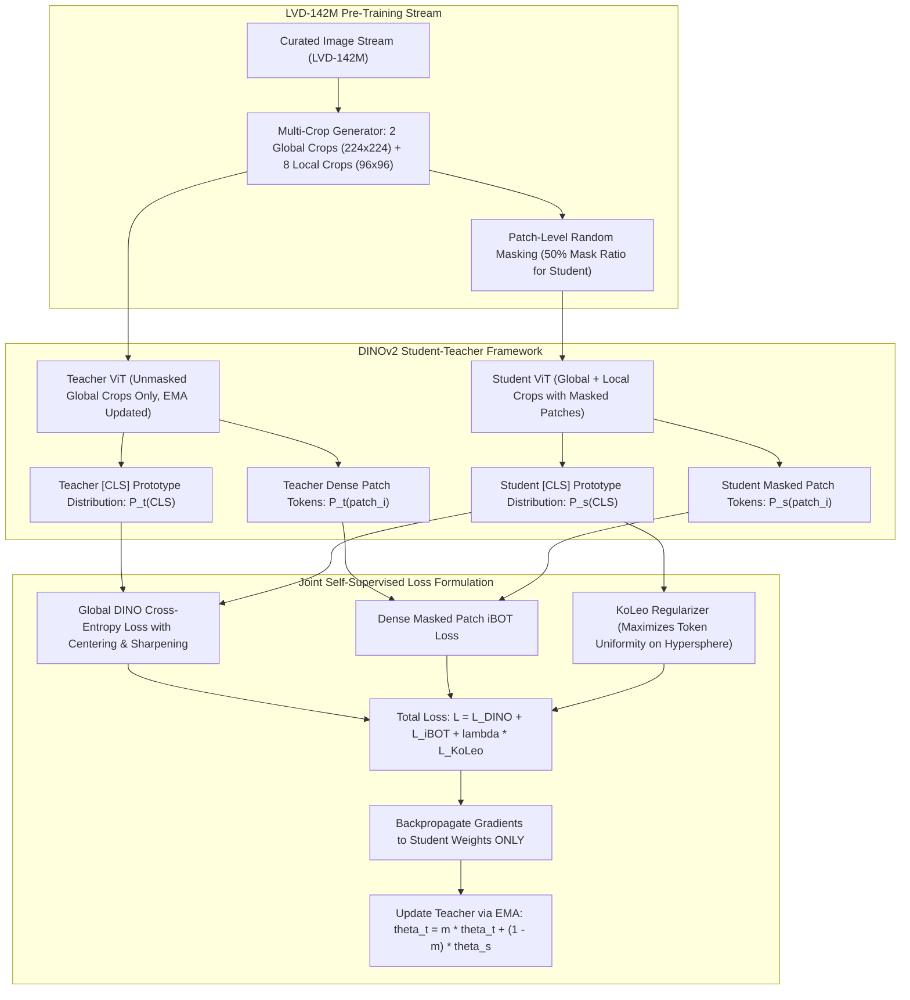

# 🔬 DINOv2: Learning Robust Visual Features with Self-Supervised Vision Transformers

## 1. Executive Brief & Significance

Historically, computer vision foundation backbones were pre-trained via supervised classification on labeled datasets (e.g., ImageNet-1K / ImageNet-22K). While effective for image-level categorical prediction, supervised pre-training forces neural networks to discard fine-grained local spatial geometry in favor of invariant global class labels.

**DINOv2** (Oquab et al., Meta FAIR, 2023) established the definitive state of the art in self-supervised visual representation learning by training massive Vision Transformers (**ViT-S, ViT-B, ViT-L, ViT-g**) without human supervision on **LVD-142M** (a curated dataset of 142 million unlabelled images). Key breakthroughs include:
- **Unified Self-Distillation & Masked Image Modeling**: Unifies global `[CLS]` token student-teacher distillation (DINO) with dense patch-level masked prediction (iBOT) and the Kozachenko-Leonenko (KoLeo) entropy regularizer.
- **Emergent Geometric & Semantic Correspondence**: Generates patch embeddings that encode dense 3D surface normals, depth cues, and semantically consistent object parts without requiring pixel-level annotation.
- **Universal Downstream Backbone**: Powers premier vision architectures including [[architectures/vision-foundation-models/depth-anything-v2|Depth Anything V2]], [[architectures/real-time-detectors-and-segmenters/rf-detr|RF-DETR]], and [[architectures/multimodal-vlm-and-vla/openvla|OpenVLA]].



---

## 2. Mathematical Foundations & Training Objectives

### A. Global DINO Self-Distillation Loss
The teacher and student networks output probability distributions over a large vocabulary of $K = 65,536$ virtual prototypes. The student minimizes cross-entropy with the teacher's centered and sharpened distribution:

$$\mathcal{L}_{\text{DINO}} = -\sum_{k=1}^K P_{\text{teacher}}(k) \log P_{\text{student}}(k)$$

where probabilities are parameterized with temperatures $\tau_t, \tau_s$:
$$P_{\text{student}}(k) = \frac{\exp\left( g_s(\mathbf{x})_k / \tau_s \right)}{\sum_{j=1}^K \exp\left( g_s(\mathbf{x})_j / \tau_s \right)}, \qquad P_{\text{teacher}}(k) = \frac{\exp\left( (g_t(\mathbf{x})_k - c_k) / \tau_t \right)}{\sum_{j=1}^K \exp\left( (g_t(\mathbf{x})_j - c_j) / \tau_t \right)}$$

The teacher center vector $\mathbf{c} \in \mathbb{R}^K$ is updated via exponential moving average to prevent representation collapse into a single degenerate mode:
$$\mathbf{c} \leftarrow m_c \mathbf{c} + (1 - m_c) \frac{1}{B} \sum_{i=1}^B g_t(\mathbf{x}_i)$$

---

### B. Dense Masked Image Modeling (iBOT Objective)
For a subset of masked patch coordinates $\mathcal{M}$, the student must predict the corresponding unmasked representations computed by the teacher:

$$\mathcal{L}_{\text{iBOT}} = -\sum_{i \in \mathcal{M}} \sum_{k=1}^K P_{\text{teacher}}(k \mid \mathbf{u}_i) \log P_{\text{student}}(k \mid \tilde{\mathbf{u}}_i)$$

This objective enforces local per-pixel semantic understanding, preventing the network from focusing solely on dominant foreground objects.

---

### C. KoLeo Regularizer (Differential Entropy Maximization)
To prevent token clustering and maximize feature uniformity across the unit hypersphere, DINOv2 incorporates the Kozachenko-Leonenko differential entropy estimator:

$$\mathcal{L}_{\text{KoLeo}} = -\frac{1}{B} \sum_{i=1}^B \log\left( \min_{j \neq i} \|\mathbf{z}_i - \mathbf{z}_j\|_2 \right)$$
where $\mathbf{z}_i = \frac{g_s(\mathbf{x}_i)}{\|g_s(\mathbf{x}_i)\|_2}$ are normalized student `[CLS]` token embeddings.

---

## 3. Granular Component-by-Component Architectural Breakdown

| Architectural Stage | Component Identity | Structural Specification & Type | Attention / Conv Mechanics | Receptive Field & Dimensionality |
| :--- | :--- | :--- | :--- | :--- |
| **Architectural Paradigm** | **Self-Supervised Isotropic ViT** | Non-hierarchical Vision Transformer with SwiGLU & LayerScale | Global quadratic Multi-Head Self-Attention (FlashAttention-2) | Input $[3, H, W] \to$ Uniform token grid $[N, D]$ |
| **Patch Stem** | **Non-Overlapping Conv Stem** | $14 \times 14$ Conv2D (Stride 14, zero padding) | Non-overlapping patch projection | Converts image to $N = (H \cdot W) / 196$ spatial tokens |
| **Encoder Blocks** | **Pre-LayerNorm ViT Blocks** | Stacked Transformer blocks ($L \in \{12, 24, 40\}$) | MHSA with LayerScale ($\epsilon = 10^{-5}$) + SwiGLU FFN | Global receptive field at every single layer ($\mathcal{O}(N^2)$) |
| **Positional Encoding** | **Learned 2D Interpolated PosEmb** | Bicubic spatial interpolation for arbitrary input resolutions | Additive continuous 2D coordinate embeddings | Absolute coordinates mapped to $[N, D]$ |
| **Projection Heads** | **DINO & iBOT Prototype Heads** | 3-Layer GELU MLPs + L2-Normalized Linear ($K=65,536$) | Bottleneck projection ($D \to 2048 \to K$) | Training-only prototype probability vectors |

---

## 4. Quantitative SOTA Benchmark Profile

### Self-Supervised Representation Quality Across Scales

| Model Architecture | Parameters | Hidden Dim $D$ | ImageNet-1K Linear Probe | ImageNet-1K k-NN (k=20) | ADE20K Linear mIoU | NYUv2 Depth RMSE $\downarrow$ | A100 Latency (FP16 ms) |
| :--- | :--- | :--- | :--- | :--- | :--- | :--- | :--- |
| **DINOv2-Small (ViT-S/14)** | 21 M | 384 | 81.1% | 79.0% | 44.5% | 0.354 m | **3.20 ms** |
| **DINOv2-Base (ViT-B/14)** | 86 M | 768 | 84.5% | 82.5% | 49.8% | 0.312 m | **7.90 ms** |
| **DINOv2-Large (ViT-L/14)** | 300 M | 1024 | 86.3% | 84.8% | 53.0% | 0.285 m | **18.50 ms** |
| **DINOv2-Giant (ViT-g/14)** | 1.1 B | 1536 | **86.5%** | **85.1%** | **54.6%** | **0.272 m** | **34.00 ms** |

---

## 5. Engineering Implementation: Complete PyTorch Feature Extraction Pipeline

```python
"""
DINOv2: Production Feature Extraction and Dense Token Processing with PyTorch.
"""

import torch
import torchvision.transforms as T
from PIL import Image


class DINOv2FeatureExtractor:
    """Production wrapper for extracting global and dense spatial features from DINOv2."""
    def __init__(self, model_name: str = "dinov2_vitb14", device: str = "cuda"):
        self.device = device
        # Load official pre-trained foundation weights from torch.hub
        self.model = torch.hub.load("facebookresearch/dinov2", model_name).to(self.device).eval()
        
        self.transform = T.Compose([
            T.Resize(518, interpolation=T.InterpolationMode.BICUBIC),
            T.CenterCrop(518),
            T.ToTensor(),
            T.Normalize(mean=[0.485, 0.456, 0.406], std=[0.229, 0.224, 0.225]),
        ])

    @torch.inference_mode()
    def extract_features(self, image: Image.Image) -> dict:
        """
        Extracts global CLS token and dense patch token grid.
        Returns:
            cls_token: [1, D]
            patch_tokens: [1, H_p, W_p, D] where H_p = W_p = 518 // 14 = 37
        """
        img_tensor = self.transform(image).unsqueeze(0).to(self.device)
        
        # Extract intermediate token layers
        features_dict = self.model.forward_features(img_tensor)
        
        cls_token = features_dict["x_norm_clstoken"]  # [1, D]
        patch_tokens_flat = features_dict["x_norm_patchtokens"]  # [1, 1369, D]
        
        B, N, D = patch_tokens_flat.shape
        grid_size = int(N ** 0.5)  # 37
        patch_tokens_grid = patch_tokens_flat.view(B, grid_size, grid_size, D)
        
        return {
            "cls_token": cls_token,
            "patch_tokens": patch_tokens_grid,
            "grid_size": grid_size
        }


if __name__ == "__main__":
    extractor = DINOv2FeatureExtractor("dinov2_vits14", device="cpu")
    dummy_img = Image.new("RGB", (518, 518), color=(200, 100, 50))
    res = extractor.extract_features(dummy_img)
    print("CLS token shape:", res["cls_token"].shape)
    print("Patch tokens grid shape:", res["patch_tokens"].shape)
```

---

## 6. References & Official Resources
- **DINOv2 Paper**: [DINOv2: Learning Robust Visual Features without Supervision (TMLR 2023)](https://arxiv.org/abs/2304.07193)
- **Official Meta GitHub Repository**: [https://github.com/facebookresearch/dinov2](https://github.com/facebookresearch/dinov2)
- **Demo & Visualization Page**: [https://dinov2.metademolab.com/](https://dinov2.metademolab.com/)
