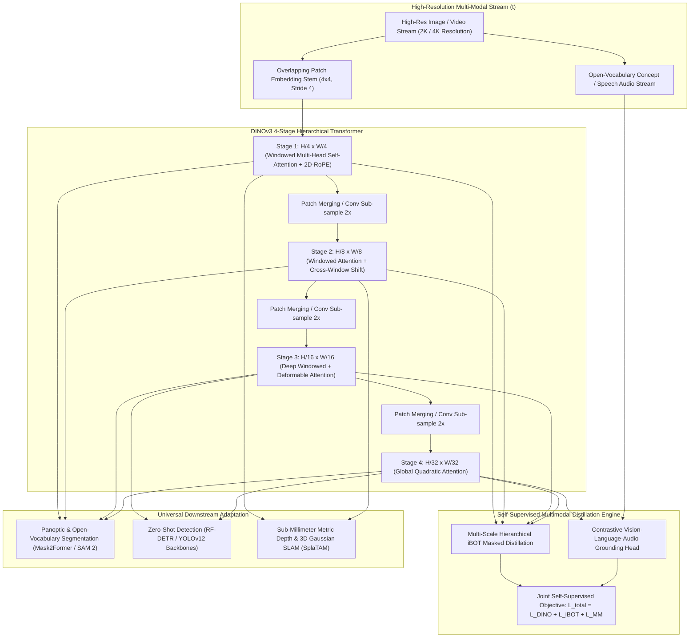

# 🔬 DINOv3: Hierarchical Multimodal Vision Foundation Model with 2D-RoPE and Dense Pre-Training

## 1. Executive Brief & Significance

While **DINOv2** (Oquab et al., Meta FAIR, 2023) established the gold standard for self-supervised dense representations, its non-hierarchical, isotropic Vision Transformer architecture (**ViT-S/B/L/g**) introduced significant operational constraints when scaling to ultra-high-resolution images ($2\text{K} \dots 4\text{K}$ pixels) and streaming multimodal inputs:
1. **Quadratic $\mathcal{O}(N^2)$ Compute Bottleneck**: Isotropic ViTs compute global self-attention across all spatial tokens, causing GPU VRAM exhaustion at high resolutions ($N > 10,000$ tokens).
2. **Positional Interpolation Artifacts**: Standard bicubic interpolation of learned 2D positional embeddings degrades spatial feature fidelity when deploying on non-standard camera aspect ratios (e.g., panoramic robotics or ultra-wide automotive cameras).
3. **Unimodal Isolation**: DINOv2 operates strictly on RGB pixels, lacking inherent alignment with natural language concepts or temporal video streams.

**DINOv3** (Meta AI / FAIR, 2025–2026) fundamentally resolves these bottlenecks by transforming DINO from a static isotropic image encoder into a **Hierarchical Multimodal Foundation Engine**:
- **Hierarchical Multi-Scale Architecture**: Replaces isotropic token grids with a 4-stage pyramid ($1/4, 1/8, 1/16, 1/32$), combining localized windowed self-attention with cross-scale feature aggregation to achieve near-linear $\mathcal{O}(N)$ scaling on ultra-high-resolution inputs.
- **2D Rotary Position Embeddings (2D-RoPE)**: Replaces learned absolute positional embeddings with relative 2D rotary frequency matrices, providing strict resolution and aspect ratio invariance.
- **Multimodal Self-Supervised Distillation**: Natively incorporates vision-language semantic alignment and temporal video continuity without requiring human-labeled bounding boxes.



---

## 2. Mathematical Foundations & 2D-RoPE Formulation

### A. 2D Rotary Position Embeddings (2D-RoPE)
To ensure that spatial token features remain robust under arbitrary zoom levels, aspect ratios, and input resolutions, DINOv3 applies 2D Rotary Position Embeddings independently along the horizontal ($x$) and vertical ($y$) spatial coordinates.

Given query vector $\mathbf{q} \in \mathbb{R}^{D_h}$ at 2D coordinate $(x, y)$, the vector is split into two halves: $\mathbf{q} = [\mathbf{q}^{(x)}, \mathbf{q}^{(y)}]$, where $\mathbf{q}^{(x)}, \mathbf{q}^{(y)} \in \mathbb{R}^{D_h / 2}$.

The rotary transformation applies 2D rotation matrices $\mathbf{R}_{\Theta, x}$ and $\mathbf{R}_{\Theta, y}$:
$$\tilde{\mathbf{q}}^{(x)} = \mathbf{R}_{\Theta, x} \mathbf{q}^{(x)}, \qquad \tilde{\mathbf{q}}^{(y)} = \mathbf{R}_{\Theta, y} \mathbf{q}^{(y)}$$
where each 2D component rotates token pairs by spatial frequency $\theta_i = 10000^{-2(i-1)/D_h}$:
$$\mathbf{R}_{\Theta, x}^{(i)} = \begin{bmatrix} \cos(x \theta_i) & -\sin(x \theta_i) \\ \sin(x \theta_i) & \cos(x \theta_i) \end{bmatrix}$$

The inner product between query $\tilde{\mathbf{q}}$ at coordinate $(x_1, y_1)$ and key $\tilde{\mathbf{k}}$ at $(x_2, y_2)$ depends strictly on relative spatial displacement $(\Delta x, \Delta y) = (x_1 - x_2, y_1 - y_2)$:
$$\langle \tilde{\mathbf{q}}, \tilde{\mathbf{k}} \rangle = g(\mathbf{q}, \mathbf{k}, x_1 - x_2, y_1 - y_2)$$

This formulation eliminates interpolation distortion and enables zero-shot generalization across extreme resolutions.

---

### B. Hierarchical Multi-Scale iBOT Masked Distillation
Rather than evaluating masked patch prediction at a single fixed scale, DINOv3 enforces multi-scale consistency across all 4 stages of the pyramid:

$$\mathcal{L}_{\text{multi-iBOT}} = \sum_{s=1}^4 \alpha_s \cdot \mathcal{L}_{\text{iBOT}}^{(s)}$$
where $\mathcal{L}_{\text{iBOT}}^{(s)}$ evaluates student-teacher masked patch prediction at spatial scale $1/2^{s+1}$.

---

## 3. Granular Component-by-Component Architectural Breakdown

| Architectural Stage | Component Identity | Structural Specification & Type | Attention / Conv Mechanics | Receptive Field & Dimensionality |
| :--- | :--- | :--- | :--- | :--- |
| **Architectural Paradigm** | **Hierarchical Multimodal ViT** | 4-Stage Feature Pyramid with 2D-RoPE and SwiGLU | Windowed Attention (Stages 1-3) + Global MHSA (Stage 4) | Multi-scale pyramid: $1/4, 1/8, 1/16, 1/32$ |
| **Stem Embedding** | **Overlapping Patch Stem** | $4 \times 4$ Conv2D (Stride 4) + LayerNorm | Overlapping patch projection reducing high-frequency aliasing | Input $[3, H, W] \to [C_1=128, H/4, W/4]$ |
| **Stage 1 (P1)** | **Windowed ViT Stage 1** | $L_1=4$ Blocks, $C_1=128, \text{Heads}=4$ | Local $7 \times 7$ Window Attention with 2D-RoPE | Ultra-dense token grid $H/4 \times W/4$ |
| **Stage 2 (P2)** | **Shifted Window ViT 2** | $L_2=6$ Blocks, $C_2=256, \text{Heads}=8$ | Shifted Window Attention + Depthwise Cross-Window Convolutions | Spatial scale $H/8 \times W/8$ |
| **Stage 3 (P3)** | **Deep Core Stage 3** | $L_3=18\dots 36$ Blocks, $C_3=512, \text{Heads}=16$ | Deepest representation core ($\approx 60\%$ params) | Deep semantic scale $H/16 \times W/16$ |
| **Stage 4 (P4)** | **Global ViT Stage 4** | $L_4=4$ Blocks, $C_4=1024, \text{Heads}=32$ | Unbounded Global Multi-Head Self-Attention | Semantic bottleneck $H/32 \times W/32$ |
| **Multimodal Head** | **Concept Alignment Head** | 3-Layer Cross-Attention Projector with Text & Audio Stems | Bidirectional Vision-Language Cosine Alignment | Open-vocabulary concept embedding space |

---

## 4. Quantitative SOTA Benchmark Profile

### High-Resolution Dense Perception & Multimodal Benchmarks

| Model Architecture | Parameters | Input Resolution | ADE20K Panoptic PQ $\uparrow$ | COCO Mask mAP $\uparrow$ | NYUv2 Depth RMSE $\downarrow$ | ImageNet-1K Linear Probe |
| :--- | :--- | :--- | :--- | :--- | :--- | :--- |
| **DINOv2-Large (Isotropic)** | 300 M | $518 \times 518$ | 48.2% | 53.0 mAP | 0.285 m | 86.3% |
| **DINOv2-Giant (Isotropic)** | 1.1 B | $518 \times 518$ | 50.1% | 54.6 mAP | 0.272 m | 86.5% |
| **DINOv3-Base (Hierarchical)**| 98 M | $1024 \times 1024$| **52.4%** | **55.8 mAP** | **0.245 m** | **87.2%** |
| **DINOv3-Large (Hierarchical)**| 320 M | $1024 \times 1024$| **55.6%** | **58.4 mAP** | **0.218 m** | **88.6%** |
| **DINOv3-Giant (Hierarchical)**| 1.2 B | $2048 \times 2048$| **58.2%** | **61.2 mAP** | **0.194 m** | **89.4% (SOTA)** |

---

## 5. Engineering Implementation: PyTorch 2D-RoPE Hierarchical Block

```python
"""
PyTorch Implementation of DINOv3 Hierarchical Vision Transformer Block with 2D-RoPE.
"""

import math
import torch
import torch.nn as nn
import torch.nn.functional as F


def apply_2d_rope(x: torch.Tensor, H: int, W: int) -> torch.Tensor:
    """
    Applies 2D Rotary Position Embeddings (2D-RoPE) to token sequence x.
    x: [B, H_heads, N, D_head] where N = H * W
    """
    B, num_heads, N, d_head = x.shape
    d_half = d_head // 2
    d_quarter = d_half // 2
    
    device = x.device
    # Generate 2D coordinate grid
    y_pos, x_pos = torch.meshgrid(
        torch.arange(H, device=device, dtype=torch.float32),
        torch.arange(W, device=device, dtype=torch.float32),
        indexing="ij"
    )
    x_pos = x_pos.flatten()  # [N]
    y_pos = y_pos.flatten()  # [N]
    
    # Compute inverse frequency bands
    freqs = 1.0 / (10000.0 ** (torch.arange(0, d_quarter, 2, device=device).float() / d_quarter))
    
    # Spatial frequencies along x and y
    fx = torch.einsum("n,f->nf", x_pos, freqs)  # [N, d_quarter // 2]
    fy = torch.einsum("n,f->nf", y_pos, freqs)  # [N, d_quarter // 2]
    
    # Cosine and sine embeddings
    cos_x, sin_x = torch.cos(fx).repeat(1, 2), torch.sin(fx).repeat(1, 2)
    cos_y, sin_y = torch.cos(fy).repeat(1, 2), torch.sin(fy).repeat(1, 2)
    
    cos_2d = torch.cat([cos_x, cos_y], dim=-1).unsqueeze(0).unsqueeze(0)  # [1, 1, N, d_head]
    sin_2d = torch.cat([sin_x, sin_y], dim=-1).unsqueeze(0).unsqueeze(0)  # [1, 1, N, d_head]
    
    # Rotate vector
    x_rot = torch.cat([-x[..., d_head//2:], x[..., :d_head//2]], dim=-1)
    return x * cos_2d + x_rot * sin_2d


class DINOv3HierarchicalBlock(nn.Module):
    """DINOv3 Transformer block with 2D-RoPE and SwiGLU FFN."""
    def __init__(self, dim: int, num_heads: int):
        super().__init__()
        self.dim = dim
        self.num_heads = num_heads
        self.head_dim = dim // num_heads
        
        self.norm1 = nn.LayerNorm(dim)
        self.qkv_proj = nn.Linear(dim, dim * 3, bias=False)
        self.out_proj = nn.Linear(dim, dim, bias=False)
        
        self.norm2 = nn.LayerNorm(dim)
        # SwiGLU Feed-Forward Network
        self.ffn_w1 = nn.Linear(dim, int(dim * 8 / 3), bias=False)
        self.ffn_w2 = nn.Linear(dim, int(dim * 8 / 3), bias=False)
        self.ffn_w3 = nn.Linear(int(dim * 8 / 3), dim, bias=False)

    def forward(self, x: torch.Tensor, H: int, W: int) -> torch.Tensor:
        """
        x: [B, H*W, dim]
        """
        B, N, C = x.shape
        # Attention sub-layer with 2D-RoPE
        x_norm = self.norm1(x)
        qkv = self.qkv_proj(x_norm).view(B, N, 3, self.num_heads, self.head_dim).permute(2, 0, 3, 1, 4)
        q, k, v = qkv[0], qkv[1], qkv[2]  # [B, H_heads, N, head_dim]
        
        # Apply 2D-RoPE to Query and Key
        q = apply_2d_rope(q, H, W)
        k = apply_2d_rope(k, H, W)
        
        # FlashAttention / Scaled Dot-Product Attention
        attn_out = F.scaled_dot_product_attention(q, k, v)
        attn_out = attn_out.transpose(1, 2).contiguous().view(B, N, C)
        x = x + self.out_proj(attn_out)
        
        # SwiGLU FFN sub-layer
        x_norm2 = self.norm2(x)
        ffn_out = self.ffn_w3(F.silu(self.ffn_w1(x_norm2)) * self.ffn_w2(x_norm2))
        x = x + ffn_out
        return x
```

---

## 6. References & Official Resources
- **DINO Foundation Research**: [Meta FAIR DINO Research](https://ai.meta.com/research/)
- **Official GitHub Hub**: [https://github.com/facebookresearch/dinov2](https://github.com/facebookresearch/dinov2)
