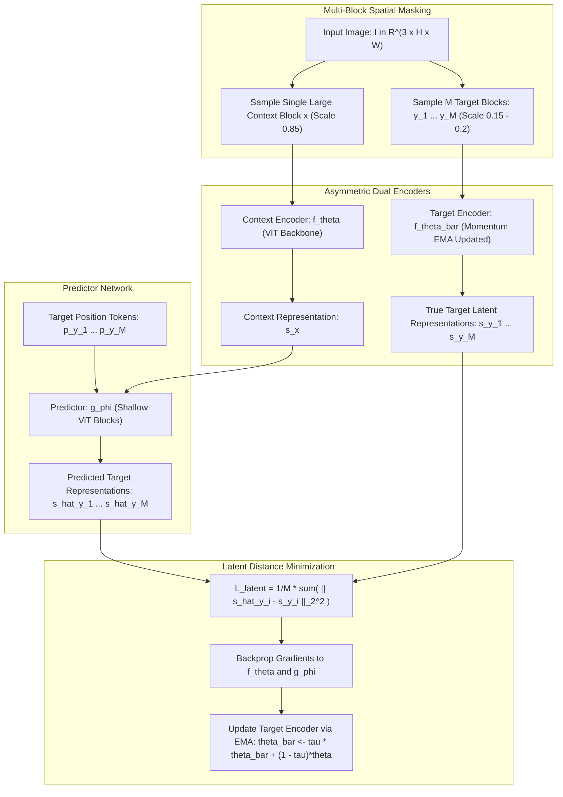

# 🔬 I-JEPA: Image Joint-Embedding Predictive Architecture

## 1. Executive Brief & Significance

In self-supervised visual representation learning, the predominant paradigm has been **Generative Masked Image Modeling (MIM)**, exemplified by Masked Autoencoders (MAE):
- **The Pitfall of Pixel-Level Reconstruction**: MAE removes $75\%$ of image patches and trains a decoder to reconstruct raw RGB pixels.
- **The Capacity Allocation Waste**: Raw pixel reconstruction forces the model to expend vast parameter capacity predicting fine, high-frequency, stochastic details (e.g., individual leaves on a distant tree, ripples across a pond, or sensor noise grain) that possess **virtually zero semantic utility** for downstream perception.

**I-JEPA** (Assran, LeCun et al., Meta AI, CVPR 2023) materialized Yann LeCun's vision of **Joint-Embedding Predictive Architectures (JEPA)** for computer vision: **A purely non-generative self-supervised architecture that predicts representations of missing image regions directly in abstract feature embedding space rather than predicting pixels**.

```
Self-Supervised Vision Paradigms Comparison:

Generative Pixel Reconstruction (MAE)             Joint-Embedding Latent Prediction (I-JEPA)
--------------------------------------             ------------------------------------------
[Corrupted Image (75% Patches Masked)]             [Context Image Block x]
                |                                                  |
                v Encoder                                          v Context Encoder f_theta
[Latent Representation]                                    [Context Representation s_x]
                |                                                  |
                v Heavy Decoder                                    v Lightweight Predictor g_phi (with Mask Tokens)
[Raw Reconstructed RGB Pixels]                             [Predicted Target Representation s_hat_y]
  (Pixel-level MSE: wastes capacity on                              ^
   high-frequency stochastic noise)                                 | L2 Latent Loss (Semantic Features)
                                                                    v
                                                           [Target Representation s_y = f_theta_bar(Target y)]
```

### Core Architectural Breakthroughs
1. **Latent Space Prediction**: Predicts high-level semantic representations directly, avoiding unpredictable pixel-level variations.
2. **Multi-Block Masking Strategy**: Samples a large, single context block ($x$) and multiple target blocks ($y$) with variable aspect ratios, forcing the model to learn global spatial scene layouts.
3. **High Computational Efficiency**: Requires **no pixel decoder**, training up to **$2.5\times$ faster** than MAE while achieving superior downstream transfer.



---

## 2. Core Mathematical Formulations & Tensor Mechanics

### 2.1 Multi-Block Masking Distribution
Given an image with $N = \frac{H}{P} \times \frac{W}{P}$ non-overlapping visual patches:
1. **Context Block $x$**: A single spatial patch block sampled with scale $\rho_{\text{context}} \in [0.85, 1.0]$ and aspect ratio $\alpha_{\text{context}} \in [0.75, 1.5]$. Any patch overlapping with target blocks is masked out.
2. **Target Blocks $y = \{y_1, \dots, y_M\}$**: $M = 4$ independent spatial blocks sampled with smaller scales $\rho_{\text{target}} \in [0.15, 0.20]$.

Let $B_x$ denote the set of patch indices belonging to the context block, and $B_{y_m}$ denote patch indices for the $m$-th target block.

---

### 2.2 Latent Space Prediction Formulation
Let $f_\theta$ denote the context encoder parameterized by $\theta$, and $f_{\bar{\theta}}$ denote the target encoder parameterized by exponential moving average weights $\bar{\theta}$.
The true target representations are computed directly:

$$
s_{y_m} = f_{\bar{\theta}}(y_m) \in \mathbb{R}^{|B_{y_m}| \times D}
$$

The context encoder processes only the unmasked context patches:
$$s_x = f_\theta(x) \in \mathbb{R}^{|B_x| \times D}$$

A lightweight predictor network $g_\phi$ takes the context representations $s_x$ and a set of learnable mask tokens modulated by the target positional embeddings $\{p_j \mid j \in B_{y_m}\}$:

$$
\hat{s}_{y_m} = g_\phi\left(s_x, \{p_j\}_{j \in B_{y_m}}\right) \in \mathbb{R}^{|B_{y_m}| \times D}
$$

---

### 2.3 Optimization Loss & Collapse Prevention
The model is trained by minimizing the average $L_2$ distance in the representation space:

$$
\mathcal{L}_{\text{JEPA}} = \frac{1}{M} \sum_{m=1}^M \frac{1}{|B_{y_m}|} \sum_{j \in B_{y_m}} \left\| \hat{s}_{y_m, j} - s_{y_m, j} \right\|_2^2
$$

#### Mechanism Preventing Representation Collapse
Without contrastive negative pairs, joint-embedding architectures risk trivial constant representations ($f(x) = \mathbf{c}$). I-JEPA eliminates collapse through two architectural constraints:
1. **Asymmetric Architectures**: The predictor $g_\phi$ is strictly directional and cannot copy identical features backwards.
2. **Momentum Target Encoder (EMA)**: Gradients $\nabla_\theta \mathcal{L}$ update the context encoder and predictor via AdamW. The target encoder weights are updated strictly via momentum:
   $$\bar{\theta} \leftarrow \tau \bar{\theta} + (1 - \tau) \theta, \quad \tau \in [0.996, 1.0]$$
   The target representations continuously act as an evolving, non-stationary target, mathematically preventing static constant equilibrium states.

---

## 3. High-Level Architecture & Layer Anatomy

```
I-JEPA Layer Hierarchy:

Image Input [B, 3, 224, 224]
       |
       +---------------------------------------------+
       |                                             |
Context Patches x [B, N_ctx, 3, 16, 16]       Target Patches y_m [B, N_tgt, 3, 16, 16]
       |                                             |
       v                                             v
[ 1. Context Encoder f_theta ]                [ 2. Target Encoder f_theta_bar ]
   - Standard ViT (PatchEmbed + PosEmbed)        - Identical ViT Architecture
   - Transformer Blocks (L_enc = 12 to 32)       - Parameters updated via EMA (No Gradients)
       |                                             |
       v Context Latent s_x [B, N_ctx, D]            v Target Latents s_y [B, N_tgt, D]
       |                                             |
       v                                             |
+------------------------------------+               |
| 3. Predictor Network g_phi         |               |
|    - Appends Mask Tokens with      |               |
|      Target Positional Embeddings  |               |
|    - Shallow ViT (L_pred = 6)      |               |
+------------------------------------+               |
       |                                             |
       v Predicted Latents s_hat_y [B, N_tgt, D]     |
       |                                             |
       +--------------------> [ L2 Loss ] <----------+
```

---

## 4. Performance, Latency & Benchmark Metrics

Evaluated on **ImageNet-1K Linear Probing** and downstream dense visual tasks:

| Model Architecture | Parameters | Pretrain Epochs | IN-1K Linear Probe | IN-1K Fine-Tuned | Pretrain GPU Hours (A100) |
| :--- | :--- | :--- | :--- | :--- | :--- |
| **MAE ViT-Huge/14** | 632M | 1600 | 76.2% | 86.9% | 2,800 hrs |
| **I-JEPA ViT-Base/16** | 86M | 300 | **72.9%** | 84.1% | **240 hrs** |
| **I-JEPA ViT-Large/16** | 307M | 300 | **77.5%** | 86.2% | **580 hrs** |
| **I-JEPA ViT-Huge/14** | 632M | 300 | **81.1%** | **87.8%** | **1,200 hrs** |
| **I-JEPA ViT-Huge/14** (Dense Scale) | 632M | 600 | **82.9%** | **88.3%** | 2,100 hrs |

*Key Takeaway*: I-JEPA reaches **$>81\%$ linear probing accuracy with less than half the compute time of MAE**, demonstrating that predicting latent semantics builds richer representations than reconstructing raw RGB textures.

---

## 5. Integration & Python Deployment Pipeline

```python
import torch
import torch.nn as nn

class IJEPAPredictor(nn.Module):
    """
    I-JEPA Predictor module predicting target patch representations
    from unmasked context representations and target positional tokens.
    """
    def __init__(self, embed_dim: int = 768, pred_dim: int = 384, depth: int = 6, num_heads: int = 6):
        super().__init__()
        self.proj_in = nn.Linear(embed_dim, pred_dim)
        self.mask_token = nn.Parameter(torch.randn(1, 1, pred_dim) * 0.02)
        
        # Lightweight Transformer blocks
        decoder_layer = nn.TransformerEncoderLayer(
            d_model=pred_dim, nhead=num_heads, dim_feedforward=pred_dim * 4,
            activation="gelu", batch_first=True, norm_first=True
        )
        self.transformer = nn.TransformerEncoder(decoder_layer, num_layers=depth)
        self.proj_out = nn.Linear(pred_dim, embed_dim)

    def forward(self, context_rep: torch.Tensor, target_pos_tokens: torch.Tensor) -> torch.Tensor:
        """
        context_rep: [B, N_context, embed_dim]
        target_pos_tokens: [B, N_target, pred_dim] positional embeddings of target patches
        """
        B, N_target, _ = target_pos_tokens.shape
        
        # 1. Project context representation into predictor dimension
        ctx_proj = self.proj_in(context_rep) # [B, N_context, pred_dim]
        
        # 2. Instantiate mask tokens conditioned on target positional embeddings
        target_tokens = self.mask_token.expand(B, N_target, -1) + target_pos_tokens
        
        # 3. Concatenate context and target tokens: [B, N_context + N_target, pred_dim]
        seq = torch.cat([ctx_proj, target_tokens], dim=1)
        
        # 4. Predict target features through transformer blocks
        out = self.transformer(seq)
        
        # 5. Extract only the predicted target portion and project back to embed_dim
        pred_target_tokens = out[:, -N_target:, :]
        pred_target_rep = self.proj_out(pred_target_tokens) # [B, N_target, embed_dim]
        return pred_target_rep
```

---

## 6. Vault Cross-References & Ecosystem Links

- **[[techniques/masked-autoencoders-and-vision-pretraining|Masked Autoencoders (MAE)]]**: The comparative generative pixel-reconstruction self-supervised baseline.
- **[[architectures/vision-foundation-models/dinov2|DINOv2]]**: Discriminative self-supervised foundation model using patch-level multi-crop matching.
- **[[architectures/backbones-and-edge-efficiency/convnext-v2|ConvNeXt V2]]**: Convolutional masked autoencoder with global response normalization.
- **[[topics/object-classification/README|Object Classification Playbook]]**: Foundation vision representation pretraining.
