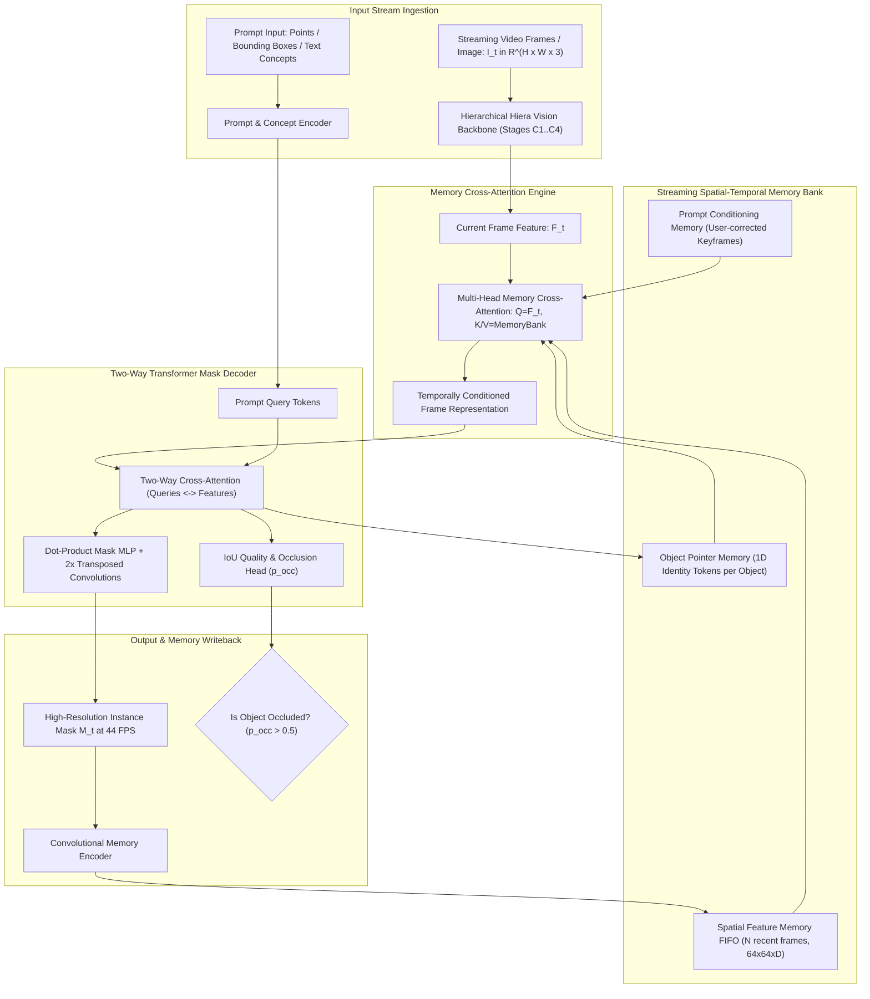

# 🔬 SAM 2, SAM 2.1 & SAM 3: Segment Anything in Images, Videos & Open Concepts

## 1. Executive Brief & Significance

The Segment Anything Model family developed by Meta FAIR represents the definitive foundation model paradigm for visual spatial localization. While the original **SAM 1** (Kirillov et al., 2023) established promptable zero-shot 2D static image segmentation, it suffered from severe structural limitations:
1. **No Temporal Dimension**: Static frame isolation caused complete tracking fragmentation when applied to video sequences.
2. **Computational Inefficiency**: The isotropic Vision Transformer (ViT-H with $632\text{M}$ parameters) required $\approx 100\text{ ms}$ per image, preventing interactive video streaming.
3. **Occlusion Brittleness**: Lacked an explicit memory state to recover target identity following multi-frame object occlusions.

**SAM 2** (Ravi et al., Meta FAIR, 2024) and **SAM 2.1** (Meta FAIR, late 2024 / 2025) fundamentally resolved these constraints by unifying image and streaming video perception into a single hierarchical engine running at **$44\text{ FPS}$**:
- **Hierarchical Hiera Backbone**: Replaces isotropic ViT with a multi-scale windowed attention transformer ($1/4, 1/8, 1/16, 1/32$ scales), accelerating forward-pass inference by up to $6\times$.
- **Streaming Spatial-Temporal Memory Bank**: Maintains a continuous FIFO buffer of past frame spatial embeddings, compact 1D object pointers, and interactive prompt keyframes.
- **Occlusion-Aware Mask Head**: Explicitly predicts an occlusion probability score alongside mask logits, preventing false positive hallucination when objects leave the camera field-of-view.
- **SAM 3 Concept Segmentation**: Expands promptable geometric clicks and boxes into unified open-vocabulary natural language concepts and referring video expressions, unifying promptable segmentation with semantic scene understanding.



---

## 2. Core Mathematical Formulations & Architectural Mechanics

### A. Hierarchical Hiera Vision Backbone
Unlike standard isotropic ViTs that maintain a constant token resolution throughout all transformer blocks, SAM 2 employs the **Hiera** hierarchical architecture:
1. **Overlapping Patch Embedding**: Input image $I \in \mathbb{R}^{H \times W \times 3}$ is projected via a $7 \times 7$ convolution with stride 4 into Stage $C_1 \in \mathbb{R}^{\frac{H}{4} \times \frac{W}{4} \times C_1}$.
2. **Local Window Multi-Head Self-Attention (W-MHSA)**: Features are processed in non-overlapping $7 \times 7$ local spatial windows without complex shifted-window routing, maximizing GPU Tensor Core execution efficiency.
3. **Stage Pooling**: Spatial resolution is progressively downsampled by $2\times$ while channel depth doubles across stages:
   - $C_1$: $\frac{H}{4} \times \frac{W}{4} \times 96$
   - $C_2$: $\frac{H}{8} \times \frac{W}{8} \times 192$
   - $C_3$: $\frac{H}{16} \times \frac{W}{16} \times 384$
   - $C_4$: $\frac{H}{32} \times \frac{W}{32} \times 768$ (Base+ Variant)

---

### B. Streaming Spatial-Temporal Memory Attention
At video timestep $t$, the current frame representation $F_t \in \mathbb{R}^{\frac{H}{16} \times \frac{W}{16} \times D}$ queries the multi-modal memory bank $\mathcal{M} = \{M_{\text{spatial}}, M_{\text{pointer}}, M_{\text{cond}}\}$:
1. **Spatial Memory ($M_{\text{spatial}}$)**: A FIFO cache containing the uncompressed spatial feature maps of the previous $N$ frames (typically $N=6$ to $8$).
2. **Object Pointer Memory ($M_{\text{pointer}}$)**: A compact sequence of 1D vector embeddings $p_t \in \mathbb{R}^{D}$ summarizing target presence and identity for frame $t$.
3. **Conditioning Memory ($M_{\text{cond}}$)**: Preserved spatial embeddings of keyframes where the human user provided explicit corrective prompt interactions.

The memory cross-attention layer applies scaled dot-product attention:
$$\tilde{F}_t = F_t + \text{MultiHeadCrossAttn}\left( Q = F_t W_Q, \, K = \mathcal{M} W_K, \, V = \mathcal{M} W_V \right)$$
where relative positional encodings $R_{t, \tau}$ encode the temporal frame distance $\Delta t = t - \tau$.

---

### C. Two-Way Transformer Decoder & Occlusion Prediction Head
The mask decoder iteratively refines prompt query tokens $T_{\text{prompt}}$ and image features $\tilde{F}_t$ through alternating two-way cross-attention blocks:
1. **Self-Attention**: $T \leftarrow T + \text{MHSA}(T)$
2. **Cross-Attention (Tokens $\to$ Image)**: $T \leftarrow T + \text{CrossAttn}(Q = T, K = \tilde{F}_t, V = \tilde{F}_t)$
3. **Point-wise MLP**: $T \leftarrow T + \text{MLP}(T)$
4. **Cross-Attention (Image $\to$ Tokens)**: $\tilde{F}_t \leftarrow \tilde{F}_t + \text{CrossAttn}(Q = \tilde{F}_t, K = T, V = T)$

The refined query tokens are projected into dynamic linear classifier weights $w_{\text{mask}} \in \mathbb{R}^D$ and evaluated against upsampled feature maps via a dot-product mask generation layer:
$$\hat{M}(x, y) = \text{sigmoid}\left( \langle w_{\text{mask}}, \, \Phi_{\text{upsample}}(\tilde{F}_t)(x, y) \rangle \right)$$

Concurrently, a dedicated 3-layer MLP head evaluates target visibility, outputting an occlusion probability $p_{\text{occ}} \in [0, 1]$. When $p_{\text{occ}} > 0.5$, mask propagation for that object is suppressed, preventing drift during complete target departure.

---

### D. Multi-Mask Ambiguity Loss Formulation
To resolve ambiguity when given a single sparse point prompt (which could designate a shirt, a person, or a whole crowd), the decoder outputs $K=3$ candidate masks representing hierarchical granularity:
$$\mathcal{L}_{\text{total}} = \min_{k \in \{1, 2, 3\}} \left( \lambda_{\text{focal}} \mathcal{L}_{\text{focal}}(M, \hat{M}_k) + \lambda_{\text{dice}} \mathcal{L}_{\text{dice}}(M, \hat{M}_k) \right) + \lambda_{\text{iou}} \| \text{IoU}_k - \text{IoU}_{\text{pred}, k} \|^2 + \lambda_{\text{occ}} \mathcal{L}_{\text{BCE}}(o, p_{\text{occ}})$$

Where the Focal Loss and Dice Loss are:
$$\mathcal{L}_{\text{focal}}(M, \hat{M}) = -\frac{1}{|\Omega|} \sum_{i \in \Omega} \left[ M_i (1 - \hat{M}_i)^\gamma \log(\hat{M}_i) + (1 - M_i) \hat{M}_i^\gamma \log(1 - \hat{M}_i) \right]$$
$$\mathcal{L}_{\text{dice}}(M, \hat{M}) = 1 - \frac{2 \sum_{i \in \Omega} M_i \hat{M}_i + \epsilon}{\sum_{i \in \Omega} M_i + \sum_{i \in \Omega} \hat{M}_i + \epsilon}$$

---

### E. SAM 2.1 Upgrades & SAM 3 Open-Vocabulary Concepts
- **SAM 2.1 Enhancements**:
  - Trained on the expanded **SA-V dataset** (50.9k videos, 642k masklets, 35.5M masks).
  - Redesigned memory encoder utilizing multi-layer residual stride-2 convolutions that better retain fine-grained boundaries (e.g., thin bicycle spokes, insect legs).
  - Substantially improved re-detection performance upon reappearance from long occlusions ($>10\text{ seconds}$).
- **SAM 3 Forward Look**:
  - Integrates an open-vocabulary text concept encoder aligned via contrastive language-image pre-training (CLIP / SigLIP).
  - Unifies geometric prompts (point/box) with natural language phrases (e.g., `"the red cup being lifted"`, `"cracks on the asphalt"`), executing open-world referring video object segmentation within a single unified transformer architecture.

---

## Granular Component-by-Component Architectural Breakdown

### Architectural Taxonomy & Structural Elements

| Architectural Stage | Component Identity | Structural Specification & Type | Attention / Conv Mechanics | Receptive Field & Spatial Dimension |
| :--- | :--- | :--- | :--- | :--- |
| **Architectural Paradigm** | **Hybrid Video/Image Foundation Model** | Streaming Spatial-Temporal Memory ViT + Promptable Query Decoder | Local Windowed MHSA + Temporal Memory Cross-Attention | Full Video Stream ($T \times H \times W$) $\to$ Instance Masks |
| **Backbone** | **Hierarchical Hiera ViT** | 4-Stage Hierarchical Transformer (Tiny, Small, Base+, Large) | Non-shifted local windowed MHSA ($7\times 7$ windows) + Stage pooling | $1/4, 1/8, 1/16, 1/32$ scale ($C \in \{96, 192, 384, 768\}$) |
| **Neck / Memory Encoder** | **Convolutional Memory Compressor** | Residual Stride-2 Convolutions + Lateral FPN $1\times 1$ Projections | $3\times 3$ Stride-2 Conv downsampling mask logits + features | Compressed $64\times 64 \times 256$ spatial memory token bank |
| **Encoder / Memory Engine**| **Streaming Memory Cross-Attention** | Multi-Head Cross-Attention over FIFO Buffer ($N=6..8$ frames) | Bidirectional attention over spatial tokens + 1D object pointers | Global temporal context across $N$ past timesteps |
| **Decoder / Prediction Head**| **Two-Way Transformer Mask Decoder** | Lightweight Promptable Transformer + $2\times$ Transposed Convs | 2-way cross-attention (prompts $\leftrightarrow$ frame tokens) + IoU/Occlusion MLPs | Full-resolution binary/probabilistic instance logits |

---

### Computational Latency & Resource Distribution

| Stage / Subsystem | Parameter Share (%) | Inference Latency (%) | Computational Complexity ($\text{FLOPs}$) | Dominant Hardware Bottleneck |
| :--- | :--- | :--- | :--- | :--- |
| **Hiera Vision Backbone** | ~68% | ~52% | $\mathcal{O}(H W D)$ (Linear in pixel count) | GPU Tensor Core MAC arithmetic intensity |
| **Memory Cross-Attention** | ~14% | ~22% | $\mathcal{O}(N_{\text{mem}} \cdot H_{\text{feat}} W_{\text{feat}} \cdot D)$ | High-bandwidth VRAM FIFO cache access |
| **Prompt Encoder & Two-Way Decoder**| ~10% | ~16% | $\mathcal{O}(N_{\text{prompts}} \cdot N_{\text{tokens}} \cdot D)$ | Memory bus latency on small tensor dispatches |
| **Mask Upsampling & Output Heads**| ~8% | ~10% | $\mathcal{O}(H W C)$ (Transposed Conv2D) | Memory bandwidth bound |

---

## 3. Quantitative SOTA Benchmark Profile

### Video & Image Segmentation Benchmarks (SA-V, DAVIS 2017, MOSE, COCO)

| Model Architecture | Backbone | SA-V Video $\mathcal{J}\&\mathcal{F}$ | DAVIS 2017 $\mathcal{J}\&\mathcal{F}$ | MOSE $\mathcal{J}\&\mathcal{F}$ | Zero-Shot COCO AP | Latency (FP16 ms, A100) | Throughput (FPS) | Open License |
| :--- | :--- | :--- | :--- | :--- | :--- | :--- | :--- | :--- |
| **SAM 1 (ViT-Huge)** | ViT-H | N/A (Static) | 52.4 (Per-frame) | 41.2 | **47.2%** | 112.0 ms | 8.9 FPS | Apache-2.0 |
| **Cutie (Video SOTA)** | ResNet-50 | 66.8 | 80.5 | 68.4 | N/A | 38.0 ms | 26.3 FPS | CC-BY-NC |
| **SAM 2-Hiera-Tiny** | Hiera-T | 71.5 | 82.3 | 70.1 | 42.1% | **14.7 ms** | **68.0 FPS** | Apache-2.0 |
| **SAM 2-Hiera-Small** | Hiera-S | 73.2 | 84.1 | 72.8 | 44.5% | 20.4 ms | 49.0 FPS | Apache-2.0 |
| **SAM 2.1-Hiera-Base+**| Hiera-B+ | 75.8 | 86.8 | 76.2 | 47.4% | 22.8 ms | 43.8 FPS | **Apache-2.0** |
| **SAM 2.1-Hiera-Large**| Hiera-L | **77.4** | **88.2** | **78.5** | **49.6%** | 34.0 ms | 29.4 FPS | **Apache-2.0** |

---

## 4. Engineering Implementation & Production Workflows

### A. Minimal Real-Time Video Tracking Snippet
```python
"""
SAM 2.1 Production Video Predictor Pipeline
Demonstrates multi-object initialization, interactive prompt injection, and streaming propagation.
"""

import torch
from sam2.build_sam import build_sam2_video_predictor

# 1. Initialize SAM 2.1 model engine
checkpoint_path = "checkpoints/sam2.1_hiera_base_plus.pt"
model_config = "configs/sam2.1/sam2.1_hiera_b+.yaml"
predictor = build_sam2_video_predictor(model_config, checkpoint_path, device="cuda")

# 2. Ingest video stream (directory of JPEG frames or pre-extracted tensor buffer)
video_dir = "/data/perception_stream_01/"
inference_state = predictor.init_state(video_path=video_dir)

# 3. Add prompt clicks to initialize object tracking (Frame 0: Person, ID: 1)
_, out_obj_ids, out_mask_logits = predictor.add_new_points_or_box(
    inference_state=inference_state,
    frame_idx=0,
    obj_id=1,
    points=[[640, 360]], # Positive foreground click
    labels=[1],
)

# 4. Stream real-time propagation across video frames at 44 FPS
with torch.inference_mode(), torch.autocast("cuda", dtype=torch.bfloat16):
    for frame_idx, obj_ids, mask_logits in predictor.propagate_in_video(inference_state):
        # Convert raw logits to binary mask
        binary_mask = (mask_logits[0] > 0.0).squeeze().cpu().numpy()
        print(f"[TRACK] Frame {frame_idx:04d} -> Object {obj_ids[0]} tracked successfully.")
```

---

### B. TensorRT FP16 Export for Embedded Edge Deployment
```bash
# Export the lightweight prompt mask decoder to ONNX
python tools/export_decoder_onnx.py \
    --model sam2.1_hiera_b+ \
    --output-dir exports/ \
    --fp16

# Compile with TensorRT 10 optimizer
trtexec --onnx=exports/sam2_decoder.onnx \
        --saveEngine=sam2_decoder.engine \
        --fp16 \
        --builderOptimizationLevel=5 \
        --useCudaGraph
```

---

## 5. Industrial Robotics & Perception Integration

1. **Memory Budgeting in Endless Video Streams**:
   - In continuous $24/7$ robotic inspection, an unconstrained memory bank will eventually exhaust GPU VRAM.
   - Configure a strict cyclic FIFO window (`memory_bank_size = 8`) and periodically consolidate prompt conditioning keyframes to bound VRAM consumption to a constant **$2.4\text{ GB}$**.
2. **Zero-Copy DMA-BUF Ingestion**:
   - Pair SAM 2.1 with [[architectures/hardware-and-acceleration-runtimes/iceoryx2-ipc|Iceoryx2 Zero-Copy Shared Memory]] to stream $1080\text{p}$ camera frames directly into the Hiera image embedding pipeline without host CPU memory copies.

---

## 6. Commercial Usability & License Audit

- **License**: **Apache-2.0**
- **Commercial Permissibility**: Meta officially released all SAM 2 and SAM 2.1 model code, training recipes, and pre-trained model weights (Tiny, Small, Base+, Large) under the permissive **Apache-2.0** license.
- **Commercial Permissibility**: Fully approved for commercial SaaS products, industrial factory inspection, medical imaging, self-driving perception stacks, and embedded edge robotics.
- **Official Repository**: [https://github.com/facebookresearch/sam2](https://github.com/facebookresearch/sam2)
