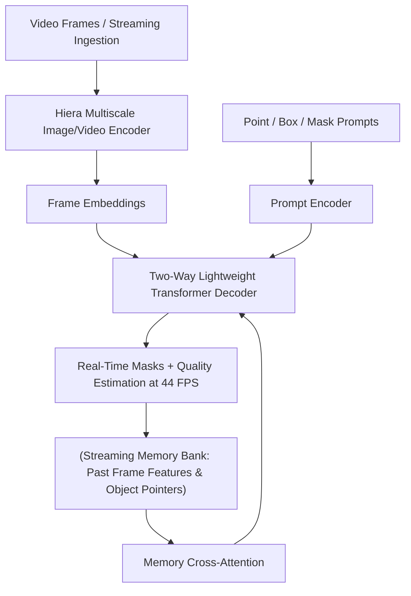

# 🔬 SAM 2 & SAM 2.1: Segment Anything in Images and Videos

## 1. Executive Brief & Significance
**SAM 2 & SAM 2.1** (Ravi et al., Meta FAIR, 2024 / 2025) unify image and streaming video perception into a single foundation model. Prior foundation segmentation (SAM 1) was confined to static images and suffered from high memory overhead (~100ms per image on a high-end GPU), making real-time interactive tracking impossible.

SAM 2 introduces a **hierarchical Hiera image/video encoder** coupled with a **streaming spatial-temporal memory bank**. It enables promptable zero-shot image segmentation, dense instance masking, and real-time video mask propagation at **44 FPS**, serving as a unified backbone across:
- [[topics/object-segmentation/00-object-segmentation-moc|Object Segmentation MOC]] (Promptable & Instance Masks)
- [[topics/video-tracking/00-video-tracking-moc|Video Tracking MOC]] (Zero-Shot Video Object Tracking & Re-identification)



---

## 2. Core Architectural Mechanics

### A. Hierarchical Hiera Backbone
Unlike SAM 1's standard non-hierarchical ViT, SAM 2 adopts **Hiera**—a hierarchical vision transformer that produces multi-scale feature maps ($1/4, 1/8, 1/16, 1/32$). Hiera uses windowed local attention without complicated spatial shift operations, significantly reducing forward-pass latency and VRAM utilization.

### B. Streaming Spatial-Temporal Memory Architecture
When tracking objects across continuous video frames, SAM 2 maintains three components in memory:
1. **Spatial Feature Memory**: A FIFO queue holding the spatial embeddings of the recent $N$ frames (typically $N=6$ or $N=8$).
2. **Object Pointer Memory**: Compact vector tokens summarizing object presence and high-level identity per object instance across past frames.
3. **Prompted Conditioning Memory**: Uncompressed spatial representations of frames where the user provided explicit interactive corrections (clicks/boxes).

During inference on frame $t$, the decoder queries the memory bank using cross-attention blocks, allowing the model to smoothly recover object identity after multi-second occlusions and camera cuts without full model re-initialization.

---

## Granular Component-by-Component Architectural Breakdown

### Architectural Taxonomy & Structural Elements

| Architectural Stage | Component Identity | Structural Specification & Type | Attention / Conv Mechanics | Receptive Field & Resolution |
| :--- | :--- | :--- | :--- | :--- |
| **Architectural Paradigm** | **Hybrid Vision Transformer (Video / Image)** | Streaming Spatial-Temporal Memory ViT + Promptable Query Decoder | Multi-scale local windowed self-attention + memory cross-attention | Full image / multi-frame temporal stream ($T \times H \times W$) |
| **Backbone** | **Hierarchical Hiera ViT** | 4-Stage Hierarchical Transformer ($C_1, C_2, C_3, C_4$) | Non-shifted local windowed MHSA with $7\times 7$ conv stem (stride 4) | $1/4, 1/8, 1/16, 1/32$ scale ($C \in \{96, 192, 384, 768\}$ on Base+) |
| **Neck / Aggregator** | **FPN Feature Projector & Memory Neck** | Lateral $1\times 1$ Convolutions + Residual Downsampling Blocks | $1\times 1$ Conv projection to 256-dim channels + $3\times 3$ Conv stride 2 downsampling | Unified $256$-dim feature maps across pyramid levels |
| **Encoder** | **Memory & Prompt Encoder** | Multi-Scale Memory Attention + Fourier Positional Embedder | Bidirectional cross-attention over streaming FIFO feature buffer ($N=6\dots 8$ frames) + Object pointers | Global temporal context + sparse point/box prompt tokens |
| **Decoder / Head** | **Two-Way Transformer Mask Decoder** | Lightweight Promptable Mask Transformer + Conv Upsampler | 2-way cross-attention (prompts $\leftrightarrow$ image features) + transposed convs ($2\times$ upsample) + IoU MLP | Output binary/probabilistic instance masks at $1/4$ resolution $\to$ full-res logits |

### Structural Deep-Dive: From Patch Embedding to Memory Decoding
1. **Backbone**: SAM 2 replaces the isotropic ViT of SAM 1 with a hierarchical **Hiera** engine. Input frames ($H \times W \times 3$) pass through an initial overlapping patch projection ($7\times 7$ convolution with stride 4) producing stage $C_1$ ($H/4 \times W/4 \times 96$). Subsequent stages $C_2, C_3, C_4$ apply non-shifted windowed Multi-Head Self-Attention with kernel pooling between stages, keeping memory linear with spatial resolution.
2. **Neck / Feature Aggregator**: The feature pyramid projector standardizes the 4 multi-scale Hiera stages to a constant $D=256$ channel depth using $1\times 1$ convolutions. For video streaming, a convolutional memory encoder compresses mask probability logits and feature maps via residual stride-2 downsampling into the spatial memory representation.
3. **Encoder**: Operates on two distinct token modalities: (a) prompt embeddings generated via learned positional encodings for point/box coordinates, and (b) spatial-temporal memory embeddings stored in a FIFO cache ($N$ recent frames plus conditioning keyframes), attended to through causal multi-head cross-attention.
4. **Decoder / Prediction Head**: A stacked two-way cross-attention Transformer decoder updates prompt queries with image context and vice versa. The updated queries modulate per-pixel feature maps via a dot-product mask generation layer, followed by a sequence of $2\times$ transposed convolutions for spatial reconstruction and small 3-layer MLP heads predicting mask IoU confidence and object presence.

### Parameter & Computational Latency Distribution

| Stage / Subsystem | Parameter Share (%) | Inference Latency (%) | Computational Complexity ($\text{FLOPs}$) | Dominant Hardware Bottleneck |
| :--- | :--- | :--- | :--- | :--- |
| **Hiera Vision Backbone** | ~65% | ~55% | $\mathcal{O}(H W D)$ (Local Windowed MHSA) | Tensor Core compute & arithmetic intensity |
| **Memory Bank & Aggregation Neck** | ~15% | ~20% | $\mathcal{O}(N_{\text{mem}} \cdot H W \cdot D)$ (FIFO Memory Cross-Attn) | VRAM bandwidth & FIFO memory access |
| **Prompt Encoder & Two-Way Decoder** | ~12% | ~18% | $\mathcal{O}(N_{\text{prompts}} \cdot N_{\text{tokens}} \cdot D)$ | Memory bus latency on small tensor ops |
| **Mask Upsampling & Prediction Heads** | ~8% | ~7% | $\mathcal{O}(H W C)$ (Conv2D Transposed Upsampling) | Memory bandwidth bound |
---

## 3. Quantitative SOTA Benchmark Profile

| Model Variant | Backbone | SA-V Video J&F (Tracking) | Zero-Shot Image AP (COCO) | Latency (FP16 ms, A100) | Throughput (FPS) | Open License |
| :--- | :--- | :--- | :--- | :--- | :--- | :--- |
| **SAM 2.1-Hiera-Tiny** | Hiera-T | 71.5 | 42.1% | 14.7 ms | 68.0 FPS | Apache-2.0 |
| **SAM 2.1-Hiera-Small**| Hiera-S | 73.2 | 44.5% | 20.4 ms | 49.0 FPS | Apache-2.0 |
| **SAM 2.1-Hiera-Base+**| Hiera-B+ | 75.0 | 46.8% | 22.8 ms | 43.8 FPS | Apache-2.0 |
| **SAM 2.1-Hiera-Large**| Hiera-L | 76.2 | 48.9% | 34.0 ms | 29.4 FPS | Apache-2.0 |

---

## 4. Engineering Implementation & Deployment Recipe

### A. Minimal Inference Snippet (Video & Image)
```python
import torch
from sam2.build_sam import build_sam2_video_predictor

# Load architecture and pre-trained weights
checkpoint = "checkpoints/sam2.1_hiera_small.pt"
model_cfg = "configs/sam2.1/sam2.1_hiera_s.yaml"
predictor = build_sam2_video_predictor(model_cfg, checkpoint, device="cuda")

# Initialize streaming session on video directory
inference_state = predictor.init_state(video_path="video_frames_dir/")

# Add prompt click (frame 0, point coordinates [x, y], label 1=positive)
_, out_obj_ids, out_mask_logits = predictor.add_new_points_or_box(
    inference_state=inference_state,
    frame_idx=0,
    obj_id=1,
    points=[[500, 375]],
    labels=[1],
)

# Propagate across video in real-time
for out_frame_idx, out_obj_ids, out_mask_logits in predictor.propagate_in_video(inference_state):
    mask = (out_mask_logits[0] > 0.0).cpu().numpy()
    # Mask is available at 49 FPS
```

### B. TensorRT FP16 Compilation
```bash
# Export the lightweight prompt decoder to ONNX
python tools/export_decoder_onnx.py --model sam2.1_hiera_s --output sam2_decoder.onnx

# Compile with TensorRT
trtexec --onnx=sam2_decoder.onnx --saveEngine=sam2_decoder.engine --fp16
```

---

## 5. Commercial Readiness & License Audit
- **License**: **Apache-2.0**
- **Commercial Permissibility**: Permitted for commercial use, enterprise SaaS platforms, robotic perception stacks, and closed-source tools without disclosing caller source code.
- **Weights Licensing Notice**: Meta officially released SAM 2 and SAM 2.1 code and model checkpoints under Apache-2.0. Ensure training on proprietary data adheres to internal data governance.
- **Official Repository**: [https://github.com/facebookresearch/sam2](https://github.com/facebookresearch/sam2)
