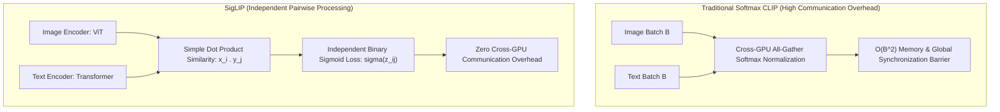

# 🔬 SigLIP & SigLIP 2: Sigmoid Loss for Language-Image Pre-Training

## 1. Executive Brief & Significance
Contrastive Language-Image Pre-training (CLIP - Radford et al., 2021) established modern zero-shot visual classification by learning a shared latent space between image and text encoders. However, original CLIP relied on a **softmax cross-entropy loss** computed across all image-text pairs in a mini-batch.

**SigLIP** (Zhai et al., Google DeepMind, 2023 / 2024) fundamentally improves this by replacing the softmax loss with a **pairwise binary sigmoid loss**. This allows each image-text pair to be treated independently, eliminating the need for massive all-gather GPU communication barriers and yielding higher zero-shot classification accuracy with half the compute budget.



---

## 2. Mathematical Formulation: Why Sigmoid Beats Softmax

### The Softmax Normalization Bottleneck (CLIP):
In standard CLIP, the probability of pairing image $i$ with text $i$ requires summing across all $B$ negative candidates in the batch:
$$\mathcal{L}_{\text{softmax}} = - \log \frac{\exp(t \cdot x_i \cdot y_i)}{\sum_{j=1}^B \exp(t \cdot x_i \cdot y_j)}$$
Because the denominator couples all elements, distributed training across 128 GPUs requires continuous `all-gather` collective communication of embeddings, which caps training throughput.

### The SigLIP Formulation:
SigLIP formulates language-image alignment as a collection of independent binary classification decisions:
$$\mathcal{L}_{\text{siglip}} = - \sum_{i, j} \log \sigma\left( z_{i, j} (-1)^{\mathbb{I}[i \ne j]} \right)$$
Where $z_{i, j} = t (x_i \cdot y_j) + b$, with learnable temperature $t$ and bias $b$.
- Treats positive diagonal pairs ($i = j$) as class $1$ and off-diagonal pairs ($i \ne j$) as class $-1$.
- Scales linearly with batch size without synchronization locks, enabling training with mini-batches of up to 1 million samples.

---

## Granular Component-by-Component Architectural Breakdown

### Architectural Taxonomy & Structural Elements

| Architectural Stage | Component Identity | Structural Specification & Type | Attention / Conv Mechanics | Receptive Field & Resolution |
| :--- | :--- | :--- | :--- | :--- |
| **Architectural Paradigm** | **Dual-Encoder Vision-Language Transformer** | Decoupled Asymmetric Dual ViT + Text Transformer | Global quadratic MHSA in Vision & Text encoders + Pairwise Sigmoid Loss | Full image ($H \times W \times 3$) and text token sequence ($S \le 64$) |
| **Backbone (Vision)** | **Isotropic ViT (ViT-B/L/SO400M)** | Patch Embedding ($16\times 16$ or $14\times 14$) + $L_v \in \{12, 24, 27\}$ Layers | Global quadratic MHSA with LayerNorm ($D_v \in \{768, 1024, 1152\}$) | Isotropic patch grid ($H/p \times W/p$) across all vision layers |
| **Backbone (Text)** | **BPE Transformer Text Encoder** | 32k SentencePiece Vocab + $L_t \in \{12, 24, 27\}$ Transformer Layers | Multi-Head Self-Attention ($D_t \in \{512, 768, 1152\}$) with learned position encodings | Sequence length $S=64$ tokens |
| **Neck / Aggregator** | **Multi-Head Attention Pooling (MAP)** | Learned Attention Pooling Probe + Linear Projections | Single-query cross-attention pooling over patch tokens $\to$ Linear $W_v, W_t$ | Projects both vision and text representations into shared $D_{\text{embed}}$ space |
| **Encoder** | **Dual Independent Encoders** | Pure Transformer Encoders (Vision & Language) | FlashAttention-2 / standard quadratic MHSA, GeLU feed-forward networks | Independent modality processing without cross-modal attention layers |
| **Decoder / Head** | **Pairwise Sigmoid Distance Head** | Linear Projection + Learnable Affine Scaling ($t, b$) | Matrix product $Z = t(X_{\text{img}} Y_{\text{txt}}^T) + b \to \sigma(Z_{i,j})$ | Computes independent binary classification probabilities per pair |

### Structural Deep-Dive: Dual-Stream Asymmetric Processing
1. **Vision Backbone**: Processes raw images via non-overlapping $16\times 16$ (or $14\times 14$ in SO400M) patch convolutions. Instead of prepending a fragile `[CLS]` token that can cause training instability at extreme batch sizes, SigLIP applies Multi-Head Attention Pooling (MAP): a learned query token attends over the entire sequence of final patch representations.
2. **Text Backbone**: Consumes tokenized prompts (tokenized via a 32,000-word SentencePiece tokenizer) through learned embedding lookup tables and standard Transformer encoder blocks with Pre-LayerNorm.
3. **Neck / Feature Aggregator**: The pooled vision vector ($D_v$) and text EOS embedding ($D_t$) are projected through dense linear matrices $W_v \in \mathbb{R}^{D_v \times D_{\text{embed}}}$ and $W_t \in \mathbb{R}^{D_t \times D_{\text{embed}}}$, followed by strict $L_2$ unit-norm normalization:
   $$x_i = \frac{W_v v_i}{\|W_v v_i\|_2}, \quad y_j = \frac{W_t u_j}{\|W_t u_j\|_2}$$
4. **Decoder / Prediction Head**: Unlike generative decoders, SigLIP uses a non-parametric sigmoid classification formulation. Forward inference computes the cosine similarity matrix $S_{i,j} = x_i \cdot y_j$, scaled by temperature parameter $t$ and shifted by bias $b$. Zero-shot classification probabilities are obtained directly via element-wise sigmoid $\sigma(t S_{i,j} + b)$ without requiring batch-wide softmax normalization.

### Parameter & Computational Latency Distribution

| Stage / Subsystem | Parameter Share (%) | Inference Latency (%) | Computational Complexity ($\text{FLOPs}$) | Dominant Hardware Bottleneck |
| :--- | :--- | :--- | :--- | :--- |
| **Vision Transformer Backbone** | ~65% | ~72% | $\mathcal{O}(L_v \cdot (N_v^2 D_v + N_v D_v^2))$ | Compute bound (Tensor Core GEMM) |
| **Text Transformer Backbone** | ~30% | ~22% | $\mathcal{O}(L_t \cdot (S^2 D_t + S D_t^2))$ | Memory bandwidth bound (small sequence $S=64$) |
| **MAP Pooling & Projections** | ~4% | ~4% | $\mathcal{O}(N_v D_v + D_v D_{\text{embed}} + D_t D_{\text{embed}})$ | Memory bandwidth bound |
| **Sigmoid Similarity Metric Head** | <1% | ~2% | $\mathcal{O}(B_{\text{img}} \cdot B_{\text{txt}} \cdot D_{\text{embed}})$ | GEMM / Matrix multiplication |
---

## 3. Quantitative SOTA Benchmark Profile (Zero-Shot Classification)

| Architecture | Parameters | ImageNet-1K Zero-Shot Top-1 | ImageNet-A (OOD) | Pre-training Compute (FLOPs) | Open License |
| :--- | :--- | :--- | :--- | :--- | :--- |
| **OpenCLIP ViT-B/16** | 150 M | 70.2% | 35.8% | $1.0\times$ (Baseline) | MIT |
| **SigLIP ViT-B/16** | 150 M | 74.8% | 46.2% | $0.6\times$ (Faster) | Apache-2.0 |
| **SigLIP ViT-L/16 (384px)** | 430 M | 82.5% | 63.8% | $2.5\times$ | Apache-2.0 |
| **SigLIP ViT-SO400M/14** | 880 M | 83.2% (SOTA) | 68.4% | $4.2\times$ | Apache-2.0 |

---

## 4. Engineering Implementation & Workflow

### A. Zero-Shot Classification Inference using Hugging Face Transformers
```python
from PIL import Image
import torch
from transformers import AutoProcessor, AutoModel

# Load official pre-trained SigLIP model
model = AutoModel.from_pretrained("google/siglip-base-patch16-224").cuda().eval()
processor = AutoProcessor.from_pretrained("google/siglip-base-patch16-224")

image = Image.open("industrial_bearing.jpg")
candidate_labels = ["defective scratched bearing", "pristine manufactured bearing", "corroded metal part"]

inputs = processor(text=candidate_labels, images=image, padding="max_length", return_tensors="pt").to("cuda")

with torch.no_grad():
    outputs = model(**inputs)
    logits_per_image = outputs.logits_per_image  # Image-text similarity scores
    probs = torch.sigmoid(logits_per_image)  # Sigmoid probabilities directly

for label, prob in zip(candidate_labels, probs[0]):
    print(f"{label}: {prob:.4f}")
```

---

## 5. Commercial Usability & License Audit
- **License**: **Apache-2.0**
- **Commercial Permissibility**: Fully approved for commercial products, automated catalog tagging, zero-shot visual inspection, and multi-modal search engines without source code disclosure.
- **Official Repository**: [https://github.com/google-research/big_vision](https://github.com/google-research/big_vision)
