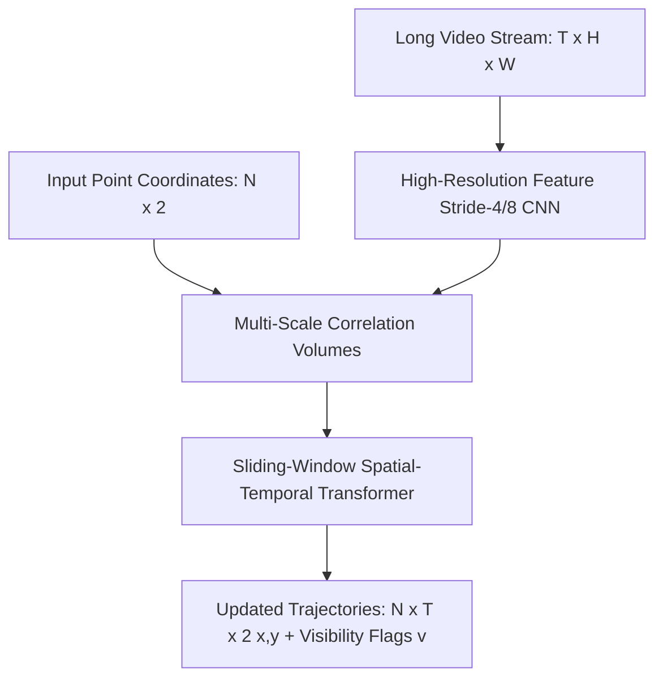

# 🔬 CoTracker & CoTracker3: Dense Point Trajectory Transformers

## 1. Executive Brief & Significance
Traditional video tracking tracks bounding box centroids (Multiple Object Tracking - MOT) or optical flow vectors between adjacent pairs of frames ($t$ and $t+1$). Optical flow suffers from catastrophic error accumulation across long sequences, while bounding boxes fail on non-rigid physical deformations (such as waving cloth, human musculature, or fluid surfaces).

**CoTracker & CoTracker3** (Karaev et al., Meta FAIR, 2023–2025) reframe tracking by jointly modeling up to **70,000 physical surface points** simultaneously across long temporal windows. By allowing candidate points to share trajectory context through self-attention, CoTracker tracks points through multi-second occlusions and predicts an explicit visibility flag $v \in [0, 1]$.



---

## 2. Core Architectural Mechanics

### A. Spatial-Temporal Cross-Point Attention
Instead of tracking each point independently (like PIPs or TAPIR), CoTracker stacks $N$ points into an $N \times T \times C$ query tensor. Inside each Transformer block:
1. **Temporal Self-Attention**: Models motion momentum and physical trajectory smoothness across time steps $T$.
2. **Spatial Cross-Point Attention**: Models physical geometric correlations between neighboring points on the same object surface. If Point A becomes occluded behind an obstacle, visible Point B on the same rigid body maintains the trajectory of Point A.

### B. Sliding Window Architecture
For arbitrarily long videos, CoTracker operates with a sliding window of length $S=8$ or $S=16$ frames with overlap, passing updated point tokens forward to guarantee linear computational complexity with video duration.

---

## Granular Component-by-Component Architectural Breakdown

### Architectural Taxonomy & Structural Elements

| Architectural Stage | Component Identity | Structural Specification & Type | Attention / Conv Mechanics | Receptive Field & Resolution |
| :--- | :--- | :--- | :--- | :--- |
| **Architectural Paradigm** | **Spatial-Temporal Point Transformer** | Hybrid 2D ConvNet Feature Extractor + Sliding-Window Point Transformer | Alternating 1D Temporal Self-Attention + 2D Spatial Cross-Point Attention | Video sequence ($T \times H \times W \times 3$) $\to$ Dense point tracks ($N \times T \times 2$) |
| **Backbone** | **Multi-Scale 2D CNN Extractor** | ResNet-style 2D Convolutional Backbone (Stride 4 and Stride 8) | Standard $3\times 3$ Residual Convolutions ($C \in [64, 128, 256]$) | High-resolution multi-scale feature pyramids at $H/4 \times W/4$ and $H/8 \times W/8$ |
| **Neck / Aggregator** | **Multi-Scale Correlation Sampler** | Differentiable Bilinear Grid Sampler + Local Radius Search | Multi-scale dot-product correlation ($r=3$ radius window across scales) | Extracts local 4D correlation volumes around estimated point positions |
| **Encoder** | **Spatial-Temporal Point Transformer** | Stacked Alternating Temporal & Spatial MHSA Blocks ($L=6$) | 1D Temporal MHSA (momentum across $T$) + 2D Spatial MHSA (coherence across $N$) | Joint interaction over all $N$ physical surface points across sliding window $S$ |
| **Decoder / Head** | **Iterative Trajectory & Visibility MLP**| Multi-Branch Iterative MLP Heads ($K=4$ refinement loops) | Linear MLPs outputting trajectory updates $(\Delta x, \Delta y)$ and visibility logits | Continuous 2D sub-pixel coordinates $(x, y) \in \mathbb{R}^2$ + Visibility flag $v \in [0, 1]$ |

### Structural Deep-Dive: Joint Dense Point Trajectory Tracking
1. **Backbone (2D CNN Feature Extractor)**: 
   - Each frame $I_t \in \mathbb{R}^{H \times W \times 3}$ in a video of length $T$ passes through a shared 2D convolutional network.
   - Produces two spatial feature pyramids: high-resolution features $\mathbf{F}_t^{(4)} \in \mathbb{R}^{\frac{H}{4} \times \frac{W}{4} \times C}$ and semantic features $\mathbf{F}_t^{(8)} \in \mathbb{R}^{\frac{H}{8} \times \frac{W}{8} \times 2C}$.
2. **Neck / Feature Aggregator (Correlation Volume Sampler)**:
   - For each query point $i \in \{1\dots N\}$ with current estimated coordinate $\mathbf{p}_{i, t} = (x_{i, t}, y_{i, t})$, the sampler extracts local feature vectors within a square window of radius $r=3$ pixels across both pyramid scales.
   - The sampled features are correlated with the point's source initialization template, generating a compact correlation descriptor vector $\mathbf{C}_{i, t} \in \mathbb{R}^{D_{\text{corr}}}$.
3. **Encoder (Spatial-Temporal Point Transformer)**:
   - Point tokens are organized into a 3D tensor: $\mathbf{X} \in \mathbb{R}^{N \times S \times D}$ where $N$ is the number of points (up to 70,000 in CoTracker3) and $S$ is the sliding window size ($S=8\dots 16$).
   - **Temporal Attention**: Applies MHSA along the temporal dimension $S$, learning physical inertia and continuous acceleration profiles.
   - **Spatial Cross-Point Attention**: Applies MHSA across the point dimension $N$, allowing points on the same rigid or non-rigid object to share trajectory context, preventing tracking loss during long-term occlusions.
4. **Decoder / Prediction Head (Iterative MLP Refiner)**:
   - An iterative GRU/MLP module runs for $K=4$ loops per sliding window.
   - Outputs sub-pixel coordinate offsets $(\Delta x_{i, t}, \Delta y_{i, t})$ to refine trajectories:
     $$\mathbf{p}_{i, t}^{(k)} = \mathbf{p}_{i, t}^{(k-1)} + (\Delta x_{i, t}, \Delta y_{i, t})$$
   - Concurrently predicts binary visibility probability $v_{i, t} = \sigma(\text{MLP}_{\text{vis}}(\mathbf{X}_{i, t}))$ to indicate whether the point is currently occluded behind another physical surface.

### Parameter & Computational Latency Distribution

| Stage / Subsystem | Parameter Share (%) | Inference Latency (%) | Computational Complexity ($\text{FLOPs}$) | Dominant Hardware Bottleneck |
| :--- | :--- | :--- | :--- | :--- |
| **2D CNN Feature Backbone** | ~24% | ~22% | $\mathcal{O}(T \cdot H W C)$ (High-resolution Conv2D) | High-resolution memory bandwidth |
| **Bilinear Correlation Sampler Neck** | ~4% | ~16% | $\mathcal{O}(N \cdot T \cdot r^2 \cdot C)$ (Grid Sample Ops) | Irregular memory gather / bilinear sampling |
| **Spatial-Temporal Point Transformer** | ~62% | ~48% | $\mathcal{O}(L \cdot (N S^2 D + N^2 S D))$ | Matrix multiplication & attention caching |
| **Iterative Trajectory & Visibility MLP**| ~10% | ~14% ($K=4$ Loops) | $\mathcal{O}(K \cdot N \cdot S \cdot D)$ | Small tensor GEMM & sequential loops |
---

## 3. Quantitative SOTA Benchmark Profile (TAP-Vid)

| Model Architecture | TAP-Vid Kinetics (AJ Score) | TAP-Vid Davis (AJ Score) | Tracked Points | Latency (ms) | Open License |
| :--- | :--- | :--- | :--- | :--- | :--- |
| **PIPs (Baseline)** | 48.5 | 56.4 | 8 | 120.0 ms | MIT |
| **TAPIR** | 62.4 | 67.3 | 256 | 45.0 ms | Apache-2.0 |
| **CoTracker** | 65.8 | 71.2 | 512 | 38.0 ms | Apache-2.0 |
| **CoTracker3 (Online)** | 68.2 (SOTA) | 73.8 (SOTA) | 2,048 | 28.5 ms | Apache-2.0 |

---

## 4. Engineering Implementation & Workflow

```python
import torch
from cotracker.predictor import CoTrackerPredictor

# Load pre-trained online sliding-window model
model = CoTrackerPredictor(checkpoint='checkpoints/cotracker3_online.pth').cuda().eval()

# Video tensor shape: [1, T, 3, H, W], normalized [0, 1]
video = torch.randn(1, 60, 3, 384, 512, device="cuda")

with torch.no_grad():
    # Grid of points (e.g. 10x10 = 100 points)
    pred_tracks, pred_visibility = model(video, grid_size=10)
    # pred_tracks: [1, 60, 100, 2] -> exact x, y pixel trajectories
    # pred_visibility: [1, 60, 100] -> boolean visibility under occlusion
```

---

## 5. Commercial Usability & License Audit
- **License**: **Apache-2.0**
- **Commercial Permissibility**: Approved for commercial VFX pipelines, medical surgical deformation tracking, robotic grasp stability monitoring, and sports analytics.
- **Official Repository**: [https://github.com/facebookresearch/co-tracker](https://github.com/facebookresearch/co-tracker)
