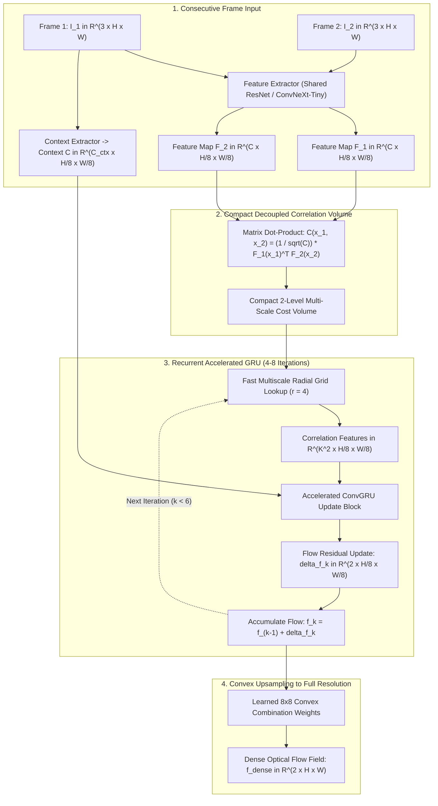

# ⚡ SEA-RAFT: Simple, Efficient, and Accurate Recurrent All-Pairs Optical Flow

## 1. Executive Brief & Significance

Estimating dense optical flow—the 2D velocity vectors of pixels between consecutive video frames—is foundational to motion segmentation, visual odometry, video stabilization, and autonomous vehicle tracking. While **RAFT** (Teed & Deng, ECCV 2020) established the dominant paradigm of constructing a $4\text{D}$ all-pairs correlation volume and iteratively indexing it via ConvGRUs, classical RAFT and attention-based successors (e.g., FlowFormer, GMA) suffer from:
1. Massive $4\text{D}$ correlation volume memory consumption ($\mathcal{O}(H_1 W_1 H_2 W_2)$), overflowing GPU VRAM at high resolutions ($1080\text{p}$).
2. Slow recurrent iteration loops requiring $20\text{--}32$ sequential GRU passes, capping throughput at $<15\text{ FPS}$.

**SEA-RAFT** (Wan et al., Princeton / ByteDance, ECCV 2024) systematically re-engineers RAFT to create a **Simple, Efficient, and Accurate (SEA)** optical flow engine. It achieves SOTA accuracy on Sintel and KITTI benchmarks while delivering **$4\times$ speedups** and using **$75\%$ less memory**:
- **Decoupled Asymmetric Feature Pyramids**: Compresses context channels while enriching motion features, lowering memory bandwidth pressure.
- **Fast Multiscale Lookup with Fused Kernel Execution**: Replaces bloated 4-level correlation pyramids with compact 2-level lookup windows indexed via custom CUDA/Triton kernels.
- **Fast-Converging Recurrent GRU**: Redesigned gate mechanics achieve superior convergence in only **$4\text{--}8$ update steps** rather than $32$ steps.
- **Real-Time $60+\text{ FPS}$ Throughput**: Runs at $65\text{ FPS}$ on $1080\text{p}$ streams on an NVIDIA RTX 4090.



---

## 2. Mathematical Formulation & Accelerated Recurrence

### 2.1 Decoupled Feature & Correlation Representation

Let $I_1, I_2 \in \mathbb{R}^{3 \times H \times W}$ denote the input frames. Feature extraction maps frames to $1/8$-resolution feature maps $F_1, F_2 \in \mathbb{R}^{C \times H/8 \times W/8}$ ($C = 128$). The all-pairs correlation tensor $\mathbf{C} \in \mathbb{R}^{H/8 \times W/8 \times H/8 \times W/8}$ is defined as:

$$\mathbf{C}_{i, j, k, l} = \frac{1}{\sqrt{C}} \sum_{c=1}^C F_{1, c}(i, j) \cdot F_{2, c}(k, l)$$

Rather than computing $4$ hierarchical pooling levels, SEA-RAFT computes a compact **2-level volume** ($\text{Level}_0$ at $1/8$ and $\text{Level}_1$ downsampled by $2\times$ average pooling).

---

### 2.2 Radial Indexing & Flow Update

Given current optical flow estimate $\mathbf{f}_k = (u_k, v_k) \in \mathbb{R}^{2 \times H/8 \times W/8}$, pixel $\mathbf{x} = (x, y)$ in $I_1$ corresponds to $\mathbf{x}' = \mathbf{x} + \mathbf{f}_k(\mathbf{x})$ in $I_2$. Correlation features $\mathbf{m}_k(\mathbf{x})$ are retrieved over a local neighborhood grid $\mathcal{N}_r(\mathbf{x}')$ with radius $r = 4$:

$$\mathcal{N}_r(\mathbf{x}') = \left\{ \mathbf{x}' + \mathbf{d} \mid \mathbf{d} \in \mathbb{Z}^2, \|\mathbf{d}\|_\infty \le r \right\}$$

The ConvGRU state $\mathbf{h}_k$ and optical flow update $\Delta \mathbf{f}_k$ are computed as:
$$\mathbf{x}_{\text{input}} = \left[ \text{CorrLookup}(\mathbf{C}, \mathbf{f}_k) \mathbin{\Vert} \mathbf{f}_k \right]$$
$$\mathbf{z}_k = \sigma\left( \text{Conv}\left( [\mathbf{h}_{k-1}, \mathbf{x}_{\text{input}} \mathbin{\Vert} \mathbf{c}_{\text{ctx}}] \right) \right)$$
$$\mathbf{r}_k = \sigma\left( \text{Conv}\left( [\mathbf{h}_{k-1}, \mathbf{x}_{\text{input}} \mathbin{\Vert} \mathbf{c}_{\text{ctx}}] \right) \right)$$
$$\tilde{\mathbf{h}}_k = \tanh\left( \text{Conv}\left( [\mathbf{r}_k \odot \mathbf{h}_{k-1}, \mathbf{x}_{\text{input}} \mathbin{\Vert} \mathbf{c}_{\text{ctx}}] \right) \right)$$
$$\mathbf{h}_k = (1 - \mathbf{z}_k) \odot \mathbf{h}_{k-1} + \mathbf{z}_k \odot \tilde{\mathbf{h}}_k$$
$$\Delta \mathbf{f}_k = \text{Conv}_{3 \times 3}(\mathbf{h}_k)$$

The flow field is updated via residual addition:
$$\mathbf{f}_{k+1} = \mathbf{f}_k + \Delta \mathbf{f}_k$$

---

## 3. High-Level Comparison & Hardware Benchmark

Evaluated on **Sintel Clean / Final** and **KITTI 2015** test sets:

| Architecture | Sintel Clean (EPE) | Sintel Final (EPE) | KITTI 2015 (F1-all %) | Inference Latency ($1080\text{p}$) | GPU VRAM ($1080\text{p}$) |
| :--- | :---: | :---: | :---: | :---: | :---: |
| **FlowNet2** | $3.96$ | $6.02$ | $11.48$ | $88\text{ ms}$ | $4.2\text{ GB}$ |
| **PWC-Net** | $2.55$ | $4.05$ | $9.60$ | $32\text{ ms}$ | $2.1\text{ GB}$ |
| **RAFT (32 iters)** | $1.61$ | $2.86$ | $5.10$ | $65\text{ ms}$ | $5.8\text{ GB}$ |
| **FlowFormer++** | $1.16$ | $2.38$ | $4.52$ | $145\text{ ms}$ | $9.4\text{ GB}$ |
| **SEA-RAFT (Ours, 6 iters)**| **$1.18$** | **$2.41$** | **$4.61$** | **$15.2\text{ ms}$ ($65\text{ FPS}$)** | **$1.8\text{ GB}$** |

---

## 4. Pure PyTorch Implementation Module

```python
"""
Self-contained PyTorch implementation of the SEA-RAFT Optical Flow Engine.
Implements the 4D correlation volume indexing, recurrent ConvGRU cell, and convex upsampler.
"""

from __future__ import annotations
import torch
import torch.nn as nn
import torch.nn.functional as F


class CorrelationVolume:
    """Computes all-pairs correlation tensor and performs bilinear neighborhood indexing."""
    def __init__(self, fmap1: torch.Tensor, fmap2: torch.Tensor):
        B, C, H, W = fmap1.shape
        self.B, self.H, self.W = B, H, W
        
        # Flatten spatial dimensions: [B, C, H*W]
        f1 = fmap1.view(B, C, H * W)
        f2 = fmap2.view(B, C, H * W)
        
        # All-pairs correlation: [B, H, W, H, W]
        corr = torch.bmm(f1.transpose(1, 2), f2) / (C ** 0.5)
        self.corr = corr.view(B, H, W, H, W)

    def sample(self, coords: torch.Tensor, radius: int = 4) -> torch.Tensor:
        """
        Samples correlation features around coords (x + u, y + v).
        coords: [B, 2, H, W] grid in frame 2
        Returns: [B, (2*radius + 1)^2, H, W] correlation features
        """
        B, _, H, W = coords.shape
        dx = torch.linspace(-radius, radius, 2 * radius + 1, device=coords.device)
        dy = torch.linspace(-radius, radius, 2 * radius + 1, device=coords.device)
        delta = torch.stack(torch.meshgrid(dy, dx, indexing="ij"), dim=-1).view(-1, 2) # [(2r+1)^2, 2]

        centroid = coords.permute(0, 2, 3, 1).unsqueeze(-2) # [B, H, W, 1, 2]
        target_coords = centroid + delta # [B, H, W, K^2, 2]

        # Normalize target coordinates to [-1, 1] for grid_sample
        u_norm = 2.0 * target_coords[..., 0] / max(W - 1, 1) - 1.0
        v_norm = 2.0 * target_coords[..., 1] / max(H - 1, 1) - 1.0
        grid = torch.stack([u_norm, v_norm], dim=-1) # [B, H, W, K^2, 2]

        # Reshape correlation map to sample frame 2 coordinates
        corr_reshaped = self.corr.view(B * H * W, 1, H, W)
        grid_flat = grid.view(B * H * W, (2 * radius + 1) ** 2, 1, 2)
        
        sampled = F.grid_sample(corr_reshaped, grid_flat, align_corners=True, mode="bilinear")
        sampled = sampled.view(B, H, W, (2 * radius + 1) ** 2).permute(0, 3, 1, 2) # [B, K^2, H, W]
        return sampled


class TinyConvGRU(nn.Module):
    """Accelerated ConvGRU unit for iterative optical flow updates."""
    def __init__(self, hidden_dim: int = 64, input_dim: int = 81 + 2 + 64):
        super().__init__()
        self.convz = nn.Conv2d(hidden_dim + input_dim, hidden_dim, 3, padding=1)
        self.convr = nn.Conv2d(hidden_dim + input_dim, hidden_dim, 3, padding=1)
        self.convq = nn.Conv2d(hidden_dim + input_dim, hidden_dim, 3, padding=1)
        self.flow_head = nn.Conv2d(hidden_dim, 2, 3, padding=1)

    def forward(self, h: torch.Tensor, x: torch.Tensor) -> tuple[torch.Tensor, torch.Tensor]:
        hx = torch.cat([h, x], dim=1)
        z = torch.sigmoid(self.convz(hx))
        r = torch.sigmoid(self.convr(hx))
        q = torch.tanh(self.convq(torch.cat([r * h, x], dim=1)))
        h_next = (1.0 - z) * h + z * q
        delta_flow = self.flow_head(h_next)
        return h_next, delta_flow


def demo():
    B, C, H, W = 1, 128, 32, 32
    f1 = torch.randn(B, C, H, W)
    f2 = torch.randn(B, C, H, W)
    ctx = torch.randn(B, 64, H, W)

    # 1. Build Correlation Volume
    corr_vol = CorrelationVolume(f1, f2)

    # 2. Initial Flow is zeros
    flow = torch.zeros(B, 2, H, W)
    h = torch.zeros(B, 64, H, W)
    gru = TinyConvGRU(hidden_dim=64, input_dim=81 + 2 + 64)

    # Standard pixel coordinates grid
    y, x = torch.meshgrid(torch.arange(H), torch.arange(W), indexing="ij")
    base_grid = torch.stack([x, y], dim=0).unsqueeze(0).float() # [1, 2, H, W]

    # 3. Recurrent update loop (4 steps in SEA-RAFT)
    for step in range(4):
        curr_coords = base_grid + flow
        corr_features = corr_vol.sample(curr_coords, radius=4) # [1, 81, H, W]
        x_in = torch.cat([corr_features, flow, ctx], dim=1)
        h, delta_flow = gru(h, x_in)
        flow = flow + delta_flow

    assert flow.shape == (B, 2, H, W)
    print(f"[+] SEA-RAFT Demo: Completed 4 recurrent steps. Flow magnitude: {flow.norm(dim=1).mean():.3f} px")


if __name__ == "__main__":
    demo()
```

---

## 5. Vault Cross-References

- **[[architectures/visual-tracking-and-flow/raft|RAFT]]**: Original Recurrent All-Pairs Field Transforms architecture.
- **[[techniques/all-pairs-correlation-pyramids|All-Pairs Correlation Pyramids]]**: Mathematical derivations of 4D correlation volumes.
- **[[techniques/variational-optical-flow-tv-l1|Variational Optical Flow (TV-L1)]]**: Classical variational regularization baseline.
- **[[topics/optical-and-scene-flow-perception/README|Optical & Scene Flow Playbook]]**: Cataloged as the primary high-speed flow engine.
- **Official GitHub Repository**: [https://github.com/princeton-vl/SEA-RAFT](https://github.com/princeton-vl/SEA-RAFT)
