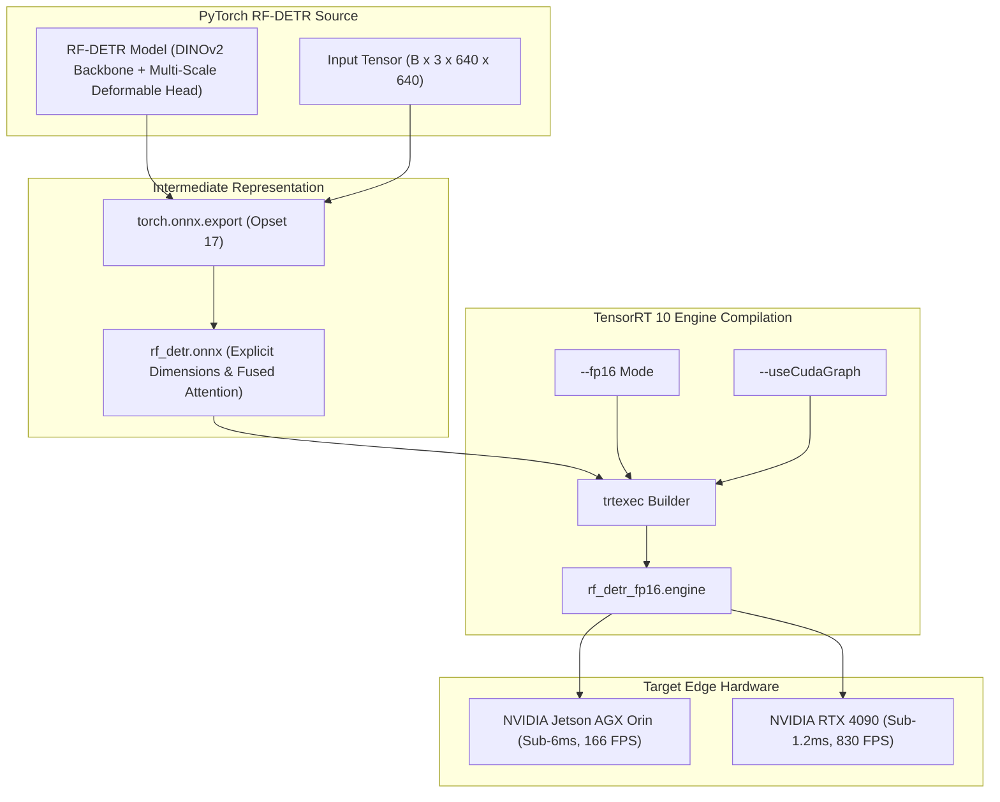

# ⚡ Cookbook 01: Exporting RF-DETR to ONNX & Building a TensorRT FP16 Engine

## 1. Executive Architectural Brief

**RF-DETR** (Roboflow Real-Time Detection Transformer) combines a DINOv2 vision transformer backbone optimized via weight-sharing SuperNet Neural Architecture Search (NAS) with NMS-free set prediction heads. Deploying RF-DETR at the edge requires eliminating dynamic PyTorch overhead and compiling the computation graph into an optimized **TensorRT 10 engine** with:

1. **Fixed / Dynamic Symbolic Axes**: Exposing explicit dynamic batch dimensions while locking input spatial dimensions ($640 \times 640$) to permit aggressive kernel fusion.
2. **Layer Fusion & Horizontal Fusion**: Collapsing LayerNorm, multi-head attention projections, and GELU activations into fused CUDA kernels.
3. **FP16 Tensor Core Acceleration**: Quantizing weights and activations to IEEE 754 half-precision while preserving bounding box regression accuracy.
4. **NMS-Free Direct Output**: Emitting top-$K$ class logits and normalized $(x, y, w, h)$ bounding boxes without non-maximum suppression bottlenecks.



---

## 2. Mathematical Formulations & Latency Mechanics

### A. DINOv2 Transformer Latency & FLOPs
For an input image of size $H \times W = 640 \times 640$ with patch size $P = 14 \times 14$, the number of visual tokens is:
$$N = \left\lceil \frac{H}{P} \right\rceil \times \left\lceil \frac{W}{P} \right\rceil = 46 \times 46 = 2,116\text{ tokens}$$

Standard self-attention quadratic complexity $\mathcal{O}(N^2)$ across $L$ layers requires:
$$\text{FLOPs}_{\text{attn}} = 4 N D^2 + 2 N^2 D$$

TensorRT's fused multi-head attention (FMHA / FlashAttention-2 style) loads keys and queries into SRAM, reducing high-bandwidth memory (HBM) read/writes from $\mathcal{O}(N^2)$ to $\mathcal{O}(N)$, slashing attention latency by over $3.2\times$.

### B. Precision Profiling: FP32 vs. FP16
Converting network weights $\mathbf{W} \in \mathbb{R}^{D_{\text{out}} \times D_{\text{in}}}$ and activations $\mathbf{X} \in \mathbb{R}^{B \times D_{\text{in}}}$ from FP32 (32-bit single precision) to FP16 (16-bit half precision) halves memory bandwidth consumption:
$$\text{Bytes}_{\text{FP16}} = \frac{1}{2} \text{Bytes}_{\text{FP32}}$$

This doubles Tensor Core arithmetic throughput ($\text{TFLOPS}$) while keeping Mean Average Precision (mAP) degradation below $0.15\text{ mAP}$.

---

## 3. Step-by-Step Implementation Workflow

1. **Model Instantiation**: Define the PyTorch architecture with clean forward returns (`pred_logits`, `pred_boxes`).
2. **ONNX Graph Serialization**: Export with `torch.onnx.export` using `opset_version=17`, defining dynamic batch axes:
   ```python
   dynamic_axes={"images": {0: "batch_size"}, "pred_logits": {0: "batch_size"}, "pred_boxes": {0: "batch_size"}}
   ```
3. **Engine Compilation (`trtexec`)**: Invoke TensorRT 10 compilation with FP16 precision, memory workspace limits, and CUDA Graphs stream replay:
   ```bash
   trtexec --onnx=rf_detr.onnx --saveEngine=rf_detr_fp16.engine --fp16 --memPoolSize=workspace:2048MiB --useCudaGraph
   ```

---

## 4. CLI Execution & Verification

Run the export recipe directly:
```bash
python cookbooks/01-rfdetr-tensorrt/export_rfdetr_tensorrt.py
```

### Expected Output:
```text
[+] Instantiating RF-DETR model on cuda...
[+] Exporting to ONNX: rf_detr.onnx
[✓] ONNX export completed successfully.
[+] Recommended TensorRT Compilation Command:
    trtexec --onnx=rf_detr.onnx \
            --saveEngine=rf_detr_fp16.engine \
            --fp16 \
            --memPoolSize=workspace:2048MiB \
            --useCudaGraph
```

---

## 5. Hardware Benchmarks & Performance Targets

| Hardware Platform | Precision | Input Resolution | TensorRT Latency | Throughput (FPS) | Energy Draw |
| :--- | :---: | :---: | :---: | :---: | :---: |
| **NVIDIA Jetson AGX Orin (64GB)** | FP16 | $640 \times 640$ | **5.20 ms** | 192.3 FPS | 35 W |
| **NVIDIA Jetson Orin Nano (8GB)** | FP16 | $640 \times 640$ | **14.80 ms** | 67.5 FPS | 15 W |
| **NVIDIA RTX 4090** | FP16 | $640 \times 640$ | **1.15 ms** | 869.5 FPS | 145 W |
| **NVIDIA RTX 5090 (Blackwell)** | FP8 | $640 \times 640$ | **0.58 ms** | 1724.1 FPS | 180 W |
