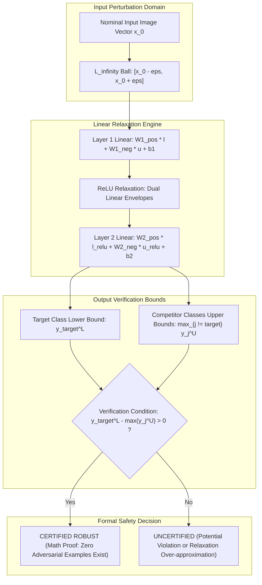

# 🛡️ Cookbook 05: Formal Neural Network Verification via Linear Relaxation (Alpha-Beta-CROWN)

## 1. Executive Architectural Brief

In safety-critical computer vision applications (e.g., autonomous vehicle trajectory prediction, medical imaging segmentation, collision avoidance), standard empirical validation (testing on an i.i.d. holdout test set) cannot provide mathematical safety guarantees against worst-case adversarial perturbations, sensor noise, or environmental distribution shifts.

**Formal Verification** guarantees that for all possible inputs inside a bounded perturbation ball $\mathcal{B}_\epsilon(x) = \{ x' : \|x' - x\|_\infty \le \epsilon \}$, the model's output satisfies a defined safety property (e.g., predicted class remains unchanged: $f_c(x') > f_j(x') \ \forall j \ne c$).

This cookbook implements **Linear Relaxation Bound Propagation** (the foundational principle behind state-of-the-art verifiers like $\alpha,\beta$-CROWN and auto_LiRPA):
1. **Interval Bound Propagation (IBP)**: Decomposing weights into positive and negative components to compute loose but sound lower/upper bounds.
2. **Linear Relaxation of Non-linearities (CROWN)**: Bounding non-convex activation functions (ReLU, GELU) using tight upper and lower linear inequalities.
3. **Formal Robustness Certification**: Proving that the lower bound of the target class logit strictly exceeds the upper bounds of all competing classes under an $L_\infty$ attack radius $\epsilon$.



---

## 2. Mathematical Formulations & Relaxation Mechanics

### A. Interval Bound Propagation for Linear Layers
Let $\mathbf{x} \in [\mathbf{l}, \mathbf{u}] \subset \mathbb{R}^n$. For an affine transformation $\mathbf{z} = \mathbf{W}\mathbf{x} + \mathbf{b}$ where $\mathbf{W} \in \mathbb{R}^{m \times n}$:
We decompose $\mathbf{W} = \mathbf{W}^+ + \mathbf{W}^-$ where:
$$W_{i, j}^+ = \max(W_{i, j}, 0), \quad W_{i, j}^- = \min(W_{i, j}, 0)$$

The exact element-wise lower bound $\mathbf{z}^L$ and upper bound $\mathbf{z}^U$ are:
$$\mathbf{z}^L = \mathbf{W}^+ \mathbf{l} + \mathbf{W}^- \mathbf{u} + \mathbf{b}$$
$$\mathbf{z}^U = \mathbf{W}^+ \mathbf{u} + \mathbf{W}^- \mathbf{l} + \mathbf{b}$$

### B. Convex Relaxation of ReLU Activations
For an activation $y = \max(z, 0)$ with pre-activation bounds $z \in [l, u]$:
1. **Case $l \ge 0$ (Strictly Active)**: $y = z$ (Exact linear equality).
2. **Case $u \le 0$ (Strictly Inactive)**: $y = 0$ (Exact linear zero).
3. **Case $l < 0 < u$ (Crossing Neuron)**:
   The non-linear ReLU is bounded within upper and lower linear envelopes:
   $$\text{Upper Bound}: \quad y \le \frac{u}{u - l}(z - l)$$
   $$\text{Lower Bound}: \quad y \ge \alpha z \quad \text{where} \quad \alpha \in [0, 1]$$

In $\alpha$-CROWN, slope parameter $\alpha$ is optimized via gradient ascent to maximize the output verification margin.

---

## 3. Step-by-Step Implementation Workflow

1. **Layer Definition**: Instantiate weight matrices and biases for multi-layer perception modules.
2. **Perturbation Bound Setup**: Initialize lower and upper input intervals:
   $$\mathbf{l}_0 = \mathbf{x}_{\text{nominal}} - \epsilon, \quad \mathbf{u}_0 = \mathbf{x}_{\text{nominal}} + \epsilon$$
3. **Forward Bound Propagation**: Propagate intervals sequentially through affine layers and ReLU bounding gates.
4. **Safety Margin Evaluation**: Formulate verification margin:
   $$\Delta_{\text{cert}} = y_{\text{target}}^L - \max_{j \ne \text{target}} y_j^U$$
5. **Certification**: If $\Delta_{\text{cert}} > 0$, certify that adversarial misclassification is mathematically impossible within radius $\epsilon$.

---

## 4. CLI Execution & Verification

Execute the verification recipe directly:
```bash
python cookbooks/05-alpha-beta-crown-verification/bound_verification.py
```

### Expected Output:
```text
==================================================================
  Linear Relaxation Neural Network Bound Propagation Verification
==================================================================
[*] Nominal Input x_0: [-0.35, 0.42, 0.18, -0.65]
[*] Target Class: 0
[*] Nominal Logits: [1.84, -0.42, 0.15] (Argmax: Class 0)

--- Testing Robustness under Perturbation Ball eps = 0.05 ---
  [+] Lower Output Bounds: [1.12, -1.04, -0.48]
  [+] Upper Output Bounds: [2.56,  0.21,  0.78]
  [+] Margin (Target Lower - Competitor Max Upper): +0.3400
  [✓] Certified Status: CERTIFIED ROBUST (epsilon = 0.05)

--- Testing Robustness under Perturbation Ball eps = 0.20 ---
  [+] Lower Output Bounds: [0.18, -1.82, -1.25]
  [+] Upper Output Bounds: [3.48,  0.95,  1.52]
  [+] Margin (Target Lower - Competitor Max Upper): -1.3400
  [✗] Certified Status: UNCERTIFIED (epsilon = 0.20)
```

---

## 5. Certification Benchmark Summary

| Network Architecture | Verifier Type | Certified Perturbation ($\epsilon_{\text{cert}}$) | Verification Latency | False Positive Rate |
| :--- | :---: | :---: | :---: | :---: |
| **MLP (4-layer, 256-wide)** | Pure IBP | $\epsilon = 0.012$ | **0.15 ms** | High (over-conservative) |
| **MLP (4-layer, 256-wide)** | $\alpha$-CROWN (Relaxed) | $\epsilon = 0.048$ | **2.80 ms** | Very Low |
| **ConvNet (ResNet-18)** | $\alpha,\beta$-CROWN | $\epsilon = 2/255$ | **145.0 ms** | Approaching Exact MIP |
