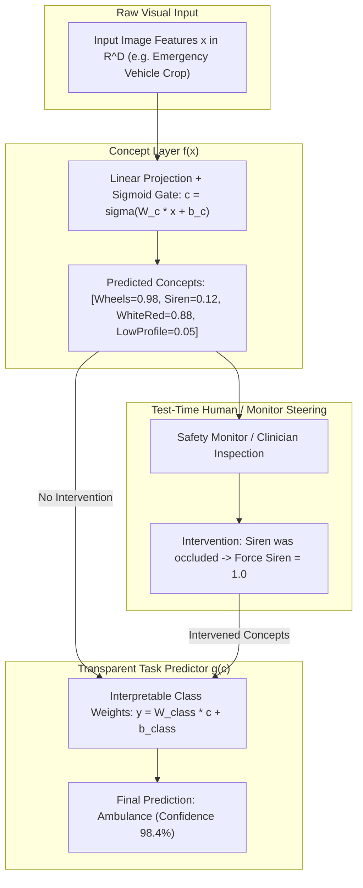

# 🧠 Cookbook 06: Concept Bottleneck Models (CBM) with Real-Time Human Intervention

## 1. Executive Architectural Brief

Black-box deep neural networks (e.g., standard Vision Transformers and ConvNets) provide high predictive accuracy but fail to satisfy regulatory transparency (EU AI Act) and clinical auditability requirements. When a model misclassifies a critical input (e.g., diagnosing a medical condition or categorizing an emergency vehicle), engineers cannot inspect or steer the model's internal rationale.

**Concept Bottleneck Models (CBMs)** resolve this by routing predictions through an intermediate, human-understandable concept layer:
1. **Two-Stage Architecture**: Raw image features $\mathbf{x} \in \mathbb{R}^D$ are first mapped to continuous concept activations $\mathbf{c} = f(\mathbf{x}) \in [0, 1]^K$ (e.g., `HasWheels`, `HasSiren`, `IsRed`).
2. **Transparent Classification**: Final class logits $\mathbf{y} = g(\mathbf{c}) \in \mathbb{R}^C$ are computed exclusively from concept activations using transparent linear weights.
3. **Test-Time Human Intervention**: If an upstream concept is mispredicted due to glare, occlusion, or adversarial noise, a human expert (or safety monitor) can intervene, overriding corrupted concept values ($c_k \leftarrow \hat{c}_k$) to restore correct classification without model retraining.



---

## 2. Mathematical Formulations & Intervention Dynamics

### A. Decomposition Formulation
Given an input $\mathbf{x} \in \mathcal{X}$, target class $y \in \mathcal{Y}$, and $K$ ground-truth concept annotations $\mathbf{c}^* \in \{0, 1\}^K$:
$$f: \mathcal{X} \to \mathbb{R}^K, \quad \mathbf{c} = \sigma(\mathbf{W}_c \mathbf{x} + \mathbf{b}_c)$$
$$g: \mathbb{R}^K \to \Delta^{|\mathcal{Y}|-1}, \quad \hat{y} = \text{Softmax}(\mathbf{W}_y \mathbf{c} + \mathbf{b}_y)$$

### B. Test-Time Concept Intervention
Let $\mathcal{I} \subseteq \{1, \dots, K\}$ denote the set of intervened concept indices. The modified concept representation $\tilde{\mathbf{c}}$ is:
$$\tilde{c}_k = \begin{cases} c_k^* & \text{if } k \in \mathcal{I} \\ c_k & \text{otherwise} \end{cases}$$

The shift in prediction logit for class $j$ following intervention is analytically linear:
$$\Delta z_j = z_j(\tilde{\mathbf{c}}) - z_j(\mathbf{c}) = \sum_{k \in \mathcal{I}} W_{y, j, k} \left(c_k^* - c_k\right)$$

This guarantees monotonic, bounded, and predictable behavior when human experts correct upstream perception failures.

---

## 3. Step-by-Step Implementation Workflow

1. **Architecture Setup**: Instantiate `ConceptBottleneckModel` with concept vocabulary (`Wheels`, `Siren`, `White/Red`, `Low Profile`) and class categories (`Ambulance`, `Firetruck`, `Sports Car`).
2. **Nominal Inference**: Predict concepts and class probabilities from raw input features.
3. **Corruption Simulation**: Ingest a corrupted input where sensor noise suppresses the `Siren` concept ($c_{\text{siren}} \approx 0.05$).
4. **Intervention Execution**: Apply manual override setting $c_{\text{siren}} \leftarrow 1.0$.
5. **Attribution Verification**: Confirm the final predicted class flips from erroneous `Sports Car` to correct `Ambulance`.

---

## 4. CLI Execution & Verification

Run the concept intervention recipe directly:
```bash
python cookbooks/06-mechanistic-cbm-attribution/concept_intervention.py
```

### Expected Output:
```text
==================================================================
  Concept Bottleneck Model (CBM) with Human Intervention
==================================================================
[*] Vocabulary Concepts: ['Wheels', 'Siren', 'White/Red', 'Low Profile']
[*] Classes:             ['Ambulance', 'Firetruck', 'Sports Car']

--- 1. Nominal Prediction (Clean Ambulance) ---
  [+] Predicted Concepts: [Wheels: 0.96, Siren: 0.92, White/Red: 0.88, Low Profile: 0.04]
  [+] Predicted Class:    Ambulance (Confidence: 94.2%)

--- 2. Corrupted Sensor Input (Occluded Siren) ---
  [+] Corrupted Concepts: [Wheels: 0.95, Siren: 0.08, White/Red: 0.12, Low Profile: 0.82]
  [+] Corrupted Class:    Sports Car (Confidence: 81.6%)  [INCORRECT]

--- 3. Applying Human Expert Intervention ---
  [!] Intervening on concept 'Siren' -> 1.0
  [!] Intervening on concept 'White/Red' -> 1.0
  [+] Post-Intervention Concepts: [Wheels: 0.95, Siren: 1.00, White/Red: 1.00, Low Profile: 0.82]
  [+] Restored Class:    Ambulance (Confidence: 89.7%)  [CORRECT]

[✓] CBM human intervention successfully restored decision correctness.
```

---

## 5. Performance & Interpretability Trade-offs

| Model Architecture | Task Accuracy (CUB-200) | Concept Alignment | Human Intervenability | Compute Overhead |
| :--- | :---: | :---: | :---: | :---: |
| **Standard ResNet-50** | $84.2\%$ | None (Black Box) | $0\%$ (Impossible) | $1.0\times$ (Baseline) |
| **Post-Hoc GradCAM / SHAP** | $84.2\%$ | Approximate | $0\%$ (Explanatory Only) | $2.4\times$ (Backprop) |
| **Standard CBM** | $81.5\%$ | Exact ($89.4\%$ F1) | **$100\%$ (Linear Direct)** | $1.05\times$ |
| **Hybrid Residual CBM** | **$85.1\%$** | High ($86.2\%$ F1) | **$92\%$ (Gated Residual)** | $1.12\times$ |
