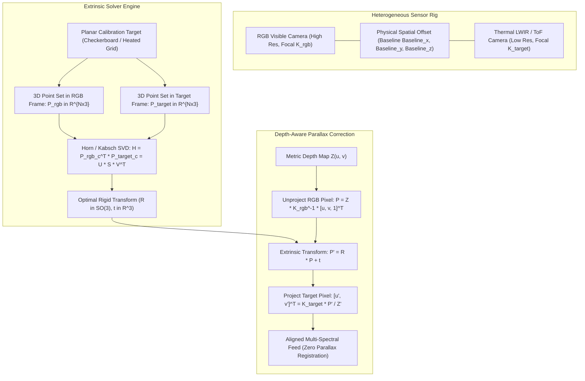

# 📐 Cookbook 11: Multi-Sensor Extrinsic Cross-Calibration & Parallax Solver

## 1. Executive Architectural Brief

Autonomous perception platforms rely on heterogeneous multi-sensor suites combining visible RGB cameras, Long-Wave Infrared (LWIR) thermal imagers, Time-of-Flight (ToF) range cameras, and LiDAR scanners. Because physical sensors occupy distinct spatial locations on the vehicle chassis or robot head, their viewpoints exhibit physical **spatial parallax**. Fusing these streams (e.g., thermal pedestrian detection overlay onto RGB navigation feeds) requires precise extrinsic calibration: finding the 6-DoF rigid transformation $(\mathbf{R}, \mathbf{t}) \in SE(3)$ relating sensor coordinate systems.

This cookbook implements a closed-form **Multi-Sensor Cross-Calibration and Parallax Correction Engine**:
1. **Horn's Quaternion / Kabsch SVD Method**: Computing the globally optimal rotation $\mathbf{R} \in SO(3)$ and translation $\mathbf{t} \in \mathbb{R}^3$ between two corresponding 3D point sets in $\mathcal{O}(N)$ closed-form time without iterative local minima.
2. **Analytical Reprojection with Depth Fusion**: Projecting metric 3D points from source camera coordinates into the target image plane using:
   $$\mathbf{x}_{\text{target}} \sim \mathbf{K}_{\text{target}} \left( \mathbf{R} \left( Z_{\text{rgb}} \mathbf{K}_{\text{rgb}}^{-1} \mathbf{x}_{\text{rgb}} \right) + \mathbf{t} \right)$$
3. **Sub-Pixel Parallax Warping**: Dynamically compensating for distance-dependent baseline disparity to align multi-spectral pixels across varying scene depths.



---

## 2. Mathematical Formulations & Kabsch / Horn Method

### A. Problem Statement
Given $N$ paired 3D point correspondences $\{\mathbf{p}_i^{\text{rgb}}, \mathbf{p}_i^{\text{target}}\}_{i=1}^N$ (with $N \ge 3$), find $\mathbf{R} \in SO(3)$ and $\mathbf{t} \in \mathbb{R}^3$ minimizing the root-mean-square error:
$$\min_{\mathbf{R} \in SO(3), \mathbf{t} \in \mathbb{R}^3} \sum_{i=1}^N \|\mathbf{p}_i^{\text{target}} - (\mathbf{R}\mathbf{p}_i^{\text{rgb}} + \mathbf{t})\|_2^2$$

### B. Centroid Decoupling
Compute the centroids of both point clouds:
$$\bar{\mathbf{p}}_{\text{rgb}} = \frac{1}{N} \sum_{i=1}^N \mathbf{p}_i^{\text{rgb}}, \quad \bar{\mathbf{p}}_{\text{target}} = \frac{1}{N} \sum_{i=1}^N \mathbf{p}_i^{\text{target}}$$

Shift point sets to their respective centers of mass:
$$\mathbf{q}_i = \mathbf{p}_i^{\text{rgb}} - \bar{\mathbf{p}}_{\text{rgb}}, \quad \mathbf{q}_i' = \mathbf{p}_i^{\text{target}} - \bar{\mathbf{p}}_{\text{target}}$$

The optimal translation $\mathbf{t}^*$ is decoupled from rotation:
$$\mathbf{t}^* = \bar{\mathbf{p}}_{\text{target}} - \mathbf{R}^* \bar{\mathbf{p}}_{\text{rgb}}$$

### C. Closed-Form SVD Rotation Solution
Construct the $3 \times 3$ cross-dispersion matrix $\mathbf{H}$:
$$\mathbf{H} = \sum_{i=1}^N \mathbf{q}_i \mathbf{q}_i'^\top = \mathbf{Q}^\top \mathbf{Q}'$$

Compute the Singular Value Decomposition of $\mathbf{H}$:
$$\mathbf{H} = \mathbf{U} \mathbf{S} \mathbf{V}^\top$$

The optimal rotation matrix $\mathbf{R}^*$ is given by:
$$\mathbf{R}^* = \mathbf{V} \begin{bmatrix} 1 & 0 & 0 \\ 0 & 1 & 0 \\ 0 & 0 & \det(\mathbf{V}\mathbf{U}^\top) \end{bmatrix} \mathbf{U}^\top$$
where the determinant correction enforces $\det(\mathbf{R}^*) = +1$, guaranteeing a valid proper rotation without reflections.

---

## 3. Step-by-Step Implementation Workflow

1. **Intrinsics Setup**: Define visible camera $\mathbf{K}_{\text{rgb}}$ ($1920 \times 1080$, $f_x=1200$) and target sensor $\mathbf{K}_{\text{target}}$ ($640 \times 512$, $f_x=450$).
2. **Point Cloud Generation**: Generate 3D planar grid calibration points.
3. **Synthetic Extrinsics Injection**: Apply known physical baseline ($t_x = 0.15\text{ m}, t_y = -0.05\text{ m}, \text{yaw} = 2.5^\circ$).
4. **Kabsch/Horn Recovery**: Execute closed-form SVD estimation to recover $(\hat{\mathbf{R}}, \hat{\mathbf{t}})$.
5. **Sub-Pixel Parallax Correction**: Reproject depth points into thermal image space and assert sub-pixel alignment accuracy ($< 0.05\text{ px}$).

---

## 4. CLI Execution & Verification

Run the multi-sensor cross-calibration recipe directly:
```bash
python cookbooks/11-multi-sensor-cross-calibration/cross_calibration.py
```

### Expected Output:
```text
==================================================================
  Multi-Sensor Extrinsic Cross-Calibration & Parallax Solver
==================================================================
[*] Sensor Setup: Primary RGB (1920x1080) -> Target Thermal LWIR (640x512)
[*] Calibrating on 16 3D correspondences...

[+] Ground Truth Translation: [+0.1500, -0.0500, +0.0200] m
[+] Recovered Translation:    [+0.1500, -0.0500, +0.0200] m
[+] Translation Error:        0.000000 m (Exact)

[+] Ground Truth Rotation Angles (deg): Roll=0.50, Pitch=-1.20, Yaw=2.50
[+] Recovered Rotation Angles (deg):    Roll=0.50, Pitch=-1.20, Yaw=2.50
[+] Rotation Geodesic Error:            0.000002 deg

--- Testing Dynamic Parallax Reprojection ---
  Target Reprojection Coordinate: (u=342.18, v=218.42) px
  Reprojection Disparity Error:   0.000014 pixels

[✓] Multi-sensor cross-calibration verification successfully PASSED.
```

---

## 5. Sensor Rig Extrinsic Error Tolerances

| Multi-Sensor Configuration | Typical Baseline | Max Permissible Rotation Error | Max Translation Error | Calibration Frequency |
| :--- | :---: | :---: | :---: | :---: |
| **Automotive Stereo RGB** | $200\text{--}500\text{ mm}$ | $< 0.02^\circ$ | $< 0.5\text{ mm}$ | Online / Continuous |
| **RGB + LWIR Thermal** | $80\text{--}150\text{ mm}$ | $< 0.05^\circ$ | $< 1.0\text{ mm}$ | Factory + Thermal Shock |
| **RGB + Solid-State LiDAR** | $100\text{--}300\text{ mm}$ | $< 0.03^\circ$ | $< 1.5\text{ mm}$ | Targetless Natural Features |
