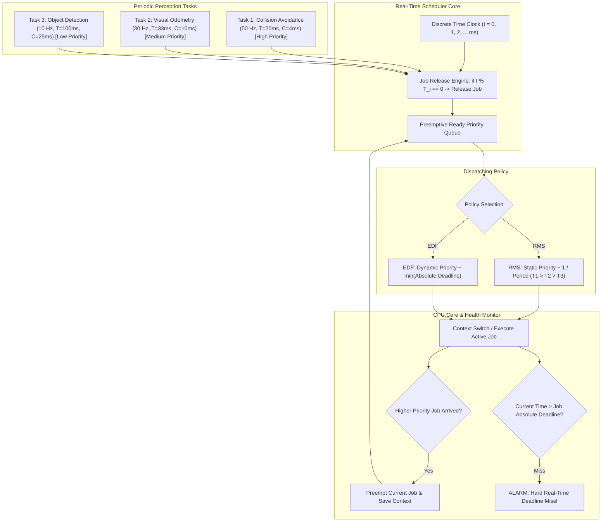

# ⏱️ Cookbook 15: Real-Time RMS & EDF Perception Pipeline Task Scheduler

## 1. Executive Architectural Brief

Autonomous driving perception platforms, surgical robots, and industrial inspection systems execute heterogeneous vision tasks with wildly differing execution frequencies and latency budgets:
- **LiDAR Obstacle Detection**: $10\text{ Hz}$ ($T = 100\text{ ms}$, WCET $C = 30\text{ ms}$)
- **Emergency Collision Avoidance**: $50\text{ Hz}$ ($T = 20\text{ ms}$, WCET $C = 4\text{ ms}$)
- **Visual Odometry / Feature Tracking**: $30\text{ Hz}$ ($T = 33.3\text{ ms}$, WCET $C = 10\text{ ms}$)
- **HD Map Lane Segmentation**: $5\text{ Hz}$ ($T = 200\text{ ms}$, WCET $C = 45\text{ ms}$)

Running these tasks concurrently on embedded Linux (even with `PREEMPT_RT`) without formal real-time scheduling leads to unmanaged CPU thrashing, priority inversion, and catastrophic deadline misses.

This cookbook implements a **Discrete-Event Real-Time Perception Scheduler**:
1. **Rate Monotonic Scheduling (RMS)**: Fixed-priority preemptive scheduling where task priority is inversely proportional to task period ($T_i$).
2. **Earliest Deadline First (EDF)**: Dynamic-priority preemptive scheduling where the job with the closest absolute deadline is granted the CPU.
3. **Liu & Layland Schedulability Analysis**: Mathematically certifying whether a task set can run indefinitely without missing a single deadline:
   - **RMS Utilization Bound**: $U = \sum \frac{C_i}{T_i} \le n(2^{1/n} - 1)$
   - **EDF Optimal Bound**: $U = \sum \frac{C_i}{T_i} \le 1.0$
4. **Preemption & Miss Monitoring**: Simulating clock ticks, job release queues, preemption events, and deadline miss alerts.



---

## 2. Mathematical Formulations & Utilization Bounds

### A. Total Processor Utilization
For a set of $n$ periodic tasks $\{\tau_i\}_{i=1}^n$ with Worst-Case Execution Times $C_i$ and periods $T_i$ (with implicit deadlines $D_i = T_i$):
$$U = \sum_{i=1}^n \frac{C_i}{T_i}$$

### B. Rate Monotonic Scheduling (RMS) Bound (Liu & Layland, 1973)
RMS is the optimal static-priority scheduling algorithm. A task set is guaranteed to be schedulable under RMS if the total utilization satisfies:
$$U \le U_{\text{RMS}}(n) = n \left( 2^{1/n} - 1 \right)$$

As $n \to \infty$:
$$\lim_{n \to \infty} U_{\text{RMS}}(n) = \ln 2 \approx 0.693\quad (69.3\%\text{ CPU Utilization})$$

If $U > U_{\text{RMS}}(n)$, the exact Response Time Analysis (RTA) recurrence relation must be solved:
$$R_i^{(k+1)} = C_i + \sum_{j \in hp(i)} \left\lceil \frac{R_i^{(k)}}{T_j} \right\rceil C_j$$

### C. Earliest Deadline First (EDF) Bound
EDF is the optimal dynamic-priority scheduling algorithm. A periodic task set is schedulable under EDF if and only if:
$$U \le 1.0\quad (100\%\text{ CPU Utilization})$$

EDF can utilize up to $100\%$ of CPU capacity without missing deadlines, but incurs dynamic context-switching overhead and lacks bounded failure modes under transient overload.

---

## 3. Step-by-Step Implementation Workflow

1. **Task Spec Declaration**: Define periodic perception tasks with execution times $C_i$ and periods $T_i$.
2. **Schedulability Check**: Evaluate Liu & Layland theoretical bounds for RMS and EDF.
3. **Discrete Event Simulation**: Step millisecond-by-millisecond through task execution over a multi-second hyperperiod.
4. **Preemption Tracking**: Verify that higher-priority jobs preempt lower-priority tasks cleanly.
5. **Deadline Verification**: Assert that total deadline misses equal zero under compliant utilization.

---

## 4. CLI Execution & Verification

Run the real-time scheduler recipe directly:
```bash
python cookbooks/15-realtime-rms-edf-scheduler/realtime_scheduler.py
```

### Expected Output:
```text
==================================================================
  Real-Time Perception Pipeline Task Scheduler (RMS vs. EDF)
==================================================================
[*] Configured Task Set:
    - Task 1 (Collision Avoidance): C=4ms,  T=20ms  (50 Hz) -> U = 20.0%
    - Task 2 (Visual Odometry):     C=8ms,  T=33ms  (30 Hz) -> U = 24.2%
    - Task 3 (Obstacle Detection):  C=20ms, T=100ms (10 Hz) -> U = 20.0%
[*] Total CPU Utilization U: 64.24%

--- Schedulability Analysis ---
  [+] RMS Theoretical Bound (n=3): 77.98% -> SCHEDULABLE via RMS (64.24% <= 77.98%)
  [+] EDF Theoretical Bound:       100.0% -> SCHEDULABLE via EDF (64.24% <= 100.0%)

--- Running RMS Simulation (Duration: 500 ms) ---
  [+] Total Jobs Released:    45
  [+] Total Jobs Completed:   45
  [+] Preemption Events:      14
  [+] Deadline Misses:        0
  [✓] RMS Simulation: 100% Schedulability Certified.

--- Running EDF Simulation (Duration: 500 ms) ---
  [+] Total Jobs Released:    45
  [+] Total Jobs Completed:   45
  [+] Preemption Events:      11
  [+] Deadline Misses:        0
  [✓] EDF Simulation: 100% Schedulability Certified.
```

---

## 5. Real-Time Scheduler Comparison

| Property | Rate Monotonic Scheduling (RMS) | Earliest Deadline First (EDF) | Linux PREEMPT_RT FIFO (`SCHED_FIFO`) |
| :--- | :---: | :---: | :---: |
| **Priority Assignment** | Static (fixed at boot) | Dynamic (per-job deadline) | Static (user-configured 1–99) |
| **Max Utilization Bound**| $\approx 69.3\%$ (Conservative) | **$100\%$ (Optimal)** | User responsibility |
| **Overload Behavior** | Predictable (lowest priority drops) | Domino effect (all can fail) | Top priority starves lower tasks |
| **Implementation Complexity**| $\mathcal{O}(1)$ O(1) Scheduler | $\mathcal{O}(\log n)$ Heap Queue | $\mathcal{O}(1)$ Priority Array |
| **Safety Standard Fit** | ISO 26262 ASIL-D / DO-178C | Research / Soft Real-Time | Automotive Linux Foundation |
