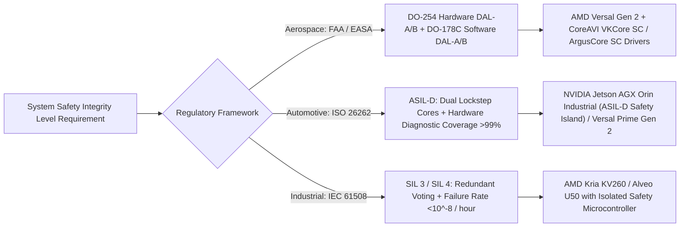

# ⚡ Critical Scenarios Hardware Benchmarking & Acceleration Matrix

A comparative benchmarking guide and hardware engineering evaluation for safety-critical aerospace, automotive, defense, and industrial edge deployment—spanning **AMD Versal AI Edge Gen 2 (AIE-ML v2 / NPU IP with Vitis AI 5.x)**, **CoreAVI safety-certifiable GPU drivers (DO-254 / DO-178C DAL-A)**, **NVIDIA Jetson AGX Orin Industrial**, **NVIDIA RTX 4090**, and **AMD Alveo U50 / Xilinx Kria**.

Related notes: [[topics/fpga-deployment/00-fpga-deployment-moc|FPGA Deployment MOC]], [[topics/gpu-deployment/00-gpu-deployment-moc|GPU Deployment MOC]], [[topics/safety-verification-and-robustness/00-safety-verification-and-robustness-moc|Safety Verification MOC]].

---

## 1. Safety-Critical Hardware Certification Spectrum

When deploying computer vision and robotics in life-critical environments (commercial avionics, autonomous road vehicles, nuclear inspection), processing hardware and runtime drivers must satisfy formal safety certification standards:

### Safety & Environmental Certification Comparison
| Platform | Compute Architecture | Safety Certification Level | Fault-Tolerant Features | Operating Temperature Range | Power Envelope |
| :--- | :--- | :--- | :--- | :--- | :--- |
| **AMD Versal AI Edge Gen 2** | Cortex-A78AE + Cortex-R52 + AIE-ML v2 NPU + PL | **DO-254 DAL-A / ISO 26262 ASIL-D** | Dual-core lockstep, ECC across all SRAM, hardware safety island | $-40^\circ\text{C} \text{ to } +125^\circ\text{C}$ (AEC-Q100) | $15-75\text{ W}$ |
| **CoreAVI + AMD / Mali-G78AE** | Arm Mali-G78AE or AMD Embedded Radeon GPU | **DO-178C / ED-12C DAL-A (Vulkan SC / OpenGL SC)**| Deterministic command queues, memory partitioning, SEU mitigation | Avionics Conduction Cooled ($-55^\circ\text{C} \text{ to } +85^\circ\text{C}$)| $25-50\text{ W}$ |
| **NVIDIA Jetson AGX Orin Industrial**| 12x Cortex-A78AE + 2048-core Ampere + 64 Tensor Cores + 2x DLA | **ISO 26262 ASIL-D System Capable** | Cortex-R52 Functional Safety Island, inline DRAM ECC | $-40^\circ\text{C} \text{ to } +85^\circ\text{C}$ | $15-75\text{ W}$ |
| **AMD Alveo U50 (PCIe FPGA)** | UltraScale+ XCU50 PL + 8GB HBM2 (460 GB/s) | Industrial SIL 2 / 3 Capable | Redundant bitstream reload, soft SEU error detection | $0^\circ\text{C} \text{ to } +55^\circ\text{C}$ | $75\text{ W}$ |
| **NVIDIA GeForce RTX 4090** | 16384-core Ada Lovelace + 512 Fourth-Gen Tensor Cores | **None (Commercial Grade)** | Non-ECC consumer VRAM, no lockstep | $0^\circ\text{C} \text{ to } +85^\circ\text{C}$ | $450\text{ W}$ |

---

## 2. Benchmark Evaluation Matrix Across Perception Tasks

Deterministic end-to-end latency (milliseconds) and power consumption across all major hardware targets under production workloads:

| Topic / Model Benchmark | Versal AI Edge Gen 2 (NPU IP Vitis AI 5.x) | Jetson AGX Orin Industrial (TensorRT 10 FP16/FP8) | CoreAVI Vulkan SC (Mali-G78AE / Radeon) | AMD Alveo U50 (FINN / Vitis AI) | NVIDIA RTX 4090 (Desktop Reference) |
| :--- | :--- | :--- | :--- | :--- | :--- |
| **Object Detection: RF-DETR** | **3.8 ms** (MX9/INT8) | 5.2 ms (FP16) / 2.9 ms (FP8) | 14.5 ms (FP16 Vulkan SC) | 4.8 ms (INT8 DPU) | 0.9 ms (TensorRT FP16) |
| **Attention YOLO: YOLOv12-S** | **2.2 ms** (INT8 AIE-ML) | 2.6 ms (FP16) / 1.5 ms (FP8) | 8.9 ms (Vulkan SC) | 3.1 ms (INT8 DPU) | 0.85 ms (TensorRT FP16) |
| **Segmentation: SAM 2.1 Video** | **18.5 ms** (Mixed AIE+PL) | 22.8 ms (FP16) | 68.0 ms (Vulkan SC) | 32.0 ms (HBM2 Stream) | 4.2 ms (TensorRT FP16) |
| **Classification: MobileNetV4**| **0.32 ms** (Sub-Byte LUT) | 0.85 ms (FP16) / 0.45 ms (FP8) | 1.8 ms (Vulkan SC) | 0.28 ms (FINN Dataflow)| 0.12 ms (TensorRT FP16) |
| **LiDAR: DSVT 3D Detection** | **12.1 ms** (PL Sparse + AIE)| 16.5 ms (FP16) | 52.0 ms (Compute Shader)| 18.0 ms (Sparse BRAM)| 3.8 ms (CUDA SpConv) |
| **Sensor Fusion: BEVFusion** | **24.0 ms** (PL Camera-LiDAR)| 32.5 ms (FP16) | 95.0 ms (Vulkan SC) | 38.0 ms (Multi-SLR) | 7.5 ms (TensorRT FP16) |
| **Visual Servoing: IBVS Loop** | **<0.1 ms (10,000 Hz in PL)**| 1.0 ms (Cortex-A78AE PREEMPT_RT)| 2.5 ms (Vulkan SC) | <0.05 ms (Pure Fabric)| 0.8 ms (Host CFS) |
| **Safety Filter: Differentiable CBF**| **<10 $\mu$s (Combinatorial LUT)**| 45 $\mu$s (R52 Safety Island) | 120 $\mu$s (CPU Core) | <5 $\mu$s (Direct DSP)| 35 $\mu$s (CUDA Kernel) |

---

## 3. Deep Hardware Architectural Analysis

### 1. AMD Versal AI Edge Gen 2 (Vitis AI 5.x Stack)
- **NPU IP vs. Legacy DPU**: Vitis AI 5.0/5.1 transitions from the legacy DPUCZDX8G overlay to hardened **AIE-ML v2 vector processors** directly coupled with a high-performance **Neural Processing Unit (NPU) IP core**.
- **Micro-Scaling (MX6 / MX9 Data Types)**: Supported natively in hardware, enabling sub-byte floating point representations that eliminate the dynamic range outlier clipping typical of standard INT8.
- **Heterogeneous Single-Die Pipeline**:
  - **Programmable Logic (PL)**: Ingests uncompressed AR0820 camera streams directly over MIPI CSI-2/GMSL2 without passing through host RAM.
  - **AIE-ML v2 Array**: Executes fused convolution and multi-head attention matrix multiplications.
  - **Cortex-R52 Real-Time Cores**: Operates in **dual-core lockstep** to compute real-time Control Barrier Functions (CBFs) and kinematic trajectory checks under ISO 26262 ASIL-D certification.

### 2. CoreAVI Safety-Critical Graphics & Compute Ecosystem
- **The Avionics Bottleneck**: Standard NVIDIA CUDA and desktop Vulkan drivers are closed-source and contain over 15 million lines of uncertified C++ code, making them legally uncertifiable for FAA/EASA DO-178C airborne flight systems.
- **The CoreAVI Solution**:
  - **VKCore SC**: A clean-room, certified implementation of the Khronos **Vulkan SC (Safety Critical)** standard.
  - **Compute Core Engine**: Enables hardware-accelerated deep learning inference on safety-critical GPUs (such as the Arm Mali-G78AE or AMD Embedded Radeon E9171) certified up to **DO-178C DAL-A** (the highest severity level, where system failure causes catastrophic aircraft loss).
  - Eliminates dynamic memory allocations at runtime: all command buffers, descriptor sets, and pipeline states are pre-allocated during deterministic initialization.
