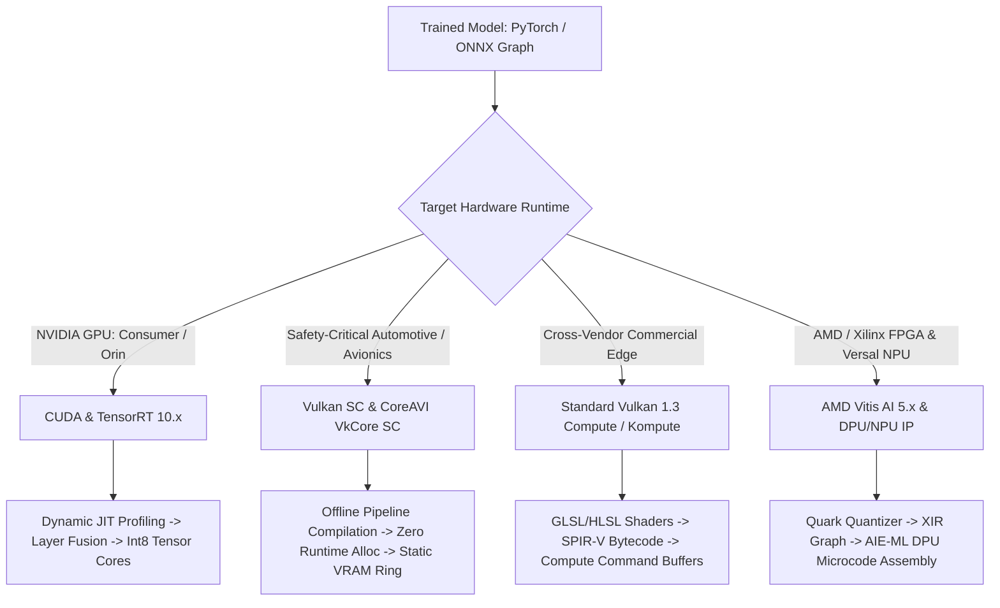

# ⚙️ Hardware Perception & Inference Reality: CUDA, TensorRT, Vulkan, Vulkan SC & Vitis AI

A ground-truth engineering breakdown of how computer vision and deep learning models actually execute across target hardware runtimes, how each is tested, and the exact compilation workflows.

Related notes: [[topics/gpu-deployment/00-gpu-deployment-moc|GPU Deployment MOC]], [[topics/fpga-deployment/00-fpga-deployment-moc|FPGA Deployment MOC]], [[docs/critical-scenarios-hardware-matrix.md|Critical Scenarios Hardware Matrix]].

---

## 1. How Each Hardware Runtime Actually Works

### 1. NVIDIA CUDA & TensorRT 10.x
- **How it Works**:
  - **CUDA (Compute Unified Device Architecture)**: Direct C++ hardware access exposing Streaming Multiprocessors (SMs), Warp Schedulers (32 threads per warp), Shared Memory ($L1$), and Tensor Cores.
  - **TensorRT**: An optimizing compiler that ingests an ONNX graph, performs **horizontal and vertical layer fusion** (e.g., Conv + BatchNorm + ReLU merged into a single CUDA kernel call), evaluates memory footprints to minimize DRAM reads/writes, and benchmarks multiple candidate kernels live on target silicon to pick the fastest implementation.
- **Memory Model**: Unified Memory (`cudaMallocManaged`) or pinned host memory (`cudaHostAlloc`) enabling zero-copy DMA transfers between CPU RAM and GPU VRAM over PCIe.
- **Certification Reality**: **Not certified for aerospace (DO-178C) or highest automotive (ISO 26262 ASIL-D) by default**. While NVIDIA provides "DriveOS Safety" on specialized Jetson Orin AGX chips, standard consumer GPUs (RTX 4050/4090) run non-deterministic Linux drivers with closed-source user/kernel binary blobs.

---

### 2. Khronos Vulkan Compute (Standard Vulkan 1.3)
- **How it Works**:
  - A cross-vendor, low-level explicit API supported on NVIDIA, AMD, Intel, Apple (via MoltenVK), ARM Mali, and Qualcomm Adreno.
  - Neural networks are represented as **Compute Shaders** written in GLSL or HLSL, compiled into portable **SPIR-V bytecode** using `glslangValidator` or `dxc`.
  - The runtime dispatches compute passes through `VkCommandBuffer` submitted to a `VkQueue` with explicit pipeline memory barriers (`vkCmdPipelineBarrier`).
- **Framework Integrations**:
  - **Tencent NCNN**: Uses Vulkan compute shaders for ultra-fast mobile inference.
  - **ONNX Runtime Vulkan Execution Provider**: Executes ONNX operators via SPIR-V compute kernels.
- **Certification Reality**: Standard Vulkan is a consumer/gaming API. It permits dynamic memory allocations (`vkAllocateMemory`), runtime pipeline compilation (`vkCreateComputePipelines`), and shader compilation on the fly—which are strictly prohibited in safety-critical certifiable avionics.

---

### 3. Khronos Vulkan SC (Safety Critical) & CoreAVI VkCore SC
- **How it Works**:
  - **Vulkan SC** is a restricted, deterministic subset of Vulkan engineered specifically for **ISO 26262 (ASIL-D automotive)** and **DO-178C / DO-254 (DAL-A avionics)**.
  - **The Golden Law of Vulkan SC**: **Zero Dynamic Memory Allocation and Zero Runtime Shader Compilation**.
  - In standard Vulkan, if a driver runs out of memory or a shader compilation stutters for $50\,\text{ms}$, a video game drops a frame. In an aircraft fly-by-wire or autonomous braking system, that stutter can be catastrophic.
  - **Offline Pipeline Compiler (PCC)**: Shaders are compiled offline on the host development machine into static binary pipeline cache files.
  - **Static Memory Footprint**: All GPU memory pools, descriptors, and buffers are pre-allocated during vehicle boot-up (`vkCreateDevice` with fixed pool sizes). Once the vehicle enters operational drive mode, calling any allocation function is illegal.
- **Vendors**:
  - **CoreAVI**: The primary commercial provider of certifiable Vulkan SC drivers (**VkCore SC**) and safety-critical compute engines (**ComputeCore**), supporting AMD embedded GPUs, NXP i.MX8, and Intel Tiger Lake/Alder Lake.

---

### 4. AMD / Xilinx Vitis AI (5.x) & FPGA / Versal NPU
- **How it Works**:
  - FPGAs and Versal ACAPs (Adaptive Compute Acceleration Platforms) do not run sequential instructions like CPUs/GPUs. They synthesize custom digital hardware circuits.
  - **DPU (Deep Learning Processor Unit)**: Pre-implemented, parameterizable hardware IP cores placed in programmable logic (PL) or Versal AI Engine tiles (AIE-ML v2).
  - **Compilation Workflow**:
    1. **Quantization (Quark / Vitis AI Quantizer)**: Converts FP32 models to INT8 or sub-byte micro-scaling formats (**MX6 / MX9** on Versal Gen 2).
    2. **Graph Partitioning (XIR - Xilinx Intermediate Representation)**: Splits the network into DPU-supported subgraphs and CPU/host-fallback layers.
    3. **Compiler (`vaic`)**: Assembles the DPU subgraph directly into **DPU Microcode instructions** loaded into on-chip BRAM/URAM buffers.
- **Streaming Pipeline Advantage**:
  - FPGAs execute neural layers as a hardware assembly line (dataflow architecture). Frame latency can drop to $<1\,\text{ms}$ with zero variation, perfectly deterministic clock cycles, and low thermal dissipation ($<15\,\text{W}$).

---

## 2. How Each Hardware Runtime is Actually Tested in Production

| Hardware Runtime | Target Test Hardware | How It Is Actually Tested | Testing Tools & Frameworks |
| :--- | :--- | :--- | :--- |
| **CUDA / TensorRT** | NVIDIA Jetson Orin / RTX 4090 | 1. Export PyTorch to ONNX. 2. Build engine with `trtexec`. 3. Measure latency with CUDA events. 4. Validate mAP on full validation split. | `trtexec`, `nsys` (Nsight Systems), `ncu` (Nsight Compute), PyCUDA. |
| **Standard Vulkan** | Linux/Android (NVIDIA / Intel / AMD) | 1. Query physical devices with `vulkaninfo`. 2. Compile GLSL shaders to SPIR-V with `glslc`. 3. Profile compute passes via timestamp queries (`vkCmdWriteTimestamp`). | Vulkan SDK (`vulkaninfo`, `vkcube`), RenderDoc, `kompute`. |
| **Vulkan SC (Safety-Critical)** | ISO 26262 ASIL-D / DO-178C Target ECU | 1. Compile pipelines offline with `PCC` (Pipeline Cache Compiler). 2. Deploy static binary to target ECU. 3. Run deterministic trace benchmarks measuring WCET (Worst-Case Execution Time). 4. Run Khronos Vulkan SC Conformance Test Suite (CTS). | Khronos Vulkan SC CTS, CoreAVI VkCore SC test harness. |
| **AMD Vitis AI / DPU** | AMD Versal AI Edge / Kria KV260 / ZCU102 | 1. Quantize with `quark.torch`. 2. Compile XIR model with `vai_c_xir`. 3. Run live inference on target board using `vitis-ai-library`. 4. Inspect DPU utilization via `xir` and `xbutil`. | `xbutil` (Xilinx Board Utility), Vitis AI Runtime (VART), Vivado Logic Analyzer. |

---

## 3. Real Physical Testing on Your Machine vs. Emulated Targets

- **What Your Physical Machine Can Test Live Today**:
  - **CPU Compute**: High-performance BLAS/LAPACK execution via NumPy/OpenBLAS.
  - **NVIDIA GPU (RTX 4050 Mobile)**: Can run real CUDA and standard Vulkan compute kernels once runtime libraries (`nvidia-utils`, Vulkan loader, or PyTorch CUDA) are installed.
- **What Requires Specialized Silicon or Commercial Licenses**:
  - **Vulkan SC**: Requires a Khronos Vulkan SC implementation or commercial licenses from CoreAVI (costing tens of thousands of dollars for DO-178C DAL-A flight certification packages).
  - **Vitis AI**: Requires Xilinx/AMD hardware (Versal ACAP or Zynq UltraScale+ FPGA) or the QEMU target emulator from AMD.
