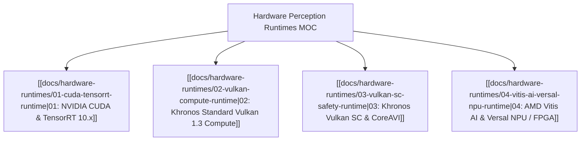

# ⚙️ Hardware Perception & Inference Runtimes MOC

A modular vault partitioning each hardware perception runtime into dedicated deep engineering references, compilation blueprints, physical testing commands, and safety certification criteria.

---

## 🗺️ Modular Hardware Runtime Matrix

---

## 📚 Dedicated Runtime Guides
1. **[[docs/hardware-runtimes/01-cuda-tensorrt-runtime|01. NVIDIA CUDA & TensorRT 10.x Runtime Guide]]**:
   - Streaming Multiprocessor (SM) memory hierarchy, horizontal/vertical layer fusion, kernel auto-tuning, and live testing via `trtexec`, `nsys`, and `ncu`.
2. **[[docs/hardware-runtimes/02-vulkan-compute-runtime|02. Khronos Standard Vulkan 1.3 Compute Guide]]**:
   - Cross-vendor portable compute shaders, SPIR-V compilation (`glslc`), NCNN mobile deployment, and `vulkaninfo` testing.
3. **[[docs/hardware-runtimes/03-vulkan-sc-safety-runtime|03. Khronos Vulkan SC & CoreAVI Guide]]**:
   - Safety-critical avionics (DO-178C / DO-254 DAL-A) and automotive (ISO 26262 ASIL-D), Offline Pipeline Compiler (`pcc`), zero-runtime allocation rules, and Conformance Test Suite (`vksc_cts`).
4. **[[docs/hardware-runtimes/04-vitis-ai-versal-npu-runtime|04. AMD Vitis AI & Versal NPU / FPGA Guide]]**:
   - Custom dataflow streaming circuits, Deep Learning Processor Units (DPU), Quark sub-byte quantization (MX6 / MX9), and live board verification (`xbutil`, `xdputil`).

---

## 🔗 Related Vault & Architecture Links
- [[hardware/README|Hardware Platforms & Silicon Acceleration Vault]]
- [[frameworks/README|Software Frameworks, Compilers & Inference Runtimes Vault]]
- [[topics/gpu-deployment/00-gpu-deployment-moc|GPU Deployment MOC]]
- [[topics/fpga-deployment/00-fpga-deployment-moc|FPGA Deployment MOC]]
- [[topics/real-time-systems/00-real-time-systems-moc|Real-Time Systems MOC]]
- [[docs/critical-scenarios-hardware-matrix|Critical Scenarios Hardware Matrix]]
