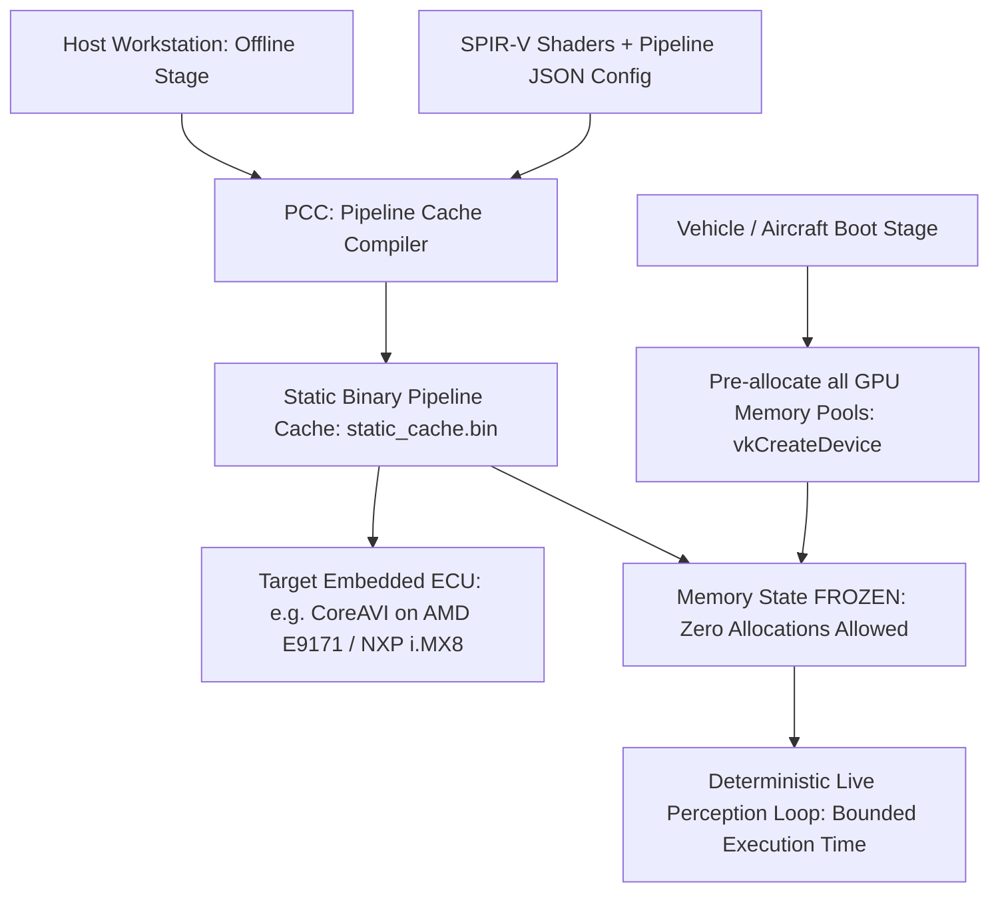

# 🛡️ Khronos Vulkan SC & CoreAVI: Safety-Critical Avionics & Automotive Runtime

## 1. Physical Hardware Execution Model
- **Vulkan SC (Safety Critical)** is a strictly deterministic subset of the Vulkan API engineered for:
  - **Avionics**: DO-178C (software) and DO-254 (hardware) Design Assurance Level A (DAL-A).
  - **Automotive**: ISO 26262 Automotive Safety Integrity Level D (ASIL-D).
- **Core Architecture Rule**: **Zero Dynamic Memory Allocation and Zero Runtime Pipeline Compilation**.

---

## 2. The Deterministic Execution Pipeline
In contrast to standard Vulkan/CUDA where drivers compile kernels on the fly and dynamically allocate heap memory:



### Key Differences from Standard Vulkan:
1. **No `vkCreateShaderModule` or `vkCreateComputePipelines` at runtime**: Pipelines are loaded directly from the offline compiled cache via `vkCreatePipelineCache`.
2. **Fixed Memory Pools**: Device memory must be partitioned into pre-sized pools during initialization. Dynamic `vkAllocateMemory` during operational perception is rejected with an error.
3. **Hardware Watchdogs**: Incorporates fault detection mechanisms complying with IEC 61508 safety loops.

---

## 3. Real Physical Testing & Certification Workflow

```bash
# 1. Host Pipeline Cache Compiler (PCC) Execution
# Compiles all compute shaders into deterministic hardware microcode offline
pcc -inputs pipeline_definition.json -out static_pipeline_cache.bin

# 2. Run the Khronos Vulkan SC Conformance Test Suite (CTS) on Target ECU
vksc_cts \
  --deqp-case=dEQP-VKSC.* \
  --deqp-archive-dir=/usr/share/vksc_cts \
  --deqp-log-filename=vksc_cts_results.qpa

# 3. Determinism & WCET (Worst-Case Execution Time) Jitter Testing
# Runs 10,000 consecutive iterations verifying that timing variation stays under certifiable threshold (<50 us)
./coreavi_wcet_harness --pipeline=static_pipeline_cache.bin --iterations=10000 --max-jitter-us=50
```

---

## 4. Vendor Implementations & Hardware Ecosystem
- **CoreAVI VkCore SC / ComputeCore**: Commercial implementation supporting AMD embedded discrete GPUs, Intel Alder Lake, and NXP automotive platforms.
- **Flight Certification Packages**: Includes full FAA/EASA certification evidence data packs (Traceability Matrices, Low-Level Requirements, Structural Code Coverage Artifacts).
