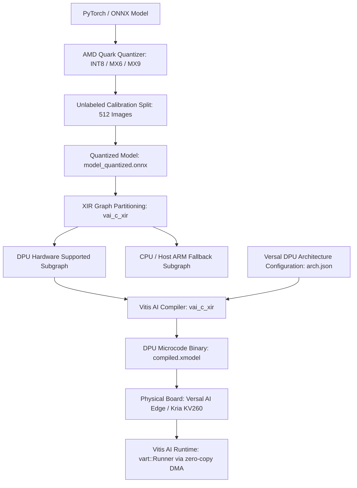

# 🟣 AMD Vitis AI & Versal NPU: Architecture, FPGA Dataflow & Hardware Testing

## 1. Physical Hardware Execution Model
- **Architectural Paradigm**: Unlike CPUs and GPUs that execute software instruction streams, AMD FPGAs and Versal ACAPs instantiate **digital hardware dataflow circuits**.
- **DPU (Deep Learning Processor Unit)**:
  - Parameterizable systolic tensor array IP cores synthesized into Programmable Logic (PL) or Versal AI Engine tiles (**AIE-ML v2** on Versal Gen 2).
  - High-density on-chip memory: UltraRAM (URAM) and Block RAM (BRAM) storing weights and activation scratchpads with $>10\,\text{TB/s}$ internal memory bandwidth.

---

## 2. Vitis AI 5.x / Quark Compilation Workflow



### Supported Sub-Byte Quantization (Versal Gen 2):
- **MX6 (6-bit Micro-scaling)**: 1 sign bit + 1 scale exponent + 4 mantissa bits, cutting memory bandwidth by $>60\%$ compared to INT8 with $<0.2\%$ Top-1 degradation.
- **MX9 (9-bit Micro-scaling)**: For sensitive regression heads (bounding box coordinates and 6-DoF pose quaternions).

---

## 3. Real Physical Testing & Benchmarking Workflow

```bash
# 1. Model Quantization using Quark (Host Workstation)
python -m quark.torch \
  --model_dir ./checkpoints \
  --model_name yolov12 \
  --quant_scheme int8 \
  --data_dir ./val_calib_512

# 2. Compiling XIR Graph to Target Versal AI Engine Architecture
vai_c_xir \
  -x ./quantized_model.xmodel \
  -a /opt/vitis_ai/compiler/arch/DPUCVDX8G/VERSAL_GEN2/arch.json \
  -o ./compiled_versal.xmodel \
  -n yolov12_versal

# 3. Live Execution & FPS Benchmark on Physical Board (via SSH)
# Uses the physical DPU hardware driver
xdputil benchmark ./compiled_versal.xmodel 1

# 4. Hardware Health, Clock Frequency & Thermal Inspection
xbutil examine --report thermal,electrical,memory
xbutil validate --run verify
```

---

## 4. Safety & Avionics Certification Reality
- **DO-254 Hardware Certification**: The DPU hardware IP can be synthesized into radiation-hardened Xilinx space/avionics FPGAs (e.g. Kintex UltraScale / Versal Prime Space Grade), achieving **DAL-A hardware certification** with deterministic cycle counts and no OS scheduler jitter.
