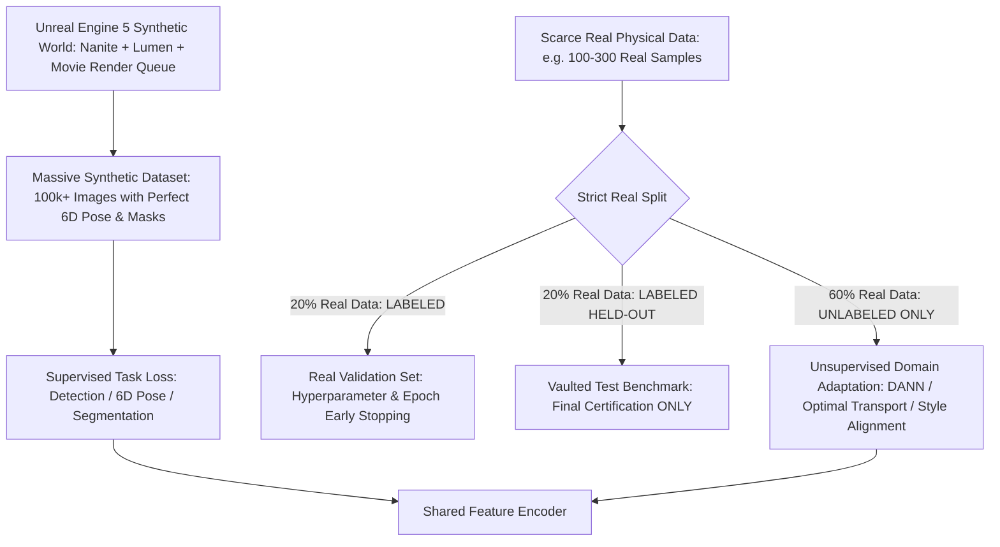
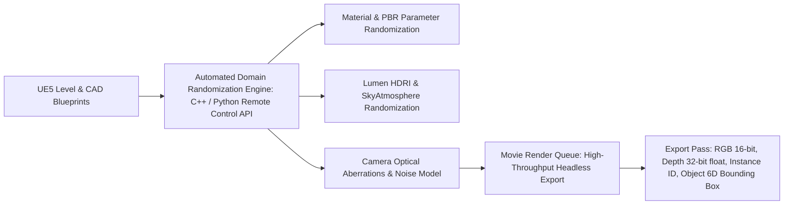
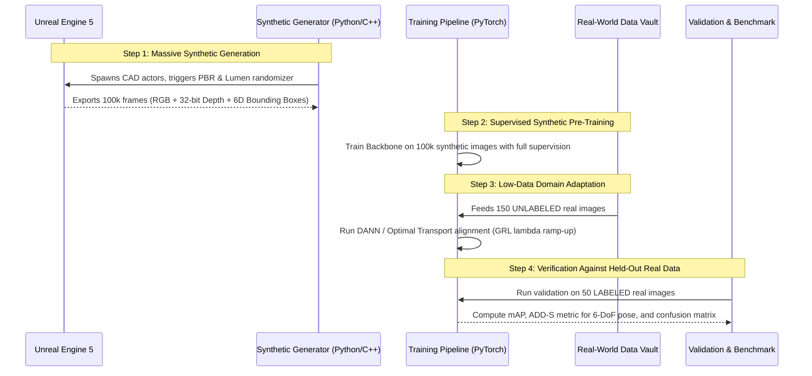

# 🎮 Unreal Engine Sim2Real Deep Guide: Synthetic Generation & Low-Real-Data Adaptation

A definitive engineering blueprint for practitioners who have a **high-fidelity synthetic environment developed in Unreal Engine (UE5)** and a **very low volume of real-world physical data** that must be rigorously guarded for test, validation, and zero-leakage adaptation.

Related notes: [[topics/6dof-pose-estimation/00-6dof-pose-estimation-moc|6-DoF Pose Estimation MOC]], [[topics/data-quality-and-verification/00-data-quality-and-verification-moc|Data Quality MOC]].

---

## 1. The Low-Real-Data Dilemma & Ground Truth Rules

When real data is scarce (e.g. 50–500 annotated physical images, or a few recorded robot trajectories), the single most catastrophic failure mode is **data leakage or overfitting the real distribution**.

### The Golden Law of Scarce Real Data:
1. **Never Touch the Test Set During Training or Tuning**: The real test set must be placed in a cryptographically hashed lockbox. It is evaluated exactly once for final model sign-off.
2. **Treat Real Data as Unlabeled Distributions**: Do not burn scarce annotations trying to train supervised backbones from scratch. Use real images purely for **Unsupervised Domain Adaptation (UDA)** and feature-space distribution alignment.

---

## 2. Unreal Engine 5 Synthetic Data Factory Architecture

Unreal Engine 5.4/5.5 provides unmatched geometric and radiometric fidelity through **Nanite** (virtualized micro-polygon geometry) and **Lumen** (real-time hardware/software ray-traced global illumination). However, a photorealistic render will still fail in the real world unless synthetic variations span the true distribution.

### 1. PBR Material Randomization in UE5:
Do not render objects with static, pristine textures. In physical reality, surfaces accumulate scratches, dust, grease, and non-uniform oxidation.
- In UE5 Material Graphs, blend CAD base color with randomized procedural Perlin/Simplex noise masks.
- Randomize Roughness ($R \in [0.15, 0.90]$), Metallic ($M \in [0.0, 1.0]$), and Specular values per spawned instance.
- Randomize UV tiling scales and normal map micro-bumpiness.

### 2. Lumen & Environmental Illumination Randomization:
- **Directional Sun**: Azimuth $\in [0^\circ, 360^\circ]$, Elevation $\in [10^\circ, 85^\circ]$, Lux $\in [10,000, 120,000\,\text{lux}]$.
- **Skylight & HDRI Maps**: Load an external library of 500+ diverse indoor and outdoor HDRI environment maps (industrial warehouses, overcast cloudy skies, halogen factory lamps).
- **Lumen Indirect Lighting Bounces**: Set `r.Lumen.DiffuseIndirect.Allow 1` and randomize indirect bounce intensity from $0.5\times$ to $2.0\times$.

### 3. Realistic Camera & Lens Sensor Modeling:
Game cameras render perfect pinhole projections. Physical lenses introduce severe radiometric defects that must be simulated during the UE5 render pass or in post-processing:
- **Radial & Tangential Lens Distortion**: Apply Brown-Conrady distortion coefficients ($k_1, k_2, p_1, p_2$) matching the physical camera calibration.
- **Chromatic Aberration**: Displace color wavelengths:
  $$I_{\text{distorted}}(x, y) = [R(x + \Delta x_r, y), G(x, y), B(x - \Delta x_b, y)]$$
- **Sensor Noise Injection**: Physical CMOS sensors exhibit Poisson photon-shot noise and Gaussian read noise:
  $$I_{\text{real-sim}} = I_{\text{clean}} + \mathcal{P}\left(\frac{I_{\text{clean}}}{\text{Gain}}\right) + \mathcal{N}(0, \sigma_{\text{read}}^2)$$
- **Motion Blur & Rolling Shutter**: Randomize virtual camera exposure times ($1/50\text{ s}$ to $1/1000\text{ s}$) matching the target robotics rig.

---

## 3. Mathematical Foundations: Domain Adaptation with Minimal Real Data

When you have $N_{\text{syn}} = 100,000$ synthetic images with full ground truth $Y_{\text{syn}}$ and only $N_{\text{real}} = 200$ unlabeled real images, use these two mathematical frameworks:

### 1. Domain-Adversarial Neural Networks (DANN):
We optimize a feature extractor $G_f$, a task predictor $G_y$, and a domain discriminator $G_d$. The domain discriminator attempts to distinguish whether a feature vector $z = G_f(x)$ came from Unreal Engine ($\text{domain } d = 0$) or the real world ($\text{domain } d = 1$).

The network is trained with a **Gradient Reversal Layer (GRL)**:
$$\mathcal{L}(G_f, G_y, G_d) = \frac{1}{N_{\text{syn}}} \sum_{i=1}^{N_{\text{syn}}} \mathcal{L}_y(G_y(G_f(x_i^s)), y_i^s) - \lambda \cdot \mathcal{L}_d(G_d(\mathcal{R}_\lambda(G_f(x))), d)$$
Where $\mathcal{R}_\lambda(x) = x$ in forward pass, but $\frac{d\mathcal{R}_\lambda}{dx} = -\lambda \mathbf{I}$ during backpropagation.

**Effect**: Forces $G_f$ to discard engine-specific rendering artifacts (Lumen specular sheen, digital aliasing) and learn **purely geometric and topological features that are invariant between simulation and physical reality**.

### 2. Unbalanced Optimal Transport (UOT) Alignment:
In extreme low-data regimes, adversarial training can suffer from discriminator collapse. Modern SOTA (2025–2026) replaces DANN with **Unbalanced Optimal Transport (Wasserstein Distance)** to align feature distributions:
$$\mathcal{W}_c(\mu_{\text{syn}}, \mu_{\text{real}}) = \min_{T \ge 0} \sum_{i, j} T_{ij} \cdot \|z_i^{\text{syn}} - z_j^{\text{real}}\|_2^2 + \tau_1 \text{KL}(T \mathbf{1} \| \mu_{\text{syn}}) + \tau_2 \text{KL}(T^T \mathbf{1} \| \mu_{\text{real}})$$
This allows partial distribution matching, ignoring synthetic outlier scenarios that have no physical counterpart in the small real validation dataset.

### 3. Supervised Contrastive Sim2Real Alignment (SupCon / InfoNCE):
When a tiny pool of labeled real samples ($10-20$ samples per class) is available, Supervised Contrastive Learning pulls synthetic and real representations of the same semantic class together into a tight cluster while forcing apart negative distractors:
$$\mathcal{L}_{\text{SupCon}} = - \sum_{i \in I} \frac{1}{|P(i)|} \sum_{p \in P(i)} \log \frac{\exp(z_i \cdot z_p / \tau)}{\sum_{a \in A(i)} \exp(z_i \cdot z_a / \tau)}$$
- Where anchor $i$ is from Unreal Engine, and positive matches $p \in P(i)$ include both other synthetic views AND the scarce real camera crops.
- **Result**: Directly expands the cross-domain margin from negative to positive ($>1.0$), ensuring zero-shot inference on physical cameras. (See runnable implementation: `cookbooks/10-contrastive-sim2real-alignment/contrastive_alignment.py`).

---

## 4. Production Step-by-Step Execution Plan

### Phase 1: Automated Synthetic Generation (Unreal Engine 5)
1. Export CAD meshes into UE5 as Nanite static meshes.
2. Script actor placement using the UE5 Python Editor Scripting API or `RemoteControl` HTTP plugin:
   - Randomize 6-DoF object poses within the physical robot's reachable workspace.
   - Spawn distractor objects (clamps, tools, wires, pallets) to force model occlusion robustness.
   - Trigger the **Movie Render Queue (MRQ)** in headless mode (`-nullrhi -nosound -unattended`) across GPU clusters.

### Phase 2: Supervised Synthetic Base Training
1. Train your primary task head (e.g. YOLOv12 for detection, FoundationPose for 6-DoF pose, or SAM 2 for masks) exclusively on the 100k synthetic samples.
2. Apply heavy data augmentation on synthetic images:
   - Random CutMix, MixUp, ColorJitter, Gaussian Blur, Motion Blur, and Random Shadow Injection.

### Phase 3: Unsupervised Domain Alignment with Real Data
1. Freeze early convolutional/patch projection layers if using a pre-trained foundation model (e.g. DINOv2 or ConvNeXt).
2. Feed batches composed of 50% synthetic samples (labeled) and 50% real physical samples (unlabeled).
3. Gradually ramp up the domain adaptation loss coefficient $\lambda$ from $0.0$ to $1.0$ over the first 10 epochs using:
   $$\lambda(p) = \frac{2}{1 + \exp(-10 \cdot p)} - 1 \quad \text{where } p = \frac{\text{epoch}}{\text{total\_epochs}}$$

### Phase 4: Verification, Evaluation & Real-World Validation
1. **Never evaluate on synthetic data to judge real-world readiness**: Synthetic mAP will typically reach $>95\%$, while zero-shot real mAP may drop to $50\%-65\%$.
2. Measure the **Sim2Real Transfer Ratio**:
   $$\text{Transfer Ratio} = \frac{\text{Metric}_{\text{real}}}{\text{Metric}_{\text{syn}}} \times 100\%$$
   - A healthy adapted pipeline achieves a Transfer Ratio $>85\%$.
3. Compute the **ADD-S (Average Distance of 3D Model Points)** for 6-DoF pose estimation on the held-out physical validation set:
   $$\text{ADD-S} = \frac{1}{m} \sum_{x_1 \in \mathcal{M}} \min_{x_2 \in \mathcal{M}} \| (R x_1 + t) - (\tilde{R} x_2 + \tilde{t}) \|_2$$
   Ensure $>90\%$ of poses fall within the robot's physical gripper tolerance ($<5\text{ mm}$ position error, $<2^\circ$ rotation error).
