# 🚀 Software Frameworks, Compilers & Inference Runtimes MOC

A comprehensive Map of Content categorizing deep learning inference engines, compilation toolchains, zero-copy IPC middleware, and visual debugging libraries for autonomous systems and computer vision. Every framework is maintained in an independent, dedicated note.

---

## 🗺️ Software & Framework Taxonomy

```mermaid
graph TD
    classDef default fill:#1E222A,stroke:#4C566A,stroke-width:1px,color:#ECEFF4;
    classDef comp fill:#2E3440,stroke:#88C0D0,stroke-width:2px,color:#88C0D0;
    classDef ipc fill:#2E3440,stroke:#A3BE8C,stroke-width:2px,color:#A3BE8C;
    classDef vis fill:#2E3440,stroke:#EBCB8B,stroke-width:2px,color:#EBCB8B;

    MOC["Frameworks MOC"] --> Compilers["Inference Engines & Compilers"]:::comp
    MOC --> Middleware["Robotics IPC & Middleware"]:::ipc
    MOC --> Tooling["Perception & Physical AI Tooling"]:::vis

    Compilers --> TRT["[[frameworks/tensorrt|NVIDIA TensorRT 10.x]]"]
    Compilers --> ORT["[[frameworks/onnxruntime|ONNX Runtime 1.20+]]"]
    Compilers --> VK["[[frameworks/vulkan|Vulkan Compute 1.3/1.4]]"]
    Compilers --> VKSC["[[frameworks/vulkan-sc|Vulkan SC 2.0 (ASIL-D / DAL A)]]"]
    Compilers --> OV["[[frameworks/openvino|Intel OpenVINO 2025/2026]]"]
    Compilers --> Triton["[[frameworks/triton-inference-server|NVIDIA Triton Server]]"]
    Compilers --> Vitis["[[frameworks/vitis-ai|AMD Vitis AI 3.5]]"]
    Compilers --> Quark["[[frameworks/quark|AMD Quark Quantization]]"]
    Compilers --> TVM["[[frameworks/apache-tvm|Apache TVM Unity & Relax]]"]

    Middleware --> Ice2["[[frameworks/iceoryx2|Eclipse Iceoryx2]]"]
    Middleware --> Zenoh["[[frameworks/zenoh|Eclipse Zenoh & Zenoh-Pico]]"]
    Middleware --> ROS2["[[frameworks/ros2-rmw|ROS 2 RMW Middleware Layer]]"]

    Tooling --> FO["[[frameworks/fiftyone|Voxel51 FiftyOne]]"]
    Tooling --> RR["[[frameworks/rerun|Rerun.io Visualization SDK]]"]
    Tooling --> PT["[[frameworks/pytorch|PyTorch 2.5/2.6 Core]]"]
    Tooling --> TV["[[frameworks/torchvision|TorchVision Operators]]"]
    Tooling --> LeRob["[[frameworks/lerobot|HuggingFace LeRobot]]"]
    Tooling --> RoboM["[[frameworks/robomimic|Robomimic Benchmark Framework]]"]
```



---

## 📑 Dedicated Framework Guides

1. **Inference Engines & Compilers**:
   - [[frameworks/tensorrt|NVIDIA TensorRT 10.x]] (AOT compilation, dynamic shapes, timing cache, IPluginV3, NVFP4)
   - [[frameworks/onnxruntime|ONNX Runtime 1.20+]] (Execution Providers architecture, BFC allocator, zero-copy IOBinding)
   - [[frameworks/vulkan|Vulkan Compute 1.3/1.4]] (SPIR-V shader compilation, explicit VkDeviceMemory, DMA-BUF)
   - [[frameworks/vulkan-sc|Vulkan SC 2.0 Safety Critical]] (ISO 26262 ASIL-D, DO-178C DAL A, Offline Pipeline Compiler PCC)
   - [[frameworks/openvino|Intel OpenVINO 2025/2026]] (nGraph IR, Level Zero NPU driver, heterogeneous scheduling)
   - [[frameworks/triton-inference-server|NVIDIA Triton Inference Server]] (Dynamic batching, BLS model pipelines, CUDA IPC shared memory)
   - [[frameworks/vitis-ai|AMD Vitis AI 3.5]] (XIR compiler, DPUCZDX8G overlay, FPGA streaming execution)
   - [[frameworks/quark|AMD Quark Quantization Framework]] (Sub-byte FP8, MX6, MX9, INT4 quantization)
   - [[frameworks/apache-tvm|Apache TVM Unity & Relax]] (Relax IR, TensorIR schedule primitives, MetaSchedule auto-tuning)

2. **Robotics Middleware & Zero-Copy IPC**:
   - [[frameworks/iceoryx2|Eclipse Iceoryx2]] (Rust zero-copy SPMC/MPSC shared memory ring buffers, <100ns latency)
   - [[frameworks/zenoh|Eclipse Zenoh & Zenoh-Pico]] (Decentralized pub/sub/query, zero-copy DDS bridge, micro-broker)
   - [[frameworks/ros2-rmw|ROS 2 RMW Middleware Layer]] (Type Adaptation, loaned messages zero-copy, deterministic QoS)

3. **Perception Tooling, Visual Debugging & Physical AI**:
   - [[frameworks/fiftyone|Voxel51 FiftyOne]] (Dataset curation, embedding vector search, FiftyOne Brain quality audits)
   - [[frameworks/rerun|Rerun.io SDK]] (Apache Arrow columnar datastore, automatic spatial transform graph, timeline sync)
   - [[frameworks/pytorch|PyTorch 2.5/2.6 Core]] (TorchDynamo, TorchInductor Triton codegen, FlexAttention, CUDA Graphs)
   - [[frameworks/torchvision|TorchVision Optimized Operators]] (C++/CUDA RoIAlign, NMS, Deformable Conv, video I/O)
   - [[frameworks/lerobot|HuggingFace LeRobot]] (Physical AI robotics dataset schema, Diffusion Policy, ACT, 50Hz teleop)
   - [[frameworks/robomimic|Robomimic Benchmark Framework]] (Imitation learning benchmarks, offline RL for robot manipulation)

---

## 🔮 Obsidian Dynamic Dataview Index

```dataview
TABLE type AS "Type", domain AS "Domain", updated AS "Updated"
FROM "frameworks"
WHERE file.name != "README" AND file.name != "00-frameworks-moc"
SORT file.name ASC
```
