# 🚀 Software Frameworks, Compilers & Inference Runtimes Vault

An exhaustive, modular technical repository documenting cutting-edge computer vision, perception, inference compilation, robotics IPC, and visualization software frameworks through August 2026. Every software framework is documented in a dedicated, standalone reference guide.

---

## 🗺️ Software & Framework Taxonomy

```mermaid
graph TD
    classDef default fill:#1E222A,stroke:#4C566A,stroke-width:1px,color:#ECEFF4;
    classDef comp fill:#2E3440,stroke:#88C0D0,stroke-width:2px,color:#88C0D0;
    classDef ipc fill:#2E3440,stroke:#A3BE8C,stroke-width:2px,color:#A3BE8C;
    classDef vis fill:#2E3440,stroke:#EBCB8B,stroke-width:2px,color:#EBCB8B;

    Root["Perception & AI Software Ecosystem"] --> Compilers["Inference Engines & Compilers"]:::comp
    Root --> Middleware["Robotics IPC & Middleware"]:::ipc
    Root --> Visual["Tooling, Training & Visualization"]:::vis

    Compilers --> TRT["[[frameworks/tensorrt|NVIDIA TensorRT 10.x]]"]
    Compilers --> ORT["[[frameworks/onnxruntime|ONNX Runtime 1.20+]]"]
    Compilers --> VK["[[frameworks/vulkan|Vulkan 1.3/1.4 Compute]]"]
    Compilers --> VKSC["[[frameworks/vulkan-sc|Vulkan SC 2.0 Safety Critical]]"]
    Compilers --> OV["[[frameworks/openvino|Intel OpenVINO 2025/2026]]"]
    Compilers --> Triton["[[frameworks/triton-inference-server|NVIDIA Triton Inference Server]]"]
    Compilers --> Vitis["[[frameworks/vitis-ai|AMD Vitis AI (3.5, 5.x, 6.x)]]"]
    Compilers --> Quark["[[frameworks/quark|AMD Quark Quantization]]"]
    Compilers --> TVM["[[frameworks/apache-tvm|Apache TVM Unity & Relax]]"]

    Middleware --> Ice2["[[frameworks/iceoryx2|Eclipse Iceoryx2]]"]
    Middleware --> Zenoh["[[frameworks/zenoh|Eclipse Zenoh & Zenoh-Pico]]"]
    Middleware --> ROS2["[[frameworks/ros2-rmw|ROS 2 RMW Middleware Layer]]"]

    Visual --> FO["[[frameworks/fiftyone|Voxel51 FiftyOne]]"]
    Visual --> RR["[[frameworks/rerun|Rerun.io Visualization SDK]]"]
    Visual --> PT["[[frameworks/pytorch|PyTorch 2.5/2.6 Core]]"]
    Visual --> TV["[[frameworks/torchvision|TorchVision Optimized Ops]]"]
    Visual --> LeRob["[[frameworks/lerobot|HuggingFace LeRobot]]"]
    Visual --> RoboM["[[frameworks/robomimic|Robomimic Imitation Learning]]"]
```

---

## 📊 Comprehensive Framework Comparison Matrix (Updated August 2026)

| Framework / Runtime | Primary Domain | Core Compilation / Engine Mechanism | Memory Allocation Model & Zero-Copy | Supported Hardware Targets | Primary Languages & Bindings | Safety & Real-Time Determinism |
| :--- | :--- | :--- | :--- | :--- | :--- | :--- |
| **[[frameworks/tensorrt|NVIDIA TensorRT 10.x]]** | Deep Learning Inference | AOT engine builder, layer fusion, timing cache, custom IPluginV3 | Pinned device buffers, CUDA unified memory, CUDA Graphs | NVIDIA GPUs (Blackwell, Ada, Ampere, Orin, Thor) | C++, Python | Deterministic execution time, zero dynamic allocations post-init |
| **[[frameworks/onnxruntime|ONNX Runtime 1.20+]]** | Multi-Backend Inference | Pluggable Execution Providers (EP), graph partitioning, constant folding | BFC Memory Arena Allocator, zero-copy `IOBinding` | CPU, CUDA, TensorRT, OpenVINO, DirectML, QNN, CoreML | C++, Python, C#, Java, Rust | Real-time safe via deterministic execution provider routing |
| **[[frameworks/vulkan|Vulkan Compute]]** | Cross-Vendor GPGPU | SPIR-V compute shaders, command buffer recording, pipeline caches | Explicit `VkDeviceMemory`, zero-copy DMA-BUF sharing | Cross-vendor GPUs (NVIDIA, AMD, Intel, ARM Mali, Adreno) | C, C++, Rust | High-throughput, cross-platform shader execution |
| **[[frameworks/vulkan-sc|Vulkan SC 2.0]]** | Safety-Critical Compute | Offline Pipeline Compiler (`pcc`), static execution graphs, no runtime allocations | Fixed memory reservations, strictly bounded command memory | Certified GPUs (NVIDIA DRIVE, CoreAVI AMD, NXP) | C, C++ | Certified to ISO 26262 ASIL-D and DO-178C DAL A |
| **[[frameworks/vitis-ai|AMD Vitis AI (3.5 / 5.x / 6.2)]]** | FPGA / SoC Inference | XIR 3.0 compiler, Versal Gen 2 AIE-ML v2 mapping, Quark FP8/INT4 | AXI DMA / AXI-Stream FIFOs, contiguous physical memory | AMD Versal AI Edge Gen 1/2, Zynq UltraScale+, Alveo | C++, Python | Hard real-time deterministic hardware pipeline execution |
| **[[frameworks/triton-inference-server|Triton Inference Server]]** | High-Throughput Serving | Dynamic batching, model pipelining (BLS), concurrent model instances | POSIX / CUDA IPC shared memory, zero-copy host-device transfers | GPUs (NVIDIA), CPUs (x86_64, ARM64) | C++, Python, HTTP/gRPC API | Enterprise-grade QoS, strict latency bounding via timeouts |
| **[[frameworks/quark|AMD Quark]]** | Sub-Byte Quantization | Advanced calibration (AWQ, SmoothQuant, GPTQ), MXFP6, MXFP4, INT4 | In-place weight transformation, layerwise tensor scaling | AMD Versal AIE-ML v2, ROCm GPUs, CPUs | Python, C++ | Lossless sub-byte compression for LLMs and vision backbones |
| **[[frameworks/apache-tvm|Apache TVM & Relax]]** | Multi-Target ML Compiler | Relax IR, TensorIR (TIR) schedule primitives, MetaSchedule auto-tuning | Unified Virtual Memory, minimal runtime footprint (<1MB) | WebGPU, Vulkan, CUDA, LLVM, MicroTVM microcontrollers | Python, C++, Rust | Suitable for bare-metal safety systems and MCUs |
| **[[frameworks/iceoryx2|Eclipse Iceoryx2]]** | High-Rate Robotics IPC | Lock-free SPMC/MPSC shared memory ring buffer, wait-free read borrowing | Zero-copy borrowed memory via POSIX shared memory / memfd | Linux, QNX, macOS, Windows (x86_64, ARM64, RISC-V) | Rust, C, C++ | Sub-100ns latency, ASIL-D ready architecture |
| **[[frameworks/zenoh|Eclipse Zenoh]]** | Decentralized Pub/Sub | Micro-broker routing, scouting protocol, session management | Zero-copy payload slices, minimal wire protocol overhead | Embedded microcontrollers (Zenoh-Pico), Robot SBCs, Cloud | Rust, Python, C, C++ | Ultra-low jitter, 10x throughput over traditional CycloneDDS |
| **[[frameworks/ros2-rmw|ROS 2 RMW Layer]]** | Robotics Middleware | Abstraction interface bridging ROS 2 nodes to underlying DDS/shm | Loaned message API (`borrow_loaned_message`) zero-copy | Linux, QNX, RTOS | C++, Python | Configurable QoS profiles (Reliable vs Best-Effort, Transient Local) |
| **[[frameworks/fiftyone|Voxel51 FiftyOne]]** | Visual Data Curation | Vector index integration, MongoDB schema backend, FiftyOne Brain | In-memory dataset indexing, memory-mapped Apache Arrow | Local Workstation, Cloud, On-Prem Servers | Python | High-throughput visual data inspection and quality auditing |
| **[[frameworks/rerun|Rerun.io SDK]]** | Multi-Modal Visualization | Columnar time-series datastore, automatic spatial transform graph | Apache Arrow zero-copy memory arrays, TCP/WebSocket streaming | Desktop, Web (WebAssembly / WebGPU), Embedded SBCs | Python, C++, Rust | Deterministic recording and microsecond timeline synchronization |
| **[[frameworks/pytorch|PyTorch 2.5/2.6 Core]]** | Deep Learning Core | TorchDynamo graph capture, TorchInductor Triton codegen, FlexAttention | Native CUDA memory pool allocator, CUDA Graph recording | NVIDIA CUDA, ROCm, Intel XPU, Apple MPS, CPU | Python, C++ (LibTorch) | SOTA dynamic training and high-performance fused inference |
| **[[frameworks/torchvision|TorchVision Ops]]** | Optimized Vision Kernels | Native C++/CUDA implementations for RoIAlign, NMS, Deformable Conv | Zero-copy PyTorch Tensor interop, pinned host memory | CUDA, CPU, Metal | Python, C++ | High-speed, battle-tested vision operator kernels |
| **[[frameworks/lerobot|HuggingFace LeRobot]]** | Physical AI & Imitation | Standardized robotics episodic dataset format, diffusion/ACT policy | Asynchronous ring buffers for 50Hz camera and joint polling | Linux SBCs, Jetson Orin, GPU Workstations | Python | Deterministic multi-camera hardware synchronization for arms |
| **[[frameworks/robomimic|Robomimic]]** | Imitation Learning Bench | Modular framework for offline imitation and reinforcement learning | HDF5 episodic dataset streaming with cached pre-fetching | Linux Workstations, Slurm Clusters | Python | Standardized benchmarking for robotic manipulation algorithms |

---

## 📂 Vault Organization & Dedicated Files

- **Map of Content**: [[frameworks/00-frameworks-moc|00-frameworks-moc.md]]
- **Inference Compilers & Engines**:
  - [[frameworks/tensorrt|NVIDIA TensorRT 10.x]]
  - [[frameworks/onnxruntime|ONNX Runtime 1.20+]]
  - [[frameworks/vitis-ai|AMD Vitis AI (3.5, 5.x, 6.2)]]
  - [[frameworks/vulkan-sc|Vulkan SC 2.0 Safety Critical]]
  - [[frameworks/openvino|Intel OpenVINO 2025/2026]]
  - [[frameworks/triton-inference-server|NVIDIA Triton Inference Server]]
  - [[frameworks/vitis-ai|AMD Vitis AI 3.5]]
  - [[frameworks/quark|AMD Quark Quantization Framework]]
  - [[frameworks/apache-tvm|Apache TVM Unity & Relax]]
- **Robotics Middleware & Zero-Copy IPC**:
  - [[frameworks/iceoryx2|Eclipse Iceoryx2]]
  - [[frameworks/zenoh|Eclipse Zenoh & Zenoh-Pico]]
  - [[frameworks/ros2-rmw|ROS 2 RMW Middleware Layer]]
- **Perception Tooling, Visual Debugging & Physical AI**:
  - [[frameworks/fiftyone|Voxel51 FiftyOne]]
  - [[frameworks/rerun|Rerun.io SDK]]
  - [[frameworks/pytorch|PyTorch 2.5/2.6 Core]]
  - [[frameworks/torchvision|TorchVision Optimized Operators]]
  - [[frameworks/lerobot|HuggingFace LeRobot]]
  - [[frameworks/robomimic|Robomimic Benchmark Framework]]

---

## 🔗 Cross-Domain Knowledge Vault Links
- Hardware Platforms: [[hardware/README|Hardware Platforms & Silicon Acceleration Vault]]
- GPU Deployment Playbook: [[topics/gpu-deployment/README|GPU Deployment Playbook]]
- Real-Time Systems: [[topics/real-time-systems/README|Real-Time Perception Playbook]]
- VLA & Physical AI: [[topics/vla-and-physical-ai-robotics/README|VLA & Robotics Playbook]]
