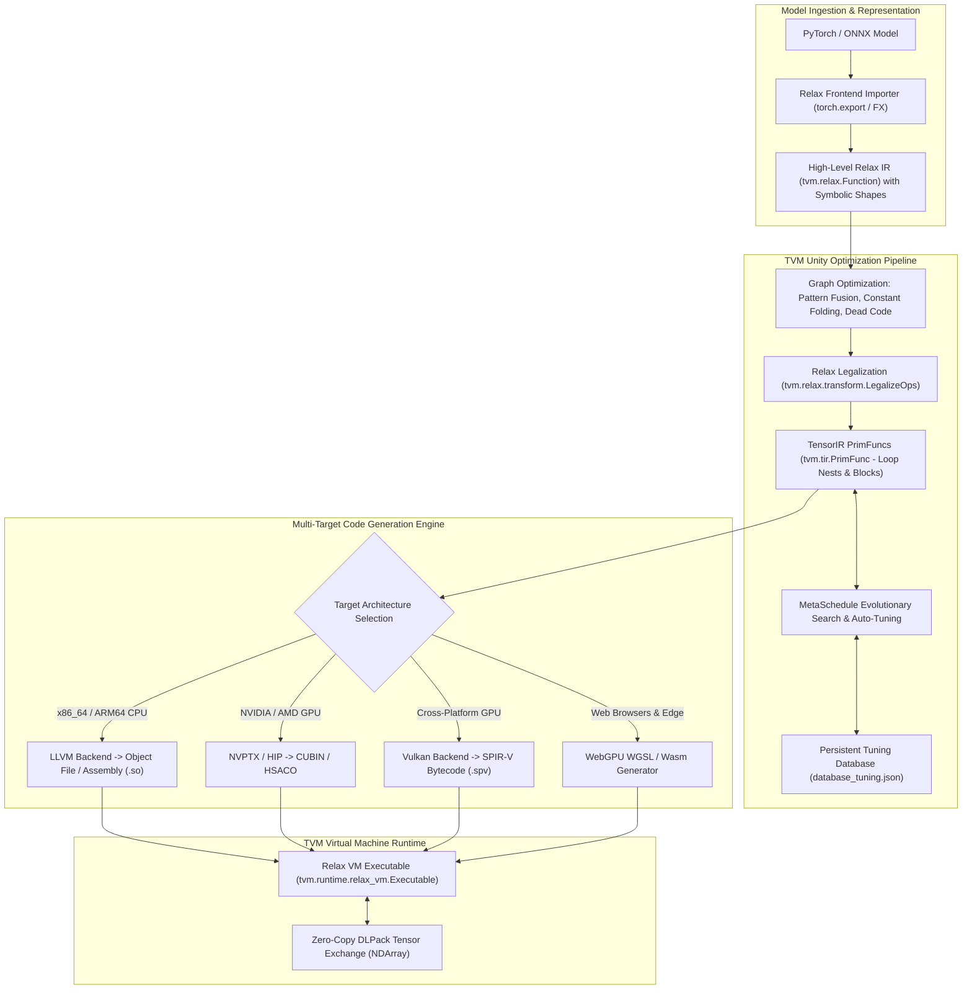

# 🌌 Apache TVM Unity & Relax: Symbolic Shapes, TensorIR Schedule Primitives & Multi-Target CodeGen

## 1. Framework Overview & Core Philosophy

**Apache TVM** is an open-source, end-to-end deep learning compiler stack designed to compile high-level computational graphs from any source framework (PyTorch, ONNX, JAX, TensorFlow) into bare-metal machine code across heterogeneous hardware targets:
- **CPUs**: x86_64 (AVX-512, AMX), ARM64 (NEON, SVE) via the LLVM backend.
- **GPUs**: NVIDIA GPUs (NVPTX / CUDA), AMD GPUs (ROCm / HIP), Apple Silicon (Metal MSL), and Cross-Platform (Vulkan SPIR-V).
- **Web & Embedded**: Web Browsers (WebAssembly & WebGPU WGSL) and Microcontrollers (microTVM bare-metal C).

### The TVM Unity & Relax Architectural Revolution
Historically, machine learning compilers enforced a rigid separation between high-level computational graphs (e.g., TVM Relay, TorchScript) and low-level tensor loop programs (e.g., TVM TIR, Halide, Triton). This separation created severe barriers:
- Inability to optimize dynamic symbolic shapes without massive graph recompilations.
- Inability to interleave custom high-performance library calls (such as FlashAttention, CUTLASS, or cuDNN) directly inside compiled graph representations.

**TVM Unity** unifies these disparate abstraction layers into a single composable compiler framework governed by **Relax (Relay Next)**:
1. **First-Class Symbolic Shape Handling**: Tensors carry symbolic dimensions ($B, S, H, D$) directly in the type system. Dimension constraints are dynamically verified and simplified using an integrated symbolic arithmetic solver (`arith::Analyzer`).
2. **Cross-Abstraction Composability**: A single compilation module (`IRModule`) seamlessly interleaves high-level computational graph nodes (Relax), low-level loop-nest schedules (TensorIR / TIR), and external library calls.
3. **Universal PackedFunc ABI**: All compiled functions, whether written in Python, C++, CUDA, or WebAssembly, share a standardized Foreign Function Interface (FFI) with dispatch latency under $20\,\text{ns}$.



---

## 2. Compilation Pipeline & IR Abstractions

### A. The Relax IR Abstraction
Relax represents neural networks as an `IRModule` containing functions that manipulate tensors with dynamic symbolic shapes. A Relax function consists of:
- **`relax.Var`**: Strongly-typed variables bound to tensors: `x: R.Tensor((batch_size, 3, 640, 640), "float32")`.
- **`relax.DataflowBlock`**: Pure functional sub-blocks where operations have no side effects, enabling aggressive re-ordering, dead-code elimination, and buffer reuse.
- **`relax.Call`**: Function invocations targeting built-in operators or registered `tir.PrimFunc` definitions.

```python
# Example of Relax IR Representation (Python TVMScript syntax)
@tvm.script.ir_module
class VisionTransformerBlock:
    @R.function
    def main(x: R.Tensor(("b", "s", 768), "float32"), 
             w_qkv: R.Tensor((768, 2304), "float32")) -> R.Tensor(("b", "s", 768), "float32"):
        b, s = T.int64(), T.int64()
        with R.dataflow():
            # Symbolic matrix multiplication
            qkv = R.matmul(x, w_qkv) # Shape: (b, s, 2304)
            # Fused attention primitive
            attn_out = R.nn.attention(qkv)
            R.output(attn_out)
        return attn_out
```

### B. TensorIR (TIR) Lowering & Schedule Primitives
During legalization (`relax.transform.LegalizeOps`), high-level Relax operations are lowered into low-level **TensorIR PrimFuncs**. TensorIR explicitly models:
- Iteration domain loops (`for i in range(M): for j in range(N): ...`).
- Spatial and reduction axes (`T.axis.spatial`, `T.axis.reduce`).
- Memory hierarchies (global memory, shared memory scratchpads, register files).

Developers and auto-tuning engines transform TensorIR programs using **Schedule Primitives**:
- `sch.split(loop, factors=[None, 16, 16])`: Splits loops into multi-level tile hierarchies.
- `sch.reorder(i_outer, j_outer, i_inner, j_inner)`: Re-orders loops to optimize cache locality.
- `sch.bind(i_outer, "blockIdx.x")`: Binds loops directly to GPU hardware thread blocks.
- `sch.bind(i_inner, "threadIdx.x")`: Binds inner loops to CUDA threads within a warp.
- `sch.vectorize(j_inner)`: Emits SIMD vector instructions (e.g., AVX-512 or NEON).
- `sch.compute_at(producer, consumer_loop)`: Inlines producer buffers into consumer scratchpads.

---

## 3. Memory Model, Allocators & Zero-Copy DLPack

TVM combines static lifetime memory planning with the open DLPack standard to minimize memory consumption and eliminate copying overhead.

```
+-----------------------------------------------------------------------------------+
|                           TVM Runtime Memory Subsystem                            |
+-----------------------------------------------------------------------------------+
|  Relax Static Memory Planner (KillAfterLastUse Analysis)                          |
|  - Lifetime-based buffer sharing across non-overlapping execution nodes           |
|  - Generates pre-allocated static storage pools (StorageTokens)                   |
+-----------------------------------------------------------------------------------+
|  Device Memory Hierarchy (Hardware-Level Scratchpads)                             |
|  - tir.allocate(..., "shared"): GPU Shared Memory / L1 Scratchpad (CUDA / Metal)  |
|  - tir.allocate(..., "local"): Thread-Private GPU Registers                       |
|  - tir.allocate(..., "global"): Device VRAM / Host RAM                            |
+-----------------------------------------------------------------------------------+
|  DLPack Standard Zero-Copy Exchange Protocol                                      |
|  - DLManagedTensor / tvm.runtime.NDArray                                          |
|  - Zero-copy tensor handoff with PyTorch, CuPy, JAX, NumPy without serialization  |
+-----------------------------------------------------------------------------------+
```

### A. Static Memory Planning (`relax.transform.StaticMemoryPlan`)
Rather than allocating memory dynamically during graph execution, Relax performs static liveness analysis:
1. Analyzes the computational DAG to identify when each intermediate tensor is created and consumed for the last time.
2. Allocates a minimal set of physical **Storage Tokens**.
3. Binds multiple temporary tensors to the identical memory storage token if their active lifetimes do not overlap, reducing activation memory by up to $70\%$.

### B. DLPack Zero-Copy Interoperability
TVM natively implements the open **DLPack standard** (`DLManagedTensor`), allowing tensors to pass between PyTorch, CuPy, JAX, and TVM with zero memory copying:

```python
import torch
import tvm
from tvm.runtime import ndarray as nd

# 1. Allocate GPU Tensor in PyTorch
torch_tensor = torch.randn(1, 3, 640, 640, device="cuda", dtype=torch.float32)

# 2. Zero-Copy Convert to TVM NDArray via DLPack pointer
tvm_tensor = nd.from_dlpack(torch_tensor)

# 3. TVM operates directly on PyTorch's allocated CUDA memory
# No cudaMemcpy or host staging buffers involved!
```

---

## 4. Execution Model: Relax VM & PackedFunc Architecture

### A. The Relax Virtual Machine (Relax VM)
Relax compiles computational graphs into bytecode executed by the **Relax VM**:
- **Dynamic Control Flow**: Efficiently evaluates conditionals (`if/else`), dynamic loops, and variable sequence lengths without triggering compiler stalls.
- **Bytecode Interpretation**: The VM executes a linear instruction stream that invokes compiled `tir.PrimFunc` kernels, passing pre-bound memory addresses.

### B. The PackedFunc Architecture
Every function in TVM is represented as a `tvm.runtime.PackedFunc`:
- A type-erased callable interface accepting an array of `TVMValue` arguments and type codes.
- Enables calling C++ compiled kernels from Python, or calling Python callbacks from inside a C++ compiled engine, with negligible overhead ($\approx 15\text{--}20\,\text{ns}$ per dispatch).

---

## 5. MetaSchedule: Automated Evolutionary Auto-Tuning

Rather than relying on hand-written heuristics, TVM uses **MetaSchedule** to automatically search the space of possible TensorIR schedules for any target hardware:

1. **Design Space Generation**: Creates rules for multi-level tiling, parallelization, vectorization, and thread binding.
2. **Evolutionary Search**: Evaluates candidates on target silicon, measuring real execution time via hardware timers.
3. **Cost Model**: Uses a Gradient Boosted Tree (GBDT / LightGBM) or MLP model to predict kernel latency and prune unpromising schedules.
4. **Database Persistence**: Serializes the best-performing schedules into a JSON database (`database_tuning.json`), allowing instant compilation in production without re-tuning.

```
MetaSchedule Search Pipeline:
[TensorIR PrimFunc] ──> [Design Space Sampling] ──> [Hardware Benchmarking] ──> [Cost Model Update] ──> [Tuning DB]
```

---

## 6. Edge Deployment, Safety & Operational Gotchas

### A. MetaSchedule Search Time Explosion
Auto-tuning an entire vision backbone or large transformer from scratch can require evaluating thousands of candidate schedules, taking several hours on target hardware.
- **Mitigation**: Utilize pre-tuned tuning databases (`database_tuning.json`) or leverage TVM's default heuristic schedules (`relax.transform.LegalizeOps`) for rapid prototyping.

### B. Symbolic Shape Unification Failures
When working with dynamic symbolic shapes, if two branches of a graph produce symbolic shapes that cannot be algebraically proven equal by `arith::Analyzer` (e.g., $2 \times S$ vs. $S + S$), the compiler can raise a shape mismatch error.
- **Remedy**: Insert explicit assertions or symbolic constraints (`R.match_cast`) at input boundaries to assist the symbolic solver.

---

## 7. Production Code Blueprint: TVMScript Compilation & Relax VM Execution

```python
#!/usr/bin/env python3
"""
Complete Production Blueprint: TVM Unity & Relax Compilation Pipeline
"""

import tvm
from tvm import relax
from tvm.script import ir_module
from tvm.script import relax as R
from tvm.script import tir as T
import numpy as np

# 1. Define Computational Module in TVMScript (Relax + Symbolic Shapes)
@tvm.script.ir_module
class DynamicVisionBlock:
    @R.function
    def main(
        x: R.Tensor(("b", 3, 640, 640), "float32"),
        weight: R.Tensor((64, 3, 3, 3), "float32")
    ) -> R.Tensor(("b", 64, 640, 640), "float32"):
        b = T.int64()
        with R.dataflow():
            # 2D Convolution with dynamic batch size 'b'
            conv_out = R.nn.conv2d(
                x, weight, strides=[1, 1], padding=[1, 1, 1, 1], data_layout="NCHW", kernel_layout="OIHW"
            )
            # Fused ReLU activation
            relu_out = R.nn.relu(conv_out)
            R.output(relu_out)
        return relu_out

def build_and_run_tvm_unity():
    print("[TVM Unity] Inspecting Input Relax IRModule with Symbolic Shapes:")
    mod = DynamicVisionBlock
    print(mod.script())

    # 2. Target Specification (LLVM CPU or CUDA GPU)
    target = tvm.target.Target("llvm -num-cores 4")
    dev = tvm.device("cpu", 0)

    # 3. Apply TVM Unity Optimization Passes
    print("[TVM Unity] Legalizing Relax Operators to TensorIR...")
    mod = relax.transform.LegalizeOps()(mod)
    mod = relax.transform.AnnotateTIROpPattern()(mod)
    mod = relax.transform.FoldConstant()(mod)

    # 4. Compile to Relax VM Executable
    print("[TVM Unity] Building Executable for Target:", target)
    ex = relax.build(mod, target=target)

    # 5. Initialize Relax Virtual Machine
    vm = relax.VirtualMachine(ex, dev)

    # 6. Run Inference with Dynamic Batch Size
    batch_size = 2
    x_np = np.random.randn(batch_size, 3, 640, 640).astype("float32")
    w_np = np.random.randn(64, 3, 3, 3).astype("float32")

    x_tvm = tvm.nd.array(x_np, dev)
    w_tvm = tvm.nd.array(w_np, dev)

    print(f"[TVM Unity] Executing Inference for Batch Size = {batch_size}...")
    out_tvm = vm["main"](x_tvm, w_tvm)
    print(f"[TVM Unity] Execution Successful! Output shape: {out_tvm.shape}")

if __name__ == "__main__":
    build_and_run_tvm_unity()
```

---

## 8. Cross-Reference Links
- [[frameworks/vulkan|Khronos Vulkan 1.3 / 1.4 Compute Reference]]
- [[frameworks/pytorch|PyTorch 2.5 / 2.6 Core Compilation Architecture]]
- [[topics/gpu-deployment/03-compilers-and-open-problems|ML Compilers & Open Problems in Deep Learning Systems]]
